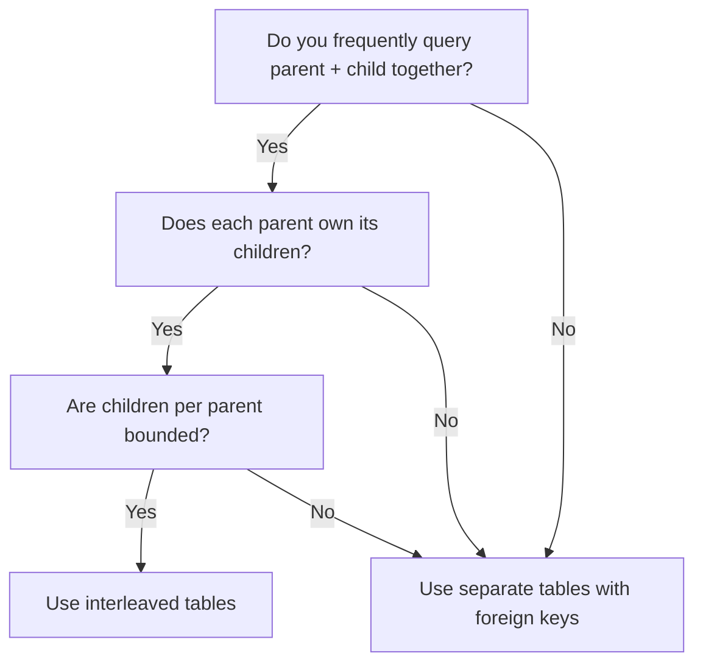

# How to Design an Effective Schema with Interleaved Tables in Cloud Spanner

Author: [nawazdhandala](https://www.github.com/nawazdhandala)

Tags: GCP, Cloud Spanner, Schema Design, Interleaved Tables, Database

Description: Learn how to use interleaved tables in Cloud Spanner to co-locate parent and child rows for faster queries and better performance.

---

If you have worked with Cloud Spanner for any length of time, you have probably come across the concept of interleaved tables. This is one of Spanner's most distinctive features, and understanding it well can make a huge difference in your application's performance. Interleaving lets you physically co-locate related rows so that parent and child data lives on the same split, which drastically reduces the need for distributed joins. Let me walk through how this works and when to use it.

## What Problem Does Interleaving Solve?

In a traditional relational database, when you join two tables, the database engine looks up rows from each table and combines them. The data for each table might be stored in completely different locations on disk, but that is fine because everything is on a single machine.

Spanner is different. It is a distributed database, which means data is split across many machines. When you join two tables whose rows live on different machines, Spanner has to make network calls between those machines. This adds latency.

Interleaving tells Spanner to store child rows physically next to their parent rows. When you query a parent and its children, the data is already on the same machine. No network hops needed.

## A Practical Example

Consider a music streaming application with artists and albums. Without interleaving, you would define the tables independently:

```sql
-- Standard table definitions without interleaving
CREATE TABLE Artists (
    ArtistId STRING(36) NOT NULL,
    Name STRING(256) NOT NULL,
    Genre STRING(64)
) PRIMARY KEY (ArtistId);

CREATE TABLE Albums (
    AlbumId STRING(36) NOT NULL,
    ArtistId STRING(36) NOT NULL,
    Title STRING(256) NOT NULL,
    ReleaseYear INT64
) PRIMARY KEY (AlbumId);
```

With this layout, an artist's albums could end up stored on a completely different Spanner split than the artist row itself. Querying an artist with all their albums would potentially require cross-node communication.

Now let's use interleaving:

```sql
-- Parent table for artists
CREATE TABLE Artists (
    ArtistId STRING(36) NOT NULL,
    Name STRING(256) NOT NULL,
    Genre STRING(64)
) PRIMARY KEY (ArtistId);

-- Child table interleaved within Artists
-- Albums for the same artist will be stored next to the artist row
CREATE TABLE Albums (
    ArtistId STRING(36) NOT NULL,
    AlbumId STRING(36) NOT NULL,
    Title STRING(256) NOT NULL,
    ReleaseYear INT64
) PRIMARY KEY (ArtistId, AlbumId),
  INTERLEAVE IN PARENT Artists ON DELETE CASCADE;
```

Notice two important changes. First, the child table's primary key starts with the parent's primary key columns. Second, the `INTERLEAVE IN PARENT` clause tells Spanner about the relationship.

## How Data is Physically Stored

To really understand interleaving, it helps to see how rows are laid out in storage. Here is how the data looks logically:

```
Artists(ArtistId="artist-1")          -- Parent row
  Albums(ArtistId="artist-1", AlbumId="album-1")  -- Child row
  Albums(ArtistId="artist-1", AlbumId="album-2")  -- Child row
  Albums(ArtistId="artist-1", AlbumId="album-3")  -- Child row
Artists(ArtistId="artist-2")          -- Next parent row
  Albums(ArtistId="artist-2", AlbumId="album-4")  -- Child row
```

The child rows are literally nested between their parent and the next parent. This is why queries that fetch an artist and all their albums are so fast - the data is already contiguous.

## Multi-Level Interleaving

You can go deeper than one level. Let's add tracks to albums:

```sql
-- Parent table
CREATE TABLE Artists (
    ArtistId STRING(36) NOT NULL,
    Name STRING(256) NOT NULL,
    Genre STRING(64)
) PRIMARY KEY (ArtistId);

-- First-level child interleaved in Artists
CREATE TABLE Albums (
    ArtistId STRING(36) NOT NULL,
    AlbumId STRING(36) NOT NULL,
    Title STRING(256) NOT NULL,
    ReleaseYear INT64
) PRIMARY KEY (ArtistId, AlbumId),
  INTERLEAVE IN PARENT Artists ON DELETE CASCADE;

-- Second-level child interleaved in Albums
CREATE TABLE Tracks (
    ArtistId STRING(36) NOT NULL,
    AlbumId STRING(36) NOT NULL,
    TrackId STRING(36) NOT NULL,
    TrackName STRING(256) NOT NULL,
    DurationSeconds INT64
) PRIMARY KEY (ArtistId, AlbumId, TrackId),
  INTERLEAVE IN PARENT Albums ON DELETE CASCADE;
```

Now an artist, their albums, and all tracks within those albums are stored together. A query that fetches an artist's complete discography with track listings will be very efficient.

The storage layout looks like this:

```
Artists("artist-1")
  Albums("artist-1", "album-1")
    Tracks("artist-1", "album-1", "track-1")
    Tracks("artist-1", "album-1", "track-2")
  Albums("artist-1", "album-2")
    Tracks("artist-1", "album-2", "track-3")
```

## The ON DELETE Clause

When defining interleaved tables, you must specify what happens when a parent row is deleted:

- `ON DELETE CASCADE` - Deleting the parent automatically deletes all child rows
- `ON DELETE NO ACTION` - Deleting the parent fails if child rows exist

Choose CASCADE when the child data has no meaning without the parent. Choose NO ACTION when you want to enforce that someone explicitly cleans up children first.

## When to Use Interleaving

Interleaving works best when:

- You frequently query parent and child data together
- The parent-child relationship is a true ownership relationship
- Each parent has a reasonable number of children (not millions)
- Your access patterns are primarily parent-scoped

Interleaving is not the right choice when:

- You mostly query children independently without their parent
- A child logically belongs to multiple parents (many-to-many relationship)
- The number of children per parent is extremely large

## Visualizing the Decision

Here is a simple decision flow for when to interleave:



## Performance Impact

I have seen real workloads where switching from separate tables to interleaved tables reduced p99 query latency from 15ms to under 3ms. The improvement is especially dramatic when your data spans multiple splits, because interleaving guarantees co-location.

However, there is a tradeoff. If you frequently need to scan all rows of a child table across all parents (for example, running analytics across all albums regardless of artist), interleaving can actually make that slower because the child rows are spread across all the parent splits instead of being contiguous.

## Schema Migration Considerations

You cannot add interleaving to an existing table. If you decide later that two tables should be interleaved, you will need to create a new interleaved table, migrate the data, and drop the old table. This is one reason it pays to think about your access patterns carefully upfront.

## Wrapping Up

Interleaved tables are one of the most powerful tools in your Cloud Spanner toolkit. They let you trade global scan performance for dramatically better parent-child query performance. The key is understanding your access patterns: if you almost always access children through their parent, interleaving is the right call. If you need to query children independently across all parents, keep the tables separate. Getting this decision right at schema design time will save you significant headaches down the road.
