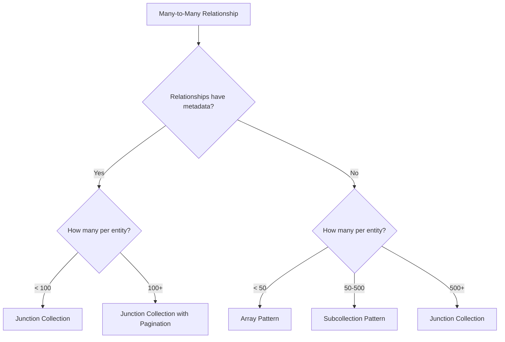

# How to Design Firestore Data Models for Complex Many-to-Many Relationships

Author: [nawazdhandala](https://www.github.com/nawazdhandala)

Tags: GCP, Firestore, Data Modeling, NoSQL, Database Design

Description: Learn practical approaches to modeling many-to-many relationships in Firestore, including junction collections, denormalization, and array-based patterns with their tradeoffs.

---

Many-to-many relationships are one of the trickier things to model in Firestore. In a relational database, you just create a junction table and call it a day. In Firestore, there is no single right answer - the best approach depends entirely on your query patterns, data volume, and how often the relationships change.

I have worked through this problem on several projects, and in this post I will walk through the main patterns, when each one works best, and where each one falls apart.

## The Problem

Consider a typical many-to-many scenario: users can belong to multiple groups, and groups can have multiple users. In SQL, you would create a `user_groups` junction table. In Firestore, you have several options, and the right choice depends on what questions you need to answer.

The two most common queries for any many-to-many relationship are:

1. Given a user, what groups do they belong to?
2. Given a group, who are its members?

Let's look at how to handle this.

## Pattern 1: Junction Collection

The junction collection pattern is closest to the relational approach. You create a separate collection where each document represents one relationship.

```javascript
// Structure:
// users/{userId} - User documents
// groups/{groupId} - Group documents
// memberships/{membershipId} - Junction documents

// Creating a membership
const db = admin.firestore();

async function addUserToGroup(userId, groupId, role = 'member') {
  // Create a junction document with a deterministic ID
  const membershipId = `${userId}_${groupId}`;

  await db.collection('memberships').doc(membershipId).set({
    userId: userId,
    groupId: groupId,
    role: role,
    joinedAt: admin.firestore.FieldValue.serverTimestamp(),
  });
}
```

Querying is straightforward:

```javascript
// Find all groups for a specific user
async function getUserGroups(userId) {
  const memberships = await db.collection('memberships')
    .where('userId', '==', userId)
    .get();

  // Fetch the actual group documents
  const groupIds = memberships.docs.map(doc => doc.data().groupId);
  const groupRefs = groupIds.map(id => db.collection('groups').doc(id));
  const groupDocs = await db.getAll(...groupRefs);

  return groupDocs.map(doc => ({ id: doc.id, ...doc.data() }));
}

// Find all members of a specific group
async function getGroupMembers(groupId) {
  const memberships = await db.collection('memberships')
    .where('groupId', '==', groupId)
    .get();

  const userIds = memberships.docs.map(doc => doc.data().userId);
  const userRefs = userIds.map(id => db.collection('users').doc(id));
  const userDocs = await db.getAll(...userRefs);

  return userDocs.map(doc => ({ id: doc.id, ...doc.data() }));
}
```

**When to use this:** The junction collection works well when relationships have their own metadata (like a role, join date, or permissions), when the number of relationships per entity is large (hundreds or thousands), or when relationships change frequently.

**Downsides:** Every query requires two steps - first read the junction documents, then read the related entities. That is two round trips minimum.

## Pattern 2: Array of References

If relationships do not carry extra metadata and the count stays manageable, you can store relationship IDs directly in the documents as arrays.

```javascript
// Structure:
// users/{userId} - contains groupIds array
// groups/{groupId} - contains memberIds array

// Add a user to a group (update both sides)
async function addUserToGroup(userId, groupId) {
  const batch = db.batch();

  // Add groupId to the user's groups array
  batch.update(db.collection('users').doc(userId), {
    groupIds: admin.firestore.FieldValue.arrayUnion(groupId),
  });

  // Add userId to the group's members array
  batch.update(db.collection('groups').doc(groupId), {
    memberIds: admin.firestore.FieldValue.arrayUnion(userId),
  });

  await batch.commit();
}

// Remove a user from a group
async function removeUserFromGroup(userId, groupId) {
  const batch = db.batch();

  batch.update(db.collection('users').doc(userId), {
    groupIds: admin.firestore.FieldValue.arrayRemove(groupId),
  });

  batch.update(db.collection('groups').doc(groupId), {
    memberIds: admin.firestore.FieldValue.arrayRemove(userId),
  });

  await batch.commit();
}
```

Querying becomes a single read:

```javascript
// Get all groups a user belongs to - single document read
async function getUserGroups(userId) {
  const userDoc = await db.collection('users').doc(userId).get();
  const groupIds = userDoc.data().groupIds || [];

  // Still need to fetch group details if needed
  if (groupIds.length === 0) return [];

  const groupRefs = groupIds.map(id => db.collection('groups').doc(id));
  const groupDocs = await db.getAll(...groupRefs);

  return groupDocs.map(doc => ({ id: doc.id, ...doc.data() }));
}

// Find all users who belong to a specific group using array-contains
async function getGroupMembers(groupId) {
  // This uses the array-contains query
  const users = await db.collection('users')
    .where('groupIds', 'array-contains', groupId)
    .get();

  return users.docs.map(doc => ({ id: doc.id, ...doc.data() }));
}
```

**When to use this:** Works great when the number of relationships per entity is small (under a few hundred), when you do not need metadata on the relationship itself, and when you want fast single-document reads.

**Downsides:** Firestore documents have a 1 MB size limit. If a group can have thousands of members, the `memberIds` array will eventually hit that limit. Also, `array-contains` queries can only filter on one array field per query.

## Pattern 3: Subcollection Approach

Instead of a standalone junction collection, you can nest the relationships as subcollections under one side of the relationship.

```javascript
// Structure:
// groups/{groupId}/members/{userId} - membership info
// users/{userId}/groups/{groupId} - denormalized group info

// Add a user to a group with data on both sides
async function addUserToGroup(userId, groupId, userData, groupData) {
  const batch = db.batch();

  // Store membership under the group
  batch.set(
    db.collection('groups').doc(groupId)
      .collection('members').doc(userId),
    {
      displayName: userData.displayName,
      email: userData.email,
      role: 'member',
      joinedAt: admin.firestore.FieldValue.serverTimestamp(),
    }
  );

  // Store group reference under the user
  batch.set(
    db.collection('users').doc(userId)
      .collection('groups').doc(groupId),
    {
      groupName: groupData.name,
      role: 'member',
      joinedAt: admin.firestore.FieldValue.serverTimestamp(),
    }
  );

  await batch.commit();
}
```

Querying each direction only needs a single subcollection read:

```javascript
// Get all groups for a user - single subcollection query
async function getUserGroups(userId) {
  const groups = await db.collection('users').doc(userId)
    .collection('groups')
    .get();

  return groups.docs.map(doc => ({ id: doc.id, ...doc.data() }));
}

// Get all members of a group - single subcollection query
async function getGroupMembers(groupId) {
  const members = await db.collection('groups').doc(groupId)
    .collection('members')
    .orderBy('joinedAt', 'desc')
    .get();

  return members.docs.map(doc => ({ id: doc.id, ...doc.data() }));
}
```

**When to use this:** This is ideal when you need fast reads in both directions and are willing to maintain denormalized data. It works well when both sides of the relationship are frequently queried.

**Downsides:** Data is duplicated, and keeping it in sync requires careful handling. If a user changes their display name, you need to update every subcollection document that references them.

## Keeping Denormalized Data in Sync

When using patterns that duplicate data (Pattern 2 and 3), you need a strategy for keeping it consistent. Cloud Functions are the standard approach:

```javascript
// Cloud Function to propagate user name changes
exports.onUserUpdate = functions.firestore
  .document('users/{userId}')
  .onUpdate(async (change, context) => {
    const before = change.before.data();
    const after = change.after.data();
    const userId = context.params.userId;

    // Only propagate if the display name changed
    if (before.displayName === after.displayName) return;

    // Find all groups this user belongs to
    const groupMemberships = await db
      .collectionGroup('members')
      .where('__name__', '>=', `groups/`)
      .get();

    // Update the denormalized name in each group's member subcollection
    const batch = db.batch();
    let count = 0;

    // Query the user's groups subcollection instead
    const userGroups = await db.collection('users').doc(userId)
      .collection('groups').get();

    for (const groupDoc of userGroups.docs) {
      const groupId = groupDoc.id;
      const memberRef = db.collection('groups').doc(groupId)
        .collection('members').doc(userId);

      batch.update(memberRef, {
        displayName: after.displayName,
      });
      count++;

      // Firestore batches support up to 500 operations
      if (count >= 499) {
        await batch.commit();
        count = 0;
      }
    }

    if (count > 0) {
      await batch.commit();
    }
  });
```

## Choosing the Right Pattern

Here is a decision framework:



In practice, most applications end up using a mix. You might use arrays for a user's favorite items (small, rarely queried from the other direction) and subcollections for team memberships (frequently queried from both directions).

The key insight with Firestore data modeling is that you should design for your read patterns, not your write patterns. If you read group members 100 times for every membership change, optimize for that read even if it means a more expensive write.

Tools like OneUptime can help you monitor the read/write ratios and latency patterns to validate whether your chosen data model is performing well in production.
