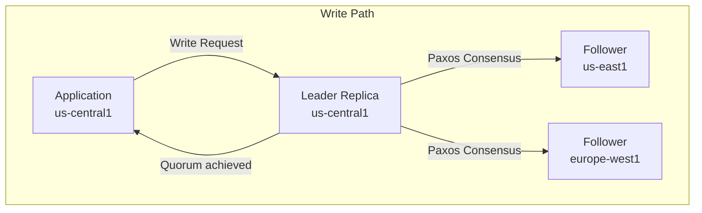

# How to Design Multi-Region Spanner Instances with Custom Leader Placement

Author: [nawazdhandala](https://www.github.com/nawazdhandala)

Tags: GCP, Cloud Spanner, Multi-Region, Leader Placement, Global Database, Database Architecture

Description: Learn how to design Cloud Spanner multi-region instances with custom leader placement to optimize write latency for specific regions while maintaining global availability.

---

Cloud Spanner's multi-region configurations give you a globally distributed database with strong consistency and 99.999% availability. But not all multi-region configurations are created equal. The placement of leader replicas determines where your writes are fast and where they incur cross-region latency. Getting leader placement right is the difference between a smoothly running global application and one where users in certain regions experience frustrating write latency.

This guide covers how to choose and configure multi-region instances with the right leader placement for your workload.

## Understanding Leader Placement

In Spanner, every write goes through a leader replica. The leader coordinates the consensus protocol (Paxos) to replicate the write to other replicas. The closer your application is to the leader, the lower the write latency.



Write latency is dominated by the round trip from the leader to the nearest quorum participant. For a 3-region configuration, a quorum requires 2 out of 3 votes, so the write completes after the leader plus one follower acknowledges.

## Pre-Defined Multi-Region Configurations

Spanner offers several pre-defined multi-region configurations:

| Configuration | Regions | Leader Region | SLA |
|---|---|---|---|
| nam14 | us-central1, us-central2, us-east1, us-east4 | us-central1, us-central2 | 99.999% |
| nam-eur-asia1 | us-central1, europe-west1, asia-east1 | us-central1 | 99.999% |
| eur6 | europe-west1, europe-west4, europe-north1, europe-north2 | europe-west1, europe-west4 | 99.999% |

These work well when your write traffic matches the leader region. But what if most of your writes come from Europe and the available configurations put the leader in the US?

## Custom Leader Placement

Custom configurations let you specify exactly where leaders should be placed. This gives you control over write latency for your primary market.

### Creating a Custom Instance Configuration

```bash
# Create a custom multi-region configuration with European leader
gcloud spanner instance-configs create custom-eur-config \
  --display-name="Custom Europe Leader Config" \
  --base-config=regional-europe-west1 \
  --replicas=location=europe-west1,type=READ_WRITE \
  --replicas=location=europe-west4,type=READ_WRITE \
  --replicas=location=europe-north1,type=READ_ONLY \
  --replicas=location=us-east1,type=READ_ONLY \
  --replicas=location=us-central1,type=WITNESS \
  --leader-region=europe-west1,europe-west4
```

Let me break down the replica types:

- **READ_WRITE**: Can be elected as leaders. Place these in regions where you want fast writes.
- **READ_ONLY**: Hold full data copies for reads. Place these near your read-heavy users.
- **WITNESS**: Participate in consensus but hold no data. Use these to meet quorum requirements cheaply.

### Create the Instance with Custom Config

```bash
# Create a Spanner instance using the custom configuration
gcloud spanner instances create global-db \
  --config=custom-eur-config \
  --display-name="Global Database - Europe Leader" \
  --nodes=3
```

## Design Patterns for Leader Placement

### Pattern 1: Single-Market Leader

Most writes come from one geographic region. Optimize for that region.

```bash
# Writes are primarily from the US
# Reads are global
gcloud spanner instance-configs create us-write-global-read \
  --display-name="US Write, Global Read" \
  --base-config=regional-us-central1 \
  --replicas=location=us-central1,type=READ_WRITE \
  --replicas=location=us-east1,type=READ_WRITE \
  --replicas=location=europe-west1,type=READ_ONLY \
  --replicas=location=asia-east1,type=READ_ONLY \
  --replicas=location=us-west1,type=WITNESS \
  --leader-region=us-central1,us-east1
```

Expected write latency from the US: 5-15ms (intra-region quorum)
Expected write latency from Europe: 80-120ms (cross-region to US leader)
Expected read latency from Europe: 5-15ms (served by local read-only replica)

### Pattern 2: Dual-Market Leader

Write traffic is split between two regions. Place leaders in both.

```bash
# Writes come from both US and Europe
gcloud spanner instance-configs create us-eur-dual-leader \
  --display-name="US-Europe Dual Leader" \
  --base-config=regional-us-central1 \
  --replicas=location=us-central1,type=READ_WRITE \
  --replicas=location=us-east1,type=READ_WRITE \
  --replicas=location=europe-west1,type=READ_WRITE \
  --replicas=location=europe-west4,type=READ_WRITE \
  --replicas=location=asia-east1,type=WITNESS \
  --leader-region=us-central1,us-east1,europe-west1,europe-west4
```

With leaders in both continents, Spanner can elect a leader closest to where the write originates. The quorum still needs a majority, so cross-region latency still factors in - but having leaders on both sides reduces the worst-case latency.

### Pattern 3: Follow-the-Sun Leader

Different regions are primary during different times of day. While you cannot change leader placement dynamically, you can design around this.

```bash
# For applications with distinct usage patterns by region
# Use a configuration that covers all active regions with READ_WRITE
gcloud spanner instance-configs create follow-sun-config \
  --display-name="Follow the Sun" \
  --base-config=regional-us-central1 \
  --replicas=location=us-central1,type=READ_WRITE \
  --replicas=location=europe-west1,type=READ_WRITE \
  --replicas=location=asia-east1,type=READ_WRITE \
  --replicas=location=us-east1,type=WITNESS \
  --replicas=location=europe-north1,type=WITNESS \
  --leader-region=us-central1,europe-west1,asia-east1
```

## Moving Leaders Between Databases

Within a multi-region instance, you can set different leader regions for different databases. This is useful when different applications have different geographic write patterns.

```bash
# Create a database with a specific leader region
gcloud spanner databases create payments-db \
  --instance=global-db \
  --database-dialect=POSTGRESQL \
  --default-leader=europe-west1

# Create another database with a different leader
gcloud spanner databases create analytics-db \
  --instance=global-db \
  --database-dialect=POSTGRESQL \
  --default-leader=us-central1
```

You can also change the leader region for an existing database:

```bash
# Change the default leader region for a database
gcloud spanner databases ddl update payments-db \
  --instance=global-db \
  --ddl="ALTER DATABASE payments_db SET OPTIONS (default_leader = 'us-central1')"
```

## Measuring Write Latency by Region

After configuring leader placement, measure the actual write latency from each region.

```sql
-- Check write latency from Spanner's system tables
SELECT
  interval_end,
  AVG(latency_seconds) * 1000 AS avg_write_latency_ms,
  APPROX_QUANTILES(latency_seconds, 100)[OFFSET(50)] * 1000 AS p50_ms,
  APPROX_QUANTILES(latency_seconds, 100)[OFFSET(99)] * 1000 AS p99_ms
FROM SPANNER_SYS.TXN_STATS_TOP_10MINUTE
WHERE interval_end >= TIMESTAMP_SUB(CURRENT_TIMESTAMP(), INTERVAL 1 HOUR)
GROUP BY interval_end
ORDER BY interval_end DESC;
```

Run this query from application instances in each region to understand the latency profile.

## Cost Implications

Multi-region configurations cost more than single-region:

- Each additional replica adds storage costs (data is replicated)
- READ_WRITE replicas cost more per node-hour than READ_ONLY or WITNESS
- Cross-region replication generates network egress charges

Cost optimization tips:

- Use WITNESS replicas instead of READ_ONLY where you do not need local reads. Witnesses are much cheaper.
- Right-size the number of replicas. For most configurations, 3-5 replicas are sufficient.
- Consider whether you truly need multi-region. If your users are in one geography, a single-region instance with HA is significantly cheaper and still provides 99.99% SLA.

## Choosing the Right Configuration

Decision framework:

1. **Where do your writes come from?** Place READ_WRITE (leader-eligible) replicas there.
2. **Where do your reads come from?** Place READ_ONLY replicas there.
3. **What is your latency budget for writes?** Intra-region writes are 5-15ms. Cross-region writes to an adjacent continent are 80-120ms. Cross-Pacific writes are 150-200ms.
4. **What is your availability target?** 99.999% requires multi-region with at least 5 replicas. 99.99% is achievable with a single-region HA instance.
5. **What is your budget?** Multi-region costs 3-5x more than single-region for the same compute.

## Wrapping Up

Custom leader placement in Cloud Spanner is about matching your database topology to your traffic patterns. The default multi-region configurations work for common cases, but if your write traffic comes from a non-standard region, custom configurations let you put leaders exactly where you need them. The design process boils down to three decisions: where should leaders be (for write latency), where should read-only replicas be (for read latency), and where should witnesses be (for quorum at minimum cost). Get those three right, and your globally distributed database performs well for users everywhere.
