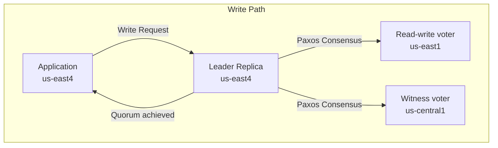

# How to Design Multi-Region Spanner Instances with Custom Leader Placement

Author: [nawazdhandala](https://www.github.com/nawazdhandala)

Tags: GCP, Cloud Spanner, Multi-Region, Leader Placement, Global Database, Database Architecture

Description: Learn how to design Cloud Spanner multi-region instances with custom leader placement to optimize write latency for specific regions while maintaining global availability.

---

Cloud Spanner's multi-region configurations give you a globally distributed database with strong consistency and 99.999% availability. But not all multi-region configurations are created equal. The default leader region determines where your writes are fast and where they incur cross-region latency. Getting leader placement right is the difference between a smoothly running global application and one where users in certain regions experience frustrating write latency.

This guide covers how to choose and configure multi-region instances with the right leader placement for your workload.

## Understanding Leader Placement

In Spanner, every write goes through a leader replica. The leader coordinates the consensus protocol (Paxos) to replicate the write to other replicas. The closer your application is to the leader, the lower the write latency.


```mermaid
graph TB
    subgraph "Write Path"
        App[Application<br>us-east4] -->|Write Request| Leader[Leader Replica<br>us-east4]
        Leader -->|Paxos Consensus| F1[Read-write voter<br>us-east1]
        Leader -->|Paxos Consensus| F2[Witness voter<br>us-central1]
        Leader -->|Quorum achieved| App
    end
```

Write latency is dominated by the round trip from the leader to the voting replicas needed for a write quorum. In a base multi-region configuration, Spanner uses five voting replicas: two in each read-write region and one witness replica. A write quorum includes one replica from the default leader region and any two of the other four voting replicas.

## Pre-Defined Multi-Region Configurations

Spanner offers several pre-defined multi-region configurations:

| Configuration | Regions | Leader Region | SLA |
|---|---|---|---|
| nam14 | us-east4, northamerica-northeast1, us-east1 | us-east4 | 99.999% |
| nam-eur-asia1 | us-central1, us-central2, europe-west1, asia-east1, us-east1 | us-central1 | 99.999% |
| eur6 | europe-west4, europe-west3, europe-west6 | europe-west4 | 99.999% |

These work well when your write traffic matches the leader region. But what if most of your writes come from Europe and the available configurations put the leader in the US?

## Custom Leader Placement

Spanner does not let you create an arbitrary multi-region topology with custom read-write or witness replicas. You choose a base multi-region configuration, then set the database's default leader region to one of that configuration's read-write regions. Custom instance configurations are useful when you want to add optional read-only replicas for low-latency stale reads.

### Creating a Custom Instance Configuration

```bash
# Create a custom eur6 configuration with optional US read-only replicas

gcloud spanner instance-configs create custom-eur6-us-read \
  --display-name="Custom eur6 with US read replicas" \
  --clone-config=eur6 \
  --add-replicas=location=us-east1,type=READ_ONLY:location=us-east1,type=READ_ONLY
```

Let me break down the replica types:

- **READ_WRITE**: Can be elected as leaders. These are defined by the base multi-region configuration.
- **READ_ONLY**: Hold full data copies for reads. Optional read-only replicas can be added to custom regional and multi-region configurations.
- **WITNESS**: Participate in consensus but hold no data. These are defined by dual-region and multi-region base configurations.

### Create the Instance with Custom Config

```bash
# Create a Spanner instance using the custom configuration
gcloud spanner instances create global-db \
  --config=custom-eur6-us-read \
  --description="Global Database - Europe Leader" \
  --edition=ENTERPRISE_PLUS \
  --nodes=3
```

## Design Patterns for Leader Placement

### Pattern 1: Single-Market Leader

Most writes come from one geographic region. Optimize for that region.

```bash
# Writes are primarily from the US
# Reads are global
gcloud spanner instance-configs create custom-nam3-global-read \
  --display-name="US Write, Global Read" \
  --clone-config=nam3 \
  --add-replicas=location=europe-west1,type=READ_ONLY:location=asia-southeast1,type=READ_ONLY
```

Expected write latency from the US: low latency when compute is near the default leader region
Expected write latency from Europe: higher latency because writes are routed to the US leader region
Expected read latency from Europe: low latency for stale reads with at least 15 seconds of staleness when served by a nearby read-only replica

### Pattern 2: Dual-Market Leader

Write traffic is split between two regions. Pick a base configuration whose read-write regions match those markets, then set the default leader per database to the region that owns the writes for that database.

```bash
# Use a base configuration that includes the desired read-write regions
gcloud spanner instances create global-db \
  --config=eur6 \
  --description="Dual-region European Database" \
  --edition=ENTERPRISE_PLUS \
  --nodes=3
```

Within that instance, you can use different databases with different default leader regions when the configuration supports those leader options. The quorum still needs voting replicas across the configuration, so cross-region latency still factors in.

### Pattern 3: Follow-the-Sun Leader

Different regions are primary during different times of day. While you should not expect per-request leader movement, you can change a database's default leader region with DDL when your operational model calls for it.

```bash
# Move the default leader for a GoogleSQL database
gcloud spanner databases ddl update operations-db \
  --instance=global-db \
  --ddl="ALTER DATABASE \`operations-db\` SET OPTIONS (default_leader = 'europe-west4')"
```

## Moving Leaders Between Databases

Within a multi-region instance, you can set different leader regions for different databases. This is useful when different applications have different geographic write patterns.

```bash
# Create a database with a specific leader region
gcloud spanner databases create payments-db \
  --instance=global-db \
  --ddl="CREATE TABLE Accounts (AccountId INT64 NOT NULL) PRIMARY KEY (AccountId); ALTER DATABASE \`payments-db\` SET OPTIONS (default_leader = 'europe-west4')"

# Create another database with a different leader
gcloud spanner databases create analytics-db \
  --instance=global-db \
  --ddl="CREATE TABLE Events (EventId INT64 NOT NULL) PRIMARY KEY (EventId); ALTER DATABASE \`analytics-db\` SET OPTIONS (default_leader = 'europe-west3')"
```

You can also change the leader region for an existing database:

```bash
# Change the default leader region for a database
gcloud spanner databases ddl update payments-db \
  --instance=global-db \
  --ddl="ALTER DATABASE \`payments-db\` SET OPTIONS (default_leader = 'europe-west3')"
```

## Measuring Write Latency by Region

After configuring leader placement, measure the actual write latency from each region.

```sql
-- Check transaction latency from Spanner's system tables
SELECT
  interval_end,
  avg_total_latency_seconds * 1000 AS avg_total_latency_ms,
  avg_commit_latency_seconds * 1000 AS avg_commit_latency_ms,
  SPANNER_SYS.DISTRIBUTION_PERCENTILE(total_latency_distribution[OFFSET(0)], 99.0) * 1000 AS p99_total_latency_ms
FROM SPANNER_SYS.TXN_STATS_TOTAL_10MINUTE
WHERE interval_end >= TIMESTAMP_SUB(CURRENT_TIMESTAMP(), INTERVAL 1 HOUR)
ORDER BY interval_end DESC;
```

Use this with application-side latency measurements from each region to understand the latency profile. The system tables are database-level statistics, not a replacement for client-region measurements.

## Cost Implications

Multi-region configurations cost more than single-region:

- Read-write and read-only replicas add database storage costs because they store full copies of the data
- Optional read-only replicas add compute, storage, and replication costs
- Inter-region replication and some outbound data transfer are charged separately

Cost optimization tips:

- Add optional READ_ONLY replicas only where you need low-latency stale reads.
- Choose the closest predefined base configuration instead of trying to create a custom voting topology.
- Consider whether you truly need multi-region. If your users are in one geography, a single-region instance with HA is significantly cheaper and still provides 99.99% SLA.

## Choosing the Right Configuration

Decision framework:

1. **Where do your writes come from?** Choose a base multi-region configuration with a read-write region close to those writers, then set the database default leader there.
2. **Where do your reads come from?** Add optional READ_ONLY replicas where you need low-latency stale reads and the base configuration supports those optional regions.
3. **What is your latency budget for writes?** Measure from your application regions. Cross-region quorum traffic and routing to the leader region both affect write latency.
4. **What is your availability target?** Multi-region configurations provide a 99.999% SLA. Regional configurations provide a 99.99% SLA.
5. **What is your budget?** Multi-region configurations cost more because of edition, compute, storage, and replication charges.

## Wrapping Up

Leader placement in Cloud Spanner is about matching your database topology to your traffic patterns. The default multi-region configurations work for common cases, and database-level default leader settings let you choose among the eligible read-write regions in that configuration. The design process boils down to three decisions: which base configuration fits your write path, which default leader region each database should use, and where optional read-only replicas help stale-read latency. Get those three right, and your globally distributed database performs well for users everywhere.
