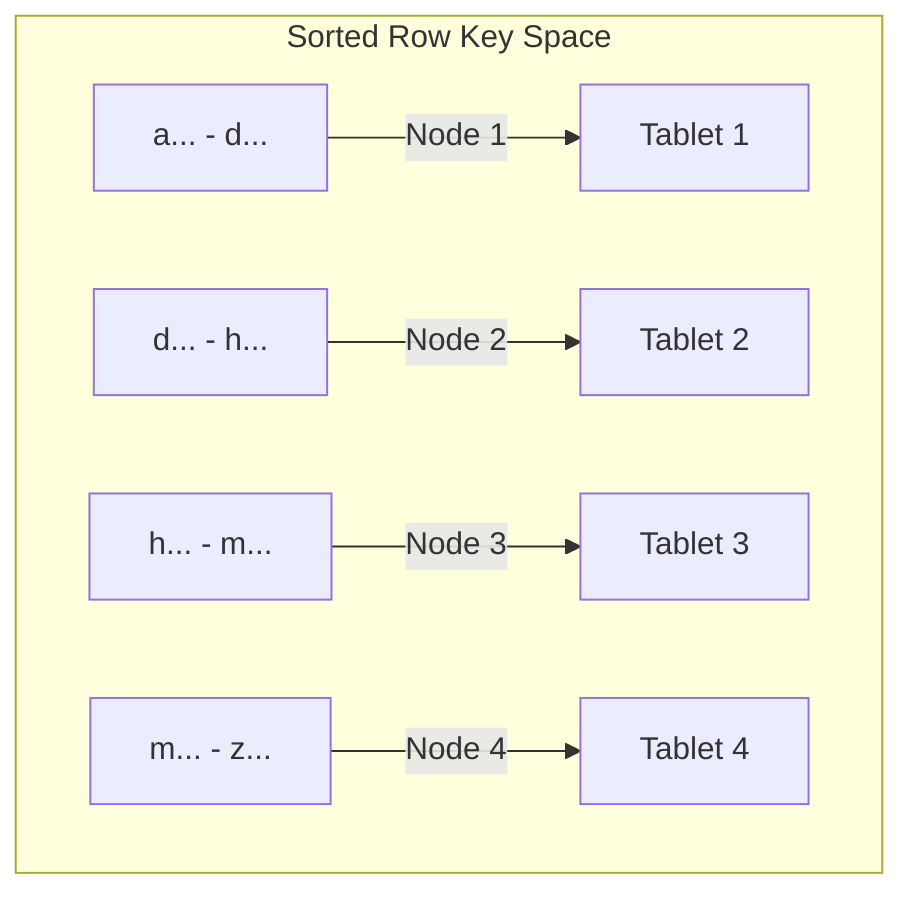

# How to Design Row Keys in Cloud Bigtable to Avoid Hotspots

Author: [nawazdhandala](https://www.github.com/nawazdhandala)

Tags: GCP, Cloud Bigtable, Row Keys, Hotspots, Schema Design

Description: Learn how to design effective row keys in Cloud Bigtable that distribute load evenly across nodes and avoid the performance-killing hotspot problem.

---

Row key design is the single most important decision you make when working with Cloud Bigtable. Get it right, and your database will handle millions of operations per second with consistent sub-10ms latency. Get it wrong, and you will have a cluster of powerful nodes where only one is doing all the work while the rest sit idle. That is a hotspot, and it is the most common performance problem in Bigtable deployments.

I have seen teams throw money at bigger clusters to fix performance issues that were actually caused by bad row key design. Let me show you how to avoid that.

## How Bigtable Distributes Data

Bigtable stores data in sorted order by row key. It splits the sorted key space into contiguous ranges called "tablets," and each tablet is served by a single node. When you write or read data, Bigtable routes the request to the node that holds the relevant tablet.



A hotspot occurs when too many requests go to the same tablet (and therefore the same node). This happens when your row keys cause reads or writes to cluster in the same region of the sorted key space.

## Anti-Pattern 1: Sequential Keys

The most common mistake is using sequentially increasing keys like timestamps or auto-incrementing IDs.

```
// BAD: Monotonically increasing row keys
// All new writes go to the same tablet at the end of the sorted range
2026-02-17T10:00:01
2026-02-17T10:00:02
2026-02-17T10:00:03
2026-02-17T10:00:04
// Every write hits the same node - massive hotspot
```

When you use timestamps as row keys, every new write goes to the end of the sorted key space. One node handles all the recent writes while the others are idle.

## Anti-Pattern 2: Starting Keys with Low-Cardinality Prefixes

Starting all your keys with the same prefix is just as bad.

```
// BAD: Most keys start with the same prefix
web#user1#event1
web#user1#event2
web#user2#event1
web#user2#event2
// If 95% of your data is "web", you have a hotspot on that prefix
```

## Pattern 1: Reverse Timestamps

If you need to query recent data first, use a reverse timestamp so the most recent data gets the lowest sort value.

```python
# GOOD: Reverse timestamp distributes data better
# and allows efficient "most recent first" scans
import time

MAX_TIMESTAMP = 9999999999999  # Far-future timestamp in milliseconds

def make_row_key(sensor_id, timestamp_ms):
    # Reverse the timestamp so newest data sorts first
    reversed_ts = MAX_TIMESTAMP - timestamp_ms
    return f"{sensor_id}#{reversed_ts}"

# Example row keys:
# sensor-001#9999998373517599  (most recent)
# sensor-001#9999998373517400  (slightly older)
# sensor-001#9999998373516000  (even older)
```

The sensor ID prefix ensures data is distributed across multiple tablets (one per sensor or group of sensors), while the reversed timestamp gives you efficient range scans for recent data.

## Pattern 2: Compound Keys with High-Cardinality Prefix

Put the field with the highest cardinality (most unique values) first in your row key.

```python
# GOOD: High-cardinality user ID comes first
# This distributes writes across many tablets
def make_row_key(user_id, event_timestamp):
    return f"{user_id}#{event_timestamp}"

# Row keys look like:
# user-00001#2026-02-17T10:00:00
# user-45892#2026-02-17T10:00:01
# user-12345#2026-02-17T10:00:02
# user-78901#2026-02-17T10:00:03
# Writes are spread across different parts of the key space
```

## Pattern 3: Hash Prefix for Even Distribution

If your natural keys are not well-distributed, add a hash prefix to force even distribution.

```python
# GOOD: Hash prefix distributes data evenly across all tablets
import hashlib

def make_row_key(entity_id, timestamp):
    # Create a hash prefix using the first 4 chars of the entity's MD5 hash
    hash_prefix = hashlib.md5(entity_id.encode()).hexdigest()[:4]
    return f"{hash_prefix}#{entity_id}#{timestamp}"

# Row keys look like:
# 2a5f#sensor-001#2026-02-17T10:00:00
# 8c3d#sensor-002#2026-02-17T10:00:00
# f1e9#sensor-001#2026-02-17T10:00:01
# 4b7a#sensor-003#2026-02-17T10:00:00
# The hash prefix ensures even distribution across the key space
```

The tradeoff is that you lose the ability to scan by entity ID directly. To read all data for `sensor-001`, you need to know its hash prefix. This works well when you always know the entity ID at query time.

## Pattern 4: Key Salting

Similar to hashing, but with a small fixed number of prefixes (salts). This gives you some control over the distribution while maintaining scannability.

```python
# GOOD: Salt prefix with a small number of buckets
# You scan all buckets in parallel when reading
NUM_SALT_BUCKETS = 10

def make_row_key(entity_id, timestamp):
    # Use a consistent salt based on the entity ID
    salt = hash(entity_id) % NUM_SALT_BUCKETS
    return f"{salt:02d}#{entity_id}#{timestamp}"

# Row keys look like:
# 00#sensor-a#2026-02-17T10:00:00
# 03#sensor-b#2026-02-17T10:00:00
# 07#sensor-c#2026-02-17T10:00:00
# 00#sensor-a#2026-02-17T10:00:01
```

To read all data for an entity, you calculate its salt and scan just that prefix. To read all data across all entities, you scan all salt prefixes in parallel.

## Pattern 5: Field Promotion for Time-Series Data

For time-series workloads, promote the time component into the row key but always with a higher-cardinality prefix.

```python
# GOOD: Combine entity ID with bucketed time for time-series data
# This creates predictable key ranges for efficient scans
def make_row_key(device_id, timestamp):
    # Bucket time into hourly segments
    hour_bucket = timestamp.strftime('%Y-%m-%dT%H')
    # Sub-second precision within the bucket
    sub_key = timestamp.strftime('%M:%S.%f')
    return f"{device_id}#{hour_bucket}#{sub_key}"

# Row keys:
# device-001#2026-02-17T10#30:00.123456
# device-001#2026-02-17T10#30:01.234567
# device-002#2026-02-17T10#30:00.345678
# device-001#2026-02-17T11#00:00.456789
```

This lets you efficiently scan all readings for a device within a specific hour, which is a very common query pattern for time-series data.

## Testing Your Key Design

Before committing to a row key design, test it with realistic data. Look at the Key Visualizer in the Cloud Console - it shows you the distribution of reads and writes across your key space.

```bash
# Generate test data with your proposed key design
# Then check the Key Visualizer in the Cloud Console
# Look for:
# - Bright horizontal lines (hotspots on specific key ranges)
# - Uneven color distribution (unbalanced load)

# You can also check the load on individual nodes
gcloud bigtable instances list --project=your-project-id
```

The Key Visualizer is a heatmap that shows you exactly where your traffic is concentrated. A well-designed key space looks like a uniform gradient. A hotspot looks like a bright line cutting across the visualization.

## Row Key Design Checklist

Before finalizing your row key design, run through this checklist:

1. Does the key start with a high-cardinality value? The first part of the key determines initial distribution.
2. Do sequential writes go to different parts of the key space? If all new data goes to the same key range, you will have a hotspot.
3. Can you efficiently query the most common access patterns? Design for your read patterns, not just write distribution.
4. Is the key reasonably short? Long keys consume more storage and memory. Aim for under 100 bytes.
5. Does the key avoid special characters that might cause issues? Stick to alphanumerics, hyphens, and hash signs.

## Common Use Case Recommendations

| Use Case | Recommended Key Pattern |
|----------|------------------------|
| User events | `{user_id}#{reverse_timestamp}` |
| IoT sensor data | `{sensor_id}#{reverse_timestamp}` |
| Web analytics | `{hash_prefix}#{domain}#{path}#{timestamp}` |
| Financial transactions | `{account_id}#{reverse_timestamp}` |
| Chat messages | `{room_id}#{timestamp}` |
| Log data | `{salt}#{hostname}#{reverse_timestamp}` |

## Wrapping Up

Row key design in Bigtable is not something you can easily change after the fact. Migrating to a new key structure means rewriting all your data. Invest the time upfront to understand your access patterns, test with realistic data, and use the Key Visualizer to verify even distribution. The core principle is simple: make sure your writes are spread across the key space, not clustered in one region. With a well-designed row key, Bigtable will deliver the performance it was built for.
