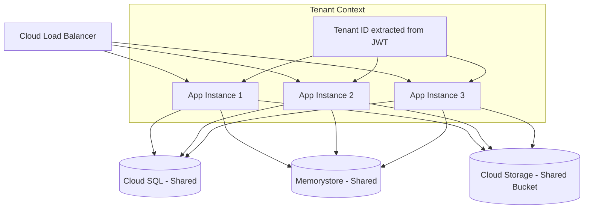

# How to Design Shared Infrastructure Multi-Tenancy with Tenant Isolation on GCP

Author: [nawazdhandala](https://www.github.com/nawazdhandala)

Tags: GCP, Multi-Tenancy, SaaS Architecture, Tenant Isolation, Google Cloud

Description: Learn how to design shared infrastructure multi-tenancy on Google Cloud Platform while maintaining proper tenant isolation for security and compliance.

---

Shared infrastructure multi-tenancy is the most cost-effective way to run a SaaS application. Instead of giving each tenant their own database, their own compute cluster, or their own project, all tenants share the same infrastructure. The challenge is doing this while still keeping tenant data and operations properly isolated.

This is the pattern most consumer SaaS products and many B2B SaaS products use. Think about how Slack, Notion, or any other SaaS tool works - you are sharing infrastructure with thousands of other customers, but you never see their data. Let me walk through how to build this on GCP.

## The Architecture Overview

In a shared infrastructure model, tenant isolation happens at the application layer rather than the infrastructure layer. Here is what the high-level architecture looks like.



Every request carries a tenant context (usually in a JWT token), and the application uses that context to scope all data access to the correct tenant.

## Database-Level Tenant Isolation

The database is where tenant isolation matters most. There are three common approaches, and I will cover the one that works best for most SaaS applications: shared database with a tenant ID column.

```sql
-- Every table that stores tenant data includes a tenant_id column
CREATE TABLE orders (
    id UUID DEFAULT gen_random_uuid() PRIMARY KEY,
    tenant_id UUID NOT NULL,
    customer_name TEXT NOT NULL,
    total_amount DECIMAL(10, 2) NOT NULL,
    created_at TIMESTAMPTZ DEFAULT NOW(),
    -- Create a composite index for efficient tenant-scoped queries
    CONSTRAINT fk_tenant FOREIGN KEY (tenant_id) REFERENCES tenants(id)
);

-- Always index on tenant_id first for query performance
CREATE INDEX idx_orders_tenant ON orders (tenant_id, created_at DESC);

-- Use Row-Level Security in PostgreSQL for an extra layer of protection
ALTER TABLE orders ENABLE ROW LEVEL SECURITY;

-- This policy ensures queries only return rows for the current tenant
CREATE POLICY tenant_isolation ON orders
    USING (tenant_id = current_setting('app.current_tenant_id')::UUID);
```

Row-Level Security (RLS) in PostgreSQL is your safety net. Even if your application code has a bug that forgets to filter by tenant_id, RLS will prevent cross-tenant data leaks.

## Implementing Tenant Context in Your Application

Every request to your application needs to carry tenant context. Here is how to implement this in a typical Python application running on GCP.

```python
# middleware/tenant_context.py
import contextvars
from functools import wraps
from flask import request, g
import jwt

# Thread-safe storage for tenant context
current_tenant = contextvars.ContextVar('current_tenant', default=None)

class TenantMiddleware:
    """Extract tenant ID from JWT and set it in the request context."""

    def __init__(self, app):
        self.app = app

    def __call__(self, environ, start_response):
        # Extract the JWT from the Authorization header
        auth_header = environ.get('HTTP_AUTHORIZATION', '')
        if auth_header.startswith('Bearer '):
            token = auth_header[7:]
            try:
                # Decode and validate the JWT
                payload = jwt.decode(
                    token,
                    key=self.public_key,
                    algorithms=['RS256']
                )
                tenant_id = payload.get('tenant_id')
                if tenant_id:
                    current_tenant.set(tenant_id)
            except jwt.InvalidTokenError:
                pass

        return self.app(environ, start_response)


def tenant_scoped(func):
    """Decorator that ensures a tenant context exists and sets the
    database session variable for RLS."""
    @wraps(func)
    def wrapper(*args, **kwargs):
        tenant_id = current_tenant.get()
        if not tenant_id:
            return {"error": "No tenant context"}, 403

        # Set the PostgreSQL session variable for RLS
        from app.database import db
        db.session.execute(
            "SET app.current_tenant_id = :tid",
            {"tid": str(tenant_id)}
        )

        return func(*args, **kwargs)
    return wrapper
```

## Cloud Storage Isolation

For file storage, you have two options in a shared model: use a single bucket with tenant-prefixed paths, or use separate buckets per tenant. The single bucket approach is simpler to manage.

```python
# storage/tenant_storage.py
from google.cloud import storage

class TenantStorage:
    """Handles tenant-isolated file storage in a shared bucket."""

    def __init__(self, bucket_name):
        self.client = storage.Client()
        self.bucket = self.client.bucket(bucket_name)

    def upload_file(self, tenant_id, file_path, file_data):
        """Upload a file to the tenant's prefix in the shared bucket."""
        # Prefix all paths with the tenant ID
        blob_path = f"tenants/{tenant_id}/{file_path}"
        blob = self.bucket.blob(blob_path)
        blob.upload_from_string(file_data)
        return blob_path

    def list_files(self, tenant_id, prefix=""):
        """List files for a specific tenant only."""
        tenant_prefix = f"tenants/{tenant_id}/{prefix}"
        # The prefix ensures we only see this tenant's files
        blobs = self.bucket.list_blobs(prefix=tenant_prefix)
        return [blob.name for blob in blobs]

    def download_file(self, tenant_id, file_path):
        """Download a file, verifying it belongs to the requesting tenant."""
        blob_path = f"tenants/{tenant_id}/{file_path}"
        blob = self.bucket.blob(blob_path)
        if not blob.exists():
            raise FileNotFoundError(f"File not found: {file_path}")
        return blob.download_as_bytes()
```

## Caching with Tenant Isolation

When using Memorystore (Redis) as a shared cache, you need to namespace cache keys by tenant to prevent data leakage.

```python
# cache/tenant_cache.py
import redis
import json

class TenantCache:
    """Tenant-isolated caching layer using Memorystore Redis."""

    def __init__(self, redis_host, redis_port=6379):
        self.redis = redis.Redis(host=redis_host, port=redis_port)

    def _key(self, tenant_id, key):
        """Generate a tenant-scoped cache key."""
        return f"tenant:{tenant_id}:{key}"

    def get(self, tenant_id, key):
        """Get a cached value for a specific tenant."""
        value = self.redis.get(self._key(tenant_id, key))
        if value:
            return json.loads(value)
        return None

    def set(self, tenant_id, key, value, ttl=3600):
        """Set a cached value for a specific tenant."""
        self.redis.setex(
            self._key(tenant_id, key),
            ttl,
            json.dumps(value)
        )

    def invalidate_tenant(self, tenant_id):
        """Invalidate all cached data for a tenant.
        Useful during data migrations or tenant offboarding."""
        pattern = f"tenant:{tenant_id}:*"
        cursor = 0
        while True:
            cursor, keys = self.redis.scan(cursor, match=pattern, count=100)
            if keys:
                self.redis.delete(*keys)
            if cursor == 0:
                break
```

## Rate Limiting Per Tenant

In a shared infrastructure model, you must prevent any single tenant from consuming too many resources. Rate limiting is essential.

```python
# middleware/rate_limiter.py
import time
import redis

class TenantRateLimiter:
    """Sliding window rate limiter scoped to individual tenants."""

    def __init__(self, redis_client, default_rate=100, window_seconds=60):
        self.redis = redis_client
        self.default_rate = default_rate
        self.window = window_seconds

    def check_rate(self, tenant_id):
        """Check if the tenant is within their rate limit."""
        key = f"ratelimit:{tenant_id}"
        now = time.time()
        pipe = self.redis.pipeline()

        # Remove entries outside the current window
        pipe.zremrangebyscore(key, 0, now - self.window)
        # Add the current request
        pipe.zadd(key, {str(now): now})
        # Count requests in the window
        pipe.zcard(key)
        # Set expiry on the key
        pipe.expire(key, self.window)

        results = pipe.execute()
        request_count = results[2]

        # Get tenant-specific limit or use default
        tenant_limit = self.get_tenant_limit(tenant_id)
        return request_count <= tenant_limit

    def get_tenant_limit(self, tenant_id):
        """Look up the rate limit for a specific tenant based on their tier."""
        limit = self.redis.get(f"tenant_limit:{tenant_id}")
        if limit:
            return int(limit)
        return self.default_rate
```

## Monitoring and Observability

You need to be able to see resource usage and performance per tenant, even though they share infrastructure. Add tenant_id as a label to all your metrics.

```python
# monitoring/tenant_metrics.py
from google.cloud import monitoring_v3
import time

def write_tenant_metric(project_id, tenant_id, metric_name, value):
    """Write a custom metric with tenant context to Cloud Monitoring."""
    client = monitoring_v3.MetricServiceClient()
    project_name = f"projects/{project_id}"

    series = monitoring_v3.TimeSeries()
    series.metric.type = f"custom.googleapis.com/saas/{metric_name}"
    series.metric.labels["tenant_id"] = tenant_id

    series.resource.type = "global"
    series.resource.labels["project_id"] = project_id

    now = time.time()
    interval = monitoring_v3.TimeInterval(
        {"end_time": {"seconds": int(now)}}
    )
    point = monitoring_v3.Point(
        {"interval": interval, "value": {"double_value": value}}
    )
    series.points = [point]

    # Write the metric to Cloud Monitoring
    client.create_time_series(
        request={"name": project_name, "time_series": [series]}
    )
```

## Wrapping Up

Shared infrastructure multi-tenancy is the most cost-effective pattern for SaaS on GCP, but it requires discipline in your application code. Every data access path needs tenant context, every cache key needs tenant scoping, and every metric needs tenant labels. The key building blocks are: Row-Level Security in your database, tenant-prefixed storage paths, namespaced cache keys, per-tenant rate limiting, and tenant-labeled monitoring. Get these right, and your shared infrastructure will be both efficient and secure.
