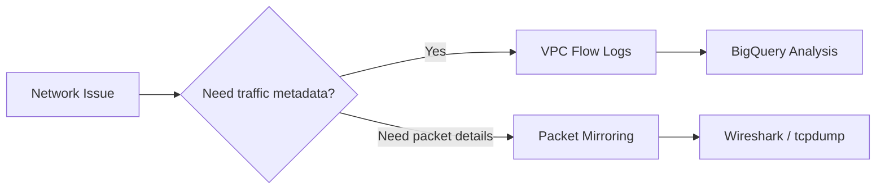
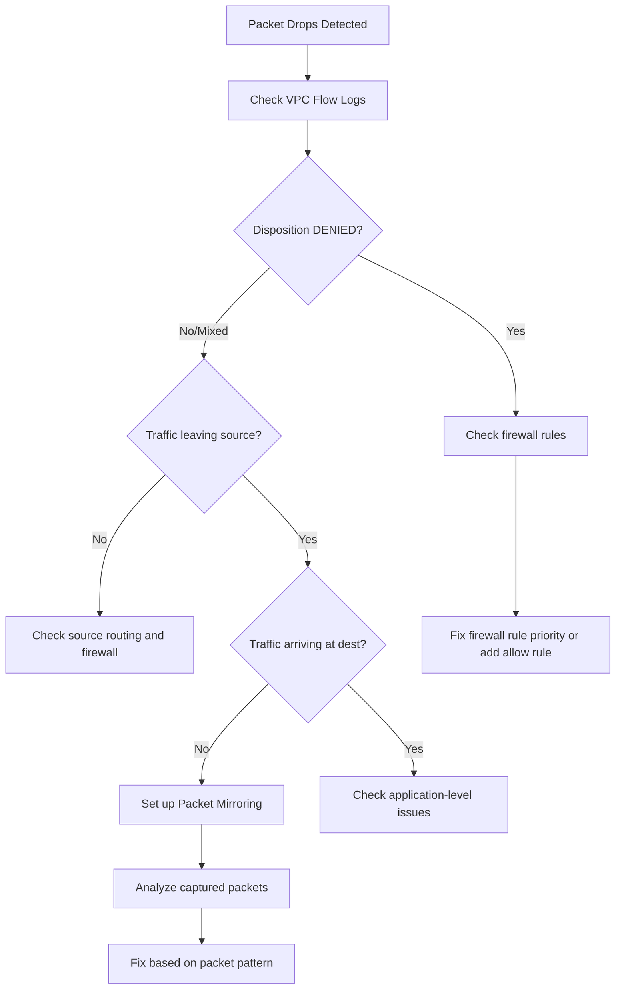

# How to Diagnose Packet Drops in Google Cloud VPC Using Flow Logs and Packet Mirroring

Author: [nawazdhandala](https://www.github.com/nawazdhandala)

Tags: GCP, VPC, Flow Logs, Packet Mirroring, Networking, Troubleshooting

Description: A practical guide to using VPC Flow Logs and Packet Mirroring to diagnose and resolve packet drops in Google Cloud VPC networks.

---

Packet drops in your VPC can cause all kinds of mysterious application behavior - timeouts, connection resets, degraded performance, and intermittent errors that are hard to reproduce. The challenge is figuring out where packets are being dropped and why. Google Cloud provides two powerful tools for this: VPC Flow Logs and Packet Mirroring. Let me show you how to use both to track down the problem.

## VPC Flow Logs vs. Packet Mirroring

These tools serve different purposes:

**VPC Flow Logs** capture metadata about network flows (source, destination, ports, bytes, packets). They tell you what traffic is flowing and whether it was allowed or denied. Think of them as a summary.

**Packet Mirroring** captures full packets and sends them to a collector for deep inspection. This is like a network tap - you get the complete packet including headers and payload. Use this when flow logs are not enough.



## Step 1: Enable VPC Flow Logs

If flow logs are not already enabled on your subnet, turn them on:

```bash
# Enable flow logs on a subnet
gcloud compute networks subnets update my-subnet \
    --region=us-central1 \
    --enable-flow-logs \
    --logging-aggregation-interval=INTERVAL_5_SEC \
    --logging-flow-sampling=1.0 \
    --logging-metadata=include-all \
    --project=my-project
```

Configuration options:
- `aggregation-interval`: How often to aggregate flows (5 seconds gives the most detail)
- `flow-sampling`: 1.0 captures 100% of flows (use lower values for high-traffic subnets to control costs)
- `logging-metadata`: Include all metadata for maximum diagnostic value

## Step 2: Query Flow Logs to Find Drops

Flow logs go to Cloud Logging. Query them to find dropped traffic:

```bash
# Search for denied (dropped) flows in the last hour
gcloud logging read \
    'resource.type="gce_subnetwork" AND jsonPayload.disposition="DENIED"' \
    --project=my-project \
    --limit=20 \
    --format=json
```

For more detailed analysis, export flow logs to BigQuery and run queries there:

```bash
# Create a log sink to BigQuery
gcloud logging sinks create vpc-flow-logs-sink \
    bigquery.googleapis.com/projects/my-project/datasets/vpc_flow_logs \
    --log-filter='resource.type="gce_subnetwork" AND logName:"compute.googleapis.com%2Fvpc_flows"' \
    --project=my-project
```

Then query the data in BigQuery:

```sql
-- Find the most common dropped flows
SELECT
  jsonPayload.connection.src_ip AS source_ip,
  jsonPayload.connection.dest_ip AS dest_ip,
  jsonPayload.connection.src_port AS source_port,
  jsonPayload.connection.dest_port AS dest_port,
  jsonPayload.connection.protocol AS protocol,
  jsonPayload.disposition AS disposition,
  jsonPayload.reporter AS reporter,
  COUNT(*) AS flow_count
FROM `my-project.vpc_flow_logs.compute_googleapis_com_vpc_flows_*`
WHERE
  _TABLE_SUFFIX >= FORMAT_DATE('%Y%m%d', DATE_SUB(CURRENT_DATE(), INTERVAL 1 DAY))
  AND jsonPayload.disposition = 'DENIED'
GROUP BY 1, 2, 3, 4, 5, 6, 7
ORDER BY flow_count DESC
LIMIT 50;
```

```sql
-- Analyze packet drops between specific source and destination
SELECT
  TIMESTAMP_TRUNC(timestamp, MINUTE) AS minute,
  jsonPayload.connection.src_ip AS source_ip,
  jsonPayload.connection.dest_ip AS dest_ip,
  jsonPayload.connection.dest_port AS dest_port,
  SUM(CAST(jsonPayload.packets_sent AS INT64)) AS total_packets,
  jsonPayload.disposition AS disposition
FROM `my-project.vpc_flow_logs.compute_googleapis_com_vpc_flows_*`
WHERE
  _TABLE_SUFFIX >= FORMAT_DATE('%Y%m%d', DATE_SUB(CURRENT_DATE(), INTERVAL 1 DAY))
  AND jsonPayload.connection.dest_ip = '10.0.1.50'
GROUP BY 1, 2, 3, 4, 6
ORDER BY minute DESC
LIMIT 100;
```

## Step 3: Identify Why Packets Are Dropped

The most common reasons for packet drops in a VPC:

### Firewall Rules

```bash
# List all firewall rules and look for deny rules
gcloud compute firewall-rules list \
    --filter="network=my-vpc" \
    --sort-by=priority \
    --format="table(name, direction, priority, sourceRanges, destinationRanges, allowed, denied)" \
    --project=my-project
```

Check if there is a deny rule with higher priority than your allow rules:

```bash
# Test a specific connection against firewall rules
gcloud compute firewall-rules describe my-deny-rule \
    --project=my-project \
    --format=json
```

### Route Issues

```bash
# Check routes that might be sending traffic to wrong destinations
gcloud compute routes list \
    --filter="network=my-vpc" \
    --format="table(name, destRange, nextHopGateway, nextHopInstance, nextHopIp, priority)" \
    --project=my-project
```

### Security Groups and Network Policies

If you are using GKE, Kubernetes NetworkPolicies might be dropping traffic:

```bash
# Check network policies in the namespace
kubectl get networkpolicies -n my-namespace -o yaml
```

## Step 4: Set Up Packet Mirroring for Deep Inspection

When flow logs show traffic is being sent but the destination is not receiving it (or you need to see the actual packet contents), use Packet Mirroring.

```bash
# Create a collector instance (this receives mirrored packets)
gcloud compute instances create packet-collector \
    --zone=us-central1-a \
    --machine-type=n1-standard-4 \
    --image-family=debian-11 \
    --image-project=debian-cloud \
    --can-ip-forward \
    --project=my-project

# Create an internal load balancer to receive mirrored traffic
gcloud compute health-checks create tcp mirror-health-check --port=80 --project=my-project

gcloud compute backend-services create mirror-backend \
    --protocol=TCP \
    --health-checks=mirror-health-check \
    --load-balancing-scheme=INTERNAL \
    --region=us-central1 \
    --project=my-project

gcloud compute backend-services add-backend mirror-backend \
    --instance-group=packet-collector-group \
    --region=us-central1 \
    --project=my-project

gcloud compute forwarding-rules create mirror-rule \
    --load-balancing-scheme=INTERNAL \
    --backend-service=mirror-backend \
    --is-mirroring-collector \
    --network=my-vpc \
    --subnet=my-subnet \
    --region=us-central1 \
    --project=my-project
```

Create the packet mirroring policy:

```bash
# Mirror all traffic from specific instances
gcloud compute packet-mirrorings create my-mirror-policy \
    --region=us-central1 \
    --network=my-vpc \
    --collector-ilb=mirror-rule \
    --mirrored-instances=zones/us-central1-a/instances/my-instance \
    --filter-cidr-ranges=10.0.1.0/24 \
    --filter-protocols=tcp \
    --project=my-project
```

On the collector instance, use tcpdump to capture packets:

```bash
# SSH into the collector and capture mirrored packets
gcloud compute ssh packet-collector --zone=us-central1-a --project=my-project

# On the collector instance, capture packets to a file
sudo tcpdump -i eth0 -w /tmp/capture.pcap -c 10000

# Filter for specific traffic
sudo tcpdump -i eth0 host 10.0.1.50 and port 443 -w /tmp/filtered.pcap
```

Download the capture file and open it in Wireshark for detailed analysis.

## Step 5: Common Packet Drop Patterns and Fixes

### Pattern: TCP RST After SYN

This means the destination is rejecting the connection. Check if the service is running on the destination and the port is correct.

### Pattern: No Response to SYN (Timeout)

Indicates a firewall is silently dropping the packets. Check both GCP firewall rules and any host-based firewall on the destination instance.

### Pattern: Intermittent Drops Under Load

This can indicate network throttling. Check if your instance type has sufficient network bandwidth:

```bash
# Check instance network performance tier
gcloud compute instances describe my-instance \
    --zone=us-central1-a \
    --format="json(networkInterfaces, machineType)" \
    --project=my-project
```

### Pattern: MTU-Related Drops

Packets larger than the MTU get dropped if fragmentation is not allowed:

```bash
# Test MTU between two instances
# From source instance:
ping -M do -s 1460 10.0.1.50  # Test with 1460 byte payload (1500 MTU)
ping -M do -s 8900 10.0.1.50  # Test with jumbo frames
```

## Monitoring and Alerting

```bash
# Create a log-based metric for denied flows
gcloud logging metrics create vpc-denied-flows \
    --description="Count of denied VPC flows" \
    --log-filter='resource.type="gce_subnetwork" AND jsonPayload.disposition="DENIED"' \
    --project=my-project
```



Packet drops are methodical to debug. Start with flow logs for the broad picture, narrow down to specific source-destination pairs, and use packet mirroring when you need the full packet details. Most drops are caused by firewall rules, but when they are not, the packet capture gives you everything you need to find the real cause.
