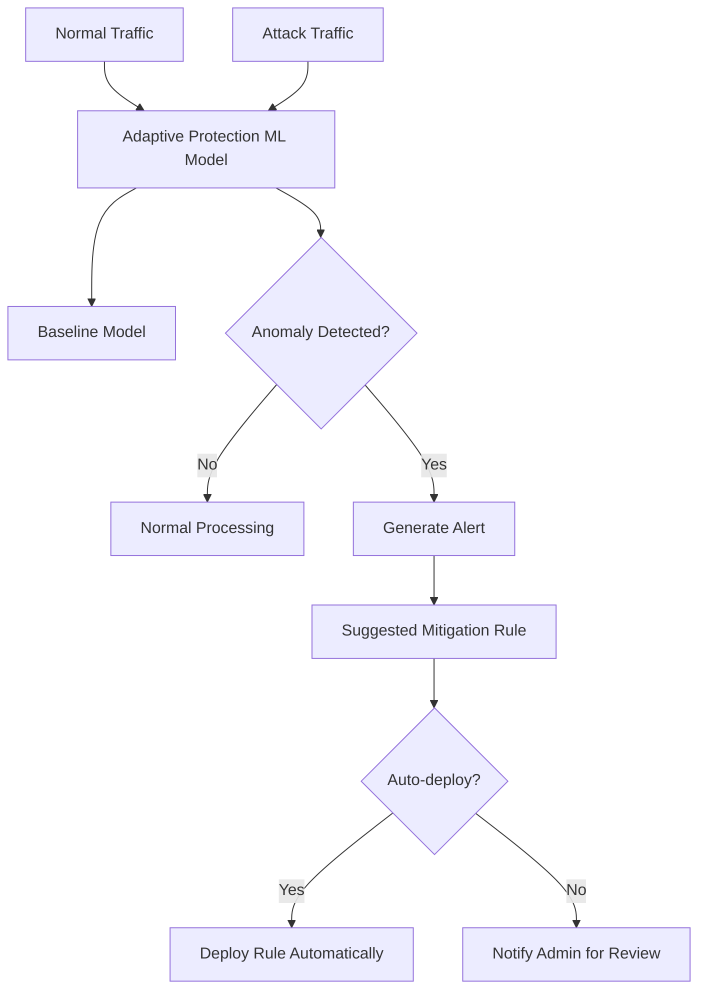

# How to Enable Adaptive Protection for Automated DDoS Detection in Google Cloud Armor

Author: [nawazdhandala](https://www.github.com/nawazdhandala)

Tags: GCP, Cloud Armor, Adaptive Protection, DDoS, Security, Machine Learning

Description: Learn how to enable and configure Adaptive Protection in Google Cloud Armor for automated detection and mitigation of DDoS and layer 7 attacks.

---

Traditional DDoS protection relies on static rules - you define thresholds and patterns, and the system blocks traffic that matches. The problem is that sophisticated attacks do not look like obvious floods. They mimic legitimate traffic patterns, slowly ramp up, or use application-layer techniques that bypass simple rate limits.

Cloud Armor's Adaptive Protection uses machine learning to baseline your normal traffic patterns and automatically detect anomalies that indicate an attack. When it detects something suspicious, it generates a recommended rule that you can deploy to block the attack traffic while allowing legitimate users through.

## How Adaptive Protection Works

Adaptive Protection operates in three phases:

1. **Learning**: It observes your traffic patterns over time, building a baseline of what normal traffic looks like for each backend service. This includes request rates, geographic distribution, user agent distribution, and request patterns.

2. **Detection**: It continuously compares incoming traffic against the learned baseline. When traffic deviates significantly - a spike in requests from an unusual region, a surge in requests with similar patterns, or abnormal request rates - it flags a potential attack.

3. **Alerting and Mitigation**: When an attack is detected, Adaptive Protection generates an alert with details about the attack traffic and a suggested Cloud Armor rule to mitigate it. You can review the suggestion and deploy it, or set up automatic deployment.



## Prerequisites

- Cloud Armor security policy attached to a backend service
- The backend service must be behind an external HTTP(S) load balancer
- Cloud Armor Managed Protection Plus tier (Adaptive Protection is a premium feature)

## Step 1: Enable Managed Protection Plus

Adaptive Protection requires the Managed Protection Plus tier.

```bash
# Enable Managed Protection Plus for your project
gcloud compute security-policies update my-security-policy \
    --enable-ml \
    --project=my-project
```

## Step 2: Enable Adaptive Protection on Your Security Policy

```bash
# Enable Adaptive Protection
gcloud compute security-policies update my-security-policy \
    --enable-ml \
    --project=my-project
```

You can also enable it when creating a new policy.

```bash
# Create a new policy with Adaptive Protection enabled
gcloud compute security-policies create adaptive-policy \
    --description="Security policy with Adaptive Protection" \
    --enable-ml \
    --project=my-project
```

## Step 3: Configure Adaptive Protection Settings

Adaptive Protection has configurable parameters that control its sensitivity and behavior.

```bash
# Set Adaptive Protection to auto-deploy rules for high-confidence detections
gcloud compute security-policies update adaptive-policy \
    --adaptive-protection-config-layer7-ddos-defense-enable \
    --adaptive-protection-config-layer7-ddos-defense-rule-visibility=STANDARD \
    --project=my-project
```

### Auto-Deploy Configuration

You can configure Adaptive Protection to automatically deploy mitigation rules when it detects an attack with sufficient confidence.

```bash
# Configure auto-deploy settings
gcloud compute security-policies update adaptive-policy \
    --adaptive-protection-config-auto-deploy-load-threshold=0.8 \
    --adaptive-protection-config-auto-deploy-confidence-threshold=0.7 \
    --adaptive-protection-config-auto-deploy-impacted-baseline-threshold=0.01 \
    --adaptive-protection-config-auto-deploy-expiration-sec=7200 \
    --project=my-project
```

The auto-deploy parameters:

- **load-threshold**: The backend load level (0 to 1) above which auto-deploy is triggered. 0.8 means auto-deploy only when the backend is under significant load.
- **confidence-threshold**: The confidence level (0 to 1) of the attack detection. 0.7 means only auto-deploy when Adaptive Protection is 70% or more confident it is a real attack.
- **impacted-baseline-threshold**: The fraction of legitimate traffic that might be impacted by the rule. 0.01 means the rule should affect less than 1% of baseline traffic.
- **expiration-sec**: How long the auto-deployed rule stays active. 7200 seconds = 2 hours.

## Step 4: Set Up Alerting

Configure alerts so you are notified when Adaptive Protection detects an attack.

```bash
# Create a notification channel for Cloud Armor alerts
gcloud monitoring notification-channels create \
    --display-name="Security Team Email" \
    --type=email \
    --channel-labels=email_address=security@example.com \
    --project=my-project
```

Adaptive Protection events appear in Cloud Logging. Set up a log-based alert.

```bash
# Create a log-based alert for Adaptive Protection detections
gcloud logging sinks create adaptive-protection-alerts \
    pubsub.googleapis.com/projects/my-project/topics/security-alerts \
    --log-filter='resource.type="http_load_balancer" AND jsonPayload.adaptiveProtection.autoDeployAlertId!=""' \
    --project=my-project
```

## Step 5: Review Attack Alerts

When Adaptive Protection detects an attack, it provides detailed information in the Cloud Console and logs.

```bash
# View Adaptive Protection alerts
gcloud logging read \
    'resource.type="http_load_balancer" AND jsonPayload.adaptiveProtection.autoDeployAlertId!=""' \
    --format="json(timestamp,jsonPayload.adaptiveProtection)" \
    --limit=10 \
    --project=my-project
```

The alert includes:
- Attack start time
- Confidence score
- Affected backend service
- Attack traffic characteristics (source IPs, regions, user agents, request patterns)
- A suggested mitigation rule expression

### Understanding the Suggested Rule

When Adaptive Protection generates a rule suggestion, it might look something like this:

```
evaluatePreconfiguredExpr('adaptive-protection-auto-deploy') &&
origin.region_code in ['XX', 'YY'] &&
request.headers['user-agent'].contains('BotPattern')
```

This expression targets the specific traffic pattern that Adaptive Protection identified as malicious. It is designed to block the attack while minimizing impact on legitimate traffic.

## Step 6: Manually Deploy a Suggested Rule

If you have auto-deploy disabled or want to review rules before deployment, you can manually create the rule from the suggestion.

```bash
# Deploy the suggested rule manually
gcloud compute security-policies rules create 100 \
    --security-policy=adaptive-policy \
    --expression="origin.region_code in ['XX', 'YY'] && request.headers['user-agent'].contains('BotPattern')" \
    --action=deny-403 \
    --description="Adaptive Protection mitigation - attack from XX/YY" \
    --project=my-project
```

Set an expiration by planning to remove the rule after the attack subsides.

```bash
# Remove the mitigation rule after the attack is over
gcloud compute security-policies rules delete 100 \
    --security-policy=adaptive-policy \
    --project=my-project
```

## Step 7: Terraform Configuration

```hcl
# Security policy with Adaptive Protection
resource "google_compute_security_policy" "adaptive" {
  name        = "adaptive-policy"
  description = "Policy with Adaptive Protection enabled"

  # Enable Adaptive Protection
  adaptive_protection_config {
    layer_7_ddos_defense_config {
      enable          = true
      rule_visibility = "STANDARD"
    }

    auto_deploy_config {
      load_threshold              = 0.8
      confidence_threshold        = 0.7
      impacted_baseline_threshold = 0.01
      expiration_sec              = 7200
    }
  }

  # Default allow
  rule {
    action   = "allow"
    priority = 2147483647
    description = "Default allow"
    match {
      versioned_expr = "SRC_IPS_V1"
      config {
        src_ip_ranges = ["*"]
      }
    }
  }

  # Standard WAF rules alongside Adaptive Protection
  rule {
    action   = "deny(403)"
    priority = 1000
    description = "Block SQL injection"
    match {
      expr {
        expression = "evaluatePreconfiguredExpr('sqli-v33-stable')"
      }
    }
  }

  rule {
    action   = "deny(403)"
    priority = 2000
    description = "Block XSS"
    match {
      expr {
        expression = "evaluatePreconfiguredExpr('xss-v33-stable')"
      }
    }
  }
}

# Attach to backend
resource "google_compute_backend_service" "web" {
  name            = "web-backend"
  security_policy = google_compute_security_policy.adaptive.id
  # ... other backend configuration
}
```

## Step 8: Monitor Adaptive Protection Performance

Track how Adaptive Protection is performing over time.

```bash
# View all Adaptive Protection events in the last 24 hours
gcloud logging read \
    'resource.type="http_load_balancer" AND jsonPayload.adaptiveProtection.autoDeployAlertId!="" AND timestamp>="2026-02-16T00:00:00Z"' \
    --format="table(timestamp,jsonPayload.adaptiveProtection.autoDeployAlertId,jsonPayload.adaptiveProtection.autoDeployAlertState)" \
    --limit=50 \
    --project=my-project
```

### Key Metrics to Track

- **Detection count**: How many attacks Adaptive Protection identified
- **Auto-deploy count**: How many rules were automatically deployed
- **False positive rate**: How many detections turned out to be legitimate traffic spikes
- **Time to mitigation**: How quickly attacks were detected and rules deployed
- **Legitimate traffic impact**: Whether auto-deployed rules blocked any real users

## Best Practices

**Start with manual review.** Enable Adaptive Protection with auto-deploy disabled initially. Review the alerts and suggested rules for a few weeks to build confidence in the detection accuracy.

**Set conservative auto-deploy thresholds.** High confidence threshold (0.8+) and low impacted baseline threshold (0.01 or lower) reduce the risk of false positives.

**Combine with static rules.** Adaptive Protection works best alongside standard Cloud Armor rules. Use static rules for known threats (IP blocks, WAF rules) and let Adaptive Protection handle novel attacks.

**Monitor auto-deployed rules.** When a rule is auto-deployed, check the logs to verify it is blocking attack traffic and not legitimate users. If you see false positives, adjust the thresholds.

**Set reasonable expiration times.** Auto-deployed rules should expire after the attack subsides. 2-4 hours is a good default. If the attack continues, Adaptive Protection will generate new rules.

**Keep your baseline stable.** Adaptive Protection needs stable traffic patterns to build an accurate baseline. If you are doing a major launch or marketing campaign that will significantly change traffic patterns, consider temporarily disabling auto-deploy.

## What Adaptive Protection Detects

Adaptive Protection is designed to catch:

- **Volumetric L7 attacks**: Large-scale HTTP floods designed to overwhelm your application
- **Slow-rate attacks**: Traffic that stays below simple rate limit thresholds but is clearly anomalous when analyzed collectively
- **Application-layer attacks**: Requests that target specific expensive endpoints to exhaust backend resources
- **Distributed attacks**: Attacks from many sources that individually look normal but collectively form an attack pattern
- **Traffic pattern anomalies**: Unusual geographic distributions, user agent patterns, or request paths that deviate from your baseline

## Wrapping Up

Adaptive Protection adds an intelligent, machine-learning-driven layer to Cloud Armor that catches attacks that static rules miss. It learns what normal looks like for your application and flags deviations that indicate attacks. The auto-deploy feature can respond to attacks in minutes without human intervention, which is critical when attacks happen at 3 AM on a weekend. Start with manual review to build confidence, then enable auto-deploy with conservative thresholds. Combined with your existing WAF and rate limiting rules, Adaptive Protection gives you comprehensive protection against both known and novel threats.
