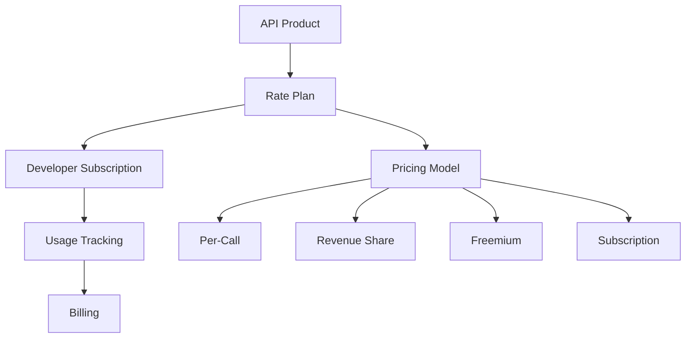

# How to Enable and Configure Apigee Monetization for Paid API Products

Author: [nawazdhandala](https://www.github.com/nawazdhandala)

Tags: Apigee, GCP, Monetization, API Products, API Management

Description: Learn how to set up Apigee monetization to charge API consumers based on usage, configure rate plans, and manage billing for your paid API products.

---

If you are building an API business, at some point you need to charge for access. Apigee monetization lets you define pricing models for your API products, track usage, and bill developers. You can charge per API call, per data volume, by subscription, or with a freemium model that offers a free tier before paid usage kicks in. This guide covers the setup from enabling monetization through creating rate plans and managing developer billing.

## Enabling Monetization

Monetization is an add-on feature in Apigee. It needs to be enabled on your Apigee organization before you can use it.

Check if monetization is already enabled:

```bash
# Check organization features
curl "https://apigee.googleapis.com/v1/organizations/YOUR_ORG" \
  -H "Authorization: Bearer $(gcloud auth print-access-token)" | jq '.addonsConfig'
```

Enable monetization if it is not active:

```bash
# Enable monetization for the organization
curl -X POST \
  "https://apigee.googleapis.com/v1/organizations/YOUR_ORG:setAddons" \
  -H "Authorization: Bearer $(gcloud auth print-access-token)" \
  -H "Content-Type: application/json" \
  -d '{
    "addonsConfig": {
      "monetizationConfig": {
        "enabled": true
      }
    }
  }'
```

## Understanding the Monetization Model

Apigee monetization works with these concepts:



- **API Product** - the API offering (you already have this)
- **Rate Plan** - the pricing structure attached to a product
- **Developer Subscription** - when a developer agrees to a rate plan
- **Usage Tracking** - automatic counting of API calls per developer
- **Billing** - generating invoices based on usage and rate plan

## Creating Rate Plans

Rate plans define how developers are charged. Let us create several common pricing models.

### Pay-Per-Call Rate Plan

Charge developers for each API call they make:

```bash
# Create a pay-per-call rate plan
curl -X POST \
  "https://apigee.googleapis.com/v1/organizations/YOUR_ORG/apiproducts/data-api-premium/rateplans" \
  -H "Authorization: Bearer $(gcloud auth print-access-token)" \
  -H "Content-Type: application/json" \
  -d '{
    "displayName": "Pay Per Call",
    "description": "Charged per API call at $0.001 per request",
    "state": "PUBLISHED",
    "startTime": "2026-01-01T00:00:00Z",
    "currencyCode": "USD",
    "consumptionPricingType": "FIXED_PER_UNIT",
    "consumptionPricingRates": [
      {
        "fee": {
          "currencyCode": "USD",
          "units": "0",
          "nanos": 1000000
        }
      }
    ],
    "billingPeriod": "MONTHLY",
    "paymentFundingModel": "POSTPAID"
  }'
```

### Tiered Pricing Rate Plan

Offer volume discounts - the price per call decreases as usage increases:

```bash
# Create a tiered pricing rate plan
curl -X POST \
  "https://apigee.googleapis.com/v1/organizations/YOUR_ORG/apiproducts/data-api-premium/rateplans" \
  -H "Authorization: Bearer $(gcloud auth print-access-token)" \
  -H "Content-Type: application/json" \
  -d '{
    "displayName": "Volume Tiered Pricing",
    "description": "Discounted rates at higher volumes",
    "state": "PUBLISHED",
    "startTime": "2026-01-01T00:00:00Z",
    "currencyCode": "USD",
    "consumptionPricingType": "BANDED",
    "consumptionPricingRates": [
      {
        "start": "0",
        "end": "10000",
        "fee": {
          "currencyCode": "USD",
          "units": "0",
          "nanos": 2000000
        }
      },
      {
        "start": "10001",
        "end": "100000",
        "fee": {
          "currencyCode": "USD",
          "units": "0",
          "nanos": 1000000
        }
      },
      {
        "start": "100001",
        "fee": {
          "currencyCode": "USD",
          "units": "0",
          "nanos": 500000
        }
      }
    ],
    "billingPeriod": "MONTHLY",
    "paymentFundingModel": "POSTPAID"
  }'
```

This creates three tiers:
- First 10,000 calls: $0.002 each
- 10,001 to 100,000 calls: $0.001 each
- Over 100,000 calls: $0.0005 each

### Freemium Rate Plan

Offer a free tier with paid usage beyond a threshold:

```bash
# Create a freemium rate plan
curl -X POST \
  "https://apigee.googleapis.com/v1/organizations/YOUR_ORG/apiproducts/data-api-free/rateplans" \
  -H "Authorization: Bearer $(gcloud auth print-access-token)" \
  -H "Content-Type: application/json" \
  -d '{
    "displayName": "Freemium Plan",
    "description": "1000 free calls per month, then $0.001 per call",
    "state": "PUBLISHED",
    "startTime": "2026-01-01T00:00:00Z",
    "currencyCode": "USD",
    "consumptionPricingType": "BANDED",
    "consumptionPricingRates": [
      {
        "start": "0",
        "end": "1000",
        "fee": {
          "currencyCode": "USD",
          "units": "0",
          "nanos": 0
        }
      },
      {
        "start": "1001",
        "fee": {
          "currencyCode": "USD",
          "units": "0",
          "nanos": 1000000
        }
      }
    ],
    "billingPeriod": "MONTHLY",
    "paymentFundingModel": "POSTPAID"
  }'
```

### Fixed Subscription Rate Plan

Charge a flat monthly fee regardless of usage:

```bash
# Create a subscription rate plan
curl -X POST \
  "https://apigee.googleapis.com/v1/organizations/YOUR_ORG/apiproducts/data-api-enterprise/rateplans" \
  -H "Authorization: Bearer $(gcloud auth print-access-token)" \
  -H "Content-Type: application/json" \
  -d '{
    "displayName": "Enterprise Monthly Subscription",
    "description": "Flat $99/month for unlimited API access",
    "state": "PUBLISHED",
    "startTime": "2026-01-01T00:00:00Z",
    "currencyCode": "USD",
    "fixedRecurringFee": {
      "currencyCode": "USD",
      "units": "99",
      "nanos": 0
    },
    "billingPeriod": "MONTHLY",
    "paymentFundingModel": "PREPAID"
  }'
```

## Managing Developer Subscriptions

When a developer wants to use a paid API product, they subscribe to a rate plan.

Subscribe a developer to a rate plan:

```bash
# Subscribe a developer to the pay-per-call plan
curl -X POST \
  "https://apigee.googleapis.com/v1/organizations/YOUR_ORG/developers/developer@example.com/subscriptions" \
  -H "Authorization: Bearer $(gcloud auth print-access-token)" \
  -H "Content-Type: application/json" \
  -d '{
    "apiproduct": "data-api-premium",
    "startTime": "2026-02-01T00:00:00Z"
  }'
```

List a developer's subscriptions:

```bash
# List active subscriptions for a developer
curl "https://apigee.googleapis.com/v1/organizations/YOUR_ORG/developers/developer@example.com/subscriptions" \
  -H "Authorization: Bearer $(gcloud auth print-access-token)"
```

## Tracking Usage

Apigee automatically tracks usage based on API calls that pass through your proxies. You can query usage data to see how much each developer has consumed.

Check a developer's current usage:

```bash
# Get usage for a developer in the current billing period
curl "https://apigee.googleapis.com/v1/organizations/YOUR_ORG/developers/developer@example.com/balance" \
  -H "Authorization: Bearer $(gcloud auth print-access-token)"
```

## Adding Monetization Awareness to Your Proxy

You might want your proxy to behave differently based on a developer's monetization status. For example, block access if a prepaid balance is exhausted.

Use a JavaScript policy to check monetization variables:

```xml
<!-- apiproxy/policies/CheckMintStatus.xml -->
<?xml version="1.0" encoding="UTF-8" standalone="yes"?>
<Javascript name="CheckMintStatus" timeLimit="200">
    <DisplayName>Check Monetization Status</DisplayName>
    <ResourceURL>jsc://check-mint-status.js</ResourceURL>
</Javascript>
```

```javascript
// apiproxy/resources/jsc/check-mint-status.js
// Check if the developer has an active subscription
var mintStatus = context.getVariable("mint.mintng_status");
var isMonetized = context.getVariable("mint.is_developer_monetized");

// Log the monetization status for debugging
print("Monetization status: " + mintStatus);
print("Is monetized: " + isMonetized);

// If the developer has exceeded their prepaid balance, block the request
if (mintStatus === "BLOCKED") {
  context.setVariable("mint.blocked", true);
  context.setVariable("mint.block_reason", "Prepaid balance exhausted");
}
```

## Generating Billing Reports

Create billing reports for your finance team or for developer invoices:

```bash
# Generate a billing report for the current month
curl "https://apigee.googleapis.com/v1/organizations/YOUR_ORG/reports" \
  -H "Authorization: Bearer $(gcloud auth print-access-token)" \
  --data-urlencode "select=sum(message_count)" \
  --data-urlencode "timeRange=02/01/2026 00:00~02/28/2026 23:59" \
  --data-urlencode "groupBy=developer_email,apiproduct"
```

For more detailed billing data, export analytics to BigQuery and run billing queries:

```sql
-- Generate a monthly invoice summary per developer
SELECT
  developer_email,
  apiproduct,
  COUNT(*) as total_calls,
  -- Calculate cost based on tiered pricing
  CASE
    WHEN COUNT(*) <= 1000 THEN 0
    WHEN COUNT(*) <= 10000 THEN (COUNT(*) - 1000) * 0.002
    WHEN COUNT(*) <= 100000 THEN (9000 * 0.002) + ((COUNT(*) - 10000) * 0.001)
    ELSE (9000 * 0.002) + (90000 * 0.001) + ((COUNT(*) - 100000) * 0.0005)
  END as estimated_cost_usd
FROM
  `YOUR_PROJECT_ID.apigee_analytics.api_*`
WHERE
  _TABLE_SUFFIX BETWEEN '20260201' AND '20260228'
GROUP BY
  developer_email, apiproduct
ORDER BY
  estimated_cost_usd DESC;
```

## Managing Rate Plan Lifecycle

Rate plans need management over time - price changes, deprecation, migration to new plans.

Update an existing rate plan:

```bash
# Update the price on an existing rate plan
curl -X PUT \
  "https://apigee.googleapis.com/v1/organizations/YOUR_ORG/apiproducts/data-api-premium/rateplans/RATE_PLAN_ID" \
  -H "Authorization: Bearer $(gcloud auth print-access-token)" \
  -H "Content-Type: application/json" \
  -d '{
    "displayName": "Pay Per Call - Updated",
    "description": "Updated pricing: $0.0008 per request",
    "state": "PUBLISHED",
    "consumptionPricingType": "FIXED_PER_UNIT",
    "consumptionPricingRates": [
      {
        "fee": {
          "currencyCode": "USD",
          "units": "0",
          "nanos": 800000
        }
      }
    ]
  }'
```

Deprecate a rate plan (new subscriptions blocked but existing ones continue):

```bash
# Set a rate plan end date to deprecate it
curl -X PUT \
  "https://apigee.googleapis.com/v1/organizations/YOUR_ORG/apiproducts/data-api-premium/rateplans/RATE_PLAN_ID" \
  -H "Authorization: Bearer $(gcloud auth print-access-token)" \
  -H "Content-Type: application/json" \
  -d '{
    "state": "DRAFT",
    "endTime": "2026-06-01T00:00:00Z"
  }'
```

## Summary

Apigee monetization turns your APIs into revenue-generating products. Enable it on your organization, create rate plans that match your business model (per-call, tiered, freemium, or subscription), and let Apigee handle usage tracking and billing automatically. Use the analytics export to BigQuery for detailed billing reports, and manage rate plan lifecycle as your pricing evolves. The key design decision is choosing between prepaid (developers pay upfront) and postpaid (billed after usage) - prepaid is simpler for small-scale APIs while postpaid works better for enterprise customers.
