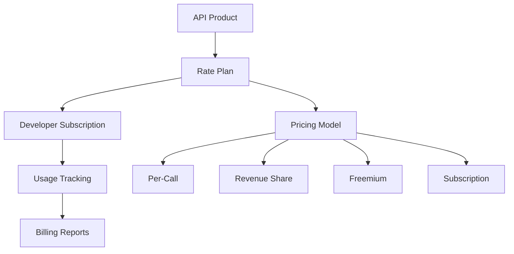

# How to Enable and Configure Apigee Monetization for Paid API Products

Author: [nawazdhandala](https://www.github.com/nawazdhandala)

Tags: Apigee, GCP, Monetization, API Products, API Management

Description: Learn how to set up Apigee monetization to charge API consumers based on usage, configure rate plans, and manage billing for your paid API products.

---

If you are building an API business, at some point you need to charge for access. Apigee monetization lets you define pricing models for your API products, track usage, and collect data for billing developers. You can charge per API call, by subscription, or with a freemium model that offers a free tier before paid usage kicks in. This guide covers the setup from enabling monetization through creating rate plans and managing developer billing data.

## Enabling Monetization

Monetization is an add-on feature in Apigee. It needs to be enabled on your Apigee organization before you can use it.

Check if monetization is already enabled:

```bash
# Check organization features

curl "https://apigee.googleapis.com/v1/organizations/YOUR_ORG" \
  -H "Authorization: Bearer $(gcloud auth print-access-token)" | jq '.addonsConfig'
```

Enable monetization if it is not active:

```bash
# Enable monetization for the organization
# Include any existing add-on configuration in the request body,
# because setAddons replaces the organization's add-on configuration.
curl -X POST \
  "https://apigee.googleapis.com/v1/organizations/YOUR_ORG:setAddons" \
  -H "Authorization: Bearer $(gcloud auth print-access-token)" \
  -H "Content-Type: application/json" \
  -d '{
    "addonsConfig": {
      "monetizationConfig": {
        "enabled": true
      }
    }
  }'
```

## Understanding the Monetization Model

Apigee monetization works with these concepts:


```mermaid
graph TD
    A[API Product] --> B[Rate Plan]
    B --> C[Developer Subscription]
    C --> D[Usage Tracking]
    D --> E[Billing Reports]
    B --> F[Pricing Model]
    F --> G[Per-Call]
    F --> H[Revenue Share]
    F --> I[Freemium]
    F --> J[Subscription]
```

- **API Product** - the API offering (you already have this)
- **Rate Plan** - the pricing structure attached to a product
- **Developer Subscription** - when a developer subscribes to a monetized API product
- **Usage Tracking** - automatic counting of API calls per developer
- **Billing Reports** - reporting usage and charge data so you can generate invoices

## Creating Rate Plans

Rate plans define how developers are charged. Let us create several common pricing models.

### Pay-Per-Call Rate Plan

Charge developers for each API call they make:

```bash
# Create a pay-per-call rate plan
curl -X POST \
  "https://apigee.googleapis.com/v1/organizations/YOUR_ORG/apiproducts/data-api-premium/rateplans" \
  -H "Authorization: Bearer $(gcloud auth print-access-token)" \
  -H "Content-Type: application/json" \
  -d '{
    "displayName": "Pay Per Call",
    "apiproduct": "data-api-premium",
    "description": "Charged per API call at $0.001 per request",
    "state": "PUBLISHED",
    "startTime": "1767225600000",
    "currencyCode": "USD",
    "consumptionPricingType": "FIXED_PER_UNIT",
    "consumptionPricingRates": [
      {
        "fee": {
          "currencyCode": "USD",
          "units": "0",
          "nanos": 1000000
        }
      }
    ],
    "billingPeriod": "MONTHLY"
  }'
```

### Tiered Pricing Rate Plan

Offer volume discounts - the price per call decreases as usage increases:

```bash
# Create a tiered pricing rate plan
curl -X POST \
  "https://apigee.googleapis.com/v1/organizations/YOUR_ORG/apiproducts/data-api-premium/rateplans" \
  -H "Authorization: Bearer $(gcloud auth print-access-token)" \
  -H "Content-Type: application/json" \
  -d '{
    "displayName": "Volume Tiered Pricing",
    "apiproduct": "data-api-premium",
    "description": "Discounted rates at higher volumes",
    "state": "PUBLISHED",
    "startTime": "1767225600000",
    "currencyCode": "USD",
    "consumptionPricingType": "BANDED",
    "consumptionPricingRates": [
      {
        "start": "0",
        "end": "10000",
        "fee": {
          "currencyCode": "USD",
          "units": "0",
          "nanos": 2000000
        }
      },
      {
        "start": "10001",
        "end": "100000",
        "fee": {
          "currencyCode": "USD",
          "units": "0",
          "nanos": 1000000
        }
      },
      {
        "start": "100001",
        "fee": {
          "currencyCode": "USD",
          "units": "0",
          "nanos": 500000
        }
      }
    ],
    "billingPeriod": "MONTHLY"
  }'
```

This creates three tiers:
- First 10,000 calls: $0.002 each
- 10,001 to 100,000 calls: $0.001 each
- Over 100,000 calls: $0.0005 each

### Freemium Rate Plan

Offer a free tier with paid usage beyond a threshold:

```bash
# Create a freemium rate plan
curl -X POST \
  "https://apigee.googleapis.com/v1/organizations/YOUR_ORG/apiproducts/data-api-free/rateplans" \
  -H "Authorization: Bearer $(gcloud auth print-access-token)" \
  -H "Content-Type: application/json" \
  -d '{
    "displayName": "Freemium Plan",
    "apiproduct": "data-api-free",
    "description": "1000 free calls per month, then $0.001 per call",
    "state": "PUBLISHED",
    "startTime": "1767225600000",
    "currencyCode": "USD",
    "consumptionPricingType": "BANDED",
    "consumptionPricingRates": [
      {
        "start": "0",
        "end": "1000",
        "fee": {
          "currencyCode": "USD",
          "units": "0",
          "nanos": 0
        }
      },
      {
        "start": "1001",
        "fee": {
          "currencyCode": "USD",
          "units": "0",
          "nanos": 1000000
        }
      }
    ],
    "billingPeriod": "MONTHLY"
  }'
```

### Fixed Subscription Rate Plan

Charge a flat monthly fee regardless of usage:

```bash
# Create a subscription rate plan
curl -X POST \
  "https://apigee.googleapis.com/v1/organizations/YOUR_ORG/apiproducts/data-api-enterprise/rateplans" \
  -H "Authorization: Bearer $(gcloud auth print-access-token)" \
  -H "Content-Type: application/json" \
  -d '{
    "displayName": "Enterprise Monthly Subscription",
    "apiproduct": "data-api-enterprise",
    "description": "Flat $99/month for unlimited API access",
    "state": "PUBLISHED",
    "startTime": "1767225600000",
    "currencyCode": "USD",
    "fixedRecurringFee": {
      "currencyCode": "USD",
      "units": "99",
      "nanos": 0
    },
    "billingPeriod": "MONTHLY"
  }'
```

## Managing Developer Subscriptions

When a developer wants to use a paid API product, they subscribe to the API product. Apigee applies the product's active rate plan.

Subscribe a developer to an API product:

```bash
# Subscribe a developer to the product with the active pay-per-call plan
curl -X POST \
  "https://apigee.googleapis.com/v1/organizations/YOUR_ORG/developers/developer@example.com/subscriptions" \
  -H "Authorization: Bearer $(gcloud auth print-access-token)" \
  -H "Content-Type: application/json" \
  -d '{
    "apiproduct": "data-api-premium",
    "startTime": "1769904000000"
  }'
```

List a developer's subscriptions:

```bash
# List active subscriptions for a developer
curl "https://apigee.googleapis.com/v1/organizations/YOUR_ORG/developers/developer@example.com/subscriptions" \
  -H "Authorization: Bearer $(gcloud auth print-access-token)"
```

## Tracking Usage

Apigee automatically tracks usage based on API calls that pass through your proxies. You can query analytics and monetization reports to see how much each developer has consumed.

Check a prepaid developer's current balance:

```bash
# Get the prepaid balance for a developer
curl "https://apigee.googleapis.com/v1/organizations/YOUR_ORG/developers/developer@example.com/balance" \
  -H "Authorization: Bearer $(gcloud auth print-access-token)"
```

## Adding Monetization Awareness to Your Proxy

You might want your proxy to enforce a developer's monetization status. For example, block access if a developer has not purchased the API product subscription or if a prepaid balance is insufficient.

Use the MonetizationLimitsCheck policy after your authentication policy:

```xml
<?xml version="1.0" encoding="UTF-8" standalone="yes"?>
<!-- apiproxy/policies/CheckMonetizationLimits.xml -->
<MonetizationLimitsCheck continueOnError="false" enabled="true" name="CheckMonetizationLimits">
    <DisplayName>Check Monetization Limits</DisplayName>
    <IgnoreUnresolvedVariables>true</IgnoreUnresolvedVariables>
    <FaultResponse>
        <Set>
            <Payload contentType="application/json">
                {"error":"API product subscription is missing or prepaid balance is insufficient"}
            </Payload>
            <StatusCode>403</StatusCode>
        </Set>
    </FaultResponse>
</MonetizationLimitsCheck>
```

## Generating Billing Reports

Create billing reports for your finance team or for developer invoices:

```bash
# Generate a billing report for the current month
curl --get \
  "https://apigee.googleapis.com/v1/organizations/YOUR_ORG/environments/ENV_NAME/stats/developer_email,api_product" \
  -H "Authorization: Bearer $(gcloud auth print-access-token)" \
  --data-urlencode "select=sum(x_apigee_mintng_rate)" \
  --data-urlencode "timeRange=02/01/2026 00:00~02/28/2026 23:59" \
  --data-urlencode "timeUnit=month"
```

For more detailed billing data, export analytics to BigQuery and run billing queries:

```sql
-- Generate a monthly invoice summary per developer
SELECT
  developer_email,
  api_product,
  COUNT(*) as total_calls,
  -- Calculate cost based on tiered pricing
  CASE
    WHEN COUNT(*) <= 1000 THEN 0
    WHEN COUNT(*) <= 10000 THEN (COUNT(*) - 1000) * 0.002
    WHEN COUNT(*) <= 100000 THEN (9000 * 0.002) + ((COUNT(*) - 10000) * 0.001)
    ELSE (9000 * 0.002) + (90000 * 0.001) + ((COUNT(*) - 100000) * 0.0005)
  END as estimated_cost_usd
FROM
  `YOUR_PROJECT_ID.apigee_analytics.api_*`
WHERE
  _TABLE_SUFFIX BETWEEN '20260201' AND '20260228'
GROUP BY
  developer_email, api_product
ORDER BY
  estimated_cost_usd DESC;
```

## Managing Rate Plan Lifecycle

Rate plans need management over time - price changes, deprecation, migration to new plans.

Update an existing rate plan:

```bash
# Update the price on an existing rate plan
curl -X PUT \
  "https://apigee.googleapis.com/v1/organizations/YOUR_ORG/apiproducts/data-api-premium/rateplans/RATE_PLAN_ID" \
  -H "Authorization: Bearer $(gcloud auth print-access-token)" \
  -H "Content-Type: application/json" \
  -d '{
    "displayName": "Pay Per Call - Updated",
    "apiproduct": "data-api-premium",
    "description": "Updated pricing: $0.0008 per request",
    "state": "PUBLISHED",
    "startTime": "1767225600000",
    "currencyCode": "USD",
    "billingPeriod": "MONTHLY",
    "consumptionPricingType": "FIXED_PER_UNIT",
    "consumptionPricingRates": [
      {
        "fee": {
          "currencyCode": "USD",
          "units": "0",
          "nanos": 800000
        }
      }
    ]
  }'
```

Move a published rate plan to draft status:

```bash
# Move a published rate plan to draft status
curl -X PUT \
  "https://apigee.googleapis.com/v1/organizations/YOUR_ORG/apiproducts/data-api-premium/rateplans/RATE_PLAN_ID" \
  -H "Authorization: Bearer $(gcloud auth print-access-token)" \
  -H "Content-Type: application/json" \
  -d '{
    "displayName": "Pay Per Call",
    "apiproduct": "data-api-premium",
    "description": "Charged per API call at $0.001 per request",
    "state": "DRAFT",
    "startTime": "1767225600000",
    "currencyCode": "USD",
    "consumptionPricingType": "FIXED_PER_UNIT",
    "consumptionPricingRates": [
      {
        "fee": {
          "currencyCode": "USD",
          "units": "0",
          "nanos": 1000000
        }
      }
    ],
    "billingPeriod": "MONTHLY"
  }'
```

## Summary

Apigee monetization turns your APIs into revenue-generating products. Enable it on your organization, create rate plans that match your business model (per-call, tiered, freemium, or subscription), and let Apigee handle usage tracking and monetization reporting. Use the analytics export to BigQuery for detailed billing reports, and manage rate plan lifecycle as your pricing evolves. The key design decision is choosing between prepaid (developers pay upfront) and postpaid (billed after usage) billing accounts - prepaid is simpler for small-scale APIs while postpaid works better for enterprise customers.
