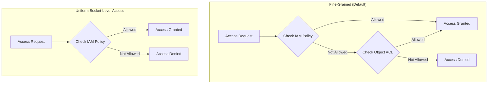

# How to Enable and Configure Uniform Bucket-Level Access in Google Cloud Storage

Author: [nawazdhandala](https://www.github.com/nawazdhandala)

Tags: GCP, Google Cloud Storage, Uniform Bucket-Level Access, IAM, Security

Description: Step-by-step guide to enabling and configuring uniform bucket-level access in Google Cloud Storage for simplified and more secure permission management.

---

Managing access to Cloud Storage gets messy fast when you have a mix of IAM policies and per-object ACLs. One team member sets an ACL on an object, another grants access via IAM, and suddenly nobody can figure out why a particular user can or cannot read a file. Uniform bucket-level access solves this by disabling ACLs entirely and making IAM the single source of truth for all access control.

This guide covers what uniform bucket-level access is, how to enable it, and what changes in your workflow once it is active.

## What Uniform Bucket-Level Access Does

By default, Cloud Storage uses a "fine-grained" access model where you can control access at two levels:

- **Bucket level** via IAM policies
- **Object level** via ACLs (Access Control Lists)

When uniform bucket-level access is enabled:

- All ACLs on the bucket and its objects are ignored
- IAM policies on the bucket become the only way to control access
- Object-level ACL operations return errors
- Permissions are consistent and predictable across all objects



## Why You Should Use It

There are several compelling reasons to enable uniform bucket-level access:

**Simpler permission model.** One system (IAM) instead of two (IAM + ACLs). Easier to understand, easier to manage, easier to audit.

**Better security posture.** No risk of accidentally leaving an object publicly accessible through an ACL while the bucket IAM policy looks secure.

**IAM Conditions support.** You can use IAM Conditions to grant access based on resource attributes, request attributes, and more. This does not work with ACLs.

**Easier compliance auditing.** With a single access control system, security audits are more straightforward.

**It is the future.** Google recommends uniform bucket-level access for all new buckets, and many organizations mandate it.

## Enabling Uniform Bucket-Level Access

### On a New Bucket

```bash
# Create a new bucket with uniform bucket-level access from the start
gcloud storage buckets create gs://my-secure-bucket \
  --location=us-central1 \
  --uniform-bucket-level-access
```

### On an Existing Bucket

```bash
# Enable uniform bucket-level access on an existing bucket
gcloud storage buckets update gs://my-existing-bucket \
  --uniform-bucket-level-access
```

### Checking the Current Status

```bash
# Check if uniform bucket-level access is enabled
gcloud storage buckets describe gs://my-bucket \
  --format="json(iamConfiguration.uniformBucketLevelAccess)"
```

The output shows whether it is enabled and the lock time (when it becomes irreversible).

## The 90-Day Reversal Window

When you first enable uniform bucket-level access, you get a 90-day window during which you can disable it and go back to fine-grained access. After 90 days, it becomes permanent.

During the reversal window:

```bash
# Disable uniform bucket-level access (only within 90-day window)
gcloud storage buckets update gs://my-bucket \
  --no-uniform-bucket-level-access
```

After the 90-day window, this command will fail. The bucket permanently uses uniform bucket-level access.

Check when the lock takes effect:

```bash
# See the lock time for the uniform bucket-level access setting
gcloud storage buckets describe gs://my-bucket \
  --format="value(iamConfiguration.uniformBucketLevelAccess.lockedTime)"
```

## Migrating from Fine-Grained to Uniform Access

Before enabling uniform bucket-level access, you need to ensure that all existing access granted through ACLs is also covered by IAM policies. Otherwise, users who relied on ACLs for access will lose it.

### Step 1: Audit Existing ACLs

Check what ACLs are currently in use:

```bash
# List objects and their ACLs to understand current access
gcloud storage objects list gs://my-bucket/ --format="table(name, acl.entity, acl.role)"
```

Look for objects with ACLs that differ from the bucket default. Common things to watch for:

- Objects made public via ACL (`allUsers` with `READER` role)
- Objects shared with specific users via ACL
- Objects with `allAuthenticatedUsers` access

### Step 2: Create Equivalent IAM Policies

For each unique access pattern found in ACLs, create an IAM binding:

```bash
# If objects had public ACLs, make the bucket publicly readable via IAM
gcloud storage buckets add-iam-policy-binding gs://my-bucket \
  --member="allUsers" \
  --role="roles/storage.objectViewer"

# If specific users had read access via ACLs
gcloud storage buckets add-iam-policy-binding gs://my-bucket \
  --member="user:alice@example.com" \
  --role="roles/storage.objectViewer"

# If service accounts had write access via ACLs
gcloud storage buckets add-iam-policy-binding gs://my-bucket \
  --member="serviceAccount:writer@project.iam.gserviceaccount.com" \
  --role="roles/storage.objectCreator"
```

### Step 3: Enable Uniform Access

```bash
# Enable uniform bucket-level access
gcloud storage buckets update gs://my-bucket \
  --uniform-bucket-level-access
```

### Step 4: Test Access

Verify that all users and service accounts can still perform the operations they need. Do this during the 90-day reversal window so you can revert if something breaks.

```bash
# Test read access with a specific user
gcloud storage ls gs://my-bucket/test-path/ \
  --impersonate-service-account=reader@project.iam.gserviceaccount.com

# Test write access
gcloud storage cp /tmp/test.txt gs://my-bucket/test-path/ \
  --impersonate-service-account=writer@project.iam.gserviceaccount.com
```

## Using IAM Conditions for Object-Level Control

One concern teams have about switching to uniform access is losing per-object permissions. IAM Conditions provide an alternative. You can grant access based on the object's name prefix:

```bash
# Grant access only to objects under a specific prefix
gcloud storage buckets add-iam-policy-binding gs://my-bucket \
  --member="user:analyst@example.com" \
  --role="roles/storage.objectViewer" \
  --condition='expression=resource.name.startsWith("projects/_/buckets/my-bucket/objects/reports/"),title=reports-only-access'
```

This gives the analyst read access only to objects whose names start with `reports/`. It is not exactly per-object ACLs, but it covers most practical use cases where different teams need access to different parts of a bucket.

## Terraform Configuration

```hcl
resource "google_storage_bucket" "secure_bucket" {
  name     = "my-secure-bucket"
  location = "US"

  # Enable uniform bucket-level access
  uniform_bucket_level_access = true

  # Prevent accidental public access
  public_access_prevention = "enforced"
}

# Grant specific access via IAM
resource "google_storage_bucket_iam_member" "viewer" {
  bucket = google_storage_bucket.secure_bucket.name
  role   = "roles/storage.objectViewer"
  member = "group:data-consumers@example.com"
}

resource "google_storage_bucket_iam_member" "writer" {
  bucket = google_storage_bucket.secure_bucket.name
  role   = "roles/storage.objectCreator"
  member = "serviceAccount:data-pipeline@my-project.iam.gserviceaccount.com"
}

# Conditional access for specific prefix
resource "google_storage_bucket_iam_member" "conditional_viewer" {
  bucket = google_storage_bucket.secure_bucket.name
  role   = "roles/storage.objectViewer"
  member = "user:analyst@example.com"

  condition {
    title       = "reports-only"
    description = "Access limited to reports prefix"
    expression  = "resource.name.startsWith(\"projects/_/buckets/${google_storage_bucket.secure_bucket.name}/objects/reports/\")"
  }
}
```

## Python Configuration

```python
from google.cloud import storage

def enable_uniform_access(bucket_name):
    """Enable uniform bucket-level access on a bucket."""
    client = storage.Client()
    bucket = client.get_bucket(bucket_name)

    # Enable uniform bucket-level access
    bucket.iam_configuration.uniform_bucket_level_access_enabled = True
    bucket.patch()

    print(f"Enabled uniform bucket-level access on {bucket_name}")
    print(f"Lock time: {bucket.iam_configuration.uniform_bucket_level_access_locked_time}")

def check_uniform_access(bucket_name):
    """Check the uniform bucket-level access status."""
    client = storage.Client()
    bucket = client.get_bucket(bucket_name)

    config = bucket.iam_configuration
    enabled = config.uniform_bucket_level_access_enabled
    locked_time = config.uniform_bucket_level_access_locked_time

    print(f"Bucket: {bucket_name}")
    print(f"Uniform access enabled: {enabled}")
    if locked_time:
        print(f"Lock time: {locked_time}")

enable_uniform_access("my-existing-bucket")
check_uniform_access("my-existing-bucket")
```

## What Breaks When You Enable Uniform Access

Be prepared for these changes:

**ACL-based operations fail.** Any code that reads or sets object ACLs will get errors. Update your application code to use IAM instead.

**Default object ACLs are ignored.** If you set default ACLs on the bucket, they no longer apply.

**gsutil acl commands stop working.** Any scripts using `gsutil acl` need to be updated to use `gsutil iam` or equivalent gcloud commands.

**Third-party tools may need updates.** Some tools assume ACL-based access. Check that all integrations work after the switch.

## Public Access Prevention

Once you have uniform bucket-level access, you can also enforce public access prevention to make sure nobody accidentally makes data public:

```bash
# Prevent any public access to the bucket
gcloud storage buckets update gs://my-bucket \
  --public-access-prevention=enforced
```

This blocks `allUsers` and `allAuthenticatedUsers` from being added to IAM policies on the bucket.

Uniform bucket-level access is one of those switches that makes everything simpler and more secure. If you are starting a new project, enable it from day one. If you have existing buckets, plan a migration during the next security review. Your future self will thank you when auditing permissions takes minutes instead of hours.
