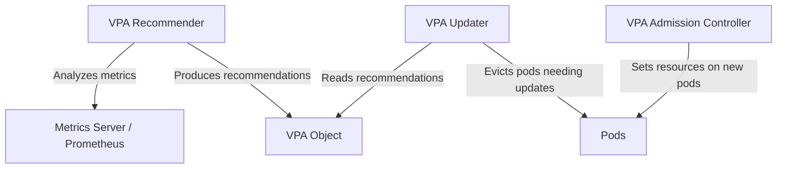

# How to Enable and Configure Vertical Pod Autoscaler in GKE to Right-Size Resource Requests

Author: [nawazdhandala](https://www.github.com/nawazdhandala)

Tags: GCP, GKE, Kubernetes, VPA, Autoscaling, Resource Management

Description: Learn how to use the Vertical Pod Autoscaler in GKE to automatically right-size your pod resource requests based on actual usage, reducing waste and preventing OOM kills.

---

Most teams set resource requests by guessing. They pick some CPU and memory values when deploying, and those values stick around forever - usually way higher than needed (wasting money) or occasionally too low (causing throttling and OOM kills). The Vertical Pod Autoscaler (VPA) in GKE solves this by analyzing actual resource usage and automatically adjusting requests to match.

I have seen teams cut their compute costs by 30-40% just by running VPA in recommendation mode and adjusting their requests based on the suggestions. Let me show you how to set it up and use it effectively.

## How VPA Works

VPA has three components:

1. **Recommender**: Watches resource usage and calculates recommended requests
2. **Updater**: Evicts pods that need resource adjustments (in auto mode)
3. **Admission Controller**: Sets resource requests on new pods based on recommendations



Unlike HPA which changes the number of replicas, VPA changes the resource requests of individual pods. They solve different problems and can even be used together (with some caveats).

## Enabling VPA on GKE

VPA is built into GKE, but you need to enable it on your cluster.

```bash
# Enable VPA on an existing GKE cluster
gcloud container clusters update my-cluster \
  --region us-central1 \
  --enable-vertical-pod-autoscaling

# For a new cluster, include it at creation time
gcloud container clusters create my-cluster \
  --region us-central1 \
  --enable-vertical-pod-autoscaling \
  --num-nodes 3
```

After enabling, verify the VPA components are running.

```bash
# Check that VPA components are deployed
kubectl get pods -n kube-system | grep vpa

# You should see:
# vpa-admission-controller-...
# vpa-recommender-...
# vpa-updater-...
```

## VPA Update Modes

VPA supports four update modes, and choosing the right one is important:

- **Off**: VPA calculates recommendations but does not apply them. Best for starting out.
- **Initial**: VPA sets resource requests only when pods are created. Existing pods are not touched.
- **Recreate**: VPA evicts and recreates pods when their resource requests need changing.
- **Auto**: Currently behaves like Recreate, but may use in-place updates in the future.

I always recommend starting with "Off" mode to see what VPA recommends before letting it make changes.

## Step 1: Create a VPA in Recommendation-Only Mode

Start by creating a VPA object in "Off" mode to observe recommendations without any changes to your pods.

```yaml
# vpa-recommend.yaml - VPA in recommendation-only mode
apiVersion: autoscaling.k8s.io/v1
kind: VerticalPodAutoscaler
metadata:
  name: my-app-vpa
  namespace: default
spec:
  targetRef:
    apiVersion: apps/v1
    kind: Deployment
    name: my-app
  updatePolicy:
    updateMode: "Off"  # Just recommend, do not apply changes
  resourcePolicy:
    containerPolicies:
      - containerName: my-app
        # Set bounds so VPA does not recommend anything extreme
        minAllowed:
          cpu: "50m"
          memory: "64Mi"
        maxAllowed:
          cpu: "2"
          memory: "4Gi"
        controlledResources:
          - cpu
          - memory
```

```bash
kubectl apply -f vpa-recommend.yaml
```

## Step 2: Check the Recommendations

After the VPA has collected enough data (usually 24 hours for good recommendations, though initial recommendations appear within minutes), check what it suggests.

```bash
# View VPA recommendations
kubectl get vpa my-app-vpa -o yaml

# Or get a cleaner view of just the recommendations
kubectl get vpa my-app-vpa -o jsonpath='{.status.recommendation}' | jq .
```

The output includes three types of recommendations.

```yaml
# Example VPA recommendation output
status:
  recommendation:
    containerRecommendations:
      - containerName: my-app
        lowerBound:
          cpu: "100m"
          memory: "128Mi"
        target:
          cpu: "250m"       # Recommended request
          memory: "356Mi"   # Recommended request
        uncappedTarget:
          cpu: "250m"
          memory: "356Mi"
        upperBound:
          cpu: "800m"
          memory: "1Gi"
```

- **target**: The recommended resource request. Use this.
- **lowerBound**: The minimum that would still work. Below this, pods will likely be throttled.
- **upperBound**: Accounts for occasional spikes. Set your limits around this value.
- **uncappedTarget**: What VPA would recommend without the min/max bounds you set.

## Step 3: Apply Recommendations Manually

Based on the recommendations, update your deployment's resource requests.

```yaml
# Updated deployment with VPA-recommended resources
apiVersion: apps/v1
kind: Deployment
metadata:
  name: my-app
spec:
  replicas: 3
  selector:
    matchLabels:
      app: my-app
  template:
    metadata:
      labels:
        app: my-app
    spec:
      containers:
        - name: my-app
          image: my-app:latest
          resources:
            requests:
              # Set to the VPA target recommendation
              cpu: "250m"
              memory: "356Mi"
            limits:
              # Set limits to the upper bound recommendation
              cpu: "800m"
              memory: "1Gi"
```

## Step 4: Enable Automatic Updates (Optional)

Once you trust the VPA recommendations, you can let it automatically adjust resources. Switch to "Auto" mode.

```yaml
# vpa-auto.yaml - VPA with automatic resource adjustment
apiVersion: autoscaling.k8s.io/v1
kind: VerticalPodAutoscaler
metadata:
  name: my-app-vpa
  namespace: default
spec:
  targetRef:
    apiVersion: apps/v1
    kind: Deployment
    name: my-app
  updatePolicy:
    updateMode: "Auto"  # VPA will evict and recreate pods with new requests
    minReplicas: 2       # Keep at least 2 pods running during updates
  resourcePolicy:
    containerPolicies:
      - containerName: my-app
        minAllowed:
          cpu: "50m"
          memory: "64Mi"
        maxAllowed:
          cpu: "4"
          memory: "8Gi"
        controlledResources:
          - cpu
          - memory
```

Be aware that "Auto" mode works by evicting pods and letting the admission controller set new resource requests when the replacement pods are created. This means brief disruptions unless you have enough replicas and a PodDisruptionBudget.

## Using VPA with HPA

You can use VPA and HPA together, but there is an important restriction: they should not both try to control the same resource metric.

```yaml
# VPA controls memory only, HPA controls scaling based on CPU
apiVersion: autoscaling.k8s.io/v1
kind: VerticalPodAutoscaler
metadata:
  name: my-app-vpa
spec:
  targetRef:
    apiVersion: apps/v1
    kind: Deployment
    name: my-app
  updatePolicy:
    updateMode: "Auto"
  resourcePolicy:
    containerPolicies:
      - containerName: my-app
        controlledResources:
          - memory  # VPA only adjusts memory
        controlledValues: RequestsOnly
---
apiVersion: autoscaling/v2
kind: HorizontalPodAutoscaler
metadata:
  name: my-app-hpa
spec:
  scaleTargetRef:
    apiVersion: apps/v1
    kind: Deployment
    name: my-app
  minReplicas: 2
  maxReplicas: 10
  metrics:
    - type: Resource
      resource:
        name: cpu  # HPA scales based on CPU
        target:
          type: Utilization
          averageUtilization: 70
```

This way, VPA right-sizes memory requests while HPA handles scaling replicas based on CPU load.

## Monitoring VPA Behavior

Keep an eye on what VPA is doing, especially when running in auto mode.

```bash
# See VPA events
kubectl describe vpa my-app-vpa

# Check if VPA is evicting pods
kubectl get events --field-selector reason=EvictedByVPA

# View VPA metrics in Cloud Monitoring
# Navigate to: Monitoring > Metrics Explorer
# Search for: kubernetes.io/autoscaler/vpa
```

## Best Practices

Some things I have learned from running VPA in production:

1. **Always start with "Off" mode.** Run it for at least a week before trusting the recommendations. Workloads that have daily or weekly patterns need that much data.

2. **Set reasonable min/max bounds.** Without bounds, VPA might recommend 10m CPU for a service that has occasional spikes, causing timeouts during peak load.

3. **Use PodDisruptionBudgets with auto mode.** VPA evicts pods to update them. Without a PDB, all replicas could be evicted simultaneously.

4. **Right-size limits separately from requests.** VPA adjusts requests, not limits. Set limits based on the upper bound recommendation plus some headroom.

5. **Do not use VPA on pods with fewer than 2 replicas in auto mode.** A single-replica deployment will have downtime when VPA evicts the pod.

```yaml
# PDB to protect availability during VPA updates
apiVersion: policy/v1
kind: PodDisruptionBudget
metadata:
  name: my-app-pdb
spec:
  minAvailable: 1
  selector:
    matchLabels:
      app: my-app
```

## Wrapping Up

VPA is one of the most impactful tools for reducing waste in a GKE cluster. Most teams over-provision resources because they are afraid of OOM kills or throttling, and that over-provisioning adds up fast across dozens of services. Start with VPA in recommendation mode, review the suggestions after a week, and manually apply them to your most resource-heavy deployments. That alone will likely save you meaningful money. Once you are comfortable with the recommendations, enable auto mode with proper PDBs and bounds for a fully automated right-sizing workflow.
