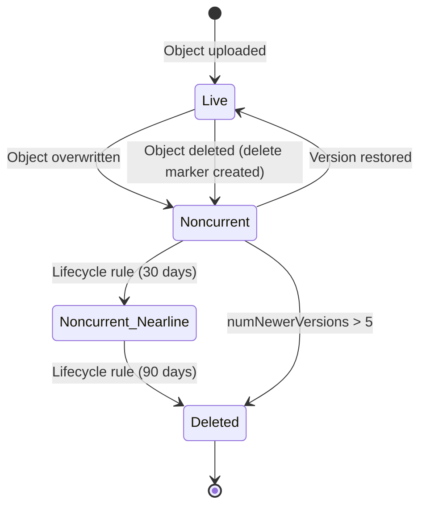

# How to Enable and Manage Object Versioning in Google Cloud Storage

Author: [nawazdhandala](https://www.github.com/nawazdhandala)

Tags: GCP, Google Cloud Storage, Object Versioning, Data Protection, Backup

Description: A complete guide to enabling, managing, and working with object versioning in Google Cloud Storage for data protection and recovery.

---

Object versioning in Google Cloud Storage is one of those features that you wish you had turned on before you accidentally overwrote that important file. It keeps a copy of every previous version of an object, so you can always go back and retrieve older versions or recover deleted files. If you are storing anything that matters - configuration files, datasets, user uploads, backups - versioning gives you a safety net.

This guide walks through everything from enabling versioning to managing and cleaning up old versions.

## What Object Versioning Does

When versioning is enabled on a bucket:

- Overwriting an object creates a new version. The previous version becomes "noncurrent" but is not deleted.
- Deleting an object does not actually remove the data. Instead, it creates a delete marker, and the most recent version becomes noncurrent.
- Every version has a unique generation number that you can use to access it directly.
- You pay for storage of all versions, not just the current one.

Without versioning, an overwrite or delete is permanent. There is no undo.

## Enabling Versioning

Enable versioning on an existing bucket:

```bash
# Enable object versioning on a bucket
gcloud storage buckets update gs://my-bucket --versioning
```

Or create a new bucket with versioning enabled:

```bash
# Create a new bucket with versioning turned on from the start
gcloud storage buckets create gs://my-versioned-bucket \
  --location=us-central1 \
  --versioning
```

Check if versioning is enabled:

```bash
# Check the versioning status of a bucket
gcloud storage buckets describe gs://my-bucket \
  --format="value(versioning.enabled)"
```

## How Versions Are Tracked

Every object in GCS has two key identifiers:

- **Name** - the path you use to access the object (like `data/report.csv`)
- **Generation** - a unique number assigned when the version was created

When you upload `data/report.csv` three times with versioning enabled, you end up with three versions, each with a different generation number. The most recent upload is the "live" version, and the older ones are "noncurrent."

## Listing Object Versions

To see all versions of objects in a bucket:

```bash
# List all versions of all objects, including noncurrent ones
gcloud storage ls --all-versions gs://my-bucket/

# List all versions of a specific object
gcloud storage ls --all-versions gs://my-bucket/data/report.csv
```

The output includes generation numbers and timestamps for each version. Live versions are marked differently from noncurrent ones.

## Retrieving a Specific Version

To download a specific version of an object, use its generation number:

```bash
# Download a specific version using its generation number
gcloud storage cp "gs://my-bucket/data/report.csv#1706745600000000" ./old-report.csv
```

The generation number is the long number after the `#` symbol.

## Restoring a Previous Version

To restore a previous version, copy it back as the current version:

```bash
# Restore a previous version by copying it to the same path
gcloud storage cp "gs://my-bucket/data/report.csv#1706745600000000" \
  gs://my-bucket/data/report.csv
```

This creates a new generation (the restored version becomes current), and the previously current version becomes noncurrent.

## Working with Versions in Python

Here is how to work with object versions programmatically:

```python
from google.cloud import storage

def list_object_versions(bucket_name, prefix=None):
    """List all versions of objects in a bucket, including noncurrent."""
    client = storage.Client()

    # Setting versions=True returns all object versions
    blobs = client.list_blobs(bucket_name, prefix=prefix, versions=True)

    for blob in blobs:
        status = "LIVE" if blob.time_deleted is None else "NONCURRENT"
        print(f"{status} | {blob.name} | gen: {blob.generation} | "
              f"created: {blob.time_created} | size: {blob.size}")

def restore_version(bucket_name, blob_name, generation):
    """Restore a specific version by copying it as the current version."""
    client = storage.Client()
    bucket = client.bucket(bucket_name)

    # Get the specific version to restore
    source_blob = bucket.blob(blob_name, generation=generation)

    # Copy it to the same name, making it the new current version
    bucket.copy_blob(source_blob, bucket, blob_name)

    print(f"Restored {blob_name} to generation {generation}")

def delete_specific_version(bucket_name, blob_name, generation):
    """Permanently delete a specific version of an object."""
    client = storage.Client()
    bucket = client.bucket(bucket_name)

    # Target the specific generation for deletion
    blob = bucket.blob(blob_name, generation=generation)
    blob.delete()

    print(f"Deleted version {generation} of {blob_name}")
```

## Working with Versions in Node.js

```javascript
const { Storage } = require('@google-cloud/storage');
const storage = new Storage();

async function listVersions(bucketName, prefix) {
  // Pass versions: true to include noncurrent versions
  const [files] = await storage.bucket(bucketName).getFiles({
    prefix: prefix,
    versions: true,
  });

  files.forEach(file => {
    const status = file.metadata.timeDeleted ? 'NONCURRENT' : 'LIVE';
    console.log(`${status} | ${file.name} | gen: ${file.generation}`);
  });
}

async function restoreVersion(bucketName, fileName, generation) {
  const bucket = storage.bucket(bucketName);

  // Copy the old version to the same path, creating a new current version
  await bucket.file(fileName, { generation })
    .copy(bucket.file(fileName));

  console.log(`Restored ${fileName} to generation ${generation}`);
}
```

## Managing Storage Costs with Lifecycle Rules

The biggest concern with versioning is storage costs. Every version takes up space, and without cleanup rules, old versions accumulate indefinitely.

Set up lifecycle rules to automatically clean up old versions:

```json
{
  "rule": [
    {
      "action": {"type": "Delete"},
      "condition": {
        "isLive": false,
        "numNewerVersions": 5
      }
    },
    {
      "action": {"type": "Delete"},
      "condition": {
        "isLive": false,
        "age": 90
      }
    },
    {
      "action": {
        "type": "SetStorageClass",
        "storageClass": "NEARLINE"
      },
      "condition": {
        "isLive": false,
        "age": 30
      }
    }
  ]
}
```

This configuration does three things:

- Keeps at most 5 noncurrent versions per object
- Deletes noncurrent versions older than 90 days
- Moves noncurrent versions to Nearline storage after 30 days

Apply it:

```bash
# Apply lifecycle rules to manage version cleanup
gcloud storage buckets update gs://my-bucket \
  --lifecycle-file=versioning-lifecycle.json
```

## Versioning with Terraform

```hcl
resource "google_storage_bucket" "versioned_bucket" {
  name     = "my-versioned-bucket"
  location = "US"

  # Enable object versioning
  versioning {
    enabled = true
  }

  # Clean up old versions automatically
  lifecycle_rule {
    action {
      type = "Delete"
    }
    condition {
      num_newer_versions = 5
      with_state         = "ARCHIVED"
    }
  }

  lifecycle_rule {
    action {
      type = "Delete"
    }
    condition {
      age        = 90
      with_state = "ARCHIVED"
    }
  }
}
```

## Version Lifecycle Flow

Here is how object versions transition through their lifecycle:



## Disabling Versioning

If you decide versioning is not needed:

```bash
# Disable versioning on a bucket (existing versions are preserved)
gcloud storage buckets update gs://my-bucket --no-versioning
```

Important: disabling versioning does not delete existing noncurrent versions. They remain in the bucket and continue to incur storage costs. You need to explicitly delete them or let lifecycle rules handle cleanup.

## Practical Tips

**Enable versioning early.** It is much easier to turn it on from the start than to wish you had it after an accidental deletion.

**Always pair versioning with lifecycle rules.** Unlimited version retention is expensive. Define a retention policy that matches your business requirements.

**Use generation numbers for immutable references.** If your application needs to reference a specific version of a file that will never change, use the full path with generation number.

**Test restores regularly.** Having versions is only useful if you know how to restore them. Practice the restore process so you are ready when you actually need it.

**Watch your storage costs.** Versioned buckets can use significantly more storage than you expect. Monitor usage in the Cloud Console or set up billing alerts.

Object versioning is a straightforward feature that provides real insurance against data loss. The small additional storage cost is almost always worth the peace of mind it provides.
