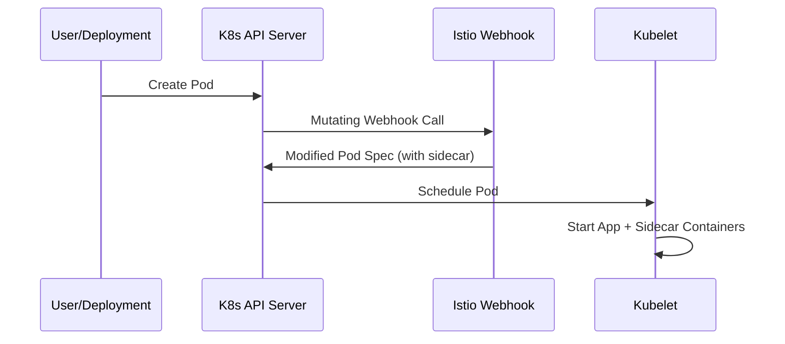

# How to Enable Automatic Sidecar Proxy Injection in Cloud Service Mesh

Author: [nawazdhandala](https://www.github.com/nawazdhandala)

Tags: GCP, Cloud Service Mesh, Sidecar Injection, Envoy Proxy, GKE

Description: Learn how to enable and configure automatic Envoy sidecar proxy injection in Google Cloud Service Mesh for transparent traffic management and security between services.

---

The sidecar proxy is the workhorse of any service mesh. Every request between your microservices flows through an Envoy proxy that runs alongside each pod, handling mTLS encryption, load balancing, retries, and telemetry collection - all without your application code knowing about it. Automatic sidecar injection is the mechanism that adds these Envoy proxies to your pods without requiring you to modify your deployment manifests.

In this guide, I will cover how automatic injection works, how to configure it, and how to handle the edge cases you will encounter in production.

## How Automatic Injection Works

Kubernetes has a feature called mutating admission webhooks. When you create a pod, Kubernetes sends the pod spec to any registered webhooks before actually creating the pod. Cloud Service Mesh registers a webhook that intercepts pod creation requests and adds the Envoy sidecar container to the pod spec.



The injection decision is based on namespace labels and pod annotations. If a namespace has the correct label, all new pods in that namespace get a sidecar injected.

## Step 1: Identify the Control Plane Revision

Cloud Service Mesh uses revision labels to manage multiple versions of the control plane. First, find your active revision.

```bash
# List control plane revisions
kubectl get controlplanerevision -n istio-system

# For managed Cloud Service Mesh, the revision is typically:
# asm-managed        (for the regular channel)
# asm-managed-rapid  (for the rapid channel)
# asm-managed-stable (for the stable channel)
```

You can also check which revisions are available.

```bash
# Check the mutating webhook configurations
kubectl get mutatingwebhookconfiguration -l app=sidecar-injector
```

## Step 2: Label Namespaces for Injection

Label each namespace where you want automatic sidecar injection.

```bash
# Enable injection for the default namespace
kubectl label namespace default istio.io/rev=asm-managed --overwrite

# Enable injection for a custom namespace
kubectl label namespace my-app istio.io/rev=asm-managed --overwrite
```

Verify the label was applied.

```bash
# Check namespace labels
kubectl get namespace default --show-labels
```

If you are using an older version of Cloud Service Mesh or in-cluster Istio, you might use the `istio-injection=enabled` label instead. But for the managed control plane, always use the revision-based label `istio.io/rev`.

## Step 3: Restart Existing Pods

Labeling a namespace only affects new pods. Existing pods need to be restarted to pick up the sidecar.

```bash
# Restart all deployments in the namespace
kubectl rollout restart deployment -n default

# Restart a specific deployment
kubectl rollout restart deployment my-app -n default
```

Wait for the pods to come back up and verify they have the sidecar.

```bash
# Check that pods have 2 containers (app + sidecar)
kubectl get pods -n default

# The READY column should show 2/2 for each pod
# NAME                     READY   STATUS    RESTARTS   AGE
# my-app-5d4f7b8c9-abc12   2/2     Running   0          1m
```

For a more detailed check, look at the containers in a specific pod.

```bash
# List containers in a pod
kubectl get pod my-app-5d4f7b8c9-abc12 -n default -o jsonpath='{.spec.containers[*].name}'
# Output: my-app istio-proxy
```

## Step 4: Configure Injection at the Pod Level

Sometimes you need finer-grained control than namespace-level injection. You can use pod annotations to override the namespace setting.

### Disable Injection for Specific Pods

If you have a pod in an injection-enabled namespace that should not get a sidecar (like a database or a batch job), annotate it.

```yaml
# deployment-no-sidecar.yaml
# This deployment opts out of sidecar injection
apiVersion: apps/v1
kind: Deployment
metadata:
  name: batch-processor
  namespace: default
spec:
  replicas: 1
  selector:
    matchLabels:
      app: batch-processor
  template:
    metadata:
      labels:
        app: batch-processor
      annotations:
        sidecar.istio.io/inject: "false"
    spec:
      containers:
      - name: batch-processor
        image: my-batch-image:latest
```

### Enable Injection for Specific Pods

Conversely, if a namespace does not have injection enabled but you want a specific pod to get a sidecar.

```yaml
# deployment-with-sidecar.yaml
# This deployment opts into sidecar injection
apiVersion: apps/v1
kind: Deployment
metadata:
  name: special-service
  namespace: no-mesh
spec:
  replicas: 1
  selector:
    matchLabels:
      app: special-service
  template:
    metadata:
      labels:
        app: special-service
        istio.io/rev: asm-managed
      annotations:
        sidecar.istio.io/inject: "true"
    spec:
      containers:
      - name: special-service
        image: my-service-image:latest
```

## Step 5: Customize Sidecar Resource Allocation

The default Envoy proxy resource allocation might not fit your workload. Use annotations to tune CPU and memory.

```yaml
# deployment-custom-resources.yaml
# Deployment with customized sidecar proxy resources
apiVersion: apps/v1
kind: Deployment
metadata:
  name: high-traffic-service
  namespace: default
spec:
  replicas: 3
  selector:
    matchLabels:
      app: high-traffic-service
  template:
    metadata:
      labels:
        app: high-traffic-service
      annotations:
        # Customize sidecar proxy CPU and memory
        sidecar.istio.io/proxyCPU: "200m"
        sidecar.istio.io/proxyCPULimit: "2000m"
        sidecar.istio.io/proxyMemory: "256Mi"
        sidecar.istio.io/proxyMemoryLimit: "1Gi"
    spec:
      containers:
      - name: high-traffic-service
        image: my-service:latest
        resources:
          requests:
            cpu: 500m
            memory: 512Mi
```

For high-traffic services, increase the proxy CPU limit. For services with many concurrent connections, increase the memory limit. A good rule of thumb is to allocate roughly 0.5 vCPU and 128MB of memory per 1000 requests per second.

## Step 6: Configure Traffic Interception

By default, the sidecar intercepts all inbound and outbound traffic. You can customize this behavior.

### Exclude Specific Ports from Interception

If your application uses ports that should bypass the proxy (like health check ports or metrics endpoints), exclude them.

```yaml
# Exclude specific ports from sidecar interception
metadata:
  annotations:
    # Outbound ports to exclude from interception
    traffic.sidecar.istio.io/excludeOutboundPorts: "3306,6379"
    # Inbound ports to exclude from interception
    traffic.sidecar.istio.io/excludeInboundPorts: "8081"
```

This is useful when your application connects to external databases or caches that are not part of the mesh.

### Include Only Specific Ports

Alternatively, specify only the inbound ports that should be intercepted.

```yaml
# Only intercept traffic on specific inbound ports
metadata:
  annotations:
    traffic.sidecar.istio.io/includeInboundPorts: "8080,8443"
```

## Step 7: Handle Init Container Dependencies

The sidecar uses an init container (`istio-init`) to set up iptables rules for traffic interception. This init container runs before your application starts. If your application also has init containers, ordering can matter.

```yaml
# Ensure proper init container ordering
metadata:
  annotations:
    # Hold application start until proxy is ready
    proxy.istio.io/config: '{"holdApplicationUntilProxyStarts": true}'
```

This annotation is particularly important for applications that make network calls during startup. Without it, those calls might fail because the sidecar proxy is not ready yet.

## Verifying Injection Is Working

Run a comprehensive check to verify everything is configured correctly.

```bash
# Check that the webhook is configured
kubectl get mutatingwebhookconfiguration -l app=sidecar-injector -o yaml | grep -A5 "namespaceSelector"

# Check injection status across all namespaces
for ns in $(kubectl get namespaces -o jsonpath='{.items[*].metadata.name}'); do
    rev=$(kubectl get namespace $ns -o jsonpath='{.metadata.labels.istio\.io/rev}' 2>/dev/null)
    if [ -n "$rev" ]; then
        echo "$ns: injection enabled (revision: $rev)"
    fi
done

# Verify a specific pod has the sidecar
kubectl describe pod my-app-pod -n default | grep -A2 "istio-proxy"
```

## Troubleshooting Injection Issues

**Pods not getting sidecars**: Check the namespace label matches the active revision. Verify the mutating webhook configuration exists. Check that the pod does not have `sidecar.istio.io/inject: "false"` annotation.

**Pods stuck in Init state**: The istio-init container might be failing. Check init container logs with `kubectl logs pod-name -c istio-init`. This often happens when the pod does not have the right permissions for iptables modification.

**CrashLoopBackOff after injection**: The sidecar might be failing to connect to the control plane. Check sidecar logs with `kubectl logs pod-name -c istio-proxy`. Common causes include misconfigured mesh settings or network policies blocking control plane communication.

**Increased latency after injection**: Some latency increase is expected (typically 1-3ms per hop). If you see more than that, check sidecar resource allocation - CPU throttling is the most common cause of excessive latency.

Automatic sidecar injection is what makes a service mesh practical at scale. Without it, you would need to modify every deployment to include the proxy container. With it, you label a namespace once and every pod automatically participates in the mesh with zero changes to your application code.
