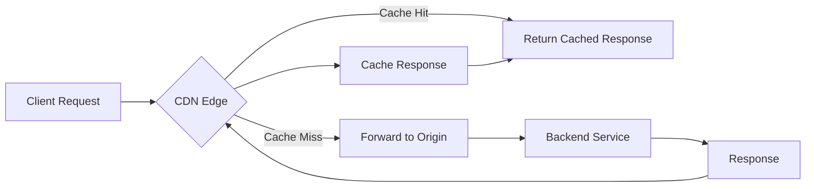

# How to Enable Cloud CDN on an Existing HTTP(S) Load Balancer in GCP

Author: [nawazdhandala](https://www.github.com/nawazdhandala)

Tags: GCP, Cloud CDN, Load Balancer, Caching, Performance

Description: Step-by-step guide to enabling Google Cloud CDN on an existing HTTP(S) load balancer in GCP for faster content delivery through edge caching.

---

You already have an HTTP(S) load balancer running in GCP. Your application works fine, but you notice that users in regions far from your backend servers experience higher latency. Enabling Cloud CDN on your existing load balancer is one of the easiest performance wins you can get. It caches content at Google's edge locations worldwide, so subsequent requests for the same content are served from a location closer to the user.

The best part is that enabling Cloud CDN on an existing load balancer takes just one command and requires zero downtime.

## How Cloud CDN Works

Cloud CDN sits between your load balancer and the client. When a request comes in, Cloud CDN checks if the response is already cached at the nearest edge location. If it is, the response is served directly from the cache (a cache hit). If not, the request is forwarded to your backend, and the response is cached for future requests (a cache miss).

Cloud CDN caches responses based on:
- The URL (path and query parameters)
- Request headers (if configured)
- Cache-Control response headers from your backend

## Step 1: Enable CDN on the Backend Service

Enabling Cloud CDN is a single flag on your backend service:

```bash
# Enable Cloud CDN on an existing backend service
gcloud compute backend-services update my-backend-service \
    --enable-cdn \
    --global
```

That is it. Cloud CDN is now active. But the default settings might not match what you need, so let us tune the configuration.

## Step 2: Configure Cache Mode

GCP offers three cache modes that control what gets cached:

```bash
# Option 1: Respect origin Cache-Control headers (default)
gcloud compute backend-services update my-backend-service \
    --cache-mode=USE_ORIGIN_HEADERS \
    --global

# Option 2: Cache all static content automatically
gcloud compute backend-services update my-backend-service \
    --cache-mode=CACHE_ALL_STATIC \
    --global

# Option 3: Cache everything
gcloud compute backend-services update my-backend-service \
    --cache-mode=FORCE_CACHE_ALL \
    --default-ttl=3600 \
    --global
```

Here is what each mode does:

**USE_ORIGIN_HEADERS**: Cloud CDN only caches responses that have valid `Cache-Control` or `Expires` headers. This gives you full control but requires your application to set these headers correctly.

**CACHE_ALL_STATIC**: Cloud CDN automatically caches common static content types (images, CSS, JavaScript, fonts) even if the origin does not set Cache-Control headers. Dynamic content is not cached unless it has explicit cache headers.

**FORCE_CACHE_ALL**: Every successful response gets cached. This is aggressive and should only be used when you know all content is cacheable. You must set a `--default-ttl` with this mode.

## Step 3: Set TTL Values

TTL (Time To Live) controls how long content stays in the cache:

```bash
# Set TTL values for the backend service
gcloud compute backend-services update my-backend-service \
    --enable-cdn \
    --cache-mode=CACHE_ALL_STATIC \
    --default-ttl=3600 \
    --max-ttl=86400 \
    --client-ttl=600 \
    --global
```

- `--default-ttl`: Used when the origin does not set a cache duration (default: 3600 seconds)
- `--max-ttl`: Maximum time content stays in the CDN cache, regardless of origin headers (default: 86400 seconds)
- `--client-ttl`: Maximum cache duration the client browser should use (overrides higher origin values)

## Step 4: Configure Cache Key Policy

The cache key determines what makes a request unique for caching purposes. By default, Cloud CDN uses the full URL including query string parameters.

```bash
# Customize the cache key policy
gcloud compute backend-services update my-backend-service \
    --cache-key-include-protocol \
    --cache-key-include-host \
    --no-cache-key-include-query-string \
    --global
```

Excluding query strings can dramatically improve your cache hit ratio if query parameters do not affect the response content. For example, if you append tracking parameters like `?utm_source=google`, excluding query strings means the CDN serves the cached version regardless of the parameter values.

For more granular control, you can include only specific query parameters:

```bash
# Include only specific query parameters in the cache key
gcloud compute backend-services update my-backend-service \
    --cache-key-include-query-string \
    --cache-key-query-string-whitelist=page,sort,filter \
    --global
```

## Step 5: Set Up Cache Headers on Your Application

For `USE_ORIGIN_HEADERS` mode, your application needs to send proper Cache-Control headers. Here are examples for different content types:

```python
# Example Flask application with appropriate cache headers
from flask import Flask, send_file, make_response

app = Flask(__name__)

@app.route('/static/<path:filename>')
def serve_static(filename):
    # Static assets - cache for 1 year (versioned filenames)
    response = send_file(f'static/{filename}')
    response.headers['Cache-Control'] = 'public, max-age=31536000'
    return response

@app.route('/api/data')
def serve_data():
    # Dynamic API data - cache for 5 minutes
    response = make_response(get_data())
    response.headers['Cache-Control'] = 'public, max-age=300'
    return response

@app.route('/api/user/profile')
def serve_profile():
    # User-specific data - do not cache
    response = make_response(get_profile())
    response.headers['Cache-Control'] = 'private, no-store'
    return response
```

Key Cache-Control directives:
- `public` - Can be cached by CDN (required for Cloud CDN to cache)
- `private` - Only the browser can cache, not CDN
- `no-store` - Do not cache at all
- `max-age=N` - Cache for N seconds
- `s-maxage=N` - CDN-specific cache duration (overrides max-age for CDN)

## Step 6: Configure Negative Caching

By default, Cloud CDN also caches error responses (like 404s) to prevent your backend from being hammered by requests for non-existent resources:

```bash
# Configure negative caching for error responses
gcloud compute backend-services update my-backend-service \
    --enable-cdn \
    --negative-caching \
    --negative-caching-policy='404=60,405=60' \
    --global
```

This caches 404 responses for 60 seconds and 405 responses for 60 seconds. Without negative caching, every 404 request hits your backend.

## Invalidating the Cache

When you deploy new content, you may need to clear the cached version:

```bash
# Invalidate all cached content
gcloud compute url-maps invalidate-cdn-cache my-url-map \
    --path="/*" \
    --global

# Invalidate a specific path
gcloud compute url-maps invalidate-cdn-cache my-url-map \
    --path="/static/style.css" \
    --global

# Invalidate everything under a path prefix
gcloud compute url-maps invalidate-cdn-cache my-url-map \
    --path="/api/v2/*" \
    --global
```

Cache invalidation takes a few minutes to propagate to all edge locations. For time-sensitive updates, consider using versioned URLs (e.g., `/static/app.v2.js`) instead of relying on cache invalidation.

## Monitoring Cache Performance

Check how well your CDN is performing:

```bash
# View CDN hit and miss rates in Cloud Monitoring
gcloud logging read 'resource.type="http_load_balancer" AND
    jsonPayload.statusDetails="response_from_cache"' \
    --limit=10 \
    --format="table(timestamp,jsonPayload.statusDetails,httpRequest.requestUrl)"
```

You can also view CDN metrics in the Google Cloud Console under Network Services > Cloud CDN, or set up dashboards in Cloud Monitoring.



## Signed URLs and Cookies

For content that should only be accessible to authorized users but still benefit from caching, use signed URLs or signed cookies:

```bash
# Create a signing key for signed URLs
gcloud compute backend-services update my-backend-service \
    --signed-url-cache-max-age=3600 \
    --global

# Add a signing key
gcloud compute backend-services add-signed-url-key my-backend-service \
    --key-name=my-key \
    --key-file=signing-key.base64 \
    --global
```

## Wrapping Up

Enabling Cloud CDN on an existing load balancer is one of the highest-impact, lowest-effort optimizations available in GCP. A single command turns it on, and with proper Cache-Control headers and a tuned cache key policy, you can dramatically reduce latency and backend load. Start with `CACHE_ALL_STATIC` mode if you are unsure, monitor your cache hit rates, and fine-tune from there.
