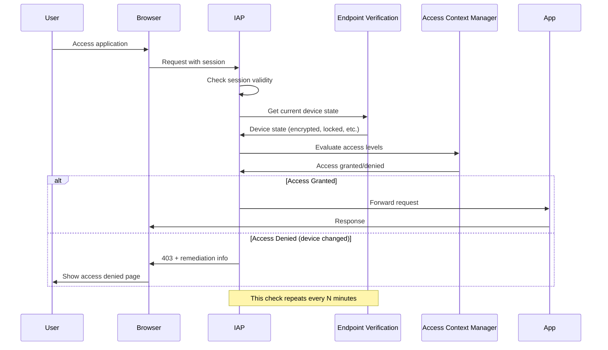

# How to Enable Continuous Authorization with BeyondCorp Enterprise on GCP

Author: [nawazdhandala](https://www.github.com/nawazdhandala)

Tags: GCP, BeyondCorp, Continuous Authorization, Zero Trust, Security

Description: Learn how to set up continuous authorization with BeyondCorp Enterprise so that access decisions are re-evaluated throughout active sessions, not just at login time.

---

Most access control systems check your credentials once at login and then leave you alone for the rest of your session. That is a problem. A device that was compliant when you logged in might become non-compliant during your session - maybe disk encryption got disabled, the device was jailbroken, or the user moved to a restricted geographic region. Continuous authorization solves this by re-evaluating access conditions throughout the session, not just at the initial authentication point.

BeyondCorp Enterprise supports continuous authorization, and this guide shows you how to enable and configure it.

## How Continuous Authorization Works

In a traditional setup, the flow is: authenticate, authorize, access granted for the session duration. With continuous authorization, the flow becomes:

1. User authenticates and is authorized (initial check)
2. Access is granted
3. While the session is active, BeyondCorp periodically re-evaluates the access conditions
4. If conditions change (device becomes non-compliant, IP changes, etc.), access is revoked mid-session
5. The user must re-authenticate or fix the compliance issue

This means a stolen session token is less useful because the device check will fail on the attacker's machine.

## Prerequisites

- BeyondCorp Enterprise license (required for continuous authorization)
- IAP configured for your applications
- Endpoint Verification deployed on client devices
- Access Context Manager access levels defined
- Chrome Enterprise Premium for browser-level controls

```bash
# Enable required APIs
gcloud services enable \
  beyondcorp.googleapis.com \
  iap.googleapis.com \
  accesscontextmanager.googleapis.com \
  --project=my-project-id
```

## Step 1: Configure Session Duration

By default, IAP sessions last up to 1 hour before requiring re-authentication. For continuous authorization, you want shorter re-evaluation intervals.

```bash
# Set the IAP session duration (reauth interval) for a backend service
gcloud iap settings set \
  --resource-type=backend-services \
  --service=my-web-app \
  --access-settings-reauthentication-frequency=30m \
  --project=my-project-id
```

This forces a re-authentication check every 30 minutes. You can set it as low as 15 minutes for high-sensitivity applications.

## Step 2: Enable Real-Time Access Level Re-Evaluation

Configure IAP to continuously check access levels, not just at session creation.

Create an IAP settings file that enables continuous verification.

```yaml
# iap-settings.yaml
# Configuration for continuous access level evaluation
accessSettings:
  reauthSettings:
    method: SECURE_KEY
    maxAge: 1800s
  gcipSettings: null
  corsSettings: null
  oauthSettings: null
applicationSettings:
  accessDeniedPageSettings:
    accessDeniedPageUri: "https://help.example.com/access-denied"
  csmSettings: null
```

Apply the settings.

```bash
# Apply IAP settings with continuous authorization parameters
gcloud iap settings set \
  --resource-type=backend-services \
  --service=my-web-app \
  --project=my-project-id \
  --format=json < iap-settings.yaml
```

## Step 3: Set Up Device State Monitoring

For continuous authorization to be effective, device state needs to be monitored in near-real-time. Endpoint Verification handles this by periodically syncing device state.

The sync frequency can be configured in the Google Admin console:

1. Go to admin.google.com
2. Navigate to Devices, then Mobile & endpoints, then Settings
3. Under Endpoint Verification settings
4. Set the sync interval (recommended: every 15 minutes for continuous authorization)

## Step 4: Create Dynamic Access Levels

For continuous authorization, your access levels should reference attributes that can change during a session.

```yaml
# dynamic-access-spec.yaml
# Access level that checks conditions which can change mid-session
- devicePolicy:
    requireScreenlock: true
    allowedEncryptionStatuses:
      - ENCRYPTED
    osConstraints:
      - osType: DESKTOP_MAC
        minimumVersion: "14.0.0"
      - osType: DESKTOP_WINDOWS
        minimumVersion: "10.0.22631"
  regions:
    - "US"
    - "CA"
```

```bash
# Create the dynamic access level
gcloud access-context-manager levels create continuous-check \
  --title="Continuous Security Check" \
  --basic-level-spec=dynamic-access-spec.yaml \
  --policy=POLICY_NUMBER
```

The geographic region check is particularly useful for continuous authorization because it catches scenarios where a user travels to a restricted region during an active session.

## Step 5: Configure Chrome Enterprise Premium

Chrome Enterprise Premium adds browser-level continuous checks. When combined with IAP, it provides the tightest continuous authorization loop.

Enable Chrome Enterprise Premium in the Admin console:

1. Go to admin.google.com
2. Navigate to Security, then Access and data control, then Chrome Enterprise Premium
3. Enable threat and data protection

Then create DLP rules that work alongside access levels.

```bash
# Chrome Enterprise Premium integrates with BeyondCorp for
# continuous content inspection and threat detection
# Configuration is done through the Admin console under
# Security > Access and data control > Rules
```

## Step 6: Implement Session Binding

Session binding ties the authenticated session to a specific device. If the session cookie is used from a different device, access is denied.

This works through the Endpoint Verification extension, which provides a device-bound certificate used during the IAP authentication flow.

```bash
# Verify that device certificates are being used
# Check in Cloud Audit Logs for device certificate validation
gcloud logging read \
  'resource.type="audited_resource" AND
   protoPayload.serviceName="iap.googleapis.com" AND
   protoPayload.metadata.device_state!=""' \
  --project=my-project-id \
  --limit=10
```

## Step 7: Handle Session Termination Gracefully

When continuous authorization revokes access mid-session, the user experience matters. Configure your application to handle this gracefully.

Your application should handle 401 responses from IAP by redirecting to a re-authentication page.

```javascript
// Frontend code to handle IAP session expiration
// Intercept 401 responses and redirect to re-auth
async function fetchWithReauth(url, options) {
  const response = await fetch(url, options);

  if (response.status === 401) {
    // IAP session expired or revoked - redirect to re-authenticate
    const reauthUrl = response.headers.get('Location');
    if (reauthUrl) {
      window.location.href = reauthUrl;
    } else {
      // Fallback: reload the page to trigger IAP authentication
      window.location.reload();
    }
    return null;
  }

  return response;
}
```

## Monitoring Continuous Authorization Events

Track authorization events and session revocations.

```bash
# View continuous authorization events
gcloud logging read \
  'resource.type="audited_resource" AND
   protoPayload.serviceName="iap.googleapis.com" AND
   (protoPayload.methodName="AuthorizeUser" OR
    protoPayload.methodName="RevokeSession")' \
  --project=my-project-id \
  --limit=30 \
  --format="table(timestamp,protoPayload.methodName,protoPayload.authenticationInfo.principalEmail,protoPayload.authorizationInfo[0].granted)"
```

Set up alerts for unusual patterns like frequent re-authentications or high session revocation rates.

```bash
# Create an alert for high session revocation rates
gcloud monitoring alerting policies create \
  --display-name="High Session Revocation Rate" \
  --condition-display-name="Session revocations exceeding threshold" \
  --condition-filter='resource.type="iap_resource" AND metric.type="iap.googleapis.com/session_revocations"' \
  --condition-threshold-value=50 \
  --condition-threshold-duration=300s \
  --notification-channels=CHANNEL_ID \
  --project=my-project-id
```

## Continuous Authorization Flow

Here is the complete flow for continuous authorization.



## Best Practices

1. **Start with longer intervals**: Begin with 60-minute re-evaluation and tighten gradually
2. **Monitor false positives**: Track how many legitimate users are getting interrupted
3. **Provide clear remediation**: When access is revoked, tell users exactly what to fix
4. **Exclude break-glass accounts**: Have emergency access paths that bypass continuous authorization
5. **Test thoroughly**: Simulate device state changes during active sessions
6. **Communicate to users**: Let them know that sessions may be interrupted if their device state changes

## Summary

Continuous authorization is the difference between "verified at login" and "verified always." By re-evaluating access conditions throughout active sessions, you catch device compliance changes, geographic shifts, and potential session theft in near-real-time. The setup involves configuring shorter session durations, enabling device state monitoring, creating dynamic access levels, and handling graceful session termination. Start with monitoring mode to understand the impact before enforcing mid-session revocations.
