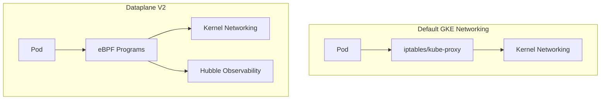

# How to Enable Dataplane V2 Cilium on GKE for Advanced Network Policy and Observability

Author: [nawazdhandala](https://www.github.com/nawazdhandala)

Tags: GCP, GKE, Kubernetes, Cilium, Dataplane V2, Networking, Observability

Description: A practical guide to enabling GKE Dataplane V2 powered by Cilium for advanced network policies, eBPF-based networking, and built-in network observability features.

---

GKE's default networking stack uses iptables for packet routing and kube-proxy for service load balancing. It works, but it has limitations: iptables rules grow linearly with the number of services, network policy enforcement is basic, and you get minimal visibility into what is actually happening on the network.

Dataplane V2 replaces all of that with Cilium, an eBPF-based networking solution. Instead of iptables rules, packet processing happens in the Linux kernel through eBPF programs. This is faster, scales better, and - the real win - gives you built-in network observability that shows exactly what traffic is flowing between your pods.

## What Dataplane V2 Gives You

Compared to the default networking stack:

- **eBPF-based packet processing**: Faster than iptables, especially at scale
- **Kernel-level network policy enforcement**: More efficient than Calico's iptables approach
- **Built-in network observability**: See traffic flows without deploying additional tools
- **FQDN-based network policies**: Restrict egress based on domain names, not just IPs
- **Advanced policy features**: Deny policies, policy logging, L7 visibility
- **Hubble integration**: Distributed networking observability platform



## Enabling Dataplane V2

Dataplane V2 can only be enabled at cluster creation time - you cannot enable it on an existing cluster.

```bash
# Create a new GKE cluster with Dataplane V2
gcloud container clusters create cilium-cluster \
  --region us-central1 \
  --enable-dataplane-v2 \
  --num-nodes 3 \
  --machine-type e2-standard-4 \
  --workload-pool YOUR_PROJECT_ID.svc.id.goog
```

For Autopilot clusters, Dataplane V2 is enabled by default.

```bash
# Autopilot clusters automatically use Dataplane V2
gcloud container clusters create-auto autopilot-cluster \
  --region us-central1
```

Verify that Cilium is running after cluster creation.

```bash
# Check Cilium agent pods
kubectl -n kube-system get pods -l k8s-app=cilium

# Check Cilium status
kubectl -n kube-system exec ds/anetd -- cilium status
```

## Network Policies with Dataplane V2

Dataplane V2 supports standard Kubernetes NetworkPolicy resources, but it also supports Cilium-specific policies that are more powerful.

### Standard Network Policies

Standard policies work the same as before, but enforcement is faster because it happens in eBPF.

```yaml
# Standard Kubernetes NetworkPolicy - works with Dataplane V2
apiVersion: networking.k8s.io/v1
kind: NetworkPolicy
metadata:
  name: allow-frontend-to-api
  namespace: default
spec:
  podSelector:
    matchLabels:
      app: api-server
  policyTypes:
    - Ingress
  ingress:
    - from:
        - podSelector:
            matchLabels:
              app: frontend
      ports:
        - protocol: TCP
          port: 8080
```

### Cilium Network Policies

Cilium policies add features not available in the standard Kubernetes spec.

```yaml
# FQDN-based egress policy - allow pods to reach specific external domains
apiVersion: cilium.io/v2
kind: CiliumNetworkPolicy
metadata:
  name: allow-external-api
  namespace: default
spec:
  endpointSelector:
    matchLabels:
      app: my-service
  egress:
    # Allow HTTPS traffic to specific external domains
    - toFQDNs:
        - matchName: "api.stripe.com"
        - matchName: "api.sendgrid.com"
        - matchPattern: "*.googleapis.com"
      toPorts:
        - ports:
            - port: "443"
              protocol: TCP
    # Allow DNS for FQDN resolution
    - toEndpoints:
        - matchLabels:
            k8s:io.kubernetes.pod.namespace: kube-system
            k8s-app: kube-dns
      toPorts:
        - ports:
            - port: "53"
              protocol: UDP
```

This is a game-changer for security. Instead of trying to maintain lists of IP addresses for external services (which change frequently), you specify domain names directly.

### Deny Policies

Standard Kubernetes NetworkPolicy does not have explicit deny rules - you can only allow traffic. Cilium adds deny policies.

```yaml
# Explicitly deny traffic to a specific destination
apiVersion: cilium.io/v2
kind: CiliumNetworkPolicy
metadata:
  name: deny-metadata-access
  namespace: default
spec:
  endpointSelector:
    matchLabels:
      role: untrusted
  egressDeny:
    # Block access to the GCE metadata server
    - toCIDR:
        - "169.254.169.254/32"
      toPorts:
        - ports:
            - port: "80"
              protocol: TCP
```

## Enabling Hubble for Network Observability

Hubble is Cilium's observability layer. On GKE with Dataplane V2, you can enable Hubble to see all network flows.

```bash
# Enable observability on the cluster
gcloud container clusters update cilium-cluster \
  --region us-central1 \
  --enable-dataplane-v2-observability
```

After enabling, you can query network flows through the GKE console or the Hubble CLI.

```bash
# Install the Hubble CLI
export HUBBLE_VERSION=$(curl -s https://raw.githubusercontent.com/cilium/hubble/master/stable.txt)
curl -L --remote-name-all https://github.com/cilium/hubble/releases/download/$HUBBLE_VERSION/hubble-linux-amd64.tar.gz
tar xzvf hubble-linux-amd64.tar.gz
sudo mv hubble /usr/local/bin/

# Port-forward to the Hubble relay
kubectl -n kube-system port-forward svc/hubble-relay 4245:80 &

# Observe all network flows in real-time
hubble observe --follow

# Filter flows by namespace
hubble observe --namespace default --follow

# Filter by specific pods
hubble observe --pod default/web-app --follow

# Filter by verdict (allowed or denied)
hubble observe --verdict DROPPED --follow
```

## Observing Network Policy Decisions

One of the most useful features is seeing exactly which policies allowed or denied traffic.

```bash
# See all denied flows with the policy that blocked them
hubble observe --verdict DROPPED --print-raw-filters

# See flows for a specific service
hubble observe --to-pod default/api-server --port 8080

# Get flow metrics
hubble observe --namespace default -o json | jq '.flow.verdict'
```

Example output showing a denied connection:

```
TIMESTAMP             SOURCE                    DESTINATION               TYPE      VERDICT   SUMMARY
Feb 17 10:15:23.456   default/untrusted-pod     default/database-pod      Policy    DROPPED   TCP Flags: SYN
                       Policy: default-deny-all
```

This tells you exactly which pod tried to connect where, and which policy blocked it. Incredibly useful for debugging network policy issues.

## L7 Visibility

Cilium can also inspect L7 (application layer) traffic to give you HTTP-level visibility.

```yaml
# Enable L7 visibility for specific pods
apiVersion: cilium.io/v2
kind: CiliumNetworkPolicy
metadata:
  name: l7-visibility
  namespace: default
spec:
  endpointSelector:
    matchLabels:
      app: api-server
  ingress:
    - fromEndpoints:
        - matchLabels:
            app: frontend
      toPorts:
        - ports:
            - port: "8080"
              protocol: TCP
          rules:
            http:
              # Allow only GET and POST methods
              - method: "GET"
              - method: "POST"
                path: "/api/.*"
```

With L7 policies, Hubble shows you the HTTP methods, paths, and response codes.

```bash
# Observe L7 flows
hubble observe --protocol http --namespace default
# Shows: GET /api/users -> 200, POST /api/orders -> 201, etc.
```

## Policy Logging

Enable policy logging to see network policy decisions in Cloud Logging.

```yaml
# Enable policy logging via annotations
apiVersion: networking.k8s.io/v1
kind: NetworkPolicy
metadata:
  name: logged-policy
  namespace: default
  annotations:
    # Log all connections that match this policy
    policy.network.gke.io/enable-logging: "true"
spec:
  podSelector:
    matchLabels:
      app: sensitive-service
  policyTypes:
    - Ingress
  ingress:
    - from:
        - podSelector:
            matchLabels:
              app: authorized-client
      ports:
        - protocol: TCP
          port: 8080
```

Then query the logs in Cloud Logging.

```bash
# Query network policy logs
gcloud logging read \
  'resource.type="k8s_node" AND jsonPayload.connection.direction="ingress" AND jsonPayload.policy_name="logged-policy"' \
  --limit 20 \
  --format json
```

## Performance Comparison

Dataplane V2 generally performs better than the default iptables-based networking, especially at scale.

```bash
# Run a network performance benchmark
# Deploy iperf3 server
kubectl run iperf-server --image=networkstatic/iperf3 -- -s

# Run iperf3 client
kubectl run iperf-client --rm -i --tty --image=networkstatic/iperf3 -- \
  -c iperf-server -t 30

# You should see improved throughput and lower latency compared to iptables
```

The improvement is most noticeable in clusters with hundreds of services, where iptables rule chains become a bottleneck.

## Migrating to Dataplane V2

Since you cannot enable Dataplane V2 on an existing cluster, migration means creating a new cluster and moving workloads.

```bash
# Create the new Dataplane V2 cluster
gcloud container clusters create new-cluster \
  --region us-central1 \
  --enable-dataplane-v2 \
  --num-nodes 3

# Export workloads from old cluster
kubectl get deployments -o yaml > deployments.yaml
kubectl get services -o yaml > services.yaml
kubectl get networkpolicies -o yaml > netpol.yaml

# Apply to new cluster
gcloud container clusters get-credentials new-cluster --region us-central1
kubectl apply -f deployments.yaml
kubectl apply -f services.yaml
kubectl apply -f netpol.yaml
```

Your existing Kubernetes NetworkPolicy resources work unchanged on Dataplane V2. The migration is about the cluster, not the policies.

## Wrapping Up

Dataplane V2 with Cilium is a significant upgrade to GKE's networking stack. The eBPF-based packet processing is faster and more scalable than iptables, the FQDN-based network policies are genuinely useful for controlling egress to external services, and the built-in Hubble observability gives you visibility into network traffic that previously required deploying and maintaining separate tools. If you are creating a new GKE cluster, there is little reason not to enable Dataplane V2. The performance is better, the features are richer, and the observability alone is worth it for debugging connectivity issues in production.
