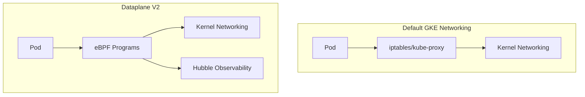

# How to Enable Dataplane V2 Cilium on GKE for Advanced Network Policy

Author: [nawazdhandala](https://www.github.com/nawazdhandala)

Tags: GCP, GKE, Kubernetes, Cilium, Dataplane V2, Networking, Observability

Description: A practical guide to enabling GKE Dataplane V2 powered by Cilium for advanced network policies, eBPF-based networking, and built-in network observability features.

---

GKE's default networking stack uses iptables for packet routing and kube-proxy for service load balancing. It works, but it has limitations: iptables rules grow linearly with the number of services, network policy enforcement is basic, and you get minimal visibility into what is actually happening on the network.

Dataplane V2 replaces much of that with a Cilium-based, eBPF-based networking dataplane managed by GKE. Instead of relying on iptables for service routing on supported GKE versions, packet processing happens in the Linux kernel through eBPF programs. This scales better, and - the real win - gives you built-in network observability that shows what traffic is flowing between your pods.

## What Dataplane V2 Gives You

Compared to the default networking stack:

- **eBPF-based packet processing**: Faster than iptables, especially at scale
- **Kernel-level network policy enforcement**: More efficient than Calico's iptables approach
- **Built-in network observability**: See traffic flows without deploying additional tools
- **FQDNNetworkPolicy support**: Restrict egress based on domain names, not just IPs
- **Advanced policy features**: Cluster-wide L3/L4 policies and policy logging
- **Managed Hubble integration**: Distributed networking observability platform


```mermaid
graph TB
    subgraph "Default GKE Networking"
        A[Pod] --> B[iptables/kube-proxy]
        B --> C[Kernel Networking]
    end
    subgraph "Dataplane V2"
        D[Pod] --> E[eBPF Programs]
        E --> F[Kernel Networking]
        E --> G[Hubble Observability]
    end
```

## Enabling Dataplane V2

Dataplane V2 can only be enabled at cluster creation time - you cannot enable it on an existing cluster.

```bash
# Create a new GKE cluster with Dataplane V2

gcloud container clusters create cilium-cluster \
  --region us-central1 \
  --enable-dataplane-v2 \
  --enable-ip-alias \
  --num-nodes 3 \
  --machine-type e2-standard-4 \
  --workload-pool YOUR_PROJECT_ID.svc.id.goog
```

For Autopilot clusters, Dataplane V2 is enabled by default.

```bash
# Autopilot clusters automatically use Dataplane V2
gcloud container clusters create-auto autopilot-cluster \
  --region us-central1
```

Verify that the Dataplane V2 agent is running after cluster creation.

```bash
# Check the Dataplane V2 agent DaemonSet
kubectl -n kube-system get daemonset anetd

# Confirm the cluster is using the advanced datapath provider
gcloud container clusters describe cilium-cluster \
  --region us-central1 \
  --format="value(networkConfig.datapathProvider)"
```

## Network Policies with Dataplane V2

Dataplane V2 supports standard Kubernetes NetworkPolicy resources. GKE also provides separate Dataplane V2 features for FQDN-based egress policies and Cilium cluster-wide network policies.

### Standard Network Policies

Standard policies work the same as before, but enforcement is faster because it happens in eBPF.

```yaml
# Standard Kubernetes NetworkPolicy - works with Dataplane V2
apiVersion: networking.k8s.io/v1
kind: NetworkPolicy
metadata:
  name: allow-frontend-to-api
  namespace: default
spec:
  podSelector:
    matchLabels:
      app: api-server
  policyTypes:
    - Ingress
  ingress:
    - from:
        - podSelector:
            matchLabels:
              app: frontend
      ports:
        - protocol: TCP
          port: 8080
```

### FQDN Network Policies

FQDN network policies add domain-based egress control that is not available in the standard Kubernetes spec. You must enable the feature before creating `FQDNNetworkPolicy` resources.

```bash
# Enable FQDN Network Policy on a Dataplane V2 cluster
gcloud container clusters update cilium-cluster \
  --region us-central1 \
  --enable-fqdn-network-policy

# For Standard clusters, restart anetd after enabling the feature
kubectl rollout restart ds -n kube-system anetd
```

```yaml
# FQDN-based egress policy - allow pods to reach specific external domains
apiVersion: networking.gke.io/v1alpha1
kind: FQDNNetworkPolicy
metadata:
  name: allow-external-api
spec:
  podSelector:
    matchLabels:
      app: my-service
  egress:
    # Allow HTTPS traffic to specific external domains
    - matches:
        - name: "api.stripe.com"
        - name: "api.sendgrid.com"
        - pattern: "*.googleapis.com"
      ports:
        - port: 443
          protocol: TCP
```

This is a game-changer for security. Instead of trying to maintain lists of IP addresses for external services (which change frequently), you specify domain names directly.

### Cluster-Wide Policies

Standard Kubernetes NetworkPolicy is namespace-scoped. GKE can also enable Cilium cluster-wide network policies for cluster-scoped L3/L4 rules.

```bash
# Enable Cilium cluster-wide network policy when creating a Standard cluster
gcloud container clusters create cilium-cluster \
  --region us-central1 \
  --enable-dataplane-v2 \
  --enable-cilium-clusterwide-network-policy

# Or enable it on an existing Dataplane V2 cluster
gcloud container clusters update cilium-cluster \
  --region us-central1 \
  --enable-cilium-clusterwide-network-policy

kubectl rollout restart ds -n kube-system anetd
```

```yaml
# Cluster-wide L3/L4 rule for selected workloads
apiVersion: cilium.io/v2
kind: CiliumClusterwideNetworkPolicy
metadata:
  name: restrict-crawler-egress
spec:
  endpointSelector:
    matchLabels:
      role: crawler
  egress:
    - toCIDR:
        - "192.0.2.0/24"
      toPorts:
        - ports:
            - port: "80"
              protocol: TCP
```

## Enabling Hubble for Network Observability

Hubble is Cilium's observability layer. On GKE with Dataplane V2, you can enable Hubble to see all network flows.

```bash
# Enable observability on the cluster
gcloud container clusters update cilium-cluster \
  --region us-central1 \
  --enable-dataplane-v2-flow-observability
```

After enabling, you can query network flows through the GKE console or the Hubble CLI.

```bash
# Use the managed Hubble CLI container
alias hubble="kubectl exec -it -n gke-managed-dpv2-observability deployment/hubble-relay -c hubble-cli -- hubble"

# Observe all network flows in real-time
hubble observe -f

# Filter flows by namespace
hubble observe -n default -f

# Filter by verdict (allowed or denied)
hubble observe --verdict DROPPED -f
```

## Observing Network Policy Decisions

One of the most useful features is seeing exactly which policies allowed or denied traffic.

```bash
# See all denied flows with the policy that blocked them
hubble observe --verdict DROPPED -f

# See flows for a specific pod
hubble observe --pod api-server --namespace default

# Get flow verdicts as JSON
hubble observe --namespace default -o json | jq '.flow.verdict'
```

Example output showing a denied connection:

```text
TIMESTAMP             SOURCE                    DESTINATION               TYPE      VERDICT   SUMMARY
Feb 17 10:15:23.456   default/untrusted-pod     default/database-pod      Policy    DROPPED   TCP Flags: SYN
                       Policy: default-deny-all
```

This tells you exactly which pod tried to connect where, and which policy blocked it. Incredibly useful for debugging network policy issues.

## L7 Visibility

GKE's Cilium cluster-wide network policy support is limited to L3/L4 rules. Layer 7 Cilium policies, such as HTTP method and path filtering, are not supported in GKE's managed Cilium integration. If you need application-layer controls on GKE, use a service mesh or another application-layer policy tool.

```yaml
# This type of Cilium L7 policy is rejected by GKE Dataplane V2:
#
# rules:
#   http:
#     - method: "GET"
#       path: "/api/.*"
```

With Dataplane V2 observability, Hubble still shows useful L3/L4 flow metadata and Kubernetes NetworkPolicy verdicts.

```bash
# Observe flows in a namespace
hubble observe -n default
```

## Policy Logging

Enable policy logging to see network policy decisions in Cloud Logging.

```yaml
# Enable logging globally or delegate allowed-connection logging to annotated policies
apiVersion: networking.gke.io/v1alpha1
kind: NetworkLogging
metadata:
  name: default
spec:
  cluster:
    allow:
      log: true
      delegate: true
    deny:
      log: true
      delegate: false
```

```yaml
# Enable allowed-connection logging for this policy when delegation is on
apiVersion: networking.k8s.io/v1
kind: NetworkPolicy
metadata:
  name: logged-policy
  namespace: default
  annotations:
    # Log all connections that match this policy
    policy.network.gke.io/enable-logging: "true"
spec:
  podSelector:
    matchLabels:
      app: sensitive-service
  policyTypes:
    - Ingress
  ingress:
    - from:
        - podSelector:
            matchLabels:
              app: authorized-client
      ports:
        - protocol: TCP
          port: 8080
```

Then query the logs in Cloud Logging.

```bash
# Query network policy logs
gcloud logging read \
  'resource.type="k8s_node"
   resource.labels.location="us-central1"
   resource.labels.cluster_name="cilium-cluster"
   logName="projects/YOUR_PROJECT_ID/logs/policy-action"' \
  --limit 20 \
  --format json
```

## Performance Comparison

Dataplane V2 generally performs better than the default iptables-based networking, especially at scale.

```bash
# Run a network performance benchmark
# Deploy iperf3 server
kubectl run iperf-server --image=networkstatic/iperf3 -- -s
kubectl expose pod iperf-server --port 5201

# Run iperf3 client
kubectl run iperf-client --rm -i --tty --image=networkstatic/iperf3 -- \
  -c iperf-server -p 5201 -t 30

# Compare results against an equivalent legacy dataplane cluster
```

The improvement is most noticeable in clusters with hundreds of services, where iptables rule chains become a bottleneck.

## Migrating to Dataplane V2

Since you cannot enable Dataplane V2 on an existing cluster, migration means creating a new cluster and moving workloads.

```bash
# Create the new Dataplane V2 cluster
gcloud container clusters create new-cluster \
  --region us-central1 \
  --enable-dataplane-v2 \
  --enable-ip-alias \
  --num-nodes 3

# Apply your source manifests to the new cluster
gcloud container clusters get-credentials new-cluster --region us-central1
kubectl apply -f k8s/
```

Your existing Kubernetes NetworkPolicy resources work unchanged on Dataplane V2. The migration is about the cluster, not the policies.

## Wrapping Up

Dataplane V2 with GKE's managed Cilium-based dataplane is a significant upgrade to GKE's networking stack. The eBPF-based packet processing scales better than iptables in large clusters, the GKE FQDNNetworkPolicy feature is genuinely useful for controlling egress to external services, and the managed Hubble observability gives you visibility into network traffic that previously required deploying and maintaining separate tools. If you are creating a new GKE cluster, there is little reason not to evaluate Dataplane V2. The scalability characteristics are better, the supported policy features are richer, and the observability alone is worth it for debugging connectivity issues in production.
