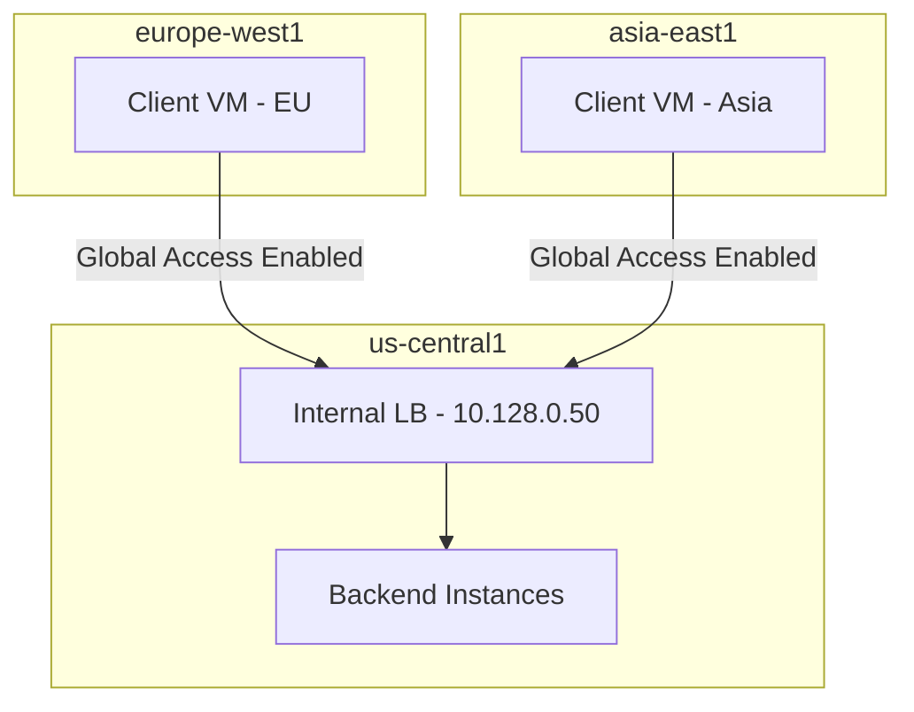

# How to Enable Global Access on an Internal Load Balancer in GCP

Author: [nawazdhandala](https://www.github.com/nawazdhandala)

Tags: GCP, Internal Load Balancer, Global Access, Networking, VPC

Description: Learn how to enable global access on a GCP internal load balancer so clients in any region can reach backends deployed in a different region within the same VPC.

---

By default, a regional internal load balancer in GCP is only accessible from clients in the same region. If your internal load balancer is in us-central1, a VM in europe-west1 cannot reach it, even if both are in the same VPC network. This is the expected behavior for regional resources, but it becomes a problem when you have a centralized internal service that needs to be accessed from multiple regions.

Enabling global access on an internal load balancer removes this restriction. Clients from any region in the same VPC (or connected VPCs) can reach the load balancer. This post covers how to enable it, when you should use it, and the networking implications.

## When You Need Global Access

Common scenarios where global access is necessary:

- **Centralized internal API**: You have a single internal API deployed in one region, but VMs and services in other regions need to call it
- **Shared database proxy**: A database proxy (like PgBouncer or ProxySQL) runs in one region behind an internal load balancer, and applications in other regions need access
- **Centralized logging or monitoring**: Internal services in multiple regions send data to a centralized collector
- **Hub-and-spoke architecture**: A central "hub" VPC has shared services accessed by "spoke" VPCs in different regions

## How It Works

Without global access, the internal load balancer's IP address is only routable within the same region. With global access enabled, GCP's SDN (Software Defined Networking) ensures the IP is routable from any region in the VPC.



Traffic from remote regions crosses Google's private backbone network, not the public internet. Latency depends on the distance between regions but is generally lower than public internet routing.

## Enabling Global Access on a New Internal Load Balancer

When creating a new forwarding rule for an internal load balancer, add the `--allow-global-access` flag:

```bash
# Create an internal forwarding rule with global access enabled
gcloud compute forwarding-rules create my-internal-rule \
    --load-balancing-scheme=INTERNAL \
    --network=my-vpc \
    --subnet=my-subnet \
    --region=us-central1 \
    --address=10.128.0.50 \
    --ip-protocol=TCP \
    --ports=80,443 \
    --backend-service=my-internal-backend \
    --allow-global-access
```

## Enabling Global Access on an Existing Internal Load Balancer

If you already have an internal load balancer running, you can enable global access without recreating it:

```bash
# Enable global access on an existing forwarding rule
gcloud compute forwarding-rules update my-internal-rule \
    --region=us-central1 \
    --allow-global-access
```

This change takes effect immediately with no downtime. Clients in other regions can start reaching the load balancer right away.

To verify the setting:

```bash
# Verify global access is enabled
gcloud compute forwarding-rules describe my-internal-rule \
    --region=us-central1 \
    --format="get(allowGlobalAccess)"
```

This should return `True`.

## Disabling Global Access

If you need to restrict the load balancer back to regional access only:

```bash
# Disable global access
gcloud compute forwarding-rules update my-internal-rule \
    --region=us-central1 \
    --no-allow-global-access
```

Existing connections from remote regions will not be immediately dropped, but new connections from remote regions will fail.

## Global Access with Internal HTTP(S) Load Balancer

For the Envoy-based internal HTTP(S) load balancer (INTERNAL_MANAGED scheme), global access works the same way:

```bash
# Create an internal HTTP(S) forwarding rule with global access
gcloud compute forwarding-rules create my-internal-http-rule \
    --load-balancing-scheme=INTERNAL_MANAGED \
    --network=my-vpc \
    --subnet=my-subnet \
    --region=us-central1 \
    --ports=80 \
    --target-http-proxy=my-internal-proxy \
    --target-http-proxy-region=us-central1 \
    --allow-global-access
```

Or update an existing one:

```bash
# Enable global access on existing internal HTTP(S) LB
gcloud compute forwarding-rules update my-internal-http-rule \
    --region=us-central1 \
    --allow-global-access
```

## Firewall Rules Considerations

Firewall rules in GCP are VPC-wide, not regional, so you do not need to create additional firewall rules for cross-region traffic. If a client VM in europe-west1 is allowed to reach the backend on port 80, it can do so regardless of region.

However, verify that your existing firewall rules are not accidentally restricted by source IP ranges that exclude other regions:

```bash
# List firewall rules that affect the backend instances
gcloud compute firewall-rules list \
    --filter="targetTags=internal-backend" \
    --format="table(name,sourceRanges,allowed)"
```

Make sure the source ranges include the IP ranges of subnets in all regions that need access.

## VPC Peering and Shared VPC

Global access also works across:

**VPC Peering**: If VPC A has an internal load balancer with global access enabled, and VPC B is peered with VPC A, clients in VPC B can reach the load balancer. However, both VPCs must have routes exchanged.

```bash
# Verify peering routes include the load balancer subnet
gcloud compute networks peerings list --network=vpc-b \
    --format="table(name,exchangeSubnetRoutes)"
```

**Shared VPC**: Service projects can access internal load balancers in the host project (or other service projects) through the shared VPC, provided global access is enabled and appropriate firewall rules exist.

## DNS Configuration for Cross-Region Access

When clients in multiple regions access the same internal load balancer, use Cloud DNS private zones to give the load balancer a hostname:

```bash
# Create a private DNS zone
gcloud dns managed-zones create internal-zone \
    --dns-name="internal.mycompany.com." \
    --visibility=private \
    --networks=my-vpc

# Add a DNS record for the load balancer
gcloud dns record-sets create api.internal.mycompany.com. \
    --zone=internal-zone \
    --type=A \
    --ttl=300 \
    --rrdatas=10.128.0.50
```

Now clients in any region can access the service as `api.internal.mycompany.com` instead of remembering the IP address.

## Latency Implications

Cross-region traffic has higher latency than same-region traffic. Here are approximate round-trip times between major GCP regions:

| From | To | Approximate RTT |
|------|----|----------------|
| us-central1 | us-east1 | 20-30ms |
| us-central1 | europe-west1 | 90-110ms |
| us-central1 | asia-east1 | 150-180ms |
| europe-west1 | asia-east1 | 200-250ms |

For latency-sensitive applications, consider deploying the service in multiple regions instead of relying on global access to a single region. The cross-region internal application load balancer is designed for this pattern.

## Testing Cross-Region Access

To verify global access is working:

```bash
# From a VM in a different region, test connectivity
# SSH into a VM in europe-west1
gcloud compute ssh eu-test-vm --zone=europe-west1-b

# From within the VM, test the internal load balancer
curl http://10.128.0.50/health
# Or using the DNS name
curl http://api.internal.mycompany.com/health
```

If this times out, check:
1. Global access is enabled on the forwarding rule
2. Firewall rules allow traffic from the source region's subnet
3. The VPC has proper routing between regions (automatic mode VPCs do this by default)

## Terraform Configuration

```hcl
# Internal forwarding rule with global access enabled
resource "google_compute_forwarding_rule" "internal" {
  name                  = "my-internal-rule"
  region                = "us-central1"
  load_balancing_scheme = "INTERNAL"
  backend_service       = google_compute_region_backend_service.internal.id
  network               = google_compute_network.vpc.id
  subnetwork            = google_compute_subnetwork.subnet.id
  ip_address            = "10.128.0.50"
  ip_protocol           = "TCP"
  ports                 = ["80", "443"]

  # Enable global access
  allow_global_access = true
}
```

## Cost Implications

Cross-region traffic through an internal load balancer with global access incurs inter-region data transfer charges. Within the same region, internal traffic is free. Check the GCP pricing page for current inter-region rates, which vary based on the source and destination regions.

For high-volume cross-region traffic, the cost can add up. Factor this into your architecture decisions.

## Wrapping Up

Enabling global access on an internal load balancer is a single flag that transforms a regional resource into a globally accessible one within your VPC. It is the simplest solution when you have a centralized internal service that needs cross-region access. For latency-sensitive workloads or high-volume cross-region traffic, consider deploying the service in multiple regions instead. But for shared services where simplicity matters more than single-digit millisecond latency, global access is the way to go.
