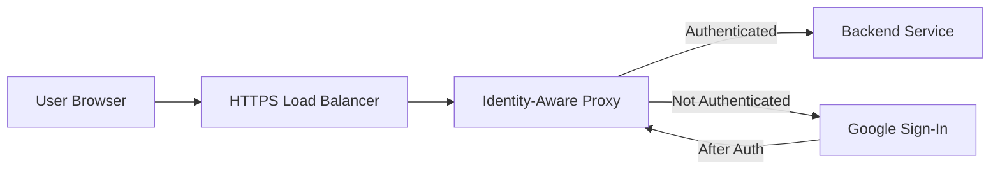

# How to Enable Identity-Aware Proxy to Secure a Web Application Behind a GCP Load Balancer

Author: [nawazdhandala](https://www.github.com/nawazdhandala)

Tags: GCP, Identity-Aware Proxy, IAP, Load Balancer, Security, Authentication

Description: Learn how to enable Google Cloud Identity-Aware Proxy to add authentication and authorization to web applications running behind an external HTTP(S) load balancer.

---

Identity-Aware Proxy (IAP) is one of those GCP features that can save you a lot of custom authentication code. Instead of building login flows into your application, you put IAP in front of it. IAP handles authentication through Google's identity infrastructure and only lets authorized users through. Your application receives requests that have already been verified.

This is especially useful for internal tools, admin panels, staging environments, and any web application where you want Google-account-based access control without modifying the app itself.

In this post, I will walk through setting up IAP on an existing web application that runs behind a GCP external HTTP(S) load balancer.

## Prerequisites

Before you start, you need:

- A web application running on GCE instances, GKE, or a managed instance group
- An external HTTP(S) load balancer already configured and serving traffic
- A domain name pointing to the load balancer's IP
- An SSL certificate configured on the load balancer (IAP requires HTTPS)

## Architecture Overview

Here is how traffic flows with IAP enabled:



IAP sits between the load balancer and your backend service. When an unauthenticated user makes a request, IAP redirects them to Google's sign-in page. After authentication, IAP checks if the user is authorized, and if so, passes the request through to your backend with identity headers attached.

## Step 1: Enable the IAP API

```bash
# Enable the Identity-Aware Proxy API
gcloud services enable iap.googleapis.com --project=my-project-id
```

## Step 2: Configure the OAuth Consent Screen

IAP uses OAuth 2.0 for authentication, so you need a consent screen configured. Go to the Google Cloud Console, navigate to APIs & Services, then OAuth consent screen. You can also do this via the command line, but the console is easier for this part.

For internal applications, set the user type to "Internal" - this limits sign-in to users in your Google Workspace organization. For external applications, set it to "External" and configure the appropriate settings.

At minimum, you need:
- Application name
- User support email
- Developer contact email

## Step 3: Enable IAP on the Backend Service

Find your backend service name first.

```bash
# List all backend services in your project
gcloud compute backend-services list --project=my-project-id
```

Now enable IAP on the target backend service.

```bash
# Enable IAP on the backend service
gcloud compute backend-services update my-backend-service \
    --iap=enabled \
    --global \
    --project=my-project-id
```

When you run this for the first time, GCP creates an OAuth client automatically. You can also provide your own OAuth credentials if you prefer.

```bash
# Enable IAP with custom OAuth credentials
gcloud compute backend-services update my-backend-service \
    --iap=enabled,oauth2-client-id=CLIENT_ID,oauth2-client-secret=CLIENT_SECRET \
    --global \
    --project=my-project-id
```

## Step 4: Grant Access to Users

After enabling IAP, nobody can access the application until you grant them the IAP-secured Web App User role.

```bash
# Grant a specific user access through IAP
gcloud iap web add-iam-policy-binding \
    --resource-type=backend-services \
    --service=my-backend-service \
    --member="user:developer@company.com" \
    --role="roles/iap.httpsResourceAccessor" \
    --project=my-project-id
```

You can also grant access to groups, which is easier to manage.

```bash
# Grant an entire Google Group access through IAP
gcloud iap web add-iam-policy-binding \
    --resource-type=backend-services \
    --service=my-backend-service \
    --member="group:engineering@company.com" \
    --role="roles/iap.httpsResourceAccessor" \
    --project=my-project-id
```

Or grant access to your entire organization.

```bash
# Grant all users in the organization access
gcloud iap web add-iam-policy-binding \
    --resource-type=backend-services \
    --service=my-backend-service \
    --member="domain:company.com" \
    --role="roles/iap.httpsResourceAccessor" \
    --project=my-project-id
```

## Step 5: Verify the Setup

Open your application URL in a browser. You should be redirected to Google's sign-in page. After signing in with an authorized account, you should see your application.

If you sign in with an unauthorized account, you will see a 403 Forbidden page.

## Reading User Identity in Your Application

IAP adds headers to every request that passes through it. Your application can read these headers to know who the authenticated user is.

The key headers are:
- `X-Goog-Authenticated-User-Email` - the user's email (e.g., `accounts.google.com:user@company.com`)
- `X-Goog-Authenticated-User-Id` - a unique user identifier
- `X-Goog-Iap-Jwt-Assertion` - a signed JWT containing identity claims

Here is a Python Flask example that reads the identity.

```python
from flask import Flask, request

app = Flask(__name__)

@app.route("/")
def index():
    # Read the authenticated user's email from IAP headers
    user_email = request.headers.get("X-Goog-Authenticated-User-Email", "unknown")

    # Strip the prefix (e.g., "accounts.google.com:user@company.com" -> "user@company.com")
    if ":" in user_email:
        user_email = user_email.split(":", 1)[1]

    return f"Hello, {user_email}!"
```

For production applications, you should verify the JWT assertion to make sure the headers were not spoofed by a request that bypassed the load balancer.

```python
from google.auth.transport import requests
from google.oauth2 import id_token

def verify_iap_jwt(iap_jwt, expected_audience):
    """Verify the IAP JWT assertion and return the user's email."""
    try:
        decoded_jwt = id_token.verify_token(
            iap_jwt,
            requests.Request(),
            audience=expected_audience,
            certs_url="https://www.gstatic.com/iap/verify/public_key",
        )
        return decoded_jwt["email"]
    except Exception as e:
        print(f"JWT verification failed: {e}")
        return None
```

## Configuring IAP with Terraform

Here is the Terraform approach for teams managing infrastructure as code.

```hcl
# Enable IAP on the backend service
resource "google_compute_backend_service" "app" {
  name        = "my-backend-service"
  protocol    = "HTTP"
  port_name   = "http"
  timeout_sec = 30

  backend {
    group = google_compute_instance_group_manager.app.instance_group
  }

  health_checks = [google_compute_health_check.app.id]

  # Enable IAP
  iap {
    oauth2_client_id     = google_iap_client.app.client_id
    oauth2_client_secret = google_iap_client.app.secret
  }
}

# Create an IAP brand (OAuth consent screen)
resource "google_iap_brand" "app" {
  support_email     = "support@company.com"
  application_title = "My Application"
  project           = var.project_id
}

# Create an IAP OAuth client
resource "google_iap_client" "app" {
  display_name = "My App IAP Client"
  brand        = google_iap_brand.app.name
}

# Grant access to the engineering team
resource "google_iap_web_backend_service_iam_member" "access" {
  project             = var.project_id
  web_backend_service = google_compute_backend_service.app.name
  role                = "roles/iap.httpsResourceAccessor"
  member              = "group:engineering@company.com"
}
```

## Handling Common Issues

**Redirect loop after enabling IAP**: This usually means the health check path is also being intercepted by IAP. Make sure your health check uses a path that the load balancer can reach directly, or configure health checks to use a different port.

**403 after successful login**: The user authenticated but is not in the IAP access list. Add them with the `iap.httpsResourceAccessor` role.

**Mixed HTTP/HTTPS issues**: IAP requires HTTPS. If your load balancer has both HTTP and HTTPS frontends, the HTTP frontend will not work with IAP. Set up an HTTP-to-HTTPS redirect on the load balancer.

**Headers missing in application**: Make sure your application is reading headers case-insensitively. Some web frameworks normalize header names.

## Bypassing IAP for Health Checks

Load balancer health checks come from Google's infrastructure, not through IAP. By default, they bypass IAP. However, if your health check endpoint requires authentication at the application level, you might need to configure it differently.

The simplest approach is to have a dedicated health check endpoint that does not require authentication.

## Security Considerations

While IAP handles authentication at the infrastructure level, your application should still:

1. Verify the JWT in the `X-Goog-Iap-Jwt-Assertion` header for defense in depth
2. Not expose the application directly on a public IP - only through the load balancer
3. Configure firewall rules to allow traffic only from the load balancer's IP ranges

```bash
# Create a firewall rule that only allows traffic from the GCP load balancer
gcloud compute firewall-rules create allow-lb-only \
    --allow=tcp:8080 \
    --source-ranges=130.211.0.0/22,35.191.0.0/16 \
    --target-tags=iap-backend \
    --project=my-project-id
```

These IP ranges are Google's health check and load balancer source ranges. Traffic from any other source will be blocked.

## Summary

IAP gives you Google-grade authentication for any web application behind a GCP load balancer without changing your application code. Enable it on the backend service, configure the OAuth consent screen, grant access to the right users or groups, and you are done. For production use, verify the JWT headers in your application and lock down network access so that traffic can only reach your backend through the load balancer.
