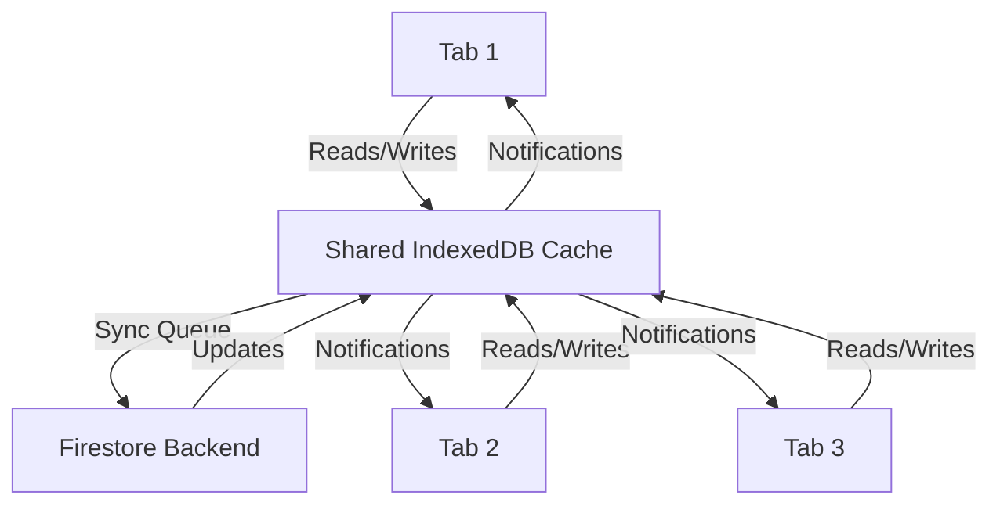

# How to Enable Offline Persistence in Firestore for Web Applications

Author: [nawazdhandala](https://www.github.com/nawazdhandala)

Tags: GCP, Firestore, Offline Persistence, Web Development, Firebase

Description: A practical guide to enabling and configuring Firestore offline persistence in web apps so users can read and write data without an internet connection.

---

One of Firestore's best features is built-in offline support. When your users lose their internet connection - on a subway, in an elevator, or just dealing with flaky Wi-Fi - your app can keep working. Reads come from a local cache, and writes get queued up and synced automatically when connectivity returns.

On mobile platforms (iOS and Android), offline persistence is enabled by default. On the web, you have to opt in. Let me show you how to set it up and what to watch out for.

## Why Offline Persistence Matters

Think about a note-taking app. A user starts writing a note on the train, goes through a tunnel, and loses signal. Without offline persistence, the app either freezes or throws errors. With it, the user keeps writing, and everything syncs up when they come out the other side.

Offline persistence works by maintaining a local copy of the Firestore data your app has recently accessed. When you enable it, every document your app reads gets cached locally in IndexedDB (for web apps). When you write data offline, it gets added to a local queue and sent to the server once the connection is back.

## Enabling Persistence

There are two approaches depending on which version of the Firebase SDK you are using. Let us cover both.

For the modular SDK (v9+), which is the recommended approach for new projects:

```javascript
// Initialize Firestore with offline persistence enabled
// This uses the modular v9+ SDK syntax
import { initializeApp } from 'firebase/app';
import { initializeFirestore, persistentLocalCache, persistentMultipleTabManager } from 'firebase/firestore';

const app = initializeApp({
  projectId: 'your-project-id',
  apiKey: 'your-api-key',
  // ... other config
});

// Enable persistent cache with multi-tab support
const db = initializeFirestore(app, {
  localCache: persistentLocalCache({
    tabManager: persistentMultipleTabManager()
  })
});
```

For the compat SDK (v8 style), which you might still be using in older projects:

```javascript
// Enable persistence using the older compat SDK
// This must be called before any other Firestore operations
import firebase from 'firebase/compat/app';
import 'firebase/compat/firestore';

const app = firebase.initializeApp(config);
const db = firebase.firestore();

// Enable persistence - returns a promise
db.enablePersistence({ synchronizeTabs: true })
  .then(() => {
    console.log('Offline persistence enabled');
  })
  .catch((err) => {
    if (err.code === 'failed-precondition') {
      // Multiple tabs open - persistence can only be enabled in one tab
      console.warn('Persistence failed: multiple tabs open');
    } else if (err.code === 'unimplemented') {
      // Browser does not support persistence
      console.warn('Persistence not supported in this browser');
    }
  });
```

## Multi-Tab Support

One of the trickier aspects of web offline persistence is handling multiple browser tabs. In the v9+ SDK with `persistentMultipleTabManager`, this is handled automatically. All tabs share the same cached data and synchronize their state.

If you are on the older SDK, the `synchronizeTabs: true` option does the same thing. Without it, only one tab can use persistence at a time, and opening a second tab will either fail or fall back to memory-only cache.

Here is how the multi-tab architecture works at a high level:



## Configuring Cache Size

By default, Firestore will cache up to 40 MB of data. Once the cache exceeds this limit, Firestore will attempt to garbage collect older, unused documents. You can configure this threshold.

```javascript
// Set a custom cache size of 100 MB
// Use this if your app needs to cache a large dataset for offline use
import { initializeFirestore, persistentLocalCache, persistentMultipleTabManager, CACHE_SIZE_UNLIMITED } from 'firebase/firestore';

const db = initializeFirestore(app, {
  localCache: persistentLocalCache({
    tabManager: persistentMultipleTabManager(),
    cacheSizeBytes: 100 * 1024 * 1024  // 100 MB
  })
});

// Or disable garbage collection entirely (use with caution)
const dbUnlimited = initializeFirestore(app, {
  localCache: persistentLocalCache({
    tabManager: persistentMultipleTabManager(),
    cacheSizeBytes: CACHE_SIZE_UNLIMITED
  })
});
```

Be careful with `CACHE_SIZE_UNLIMITED`. In a long-running app that touches a lot of documents, the cache can grow large and eat into the user's disk space. Most apps should stick with a reasonable limit.

## Handling Offline Writes

When your app writes data while offline, Firestore queues the operation locally. The write promise resolves immediately with the local cache updated, and the actual server write happens later. This means your UI stays responsive.

```javascript
// Writing data while offline works seamlessly
// The write is queued locally and synced when online
import { doc, setDoc, onSnapshot } from 'firebase/firestore';

async function saveNote(noteId, content) {
  const noteRef = doc(db, 'notes', noteId);

  // This resolves immediately, even offline
  await setDoc(noteRef, {
    content: content,
    updatedAt: new Date(),
    authorId: currentUser.uid
  });

  console.log('Note saved (locally if offline)');
}

// Snapshot listeners work with cached data too
// They fire immediately with cached data, then update when server data arrives
const unsubscribe = onSnapshot(doc(db, 'notes', 'note-1'), (snapshot) => {
  console.log('Source:', snapshot.metadata.fromCache ? 'cache' : 'server');
  console.log('Data:', snapshot.data());
});
```

The `snapshot.metadata.fromCache` property is useful. You can use it to show users a subtle indicator that they are viewing cached data, so they know their view might be slightly stale.

## Detecting Online/Offline State

Firestore provides a way to listen for network state changes. You can combine this with browser APIs for a complete picture.

```javascript
// Monitor Firestore's connection state
// This helps you show users whether their data is syncing
import { onSnapshotsInSync, enableNetwork, disableNetwork } from 'firebase/firestore';

// Listen for when all pending snapshots are in sync
const unsubscribe = onSnapshotsInSync(db, () => {
  console.log('All snapshots are in sync with the server');
});

// You can also manually toggle network access
// Useful for a "work offline" mode
async function goOffline() {
  await disableNetwork(db);
  console.log('Firestore network access disabled');
}

async function goOnline() {
  await enableNetwork(db);
  console.log('Firestore network access re-enabled');
}
```

## Handling Pending Writes

When the user has made changes offline, you might want to show them which documents have pending (unsynced) writes.

```javascript
// Check if a document has pending writes that have not been synced yet
import { onSnapshot, doc } from 'firebase/firestore';

onSnapshot(doc(db, 'notes', 'note-1'), (snapshot) => {
  if (snapshot.metadata.hasPendingWrites) {
    // Show a "saving..." or "pending sync" indicator
    showSyncStatus('pending');
  } else {
    // Data is fully synced with the server
    showSyncStatus('synced');
  }
});
```

## Browser Compatibility

Offline persistence in Firestore relies on IndexedDB. Most modern browsers support it, but there are edge cases. Safari in private browsing mode has limited IndexedDB support. Some older browsers may not support it at all.

Always handle the error case when enabling persistence. If it is not supported, your app should still work - it just will not have offline capabilities.

## Common Issues and Solutions

The most common problem developers hit is trying to enable persistence after already making Firestore calls. Persistence must be enabled at initialization time, before any reads or writes. With the v9+ SDK and `initializeFirestore`, this is enforced by the API design.

Another frequent issue is data conflicts. If a user edits a document offline and someone else edits the same document on the server, the last write wins by default. If you need more sophisticated conflict resolution, you should use transactions or implement your own merge logic.

Finally, remember that offline persistence only caches documents your app has actually read. It does not proactively download your entire database. If you need certain data available offline, make sure to read it while the user is still online - for example, during app initialization.

## Wrapping Up

Enabling offline persistence in Firestore for web apps is just a few lines of configuration, but it makes a huge difference in user experience. Your users get a responsive app that works regardless of connectivity, and everything syncs automatically when they are back online. Just remember to configure your cache size appropriately, handle the edge cases around multi-tab usage, and give users visual feedback about their sync status.
