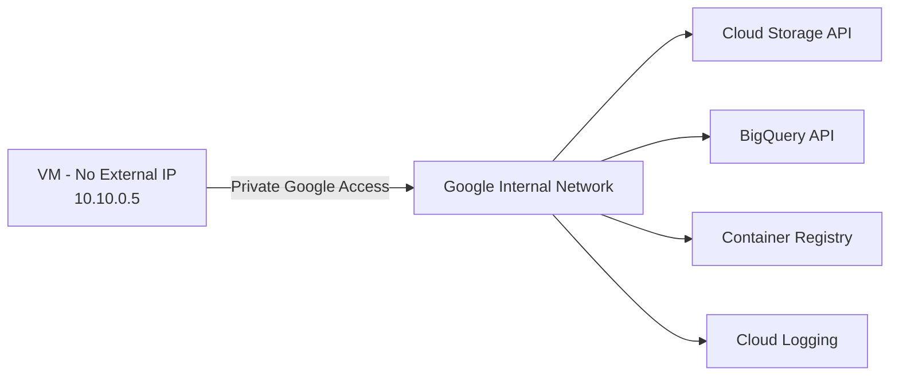

# How to Enable Private Google Access for VMs Without External IPs in GCP

Author: [nawazdhandala](https://www.github.com/nawazdhandala)

Tags: GCP, Private Google Access, VPC, Networking, Security

Description: Learn how to enable Private Google Access so GCP VMs without external IP addresses can reach Google APIs and services like Cloud Storage, BigQuery, and Container Registry.

---

In a security-conscious GCP deployment, your VMs should not have external IP addresses. External IPs increase your attack surface and expose instances directly to the internet. But VMs without external IPs cannot reach Google APIs by default - that means no pulling container images from Container Registry, no uploading logs to Cloud Logging, no accessing Cloud Storage, and no calling any Google API.

Private Google Access solves this problem. It lets VMs with only internal IPs reach Google APIs and services through Google's internal network, without any traffic leaving the VPC to the public internet.

## How Private Google Access Works

When a VM without an external IP tries to reach a Google API (like `storage.googleapis.com`), the request needs to go somewhere. Without Private Google Access, it would need to route through a NAT gateway or proxy to reach the API's public endpoint.

With Private Google Access enabled on the subnet, traffic destined for Google APIs is automatically routed through Google's internal network. The VM sends traffic to the standard API endpoints, and GCP's networking layer intercepts it and routes it internally.



The VM does not need any special configuration. It just makes standard API calls. The magic happens at the network level.

## Enabling Private Google Access

Private Google Access is enabled at the subnet level. You can enable it when creating a subnet or on an existing one.

### On a New Subnet

```bash
# Create a new subnet with Private Google Access enabled
gcloud compute networks subnets create private-subnet \
  --network=production-vpc \
  --region=us-central1 \
  --range=10.10.0.0/20 \
  --enable-private-ip-google-access
```

### On an Existing Subnet

```bash
# Enable Private Google Access on an existing subnet
gcloud compute networks subnets update existing-subnet \
  --region=us-central1 \
  --enable-private-ip-google-access
```

### Verify It Is Enabled

```bash
# Check if Private Google Access is enabled
gcloud compute networks subnets describe private-subnet \
  --region=us-central1 \
  --format="value(privateIpGoogleAccess)"
```

If the output says `True`, you are good.

## Creating a VM Without an External IP

To test Private Google Access, create a VM without an external IP:

```bash
# Create a VM with only an internal IP address
gcloud compute instances create private-vm \
  --zone=us-central1-a \
  --machine-type=e2-medium \
  --subnet=private-subnet \
  --no-address \
  --scopes=cloud-platform \
  --image-family=debian-12 \
  --image-project=debian-cloud
```

The `--no-address` flag ensures no external IP is assigned.

## Testing Google API Access

SSH into the VM using IAP (since it has no external IP):

```bash
# SSH through IAP tunnel
gcloud compute ssh private-vm \
  --zone=us-central1-a \
  --tunnel-through-iap
```

Once connected, test access to Google APIs:

```bash
# Test Cloud Storage access
gsutil ls gs://my-bucket/

# Test access to a Google API endpoint
curl -H "Authorization: Bearer $(gcloud auth print-access-token)" \
  https://storage.googleapis.com/storage/v1/b/my-bucket

# Test metadata server access (should always work)
curl -H "Metadata-Flavor: Google" \
  http://metadata.google.internal/computeMetadata/v1/project/project-id
```

If Private Google Access is working, these commands should succeed without any external IP or NAT.

## What Private Google Access Does NOT Cover

Private Google Access has some limitations you should be aware of:

1. **Only Google APIs and services**: It does not help VMs reach non-Google endpoints on the internet. For that, you need Cloud NAT or a proxy.
2. **Only VMs without external IPs**: VMs with external IPs already route API traffic through their external IP. PGA is irrelevant for them.
3. **Does not work for on-premises hosts**: On-premises machines connected via VPN or Interconnect need Private Google Access for on-premises, which uses different IP ranges.

## Private Google Access vs. Private Service Connect vs. VPC Service Controls

These three features are often confused. Here is how they differ:

- **Private Google Access (PGA)**: Lets internal-only VMs reach Google API endpoints. The traffic stays on Google's network but uses the standard public API endpoints.
- **Private Service Connect (PSC)**: Creates private endpoints for Google APIs within your VPC with internal IP addresses. More control over routing and DNS.
- **VPC Service Controls**: A security perimeter around Google API resources. Prevents data exfiltration, regardless of how traffic reaches the APIs.

For most use cases, PGA is sufficient. Use PSC when you need fine-grained control over how API traffic routes, and add VPC Service Controls when you need data exfiltration protection.

## Setting Up Cloud NAT for Non-Google Traffic

VMs without external IPs that need PGA usually also need to reach external endpoints (apt repositories, npm registries, etc.). Cloud NAT handles this:

```bash
# Create a Cloud Router (required for Cloud NAT)
gcloud compute routers create nat-router \
  --network=production-vpc \
  --region=us-central1

# Create Cloud NAT for outbound internet access
gcloud compute routers nats create nat-config \
  --router=nat-router \
  --region=us-central1 \
  --nat-all-subnet-ip-ranges \
  --auto-allocate-nat-external-ips
```

With both PGA and Cloud NAT configured, your VMs can reach Google APIs through the internal network and everything else through NAT.

## Configuring Custom DNS for Google API Endpoints

By default, PGA uses the standard Google API endpoints (e.g., `storage.googleapis.com`). You can also configure restricted or private API endpoints for additional security:

```bash
# Create a DNS zone for restricted Google APIs
gcloud dns managed-zones create googleapis-restricted \
  --dns-name=googleapis.com. \
  --description="Route Google API traffic to restricted VIPs" \
  --visibility=private \
  --networks=production-vpc

# Add a CNAME record pointing to the restricted VIP
gcloud dns record-sets create "*.googleapis.com." \
  --zone=googleapis-restricted \
  --type=CNAME \
  --rrdatas="restricted.googleapis.com." \
  --ttl=300

# Add an A record for the restricted VIP
gcloud dns record-sets create restricted.googleapis.com. \
  --zone=googleapis-restricted \
  --type=A \
  --rrdatas="199.36.153.4,199.36.153.5,199.36.153.6,199.36.153.7" \
  --ttl=300
```

The restricted VIP (`199.36.153.4/30`) only allows access to APIs that are allowed by your VPC Service Controls perimeter, adding another layer of security.

## Enabling for GKE Clusters

GKE nodes heavily rely on Google APIs for pulling images, logging, and monitoring. When creating private GKE clusters, PGA is essential:

```bash
# Create a private GKE cluster - PGA must be enabled on the subnet
gcloud container clusters create private-cluster \
  --region=us-central1 \
  --network=production-vpc \
  --subnetwork=private-subnet \
  --enable-private-nodes \
  --master-ipv4-cidr=172.16.0.0/28 \
  --enable-ip-alias \
  --no-enable-master-authorized-networks
```

GKE nodes in a private cluster have no external IPs. Without PGA on the subnet, nodes cannot pull images from `gcr.io` or `pkg.dev`, and the cluster will not function properly.

## Monitoring PGA Traffic

You can see PGA traffic in VPC Flow Logs:

```bash
# Enable flow logs on the subnet if not already enabled
gcloud compute networks subnets update private-subnet \
  --region=us-central1 \
  --enable-flow-logs \
  --logging-flow-sampling=0.5
```

In Cloud Logging, filter for traffic to Google API IP ranges to confirm PGA is working as expected.

## Wrapping Up

Private Google Access is a simple but essential configuration for any GCP deployment that follows security best practices. If your VMs do not have external IPs (and they should not, in most cases), enable PGA on every subnet. It takes one command, has no performance overhead, and lets your workloads access all Google APIs and services without exposing them to the internet. Combine it with Cloud NAT for non-Google traffic, and your VMs get the connectivity they need while staying invisible to the outside world.
