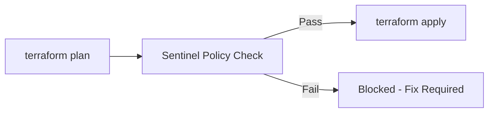

# How to Enforce Infrastructure Security with HashiCorp Sentinel Policies for GCP Terraform

Author: [nawazdhandala](https://www.github.com/nawazdhandala)

Tags: GCP, Terraform, HashiCorp Sentinel, Security, Infrastructure as Code

Description: Enforce security policies on your GCP Terraform configurations using HashiCorp Sentinel to prevent misconfigurations before they reach production.

---

Terraform makes it easy to provision infrastructure. Sometimes too easy. Without guardrails, a developer can accidentally create a public Cloud SQL instance, an overly permissive firewall rule, or a storage bucket without encryption - all with a single terraform apply.

HashiCorp Sentinel is a policy-as-code framework that integrates directly with Terraform Cloud and Terraform Enterprise. It lets you write policies that evaluate Terraform plans before they are applied, catching security violations before infrastructure is created.

In this post, I will show you how to write practical Sentinel policies for common GCP security requirements.

## How Sentinel Works with Terraform

Sentinel policies run between the plan and apply phases. When someone runs terraform plan, Sentinel evaluates the planned changes against your policies. If a policy fails, the apply is blocked.



Policies can be set to three enforcement levels:
- **advisory** - warns but does not block
- **soft-mandatory** - blocks but can be overridden by admins
- **hard-mandatory** - blocks with no override possible

## Setting Up Your Policy Structure

Organize your Sentinel policies by category. Here is a recommended structure:

```
sentinel/
  policies/
    gcp-networking.sentinel
    gcp-storage.sentinel
    gcp-compute.sentinel
    gcp-iam.sentinel
    gcp-database.sentinel
  test/
    gcp-networking/
      pass.hcl
      fail.hcl
    gcp-storage/
      pass.hcl
      fail.hcl
  sentinel.hcl
```

The root sentinel.hcl file defines which policies are active and their enforcement levels:

```hcl
# sentinel.hcl
# Policy configuration for GCP Terraform workspaces

policy "gcp-networking" {
  source            = "./policies/gcp-networking.sentinel"
  enforcement_level = "hard-mandatory"
}

policy "gcp-storage" {
  source            = "./policies/gcp-storage.sentinel"
  enforcement_level = "hard-mandatory"
}

policy "gcp-compute" {
  source            = "./policies/gcp-compute.sentinel"
  enforcement_level = "soft-mandatory"
}

policy "gcp-iam" {
  source            = "./policies/gcp-iam.sentinel"
  enforcement_level = "hard-mandatory"
}

policy "gcp-database" {
  source            = "./policies/gcp-database.sentinel"
  enforcement_level = "hard-mandatory"
}
```

## Networking Policies

This policy prevents creating firewall rules that allow traffic from the entire internet:

```python
# gcp-networking.sentinel
# Prevents overly permissive firewall rules in GCP

import "tfplan/v2" as tfplan

# Find all firewall rule resources in the plan
firewall_rules = filter tfplan.resource_changes as _, rc {
    rc.type is "google_compute_firewall" and
    rc.mode is "managed" and
    (rc.change.actions contains "create" or rc.change.actions contains "update")
}

# Block firewall rules that allow 0.0.0.0/0 as a source range
no_open_firewall_rules = rule {
    all firewall_rules as _, rule {
        all rule.change.after.source_ranges as range {
            range is not "0.0.0.0/0"
        }
    }
}

# Block firewall rules that allow all ports
no_all_ports_allowed = rule {
    all firewall_rules as _, rule {
        all rule.change.after.allow as allow_block {
            # Must specify explicit ports, not allow all
            length(allow_block.ports) > 0
        }
    }
}

# Block SSH from the internet (only allow from IAP range)
no_public_ssh = rule {
    all firewall_rules as _, rule {
        # If the rule allows TCP port 22
        not any rule.change.after.allow as allow_block {
            allow_block.protocol is "tcp" and
            "22" in allow_block.ports and
            "0.0.0.0/0" in rule.change.after.source_ranges
        }
    }
}

# Main rule that combines all checks
main = rule {
    no_open_firewall_rules and
    no_all_ports_allowed and
    no_public_ssh
}
```

## Storage Policies

Enforce encryption and access controls on Cloud Storage buckets:

```python
# gcp-storage.sentinel
# Enforces security settings on Cloud Storage buckets

import "tfplan/v2" as tfplan

# Find all storage bucket resources
storage_buckets = filter tfplan.resource_changes as _, rc {
    rc.type is "google_storage_bucket" and
    rc.mode is "managed" and
    (rc.change.actions contains "create" or rc.change.actions contains "update")
}

# All buckets must use customer-managed encryption keys
require_cmek = rule {
    all storage_buckets as _, bucket {
        bucket.change.after.encryption is not null and
        length(bucket.change.after.encryption) > 0
    }
}

# Uniform bucket-level access must be enabled
require_uniform_access = rule {
    all storage_buckets as _, bucket {
        bucket.change.after.uniform_bucket_level_access is true
    }
}

# Public access prevention must be enforced
require_public_access_prevention = rule {
    all storage_buckets as _, bucket {
        bucket.change.after.public_access_prevention is "enforced"
    }
}

# Versioning must be enabled for data protection
require_versioning = rule {
    all storage_buckets as _, bucket {
        bucket.change.after.versioning is not null and
        all bucket.change.after.versioning as v {
            v.enabled is true
        }
    }
}

main = rule {
    require_cmek and
    require_uniform_access and
    require_public_access_prevention and
    require_versioning
}
```

## IAM Policies

Prevent overly broad IAM assignments:

```python
# gcp-iam.sentinel
# Prevents dangerous IAM configurations

import "tfplan/v2" as tfplan

# Dangerous roles that should never be granted broadly
dangerous_roles = [
    "roles/owner",
    "roles/editor",
    "roles/iam.securityAdmin",
    "roles/iam.serviceAccountAdmin",
    "roles/resourcemanager.organizationAdmin",
]

# Find all IAM binding resources
iam_bindings = filter tfplan.resource_changes as _, rc {
    rc.type matches "google_.*_iam_binding" and
    rc.mode is "managed" and
    (rc.change.actions contains "create" or rc.change.actions contains "update")
}

iam_members = filter tfplan.resource_changes as _, rc {
    rc.type matches "google_.*_iam_member" and
    rc.mode is "managed" and
    (rc.change.actions contains "create" or rc.change.actions contains "update")
}

# Block granting dangerous roles
no_dangerous_role_bindings = rule {
    all iam_bindings as _, binding {
        binding.change.after.role not in dangerous_roles
    }
}

no_dangerous_role_members = rule {
    all iam_members as _, member {
        member.change.after.role not in dangerous_roles
    }
}

# Block granting roles to allUsers or allAuthenticatedUsers
no_public_iam = rule {
    all iam_bindings as _, binding {
        all binding.change.after.members as m {
            m is not "allUsers" and
            m is not "allAuthenticatedUsers"
        }
    }
}

main = rule {
    no_dangerous_role_bindings and
    no_dangerous_role_members and
    no_public_iam
}
```

## Database Policies

Ensure Cloud SQL instances meet security requirements:

```python
# gcp-database.sentinel
# Enforces security on Cloud SQL instances

import "tfplan/v2" as tfplan

# Find all Cloud SQL instance resources
sql_instances = filter tfplan.resource_changes as _, rc {
    rc.type is "google_sql_database_instance" and
    rc.mode is "managed" and
    (rc.change.actions contains "create" or rc.change.actions contains "update")
}

# No public IP addresses on database instances
no_public_ip = rule {
    all sql_instances as _, instance {
        all instance.change.after.settings as settings {
            all settings.ip_configuration as ip_config {
                ip_config.ipv4_enabled is false
            }
        }
    }
}

# SSL must be required for all connections
require_ssl = rule {
    all sql_instances as _, instance {
        all instance.change.after.settings as settings {
            all settings.ip_configuration as ip_config {
                ip_config.require_ssl is true
            }
        }
    }
}

# Automated backups must be enabled
require_backups = rule {
    all sql_instances as _, instance {
        all instance.change.after.settings as settings {
            all settings.backup_configuration as backup {
                backup.enabled is true
                backup.point_in_time_recovery_enabled is true
            }
        }
    }
}

main = rule {
    no_public_ip and
    require_ssl and
    require_backups
}
```

## Writing Tests

Every Sentinel policy should have tests. Here is an example test for the storage policy:

```hcl
# test/gcp-storage/pass.hcl
# Test case: Properly configured bucket should pass

mock "tfplan/v2" {
  module {
    source = "mock-tfplan-pass.sentinel"
  }
}

test {
  rules = {
    main = true
  }
}
```

```hcl
# test/gcp-storage/fail.hcl
# Test case: Public bucket without encryption should fail

mock "tfplan/v2" {
  module {
    source = "mock-tfplan-fail.sentinel"
  }
}

test {
  rules = {
    main = false
  }
}
```

Run tests locally before pushing:

```bash
# Run all Sentinel tests
sentinel test -run=gcp-storage

# Run all tests in verbose mode
sentinel test -verbose
```

## Integrating with Terraform Cloud

In Terraform Cloud, attach your policy set to the relevant workspaces:

```hcl
# terraform-cloud-policy-set.tf
# Attaches Sentinel policies to GCP workspaces

resource "tfe_policy_set" "gcp_security" {
  name         = "gcp-security-policies"
  description  = "Security policies for all GCP Terraform workspaces"
  organization = var.tfc_organization

  # Apply to all GCP workspaces
  workspace_ids = var.gcp_workspace_ids

  # Policies are stored in a VCS repository
  vcs_repo {
    identifier         = "myorg/terraform-sentinel-policies"
    branch             = "main"
    ingress_submodules = false
    oauth_token_id     = var.oauth_token_id
  }
}
```

## Wrapping Up

Sentinel policies are your safety net for Terraform. They catch the mistakes that code reviews miss and enforce standards consistently across every workspace. Start with hard-mandatory policies for the most dangerous misconfigurations - public databases, open firewalls, and overly broad IAM - then gradually expand your coverage. The goal is not to block developers but to give them fast feedback about what needs to change before infrastructure is created.
