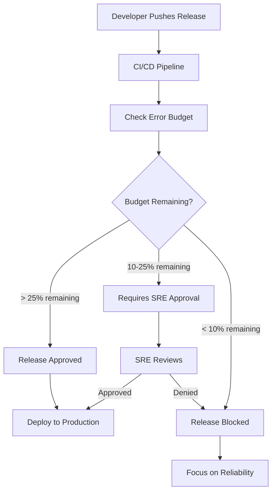

# How to Establish Error Budget Policies for Release Gating on Google Cloud

Author: [nawazdhandala](https://www.github.com/nawazdhandala)

Tags: GCP, SRE, Error Budget, Release Gating, SLO, Cloud Monitoring, Google Cloud

Description: Set up error budget policies that gate production releases based on SLO health, preventing deployments when reliability is already compromised.

---

The concept behind error budgets is simple: if your SLO says 99.9% availability, you have a 0.1% error budget. When that budget is spent, you stop shipping new features and focus on reliability. But implementing this as an actual automated gate in your release pipeline is where most teams get stuck. This guide shows you how to build error budget policies that automatically control your release velocity on Google Cloud.

## How Error Budget Gating Works

The idea is straightforward. Before every release, check how much error budget remains. If the budget is healthy, the release proceeds. If the budget is depleted or nearly depleted, the release is blocked until reliability recovers.



## Step 1: Define Your SLOs in Cloud Monitoring

First, set up SLOs that your error budget policies will reference:

```bash
# Create a Cloud Monitoring SLO for your service
# This example creates an availability SLO based on good/total request ratio
gcloud monitoring slos create \
    --project=your-project-id \
    --service=your-service-id \
    --display-name="API Availability SLO" \
    --goal=0.999 \
    --rolling-period-days=30 \
    --request-based-sli='{"goodTotalRatio":{"goodServiceFilter":"resource.type=\"cloud_run_revision\" AND metric.type=\"run.googleapis.com/request_count\" AND metric.labels.response_code_class=\"2xx\"","totalServiceFilter":"resource.type=\"cloud_run_revision\" AND metric.type=\"run.googleapis.com/request_count\""}}'
```

You can also create SLOs programmatically:

```python
# create_slos.py - Set up SLOs for error budget tracking
from google.cloud import monitoring_v3

client = monitoring_v3.ServiceMonitoringServiceClient()
project_name = "projects/your-project-id"

# Create a service first if it does not exist
service = client.create_service(
    parent=project_name,
    service=monitoring_v3.Service(
        display_name="API Service",
        custom=monitoring_v3.Service.Custom(),
    ),
    service_id="api-service",
)

# Create an availability SLO - 99.9% of requests should succeed
availability_slo = client.create_service_level_objective(
    parent=service.name,
    service_level_objective=monitoring_v3.ServiceLevelObjective(
        display_name="API Availability - 99.9%",
        goal=0.999,
        rolling_period={"seconds": 30 * 24 * 3600},  # 30-day rolling window
        service_level_indicator=monitoring_v3.ServiceLevelIndicator(
            request_based=monitoring_v3.RequestBasedSli(
                good_total_ratio=monitoring_v3.TimeSeriesRatio(
                    good_service_filter='resource.type="cloud_run_revision" AND metric.type="run.googleapis.com/request_count" AND metric.labels.response_code_class="2xx"',
                    total_service_filter='resource.type="cloud_run_revision" AND metric.type="run.googleapis.com/request_count"',
                ),
            ),
        ),
    ),
    service_level_objective_id="availability-slo",
)

# Create a latency SLO - 99% of requests under 500ms
latency_slo = client.create_service_level_objective(
    parent=service.name,
    service_level_objective=monitoring_v3.ServiceLevelObjective(
        display_name="API Latency - 99% under 500ms",
        goal=0.99,
        rolling_period={"seconds": 30 * 24 * 3600},
        service_level_indicator=monitoring_v3.ServiceLevelIndicator(
            request_based=monitoring_v3.RequestBasedSli(
                distribution_cut=monitoring_v3.DistributionCut(
                    distribution_filter='resource.type="cloud_run_revision" AND metric.type="run.googleapis.com/request_latencies"',
                    range=monitoring_v3.Range(max=500),  # 500ms threshold
                ),
            ),
        ),
    ),
    service_level_objective_id="latency-slo",
)

print(f"Availability SLO: {availability_slo.name}")
print(f"Latency SLO: {latency_slo.name}")
```

## Step 2: Build the Error Budget Checker

Create a module that queries current error budget status:

```python
# error_budget_checker.py - Query error budget status from Cloud Monitoring
from google.cloud import monitoring_v3
from google.protobuf import timestamp_pb2
from datetime import datetime, timedelta

client = monitoring_v3.ServiceMonitoringServiceClient()

def get_error_budget_status(project_id, service_id, slo_id):
    """Query the current error budget status for an SLO.
    Returns the remaining budget as a percentage and absolute values."""

    slo_name = f"projects/{project_id}/services/{service_id}/serviceLevelObjectives/{slo_id}"

    # Get the SLO definition to know the goal
    slo = client.get_service_level_objective(name=slo_name)
    goal = slo.goal

    # Query the current SLI performance over the rolling window
    now = datetime.utcnow()
    interval = monitoring_v3.TimeInterval(
        end_time=timestamp_pb2.Timestamp(seconds=int(now.timestamp())),
        start_time=timestamp_pb2.Timestamp(
            seconds=int((now - timedelta(days=30)).timestamp())
        ),
    )

    # Use the Monitoring API to get the SLO time series
    query_client = monitoring_v3.QueryServiceClient()

    # Calculate from SLO data
    # Total error budget = 1 - goal (e.g., 0.001 for 99.9%)
    total_budget = 1 - goal

    # Get the current SLI value from the time series
    # This is a simplified example - in practice, use the MQL or monitoring API
    sli_value = get_current_sli_value(project_id, service_id, slo_id)

    # Errors consumed = goal - actual SLI (if SLI < goal)
    errors_consumed = max(0, goal - sli_value)

    # Remaining budget
    budget_remaining = total_budget - errors_consumed
    budget_remaining_pct = (budget_remaining / total_budget) * 100 if total_budget > 0 else 0

    return {
        "slo_name": slo_id,
        "goal": goal,
        "current_sli": sli_value,
        "total_budget": total_budget,
        "budget_consumed": errors_consumed,
        "budget_remaining": budget_remaining,
        "budget_remaining_pct": round(budget_remaining_pct, 2),
        "is_budget_exhausted": budget_remaining <= 0,
    }


def get_current_sli_value(project_id, service_id, slo_id):
    """Get the current SLI value using the Monitoring Query Language.
    Returns the ratio of good events to total events over the SLO window."""

    query_client = monitoring_v3.QueryServiceClient()

    # MQL query to get the current SLI
    query = f"""
    fetch cloud_run_revision
    | metric 'run.googleapis.com/request_count'
    | align rate(1m)
    | every 1m
    | group_by [], [
        good: sum(val()).filter(metric.response_code_class = '2xx'),
        total: sum(val())
    ]
    """

    # Simplified - in production use the API properly
    # Return a mock value for illustration
    return 0.9995  # 99.95% current SLI
```

## Step 3: Implement the Release Gate

Create the release gate that integrates with your CI/CD pipeline:

```python
# release_gate.py - Error budget-based release gate
import json
from datetime import datetime

class ReleaseGate:
    """Controls release approvals based on error budget status.
    Enforces three tiers: auto-approve, require approval, and block."""

    def __init__(self, project_id, service_id, slos):
        self.project_id = project_id
        self.service_id = service_id
        self.slos = slos  # List of SLO IDs to check

        # Policy thresholds - customize these for your org
        self.policy = {
            "auto_approve_threshold": 25,   # Auto-approve if > 25% budget remaining
            "approval_required_threshold": 10,  # Require SRE approval between 10-25%
            "block_threshold": 10,          # Block releases if < 10% remaining
        }

    def check_release(self, release_name, release_type="standard"):
        """Check if a release should be allowed based on current error budgets.
        Returns a decision with reasoning."""

        budget_statuses = []
        for slo_id in self.slos:
            status = get_error_budget_status(
                self.project_id, self.service_id, slo_id
            )
            budget_statuses.append(status)

        # The release decision is based on the worst-case SLO
        min_budget = min(s["budget_remaining_pct"] for s in budget_statuses)
        worst_slo = min(budget_statuses, key=lambda s: s["budget_remaining_pct"])

        # Determine the decision
        if min_budget > self.policy["auto_approve_threshold"]:
            decision = "approved"
            reason = f"Error budget healthy at {min_budget:.1f}% remaining"
        elif min_budget > self.policy["block_threshold"]:
            decision = "approval_required"
            reason = f"Error budget at {min_budget:.1f}% - SRE approval required"
        else:
            decision = "blocked"
            reason = f"Error budget depleted at {min_budget:.1f}% for SLO '{worst_slo['slo_name']}'"

        # Emergency releases can bypass the gate with documentation
        if release_type == "emergency" and decision == "blocked":
            decision = "approval_required"
            reason += " - Emergency release requires VP approval"

        result = {
            "release_name": release_name,
            "decision": decision,
            "reason": reason,
            "timestamp": datetime.utcnow().isoformat(),
            "budget_statuses": budget_statuses,
            "min_budget_remaining_pct": min_budget,
        }

        return result

    def log_decision(self, result):
        """Log the release gate decision for audit trail."""
        print(f"\nRelease Gate Decision: {result['release_name']}")
        print(f"  Decision: {result['decision'].upper()}")
        print(f"  Reason: {result['reason']}")
        print(f"  Error Budgets:")
        for status in result['budget_statuses']:
            print(f"    {status['slo_name']}: {status['budget_remaining_pct']:.1f}% remaining")
```

## Step 4: Integrate with Cloud Build

Add the error budget check as a step in your Cloud Build pipeline:

```yaml
# cloudbuild.yaml - CI/CD pipeline with error budget gate
steps:
  # Step 1: Run tests
  - name: 'python:3.11'
    entrypoint: 'bash'
    args:
      - '-c'
      - 'pip install -r requirements.txt && pytest tests/'

  # Step 2: Build the container
  - name: 'gcr.io/cloud-builders/docker'
    args: ['build', '-t', 'gcr.io/$PROJECT_ID/my-service:$SHORT_SHA', '.']

  # Step 3: Check error budget before deploying
  - name: 'python:3.11'
    entrypoint: 'python'
    args: ['scripts/check_error_budget.py', '--release-name=$SHORT_SHA']
    env:
      - 'PROJECT_ID=$PROJECT_ID'

  # Step 4: Deploy (only runs if error budget check passes)
  - name: 'gcr.io/cloud-builders/gcloud'
    args:
      - 'run'
      - 'deploy'
      - 'my-service'
      - '--image=gcr.io/$PROJECT_ID/my-service:$SHORT_SHA'
      - '--region=us-central1'
```

The error budget check script:

```python
# scripts/check_error_budget.py - Cloud Build error budget gate
import sys
import os
import argparse

def main():
    parser = argparse.ArgumentParser()
    parser.add_argument("--release-name", required=True)
    args = parser.parse_args()

    project_id = os.environ.get("PROJECT_ID")

    gate = ReleaseGate(
        project_id=project_id,
        service_id="api-service",
        slos=["availability-slo", "latency-slo"],
    )

    result = gate.check_release(args.release_name)
    gate.log_decision(result)

    if result["decision"] == "blocked":
        print("\nRelease BLOCKED - error budget depleted")
        print("Fix reliability issues before releasing new features")
        sys.exit(1)  # Fail the build
    elif result["decision"] == "approval_required":
        print("\nRelease requires manual SRE approval")
        # In practice, send a Slack notification or create a ticket
        # For now, proceed but log the warning
        sys.exit(0)
    else:
        print("\nRelease APPROVED - error budget healthy")
        sys.exit(0)

if __name__ == "__main__":
    main()
```

## Step 5: Set Up Error Budget Alerts

Create alerts that fire as the error budget gets consumed:

```python
# Create tiered alerts for error budget consumption
from google.cloud import monitoring_v3

alert_client = monitoring_v3.AlertPolicyServiceClient()

def create_error_budget_alert(project_id, slo_name, threshold_pct, severity):
    """Create an alert that fires when error budget drops below a threshold."""

    policy = monitoring_v3.AlertPolicy(
        display_name=f"Error Budget Alert - {threshold_pct}% remaining",
        conditions=[
            monitoring_v3.AlertPolicy.Condition(
                display_name=f"Error budget below {threshold_pct}%",
                condition_threshold=monitoring_v3.AlertPolicy.Condition.MetricThreshold(
                    filter=f'select_slo_budget_fraction("{slo_name}")',
                    comparison=monitoring_v3.ComparisonType.COMPARISON_LT,
                    threshold_value=threshold_pct / 100.0,
                    duration={"seconds": 0},
                    trigger=monitoring_v3.AlertPolicy.Condition.Trigger(count=1),
                ),
            ),
        ],
        notification_channels=["projects/your-project-id/notificationChannels/CHANNEL_ID"],
        severity=severity,
    )

    result = alert_client.create_alert_policy(
        parent=f"projects/{project_id}",
        alert_policy=policy,
    )
    return result

# Create tiered alerts
create_error_budget_alert("your-project-id", "slo-name", 50, "WARNING")
create_error_budget_alert("your-project-id", "slo-name", 25, "ERROR")
create_error_budget_alert("your-project-id", "slo-name", 10, "CRITICAL")
```

## Step 6: Error Budget Reporting

Create a weekly error budget report for stakeholders:

```sql
-- Weekly error budget consumption report
-- Track how quickly error budget is being consumed
SELECT
    week,
    slo_name,
    budget_remaining_pct,
    budget_consumed_this_week,
    releases_this_week,
    releases_blocked_this_week
FROM `your-project.sre_metrics.weekly_error_budget_report`
ORDER BY week DESC, slo_name;
```

## Monitoring the Gate Itself

Use OneUptime to monitor your error budget checking infrastructure. If the release gate itself is down, releases either get blocked unnecessarily or bypass the gate entirely. Both outcomes are bad. Monitor the availability of your Cloud Monitoring queries, the gate function, and the notification channels.

## Summary

Error budget policies turn the abstract concept of reliability targets into concrete release decisions. The key components are well-defined SLOs in Cloud Monitoring, an automated gate that checks budget status before each release, tiered policies (auto-approve, require approval, block), and alerting that warns you as budgets get consumed. Start with a single critical SLO, implement the gate in your CI/CD pipeline, and expand to more SLOs as your team gets comfortable with the process.
