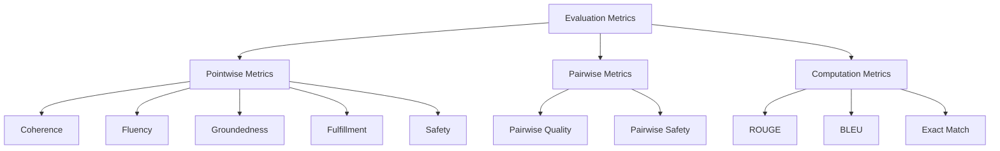

# How to Evaluate Generative AI Models Using Vertex AI Gen AI Evaluation Service

Author: [nawazdhandala](https://www.github.com/nawazdhandala)

Tags: GCP, Vertex AI, Model Evaluation, Generative AI, LLM

Description: Learn how to use Vertex AI Gen AI Evaluation Service to systematically evaluate generative AI models with built-in metrics and custom criteria.

---

Shipping a generative AI feature without proper evaluation is like deploying code without tests - it might work, but you have no way to know when it breaks. The Vertex AI Gen AI Evaluation Service gives you a structured way to measure model quality, compare different approaches, and catch regressions before they reach users. In this post, I will walk through how to set it up and use it effectively.

## Why You Need Systematic Evaluation

Every team I have worked with that skips formal evaluation ends up regretting it. You fine-tune a prompt, it seems better on three examples, you ship it, and then users start complaining about edge cases you never tested. Systematic evaluation catches these issues by running your model against a curated dataset and scoring the outputs on multiple dimensions.

The Vertex AI Evaluation Service provides both automatic metrics (computed by an LLM judge) and pointwise/pairwise evaluation modes. You can measure things like coherence, fluency, groundedness, safety, and custom criteria specific to your use case.

## Setting Up the Evaluation Environment

First, install the required packages and configure your project.

This code sets up your environment for running evaluations:

```python
# Install the evaluation dependencies
# pip install google-cloud-aiplatform[evaluation]

import vertexai
from vertexai.evaluation import EvalTask, MetricPromptTemplateExamples
from vertexai.generative_models import GenerativeModel
import pandas as pd

# Initialize Vertex AI
vertexai.init(project="your-project-id", location="us-central1")
```

## Preparing Your Evaluation Dataset

The evaluation dataset is the foundation of any good eval. It should represent the kinds of inputs your model will see in production, including edge cases and tricky examples. Each row needs at minimum an input prompt, and optionally a reference (ground truth) answer.

Here is how to create an evaluation dataset:

```python
# Create an evaluation dataset as a pandas DataFrame
# Each row represents one test case
eval_dataset = pd.DataFrame({
    "prompt": [
        "Explain what a load balancer does in simple terms.",
        "What is the difference between TCP and UDP?",
        "How does DNS resolution work step by step?",
        "Explain containerization to a non-technical manager.",
        "What causes a 502 Bad Gateway error?",
    ],
    "reference": [
        "A load balancer distributes incoming network traffic across multiple servers to ensure no single server is overwhelmed, improving reliability and performance.",
        "TCP is connection-oriented and guarantees delivery order, while UDP is connectionless and faster but does not guarantee delivery.",
        "DNS resolution translates domain names to IP addresses through a series of queries from recursive resolvers to root, TLD, and authoritative nameservers.",
        "Containerization packages an application with all its dependencies into a standardized unit that runs consistently across any environment.",
        "A 502 Bad Gateway error occurs when a server acting as a gateway receives an invalid response from an upstream server.",
    ]
})
```

## Running a Basic Evaluation

The simplest evaluation measures built-in metrics against your dataset. Let me show you how to evaluate a model on coherence and fluency.

This code runs a pointwise evaluation with standard metrics:

```python
# Define the model to evaluate
model = GenerativeModel("gemini-2.0-flash")

# Create an evaluation task with built-in metrics
eval_task = EvalTask(
    dataset=eval_dataset,
    metrics=[
        "coherence",       # How logically consistent is the response
        "fluency",         # How natural and readable is the response
        "groundedness",    # How well grounded in factual information
        "fulfillment",     # How well the response fulfills the prompt
    ],
    experiment="networking-explainer-eval-v1"
)

# Run the evaluation
result = eval_task.evaluate(model=model)

# Print summary metrics
print("Summary Metrics:")
for metric_name, value in result.summary_metrics.items():
    print(f"  {metric_name}: {value:.3f}")
```

## Understanding Evaluation Metrics

The evaluation service provides several categories of metrics. Here is how they break down:



Pointwise metrics evaluate each response independently. Pairwise metrics compare responses from two different models or prompts. Computation metrics like ROUGE and BLEU use algorithmic scoring rather than LLM judges.

## Using Reference-Based Metrics

When you have ground truth answers, you can use reference-based metrics for more precise evaluation.

This code runs evaluation with ROUGE scores comparing against reference answers:

```python
# Evaluation with computation-based metrics that use reference answers
eval_task_with_refs = EvalTask(
    dataset=eval_dataset,
    metrics=[
        "rouge_l_sum",    # Longest common subsequence overlap with reference
        "bleu",           # N-gram precision compared to reference
        "fulfillment",    # LLM-judged fulfillment of the prompt
    ],
    experiment="networking-explainer-rouge-eval"
)

result = eval_task_with_refs.evaluate(model=model)

# Examine per-example results
metrics_table = result.metrics_table
print(metrics_table[["prompt", "rouge_l_sum", "bleu", "fulfillment"]].to_string())
```

## Creating Custom Evaluation Criteria

Built-in metrics are a great start, but most applications need custom criteria. Maybe you want to check if responses follow a specific format, use appropriate technical depth, or avoid certain topics.

Here is how to define a custom metric:

```python
from vertexai.evaluation import PointwiseMetric

# Define a custom metric for technical accuracy
technical_accuracy = PointwiseMetric(
    metric="technical_accuracy",
    metric_prompt_template="""You are an expert evaluator for technical content.

Evaluate the following response for technical accuracy.

# User Prompt
{prompt}

# AI Response
{response}

# Evaluation Criteria
Rate the technical accuracy of the response on a scale of 1-5:
1 - Contains significant technical errors
2 - Contains some inaccuracies that could mislead readers
3 - Mostly accurate with minor imprecisions
4 - Accurate with good technical detail
5 - Highly accurate, precise, and technically rigorous

Provide your rating and a brief justification.
"""
)

# Use the custom metric in evaluation
eval_task_custom = EvalTask(
    dataset=eval_dataset,
    metrics=[technical_accuracy, "coherence", "fluency"],
    experiment="custom-accuracy-eval"
)

result = eval_task_custom.evaluate(model=model)
```

## Comparing Two Models with Pairwise Evaluation

Pairwise evaluation is powerful when you need to decide between two model configurations. Instead of scoring each independently, the judge model directly compares their outputs.

This code runs a pairwise comparison:

```python
from vertexai.evaluation import PairwiseMetric

# Define a pairwise comparison metric
pairwise_quality = PairwiseMetric(
    metric="pairwise_quality",
    metric_prompt_template=MetricPromptTemplateExamples.get_prompt_template(
        "pairwise_question_answering_quality"
    )
)

# Prepare dataset with responses from both models
baseline_model = GenerativeModel("gemini-1.5-flash")
candidate_model = GenerativeModel("gemini-2.0-flash")

# Generate responses from both models
responses_baseline = []
responses_candidate = []
for _, row in eval_dataset.iterrows():
    responses_baseline.append(
        baseline_model.generate_content(row["prompt"]).text
    )
    responses_candidate.append(
        candidate_model.generate_content(row["prompt"]).text
    )

eval_dataset["baseline_model_response"] = responses_baseline
eval_dataset["response"] = responses_candidate

# Run pairwise evaluation
pairwise_task = EvalTask(
    dataset=eval_dataset,
    metrics=[pairwise_quality],
    experiment="model-comparison-v1"
)

result = pairwise_task.evaluate()
```

## Evaluating with Prompt Variations

One of the most practical uses of evaluation is testing prompt changes. You can evaluate the same model with different system instructions or prompt templates.

```python
# Define two prompt templates to compare
prompt_v1 = "Answer the following technical question concisely: {question}"
prompt_v2 = """You are a senior cloud engineer. Answer the following question
with practical examples and clear explanations. Question: {question}"""

# Create datasets with each prompt applied
dataset_v1 = eval_dataset.copy()
dataset_v1["prompt"] = dataset_v1["prompt"].apply(
    lambda q: prompt_v1.format(question=q)
)

dataset_v2 = eval_dataset.copy()
dataset_v2["prompt"] = dataset_v2["prompt"].apply(
    lambda q: prompt_v2.format(question=q)
)

# Evaluate both
for version, dataset in [("v1", dataset_v1), ("v2", dataset_v2)]:
    task = EvalTask(
        dataset=dataset,
        metrics=["coherence", "fulfillment", technical_accuracy],
        experiment=f"prompt-{version}-eval"
    )
    result = task.evaluate(model=model)
    print(f"\nPrompt {version} results:")
    for k, v in result.summary_metrics.items():
        print(f"  {k}: {v:.3f}")
```

## Automating Evaluation in CI/CD

Evaluation should not be a one-time thing. Set up automated evaluation runs whenever you change prompts, update models, or modify your application logic. You can integrate eval runs into your CI/CD pipeline and fail the build if metrics drop below thresholds.

```python
# Define minimum acceptable thresholds
THRESHOLDS = {
    "coherence/mean": 4.0,
    "fulfillment/mean": 3.5,
    "fluency/mean": 4.0,
}

def check_eval_results(result):
    """Check if evaluation results meet minimum thresholds."""
    failures = []
    for metric, threshold in THRESHOLDS.items():
        actual = result.summary_metrics.get(metric, 0)
        if actual < threshold:
            failures.append(
                f"{metric}: {actual:.3f} < {threshold:.3f}"
            )
    if failures:
        print("EVALUATION FAILED:")
        for f in failures:
            print(f"  - {f}")
        return False
    print("All metrics passed.")
    return True
```

## Wrapping Up

Model evaluation is not optional for production generative AI. The Vertex AI Gen AI Evaluation Service makes it straightforward to measure quality, compare approaches, and catch regressions. Start with built-in metrics, add custom criteria for your specific use case, and automate the whole thing in your deployment pipeline. Your future self will thank you when that prompt change does not silently degrade your application. For ongoing monitoring of model performance in production, consider pairing evaluation with real-time observability tools like OneUptime.
