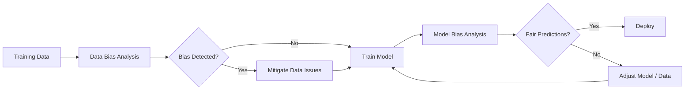

# How to Evaluate Model Fairness with Vertex AI Data Bias and Model Bias Metrics

Author: [nawazdhandala](https://www.github.com/nawazdhandala)

Tags: GCP, Vertex AI, Model Fairness, Bias Detection, Responsible AI, Machine Learning, Google Cloud

Description: Learn how to evaluate and measure ML model fairness using Vertex AI's data bias and model bias metrics to build equitable machine learning systems.

---

Building an ML model that performs well on aggregate metrics is not enough. A loan approval model with 95% accuracy might still systematically deny qualified applicants from certain demographic groups. A hiring model might score candidates differently based on gender-correlated features. Vertex AI provides tools to detect and measure these biases at both the data level and the model prediction level. This guide walks through how to use them.

## Understanding Two Types of Bias

**Data bias** exists in your training data before any model is trained. It shows up as imbalanced representation, historical discrimination baked into labels, or features that serve as proxies for protected attributes.

**Model bias** (or prediction bias) shows up in how the trained model treats different groups. Even with balanced training data, a model can amplify small biases through its learned patterns.



## Step 1: Analyze Data Bias

Before training, examine your dataset for representation issues:

```python
# data_bias_analysis.py - Analyze training data for bias
import pandas as pd
from google.cloud import bigquery

bq_client = bigquery.Client(project="your-project-id")

# Load your training data
query = """
SELECT *
FROM `your-project.ml_data.loan_applications`
"""
df = bq_client.query(query).to_dataframe()

def analyze_representation(df, sensitive_column, target_column):
    """Check how a sensitive attribute is distributed across outcomes.
    Imbalanced representation indicates potential data bias."""

    # Overall distribution of the sensitive attribute
    print(f"\n--- Distribution of {sensitive_column} ---")
    print(df[sensitive_column].value_counts(normalize=True).round(3))

    # Distribution of outcomes per group
    print(f"\n--- {target_column} rate by {sensitive_column} ---")
    outcome_rates = df.groupby(sensitive_column)[target_column].mean().round(3)
    print(outcome_rates)

    # Check for class imbalance within groups
    print(f"\n--- Sample count by {sensitive_column} ---")
    print(df.groupby(sensitive_column).size())

    return outcome_rates

# Analyze key sensitive attributes
gender_rates = analyze_representation(df, "gender", "approved")
age_rates = analyze_representation(df, "age_group", "approved")
race_rates = analyze_representation(df, "race_ethnicity", "approved")
```

## Step 2: Compute Fairness Metrics on Data

Calculate standard fairness metrics before training:

```python
# fairness_metrics.py - Compute pre-training fairness metrics
import numpy as np

def compute_data_fairness_metrics(df, sensitive_col, target_col, privileged_value):
    """Compute standard data bias metrics comparing privileged vs. unprivileged groups.
    Returns metrics that quantify how different groups are treated in the data."""

    privileged = df[df[sensitive_col] == privileged_value]
    unprivileged = df[df[sensitive_col] != privileged_value]

    # Disparate Impact: ratio of positive outcome rates
    # A value of 1.0 means perfect parity; below 0.8 is often considered problematic
    priv_rate = privileged[target_col].mean()
    unpriv_rate = unprivileged[target_col].mean()
    disparate_impact = unpriv_rate / priv_rate if priv_rate > 0 else 0

    # Statistical Parity Difference: difference in positive outcome rates
    # 0 means perfect parity; negative means unprivileged group is disadvantaged
    stat_parity_diff = unpriv_rate - priv_rate

    # Class Imbalance: difference in group sizes
    priv_fraction = len(privileged) / len(df)
    class_imbalance = priv_fraction - 0.5  # 0 means equal representation

    metrics = {
        "privileged_positive_rate": round(priv_rate, 4),
        "unprivileged_positive_rate": round(unpriv_rate, 4),
        "disparate_impact": round(disparate_impact, 4),
        "statistical_parity_difference": round(stat_parity_diff, 4),
        "class_imbalance": round(class_imbalance, 4),
    }

    return metrics

# Example: Analyze gender bias in loan approvals
metrics = compute_data_fairness_metrics(
    df, sensitive_col="gender", target_col="approved", privileged_value="male"
)

print("\nData Fairness Metrics (Gender):")
for name, value in metrics.items():
    print(f"  {name}: {value}")

# Flag concerning values
if metrics["disparate_impact"] < 0.8:
    print("\n  WARNING: Disparate impact below 0.8 threshold - significant bias detected")
```

## Step 3: Use Vertex AI Model Evaluation for Bias

After training your model, use Vertex AI's built-in evaluation to measure prediction bias across slices:

```python
from google.cloud import aiplatform

aiplatform.init(project="your-project-id", location="us-central1")

# Assuming you have a trained model
model = aiplatform.Model(model_name="projects/your-project-id/locations/us-central1/models/YOUR_MODEL_ID")

# Create a batch prediction job with the test set
batch_job = model.batch_predict(
    job_display_name="fairness-evaluation",
    bigquery_source="bq://your-project.ml_data.test_set",
    bigquery_destination_prefix="bq://your-project.ml_data",
    instances_format="bigquery",
    predictions_format="bigquery",
)
batch_job.wait()
```

Then analyze the predictions for bias:

```python
# Analyze model predictions for bias across groups
def evaluate_model_fairness(predictions_df, sensitive_col, true_label_col, pred_col, privileged_value):
    """Evaluate fairness of model predictions across demographic groups.
    Computes post-training bias metrics that reveal discriminatory patterns."""

    privileged = predictions_df[predictions_df[sensitive_col] == privileged_value]
    unprivileged = predictions_df[predictions_df[sensitive_col] != privileged_value]

    # Equal Opportunity: true positive rate should be equal across groups
    priv_tpr = privileged[privileged[true_label_col] == 1][pred_col].mean()
    unpriv_tpr = unprivileged[unprivileged[true_label_col] == 1][pred_col].mean()
    equal_opportunity_diff = unpriv_tpr - priv_tpr

    # Predictive Parity: precision should be equal across groups
    priv_precision = (
        privileged[(privileged[pred_col] >= 0.5) & (privileged[true_label_col] == 1)].shape[0]
        / max(privileged[privileged[pred_col] >= 0.5].shape[0], 1)
    )
    unpriv_precision = (
        unprivileged[(unprivileged[pred_col] >= 0.5) & (unprivileged[true_label_col] == 1)].shape[0]
        / max(unprivileged[unprivileged[pred_col] >= 0.5].shape[0], 1)
    )
    predictive_parity_diff = unpriv_precision - priv_precision

    # Demographic Parity: prediction positive rate across groups
    priv_positive_rate = (privileged[pred_col] >= 0.5).mean()
    unpriv_positive_rate = (unprivileged[pred_col] >= 0.5).mean()
    demographic_parity_diff = unpriv_positive_rate - priv_positive_rate

    return {
        "equal_opportunity_difference": round(equal_opportunity_diff, 4),
        "predictive_parity_difference": round(predictive_parity_diff, 4),
        "demographic_parity_difference": round(demographic_parity_diff, 4),
        "privileged_positive_prediction_rate": round(priv_positive_rate, 4),
        "unprivileged_positive_prediction_rate": round(unpriv_positive_rate, 4),
    }

# Load predictions and evaluate
predictions_df = bq_client.query(
    "SELECT * FROM `your-project.ml_data.predictions`"
).to_dataframe()

fairness = evaluate_model_fairness(
    predictions_df, "gender", "approved", "predicted_score", "male"
)

print("\nModel Fairness Metrics (Gender):")
for name, value in fairness.items():
    print(f"  {name}: {value}")
```

## Step 4: Slice-Based Evaluation

Evaluate model performance across intersectional groups:

```sql
-- Evaluate model accuracy across demographic slices
SELECT
    gender,
    age_group,
    COUNT(*) AS sample_count,
    -- Accuracy per slice
    ROUND(COUNTIF(
        (predicted_score >= 0.5 AND approved = 1) OR
        (predicted_score < 0.5 AND approved = 0)
    ) / COUNT(*), 4) AS accuracy,
    -- True positive rate per slice
    ROUND(COUNTIF(predicted_score >= 0.5 AND approved = 1)
        / NULLIF(COUNTIF(approved = 1), 0), 4) AS true_positive_rate,
    -- False positive rate per slice
    ROUND(COUNTIF(predicted_score >= 0.5 AND approved = 0)
        / NULLIF(COUNTIF(approved = 0), 0), 4) AS false_positive_rate,
    -- Average predicted score
    ROUND(AVG(predicted_score), 4) AS avg_predicted_score
FROM `your-project.ml_data.predictions`
GROUP BY gender, age_group
HAVING sample_count >= 50  -- Only include slices with enough samples
ORDER BY true_positive_rate ASC;
```

## Step 5: Mitigation Strategies

When you detect bias, here are practical approaches:

**Rebalancing training data:**
```python
# Oversample underrepresented groups to balance the training set
from sklearn.utils import resample

def rebalance_dataset(df, sensitive_col, target_col):
    """Oversample minority groups to achieve equal representation.
    This helps when data bias stems from underrepresentation."""

    groups = df.groupby([sensitive_col, target_col])
    max_size = groups.size().max()

    balanced_parts = []
    for (group_val, target_val), group_df in groups:
        if len(group_df) < max_size:
            oversampled = resample(group_df, replace=True, n_samples=max_size, random_state=42)
            balanced_parts.append(oversampled)
        else:
            balanced_parts.append(group_df)

    return pd.concat(balanced_parts).reset_index(drop=True)
```

**Threshold adjustment per group:**
```python
# Adjust decision thresholds to equalize true positive rates
def find_fair_thresholds(predictions_df, sensitive_col, pred_col, true_col, target_tpr=0.8):
    """Find per-group thresholds that achieve equal true positive rates.
    This post-processing approach does not require retraining."""

    thresholds = {}
    for group in predictions_df[sensitive_col].unique():
        group_df = predictions_df[predictions_df[sensitive_col] == group]
        positives = group_df[group_df[true_col] == 1]

        # Binary search for the threshold that achieves the target TPR
        low, high = 0.0, 1.0
        for _ in range(100):
            mid = (low + high) / 2
            tpr = (positives[pred_col] >= mid).mean()
            if tpr > target_tpr:
                low = mid
            else:
                high = mid

        thresholds[group] = round(mid, 4)

    return thresholds
```

## Monitoring Fairness in Production

Fairness is not a one-time check. Data distributions shift, and model behavior can drift. Set up ongoing monitoring:

```python
# Schedule weekly fairness metric computation
# Store results in BigQuery for trend analysis
def weekly_fairness_check():
    """Compute fairness metrics on the past week's predictions."""
    query = """
    SELECT * FROM `your-project.ml_data.production_predictions`
    WHERE prediction_timestamp > TIMESTAMP_SUB(CURRENT_TIMESTAMP(), INTERVAL 7 DAY)
    """
    recent_predictions = bq_client.query(query).to_dataframe()

    for sensitive_attr in ["gender", "age_group", "race_ethnicity"]:
        metrics = evaluate_model_fairness(
            recent_predictions, sensitive_attr, "actual_outcome", "predicted_score", "privileged_value"
        )
        # Store metrics and alert if thresholds are crossed
        store_fairness_metrics(sensitive_attr, metrics)
```

Use OneUptime to monitor not just model availability but also fairness metric trends. Set alerts for when any fairness metric crosses your defined threshold, so your team can investigate and respond before biased predictions accumulate.

## Summary

Evaluating model fairness requires looking at both data-level bias and prediction-level bias. Vertex AI provides the infrastructure to compute these metrics at scale, but the decisions about which metrics matter, what thresholds are acceptable, and how to mitigate detected biases require human judgment and domain expertise. Build fairness evaluation into your ML pipeline from the start - it is much harder to retrofit after deployment.
