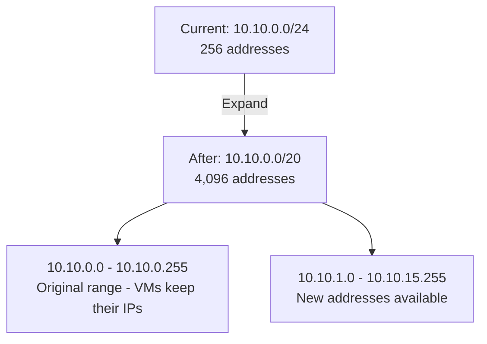

# How to Expand Subnet IP Ranges Without Downtime in a GCP VPC

Author: [nawazdhandala](https://www.github.com/nawazdhandala)

Tags: GCP, VPC, Subnets, IP Ranges, Networking

Description: Learn how to expand subnet IP ranges in GCP without downtime, including prerequisites, step-by-step commands, and what to check before and after expanding to avoid networking conflicts.

---

You planned your subnet with a /24 giving you 251 usable IPs. Six months later, your team has deployed enough VMs, GKE nodes, and internal load balancers to use up most of those addresses. New deployments are failing because there are no available IPs left.

The good news is that GCP allows you to expand subnet IP ranges in place, without downtime. Existing VMs keep their IP addresses, traffic continues flowing, and the new addresses become available immediately. In this post, I will walk through the process, the constraints, and what to verify before and after.

## How Subnet Expansion Works

When you expand a subnet, you are changing the CIDR prefix length to a shorter one, which includes more IP addresses. For example, expanding from 10.10.0.0/24 (256 IPs) to 10.10.0.0/20 (4,096 IPs).

The key constraints:
- You can only make the range larger, never smaller
- The new range must be a superset of the current range (same base address)
- The expanded range must not overlap with other subnets in the same VPC or peered VPCs
- The operation is immediate and causes no downtime



## Before Expanding: Pre-Flight Checks

### Check Current Usage

See how the current range is being used:

```bash
# Describe the subnet to see its current range
gcloud compute networks subnets describe my-subnet \
  --region=us-central1 \
  --format="yaml(ipCidrRange, secondaryIpRanges, gatewayAddress)"
```

```bash
# List all instances using this subnet to gauge utilization
gcloud compute instances list \
  --filter="networkInterfaces[].subnetwork:my-subnet" \
  --format="table(name, zone, networkInterfaces[0].networkIP)"
```

### Check for Overlaps

The expanded range must not conflict with other subnets or peered network ranges. This is the most important check:

```bash
# List all subnets in the VPC to check for potential overlaps
gcloud compute networks subnets list \
  --network=production-vpc \
  --format="table(name, region, ipCidrRange)"
```

For example, if you want to expand 10.10.0.0/24 to 10.10.0.0/20, the new range covers 10.10.0.0 through 10.10.15.255. Make sure no other subnet uses any addresses in that expanded range.

Also check peered networks:

```bash
# List routes from peered networks to check for overlapping ranges
gcloud compute routes list \
  --filter="network=production-vpc AND nextHopPeering:*" \
  --format="table(name, destRange, nextHopPeering)"
```

And Private Service Access allocations:

```bash
# Check PSA ranges for potential conflicts
gcloud compute addresses list --global \
  --filter="purpose=VPC_PEERING AND network:production-vpc" \
  --format="table(name, address, prefixLength)"
```

### Determine the New Prefix Length

Figure out how many IPs you need and pick the right prefix length:

| Current | Expanded To | Additional IPs |
|---------|-------------|---------------|
| /24 (256) | /22 (1,024) | 768 more |
| /24 (256) | /20 (4,096) | 3,840 more |
| /22 (1,024) | /20 (4,096) | 3,072 more |
| /20 (4,096) | /18 (16,384) | 12,288 more |
| /20 (4,096) | /16 (65,536) | 61,440 more |

I recommend expanding to at least double your current needs. Running out of IPs again in six months means going through this process again and potentially dealing with fewer expansion options.

## Performing the Expansion

The actual expansion is a single command:

```bash
# Expand the subnet from /24 to /20
gcloud compute networks subnets expand-ip-range my-subnet \
  --region=us-central1 \
  --prefix-length=20
```

That is it. The command completes in seconds. No downtime, no VM restarts, no reconfiguration needed.

## Verifying the Expansion

After expanding, verify everything looks correct:

```bash
# Confirm the new range
gcloud compute networks subnets describe my-subnet \
  --region=us-central1 \
  --format="yaml(ipCidrRange, gatewayAddress)"
```

Check that existing VMs still have their original IPs:

```bash
# Verify existing VM IPs have not changed
gcloud compute instances list \
  --filter="networkInterfaces[].subnetwork:my-subnet" \
  --format="table(name, networkInterfaces[0].networkIP, status)"
```

Test connectivity from an existing VM:

```bash
# SSH into a VM and verify networking still works
gcloud compute ssh my-vm --zone=us-central1-a --tunnel-through-iap

# Test outbound connectivity
curl -s https://storage.googleapis.com

# Test internal connectivity
ping -c 3 10.10.0.10
```

## Updating Firewall Rules

If your firewall rules reference the subnet's old CIDR range explicitly, you need to update them:

```bash
# Check if any firewall rules reference the old /24 range
gcloud compute firewall-rules list \
  --filter="network=production-vpc AND (sourceRanges:10.10.0.0/24 OR destinationRanges:10.10.0.0/24)" \
  --format="table(name, sourceRanges, destinationRanges)"
```

Update any rules that use the old range:

```bash
# Update the firewall rule to use the new expanded range
gcloud compute firewall-rules update allow-internal-traffic \
  --source-ranges=10.10.0.0/20
```

If your firewall rules reference a broader range that already includes the expanded subnet (like 10.0.0.0/8), no updates are needed.

## Updating Cloud NAT and Cloud Router

If you use Cloud NAT, check that it covers the expanded range:

```bash
# Check Cloud NAT configuration
gcloud compute routers nats describe my-nat-config \
  --router=my-router \
  --region=us-central1
```

If NAT is configured with `--nat-all-subnet-ip-ranges`, it automatically picks up the expanded range. If you specified subnets manually, you may need to update the configuration.

## Updating VPC Peering

If this subnet is in a VPC that peers with other networks, the peered networks automatically learn the new, larger route. Verify this from the peer side:

```bash
# On the peered network, check that the route has been updated
gcloud compute routes list \
  --project=peer-project \
  --filter="network=peer-vpc AND nextHopPeering:*" \
  --format="table(name, destRange)"
```

However, if the expanded range now overlaps with the peer network's subnets, this will cause problems. This is why the pre-flight overlap check is critical.

## What You Cannot Do

A few operations are not supported:

1. **Shrink a subnet**: You cannot reduce the prefix length back to /24 after expanding to /20.
2. **Change the base address**: You cannot expand 10.10.0.0/24 to 10.11.0.0/20. The base address must remain the same.
3. **Expand into used space**: If 10.10.1.0/24 is already used by another subnet, you cannot expand 10.10.0.0/24 to /23 because /23 would include 10.10.1.0.

## Planning for the Future

To avoid repeatedly expanding subnets, consider these strategies:

1. **Start with /20 for production subnets**: 4,096 IPs is enough for most workloads and leaves room to grow.
2. **Use /16 per region in your IP plan**: This gives you space to create multiple /20 subnets within a region without conflicts.
3. **Leave gaps between subnet allocations**: If you use 10.10.0.0/20 and 10.10.16.0/20, there is no room to expand either one. If you use 10.10.0.0/20 and 10.10.64.0/20, you have expansion space.

A well-planned IP scheme:

```
10.10.0.0/20   - Production workloads (expandable to /18)
10.10.64.0/20  - GKE pods (expandable to /16)
10.10.128.0/20 - GKE services (expandable to /18)
10.20.0.0/20   - Staging workloads (expandable to /18)
```

## Wrapping Up

Expanding subnet IP ranges in GCP is one of those rare infrastructure operations that is actually painless. No downtime, no VM restarts, no service disruption. The only thing that can go wrong is overlapping with another subnet, which is why the pre-flight checks are essential. After expanding, update any firewall rules that reference the old range, and verify that peered networks see the correct updated route. And next time you create a subnet, give it more room than you think you need - it is much easier than expanding later.
