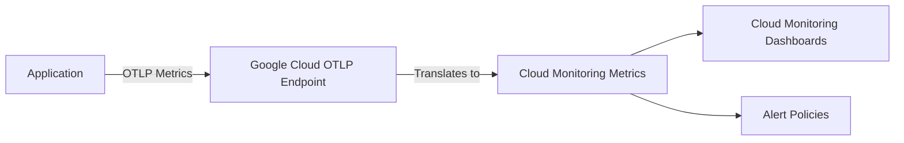
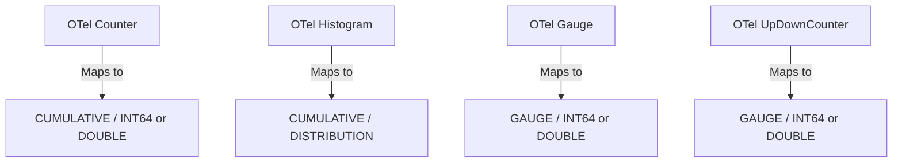

# How to Export OpenTelemetry Metrics to Google Cloud Monitoring Using the OTLP Exporter

Author: [nawazdhandala](https://www.github.com/nawazdhandala)

Tags: GCP, OpenTelemetry, Cloud Monitoring, Metrics, OTLP, Google Cloud

Description: Learn how to export OpenTelemetry metrics to Google Cloud Monitoring using the OTLP exporter for seamless metric collection and visualization.

---

Google Cloud Monitoring now supports receiving metrics via the OpenTelemetry Protocol (OTLP) directly, which means you do not need to use a Google-specific exporter anymore. You can use the standard OTLP exporter that ships with every OpenTelemetry SDK and point it at Google Cloud's OTLP endpoint. This simplifies your setup and keeps your code portable. In this post, I will walk through exactly how to configure this for different scenarios.

## Why OTLP Instead of the Google Cloud Exporter?

The dedicated Google Cloud Monitoring exporter works fine, but the OTLP exporter has advantages. It is the same exporter you use for any OTLP-compatible backend, so switching or multi-homing becomes trivial. It is maintained as part of the core OpenTelemetry project, which means it gets updates and bug fixes faster. And it reduces the number of dependencies in your project since you do not need the Google-specific exporter library.

## How It Works

Google Cloud Monitoring exposes an OTLP-compatible endpoint at `monitoring.googleapis.com`. Your application sends metrics using the standard OTLP protocol, and Google Cloud translates them into its native metric format. The translation handles metric types, labels, and resource attributes automatically.



## Step 1: Direct Export from a Python Application

Here is how to configure a Python application to export metrics directly to Google Cloud Monitoring via OTLP.

```bash
# Install the required packages
pip install opentelemetry-api opentelemetry-sdk opentelemetry-exporter-otlp-proto-grpc google-auth
```

```python
# metrics_setup.py - Configure OTLP metric export to Google Cloud Monitoring

import google.auth
import google.auth.transport.requests
from opentelemetry import metrics
from opentelemetry.sdk.metrics import MeterProvider
from opentelemetry.sdk.metrics.export import PeriodicExportingMetricReader
from opentelemetry.exporter.otlp.proto.grpc.metric_exporter import OTLPMetricExporter
from opentelemetry.sdk.resources import Resource

def setup_metrics(service_name: str):
    # Get default credentials and project ID
    credentials, project_id = google.auth.default()

    # Refresh the credentials to get an access token
    auth_request = google.auth.transport.requests.Request()
    credentials.refresh(auth_request)

    # Create resource with service identification
    resource = Resource.create({
        "service.name": service_name,
        "service.namespace": "production",
        "gcp.project_id": project_id,
    })

    # Configure the OTLP exporter pointing to Google Cloud
    exporter = OTLPMetricExporter(
        # Google Cloud's OTLP endpoint for metrics
        endpoint="monitoring.googleapis.com:443",
        headers={
            # Use the GCP access token for authentication
            "Authorization": f"Bearer {credentials.token}",
            # Specify the target project
            "x-goog-user-project": project_id,
        },
        insecure=False,
    )

    # Set up periodic metric export every 60 seconds
    reader = PeriodicExportingMetricReader(
        exporter,
        export_interval_millis=60000,
    )

    # Create and set the global meter provider
    meter_provider = MeterProvider(resource=resource, metric_readers=[reader])
    metrics.set_meter_provider(meter_provider)

    return meter_provider
```

Now use the metrics API in your application.

```python
# app.py - Use OpenTelemetry metrics in your application

from opentelemetry import metrics

# Get a meter for your component
meter = metrics.get_meter("my-service")

# Create different metric instruments
request_counter = meter.create_counter(
    name="http_requests_total",
    description="Total number of HTTP requests",
    unit="1",
)

request_duration = meter.create_histogram(
    name="http_request_duration_ms",
    description="HTTP request duration in milliseconds",
    unit="ms",
)

active_connections = meter.create_up_down_counter(
    name="active_connections",
    description="Number of active connections",
    unit="1",
)

def handle_request(method, path, status_code, duration_ms):
    # Record metrics with labels (attributes in OTel terminology)
    request_counter.add(1, {
        "http.method": method,
        "http.route": path,
        "http.status_code": str(status_code),
    })
    request_duration.record(duration_ms, {
        "http.method": method,
        "http.route": path,
    })
```

## Step 2: Export via the OpenTelemetry Collector

For production deployments, it is better to send metrics through a collector rather than directly from your application. This decouples your application from the backend configuration.

Here is the collector configuration for OTLP export to Google Cloud.

```yaml
# otel-collector-config.yaml

receivers:
  # Receive OTLP metrics from your applications
  otlp:
    protocols:
      grpc:
        endpoint: 0.0.0.0:4317
      http:
        endpoint: 0.0.0.0:4318

processors:
  batch:
    send_batch_size: 200
    timeout: 10s

  # Transform metric names to match GCP conventions if needed
  transform:
    metric_statements:
      - context: metric
        statements:
          # Prefix custom metrics with workload.googleapis.com/
          - set(name, Concat(["workload.googleapis.com/", name], ""))
            where name != ""

exporters:
  # Use the Google Managed Prometheus exporter
  # This is the recommended way to send metrics to Cloud Monitoring
  googlemanagedprometheus:
    project: my-gcp-project

service:
  pipelines:
    metrics:
      receivers: [otlp]
      processors: [batch, transform]
      exporters: [googlemanagedprometheus]
```

## Step 3: Configure Your Application to Send to the Collector

With the collector in place, configure your application to export via OTLP to the collector.

```python
# Simpler setup when using a collector as intermediary
from opentelemetry.exporter.otlp.proto.grpc.metric_exporter import OTLPMetricExporter

exporter = OTLPMetricExporter(
    # Point at the collector service
    endpoint="otel-collector:4317",
    insecure=True,  # No TLS needed for in-cluster communication
)
```

Or set it via environment variables, which is cleaner for Kubernetes deployments.

```bash
# Environment variables for OTLP metric export to a collector
export OTEL_METRICS_EXPORTER=otlp
export OTEL_EXPORTER_OTLP_METRICS_ENDPOINT=http://otel-collector:4317
export OTEL_EXPORTER_OTLP_METRICS_PROTOCOL=grpc
export OTEL_METRIC_EXPORT_INTERVAL=60000
```

## Step 4: Verify Metrics in Cloud Monitoring

After a minute or two, your metrics should appear in Cloud Monitoring. Navigate to the Metrics Explorer in the Google Cloud Console.

Custom metrics sent via the OTLP path show up under the `workload.googleapis.com` prefix by default. So if your metric is called `http_requests_total`, look for `workload.googleapis.com/http_requests_total`.

You can also verify with the gcloud CLI.

```bash
# List custom metric descriptors to verify metrics are arriving
gcloud monitoring metrics-descriptors list \
    --project=my-gcp-project \
    --filter='metric.type=starts_with("workload.googleapis.com")'
```

## Metric Type Mapping

OpenTelemetry metric instruments map to Google Cloud Monitoring metric types as follows.



Understanding this mapping is important because Cloud Monitoring has specific alignment and aggregation rules for each metric kind. Cumulative metrics can be rate-aligned, while gauge metrics can be averaged, summed, or percentile-aligned.

## Step 5: Create Alerts on OTLP Metrics

Once metrics flow into Cloud Monitoring, you can create alert policies on them.

```bash
# Create an alert when the error rate exceeds a threshold
gcloud monitoring policies create --policy-from-file=- <<'EOF'
{
  "displayName": "High Error Rate - OTLP Metrics",
  "conditions": [{
    "displayName": "Error rate above 5%",
    "conditionThreshold": {
      "filter": "metric.type=\"workload.googleapis.com/http_requests_total\" AND metric.labels.http_status_code=monitoring.regex.full_match(\"5.*\")",
      "comparison": "COMPARISON_GT",
      "thresholdValue": 10,
      "duration": "300s",
      "aggregations": [{
        "alignmentPeriod": "60s",
        "perSeriesAligner": "ALIGN_RATE"
      }]
    }
  }],
  "combiner": "OR",
  "notificationChannels": []
}
EOF
```

## Handling Authentication in Different Environments

Authentication works differently depending on where your code runs.

On GKE with Workload Identity, credentials are automatic - no extra configuration needed. On Compute Engine, the instance's service account is used by default. For local development, use Application Default Credentials.

```bash
# For local development, authenticate with ADC
gcloud auth application-default login
```

For the collector running on GKE, set up Workload Identity.

```bash
# Grant the monitoring metric writer role to the collector's service account
gcloud projects add-iam-policy-binding my-gcp-project \
    --member="serviceAccount:otel-collector@my-gcp-project.iam.gserviceaccount.com" \
    --role="roles/monitoring.metricWriter"
```

## Best Practices

Keep your metric cardinality under control. Every unique combination of metric name and label values creates a time series. Google Cloud Monitoring charges based on the number of time series, so avoid using high-cardinality labels like user IDs or request IDs in metrics.

Set the export interval to at least 60 seconds. Cloud Monitoring's minimum granularity for custom metrics is 10 seconds, but 60-second intervals reduce costs and are sufficient for most alerting scenarios.

Use meaningful metric names with clear units. Following the OpenTelemetry naming conventions (like `http.server.request.duration` with unit `ms`) makes your metrics self-documenting and easier to query.

## Wrapping Up

Exporting OpenTelemetry metrics to Google Cloud Monitoring via OTLP is the cleanest path available. Whether you export directly from your application or route through a collector, the standard OTLP exporter handles the job without needing any Google-specific libraries in your application code. The collector approach adds flexibility for processing and routing, while direct export keeps things simple for smaller deployments. Either way, once the metrics land in Cloud Monitoring, you get the full power of dashboards, alerts, and MQL queries to work with them.
