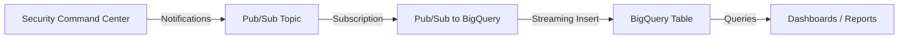

# How to Export Security Command Center Findings to BigQuery for Long-Term Analysis

Author: [nawazdhandala](https://www.github.com/nawazdhandala)

Tags: GCP, Security Command Center, BigQuery, Cloud Security, Data Analysis

Description: Step-by-step guide to exporting Security Command Center findings to BigQuery for historical analysis, trend tracking, and custom security dashboards.

---

Security Command Center in Google Cloud does a great job of detecting findings, but its built-in retention and querying capabilities have limits. If you want to run complex queries across months of data, build dashboards showing vulnerability trends, or correlate security findings with other operational data, you need to get those findings into BigQuery.

The export pipeline is straightforward: SCC publishes findings to Pub/Sub, and from there you stream them into BigQuery. Once in BigQuery, you have the full power of SQL to slice and dice your security data however you want.

Let me walk through the complete setup.

## Architecture Overview

Here is the flow of data through the pipeline:



## Prerequisites

You will need:

- Security Command Center enabled (Standard or Premium)
- Organization-level access with `roles/securitycenter.admin`
- A GCP project for the BigQuery dataset
- The BigQuery and Pub/Sub APIs enabled

```bash
# Enable required APIs
gcloud services enable bigquery.googleapis.com \
  pubsub.googleapis.com \
  securitycenter.googleapis.com \
  --project=my-analytics-project
```

## Step 1: Create the BigQuery Dataset and Table

First, create a dataset to hold your security findings.

```bash
# Create a dataset in your analytics project
bq mk --dataset \
  --description "Security Command Center findings for long-term analysis" \
  --location US \
  my-analytics-project:scc_findings
```

Now create the table with a schema that matches the SCC finding structure.

```bash
# Create the findings table with the appropriate schema
bq mk --table \
  my-analytics-project:scc_findings.raw_findings \
  finding_name:STRING,category:STRING,severity:STRING,state:STRING,resource_name:STRING,source_properties:STRING,event_time:TIMESTAMP,create_time:TIMESTAMP,external_uri:STRING,project_display_name:STRING,parent_display_name:STRING,notification_config:STRING,raw_json:STRING
```

## Step 2: Create the Pub/Sub Topic and Subscription

Set up a Pub/Sub topic for SCC to publish to, along with a BigQuery subscription that automatically writes messages into your table.

```bash
# Create the topic
gcloud pubsub topics create scc-to-bigquery \
  --project=my-analytics-project

# Create a BigQuery subscription that writes directly to the table
gcloud pubsub subscriptions create scc-bq-subscription \
  --topic=scc-to-bigquery \
  --bigquery-table=my-analytics-project:scc_findings.raw_findings \
  --write-metadata \
  --project=my-analytics-project
```

The BigQuery subscription is the simplest approach - Pub/Sub handles the streaming inserts directly without needing a Cloud Function or Dataflow job in between.

## Step 3: Grant SCC Publish Permissions

Grant the SCC service account permission to publish to your topic.

```bash
# Get your organization ID
ORG_ID=$(gcloud organizations list --format="value(ID)" --limit=1)

# Grant publisher role to the SCC service account
gcloud pubsub topics add-iam-policy-binding scc-to-bigquery \
  --member="serviceAccount:service-org-${ORG_ID}@security-center-api.iam.gserviceaccount.com" \
  --role="roles/pubsub.publisher" \
  --project=my-analytics-project
```

## Step 4: Create the SCC Notification Config

Now link SCC to the Pub/Sub topic.

```bash
# Create notification config to export all findings
gcloud scc notifications create export-to-bigquery \
  --organization=$ORG_ID \
  --pubsub-topic=projects/my-analytics-project/topics/scc-to-bigquery \
  --filter=""
```

For this use case, I recommend using an empty filter to capture everything. You can always filter at query time in BigQuery, and having all the data gives you flexibility for future analysis.

## Step 5: Use a Cloud Function for Better Data Shaping

The direct Pub/Sub-to-BigQuery subscription works but stores the raw JSON blob. For better queryability, use a Cloud Function to parse findings into structured columns.

```python
import base64
import json
from google.cloud import bigquery

# Initialize the BigQuery client
client = bigquery.Client()
TABLE_ID = "my-analytics-project.scc_findings.structured_findings"

def process_scc_finding(event, context):
    """Parse SCC finding from Pub/Sub and insert structured data into BigQuery."""

    # Decode and parse the Pub/Sub message
    raw_data = base64.b64decode(event['data']).decode('utf-8')
    message = json.loads(raw_data)

    finding = message.get('finding', {})

    # Build a structured row for BigQuery
    row = {
        'finding_name': finding.get('name', ''),
        'category': finding.get('category', ''),
        'severity': finding.get('severity', 'UNSPECIFIED'),
        'state': finding.get('state', ''),
        'resource_name': finding.get('resourceName', ''),
        'event_time': finding.get('eventTime', ''),
        'create_time': finding.get('createTime', ''),
        'external_uri': finding.get('externalUri', ''),
        'source_properties': json.dumps(finding.get('sourceProperties', {})),
        'project_display_name': finding.get('projectDisplayName', ''),
        'notification_config': message.get('notificationConfigName', ''),
        'raw_json': raw_data
    }

    # Stream the row into BigQuery
    errors = client.insert_rows_json(TABLE_ID, [row])
    if errors:
        print(f"BigQuery insert errors: {errors}")
        raise Exception(f"Failed to insert row: {errors}")

    return "OK"
```

## Step 6: Query Your Security Data

Now the fun part. With findings in BigQuery, you can run all sorts of analysis.

Find the most common finding categories over the past 30 days:

```sql
-- Top 10 finding categories in the last 30 days
SELECT
  category,
  severity,
  COUNT(*) as finding_count
FROM `my-analytics-project.scc_findings.structured_findings`
WHERE event_time >= TIMESTAMP_SUB(CURRENT_TIMESTAMP(), INTERVAL 30 DAY)
  AND state = 'ACTIVE'
GROUP BY category, severity
ORDER BY finding_count DESC
LIMIT 10;
```

Track how your security posture changes over time:

```sql
-- Weekly trend of active findings by severity
SELECT
  DATE_TRUNC(DATE(event_time), WEEK) as week,
  severity,
  COUNT(*) as new_findings
FROM `my-analytics-project.scc_findings.structured_findings`
WHERE state = 'ACTIVE'
  AND event_time >= TIMESTAMP_SUB(CURRENT_TIMESTAMP(), INTERVAL 90 DAY)
GROUP BY week, severity
ORDER BY week DESC, severity;
```

Identify the projects with the most security issues:

```sql
-- Projects with the highest finding counts
SELECT
  project_display_name,
  COUNT(*) as total_findings,
  COUNTIF(severity = 'CRITICAL') as critical_count,
  COUNTIF(severity = 'HIGH') as high_count
FROM `my-analytics-project.scc_findings.structured_findings`
WHERE state = 'ACTIVE'
GROUP BY project_display_name
ORDER BY critical_count DESC, high_count DESC
LIMIT 20;
```

## Step 7: Build a Looker Studio Dashboard

Connect your BigQuery dataset to Looker Studio (formerly Data Studio) for visual dashboards. Create charts showing:

- Finding count over time grouped by severity
- A breakdown of finding categories as a pie chart
- A heatmap of findings by project and category
- Mean time to remediation (comparing create_time to when state changes to INACTIVE)

## Setting Up Partitioning for Cost Control

BigQuery charges by data scanned, so partition your table to keep costs down.

```sql
-- Create a partitioned table for better query performance and lower cost
CREATE TABLE `my-analytics-project.scc_findings.structured_findings_partitioned`
PARTITION BY DATE(event_time)
CLUSTER BY severity, category
AS SELECT * FROM `my-analytics-project.scc_findings.structured_findings`;
```

Partitioning by `event_time` means queries with date filters only scan the relevant partitions. Clustering by severity and category further reduces scan size for common query patterns.

## Data Retention

Set a partition expiration if you do not need to keep findings forever.

```bash
# Set a 365-day expiration on the dataset
bq update --default_table_expiration 31536000 \
  my-analytics-project:scc_findings
```

## Conclusion

Exporting SCC findings to BigQuery transforms your security data from a transient dashboard into a permanent analytical asset. You can track trends, measure remediation velocity, identify your riskiest projects, and build executive dashboards - all with standard SQL.

The setup takes maybe 30 minutes, and the ongoing cost is minimal since SCC finding volumes are typically not that large. I would recommend starting with the direct Pub/Sub BigQuery subscription for simplicity, and switching to the Cloud Function approach when you need more structured data.
