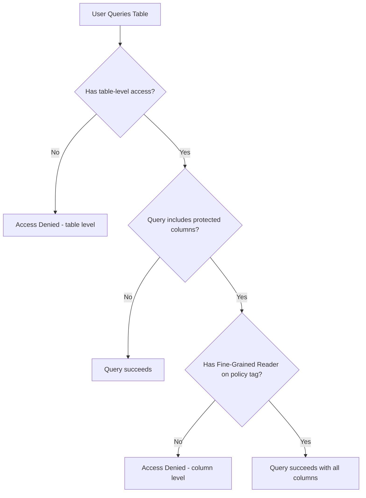
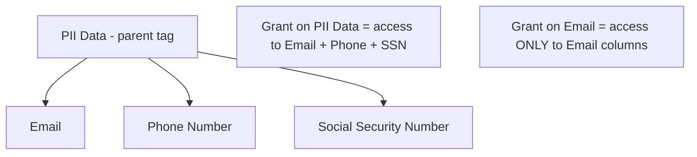
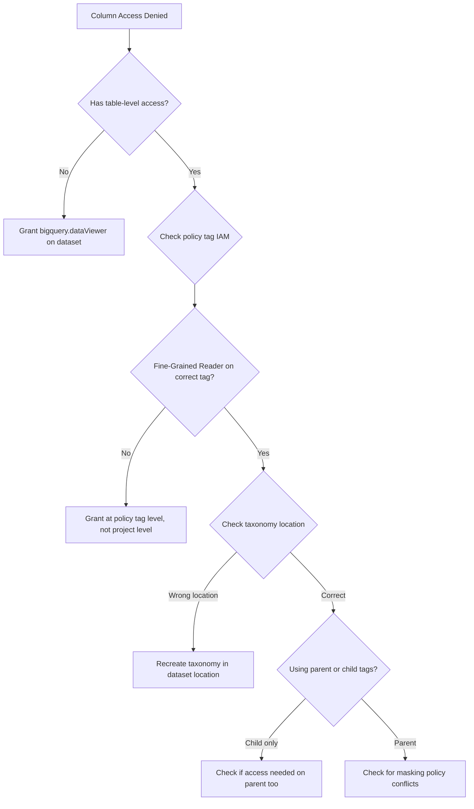

# How to Fix BigQuery Column-Level Security Denying Access Despite Correct IAM Roles

Author: [nawazdhandala](https://www.github.com/nawazdhandala)

Tags: GCP, BigQuery, Column-Level Security, Policy Tags, Data Governance, IAM

Description: Troubleshoot BigQuery column-level security denying access even when IAM roles appear correct, covering policy tags, taxonomy configuration, and access controls.

---

You have set up column-level security in BigQuery using policy tags, granted what you believe are the correct IAM roles, and your users are still getting "Access Denied" when they try to query columns protected by those tags. Column-level security adds a layer of access control on top of the regular dataset and table permissions, and getting all the pieces aligned is surprisingly tricky.

Let me walk through how column-level security works and the specific issues that cause access denials even when your IAM roles look correct.

## How Column-Level Security Works

BigQuery column-level security uses the Data Catalog taxonomy and policy tag system. Here is the chain of components:

1. **Taxonomy** - a hierarchical structure of policy tags (e.g., "PII Data" with child tags "Email", "Phone", "SSN")
2. **Policy tags** - applied to specific columns in BigQuery tables
3. **Fine-grained reader role** - grants access to read columns with specific policy tags



The critical thing to understand is that column-level security is enforced in addition to table-level permissions. Even a project Owner will be denied access to protected columns if they do not have the Fine-Grained Reader role on the specific policy tag.

## Step 1 - Verify the Policy Tag Taxonomy

First, check that your taxonomy and policy tags are set up correctly.

```bash
# List taxonomies in your project
gcloud data-catalog taxonomies list \
    --location=us \
    --project=my-project

# List policy tags within a taxonomy
gcloud data-catalog taxonomies policy-tags list \
    --taxonomy=<taxonomy-id> \
    --location=us
```

Note the taxonomy ID and policy tag IDs - you will need them.

## Step 2 - Check Which Columns Have Policy Tags

```sql
-- Check column-level security tags on a table
SELECT
  column_name,
  data_type,
  policy_tags
FROM `my_dataset.INFORMATION_SCHEMA.COLUMN_FIELD_PATHS`
WHERE table_name = 'my_table'
  AND policy_tags IS NOT NULL;
```

Or using the bq tool.

```bash
# Show table schema including policy tags
bq show --schema --format=prettyjson my_dataset.my_table
```

Look for the `policyTags` field in the column definitions.

## Step 3 - Verify the Fine-Grained Reader Role

This is where most issues occur. The user needs the `roles/datacatalog.categoryFineGrainedReader` role on the specific policy tag, not on the project or dataset.

```bash
# Check who has the Fine-Grained Reader role on a policy tag
gcloud data-catalog taxonomies policy-tags get-iam-policy \
    <policy-tag-id> \
    --taxonomy=<taxonomy-id> \
    --location=us
```

If the user is not listed, grant them access.

```bash
# Grant Fine-Grained Reader on a specific policy tag
gcloud data-catalog taxonomies policy-tags add-iam-policy-binding \
    <policy-tag-id> \
    --taxonomy=<taxonomy-id> \
    --location=us \
    --member="user:analyst@company.com" \
    --role="roles/datacatalog.categoryFineGrainedReader"
```

## Common Issue 1 - Role Granted at Wrong Level

A frequent mistake is granting the role at the project level instead of the policy tag level. The Fine-Grained Reader role must be granted on the specific policy tag.

```bash
# Wrong: granting at project level does not work for column-level security
gcloud projects add-iam-policy-binding my-project \
    --member="user:analyst@company.com" \
    --role="roles/datacatalog.categoryFineGrainedReader"
# This grants access to the Data Catalog API but NOT to specific policy tags

# Correct: grant on the policy tag itself
gcloud data-catalog taxonomies policy-tags add-iam-policy-binding \
    <policy-tag-id> \
    --taxonomy=<taxonomy-id> \
    --location=us \
    --member="user:analyst@company.com" \
    --role="roles/datacatalog.categoryFineGrainedReader"
```

## Common Issue 2 - Hierarchical Tags Not Inheriting

If your taxonomy has parent and child tags, granting access to a parent tag automatically grants access to all its children. But granting access to a child does not grant access to the parent or siblings.



If the user needs access to columns tagged with both "Email" and "Phone", either grant access on the parent "PII Data" tag or grant individually on each child tag.

```bash
# Grant on parent tag for access to all children
gcloud data-catalog taxonomies policy-tags add-iam-policy-binding \
    <parent-tag-id> \
    --taxonomy=<taxonomy-id> \
    --location=us \
    --member="user:analyst@company.com" \
    --role="roles/datacatalog.categoryFineGrainedReader"
```

## Common Issue 3 - Taxonomy Location Mismatch

The taxonomy must be in the same location as the BigQuery dataset. If your dataset is in `US` but your taxonomy is in `EU`, the policy tags will not work.

```bash
# Check dataset location
bq show --format=prettyjson my_dataset | python3 -c "
import json, sys
ds = json.load(sys.stdin)
print(f'Dataset location: {ds.get(\"location\")}')
"

# Check taxonomy location
gcloud data-catalog taxonomies list --location=us --project=my-project
gcloud data-catalog taxonomies list --location=eu --project=my-project
```

## Common Issue 4 - Querying Through Views

If a user queries a view that references protected columns, they still need Fine-Grained Reader access on the policy tags. Views do not bypass column-level security.

```sql
-- This view references a protected column
CREATE VIEW `my_dataset.user_view` AS
SELECT user_id, email, purchase_count  -- email is protected
FROM `my_dataset.users`;

-- Even querying the view requires Fine-Grained Reader on the email policy tag
SELECT * FROM `my_dataset.user_view`;  -- Will fail without the role
```

To work around this, create views that exclude protected columns.

```sql
-- Create a view that excludes protected columns
CREATE VIEW `my_dataset.safe_user_view` AS
SELECT user_id, purchase_count  -- email excluded
FROM `my_dataset.users`;
```

## Common Issue 5 - Service Accounts Missing Access

When scheduled queries, Cloud Functions, or other services query protected columns, the service account running them needs Fine-Grained Reader access too.

```bash
# Grant the service account access to the policy tag
gcloud data-catalog taxonomies policy-tags add-iam-policy-binding \
    <policy-tag-id> \
    --taxonomy=<taxonomy-id> \
    --location=us \
    --member="serviceAccount:my-sa@my-project.iam.gserviceaccount.com" \
    --role="roles/datacatalog.categoryFineGrainedReader"
```

## Common Issue 6 - Data Masking vs Access Denial

BigQuery supports data masking as an alternative to access denial. With masking, users can still query the column but see masked values instead of getting an error.

```bash
# Check if masking rules are configured
gcloud data-catalog taxonomies policy-tags list \
    --taxonomy=<taxonomy-id> \
    --location=us \
    --format="yaml"
```

If you want users to see masked data instead of being denied.

```bash
# Grant the masked reader role instead of fine-grained reader
gcloud data-catalog taxonomies policy-tags add-iam-policy-binding \
    <policy-tag-id> \
    --taxonomy=<taxonomy-id> \
    --location=us \
    --member="user:analyst@company.com" \
    --role="roles/bigquerydatapolicy.maskedReader"
```

## Debugging Checklist

Here is the systematic checklist I follow when column-level security is not working as expected.

1. Verify the user has table-level access (bigquery.dataViewer)
2. Identify which columns are protected (check INFORMATION_SCHEMA.COLUMN_FIELD_PATHS)
3. Find the policy tag IDs on those columns
4. Check the IAM policy on each policy tag (not the project)
5. Verify the taxonomy location matches the dataset location
6. Check for hierarchical tag inheritance issues
7. If using views, ensure the user has access to underlying column tags
8. If using service accounts, grant the same access to the SA



## Summary

BigQuery column-level security access denials despite correct-looking IAM roles are almost always caused by granting the Fine-Grained Reader role at the wrong level (project instead of policy tag), taxonomy location mismatches, or not understanding the parent-child tag inheritance model. Always grant the `roles/datacatalog.categoryFineGrainedReader` role directly on the policy tag, make sure the taxonomy is in the same location as your dataset, and remember that views do not bypass column-level security.
