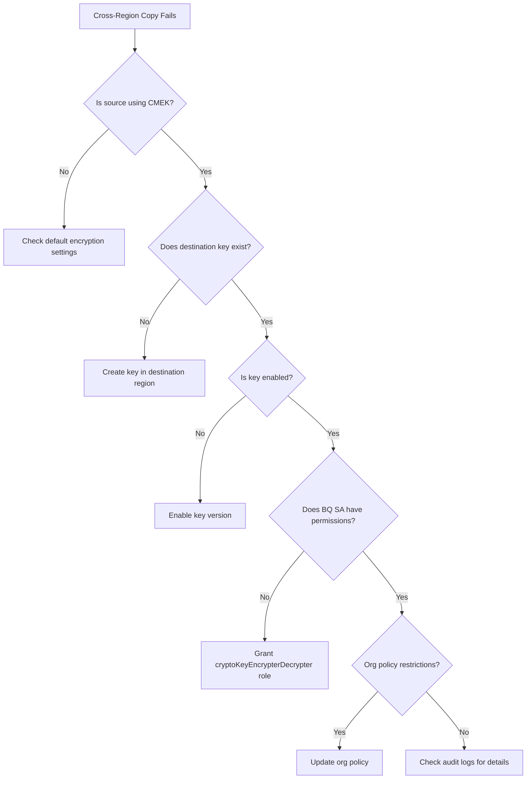

# How to Fix BigQuery Cross-Region Dataset Copy Failing with Encryption Key Errors

Author: [nawazdhandala](https://www.github.com/nawazdhandala)

Tags: GCP, BigQuery, Encryption, CMEK, Cross-Region, Data Management

Description: Learn how to diagnose and fix BigQuery cross-region dataset copy failures caused by Cloud KMS encryption key errors, including CMEK configuration and key access issues.

---

If you have ever tried to copy a BigQuery dataset from one region to another and hit an encryption key error, you know how frustrating it can be. The error messages are often vague, and the root cause is not always obvious. In this post, I will walk through the common reasons this happens and how to fix each one.

## Understanding the Problem

BigQuery supports cross-region dataset copies, which is useful for disaster recovery, compliance, or bringing data closer to your users. However, when your datasets are encrypted with Customer-Managed Encryption Keys (CMEK) through Cloud KMS, the copy process has additional requirements that must be met.

A typical error message looks something like this:

```
Error: Copy failed. Could not access the encryption key.
Ensure that the BigQuery service account has the correct permissions
on the Cloud KMS key.
```

Or you might see:

```
Error: The encryption key is in a different location than the destination dataset.
```

Both of these point to issues with how your CMEK keys are configured across regions.

## Why This Happens

There are several root causes for this error:

1. The Cloud KMS key used for encryption does not exist in the destination region
2. The BigQuery service account does not have the `cloudkms.cryptoKeyEncrypterDecrypter` role on the destination key
3. The key ring or key in the destination region has a different configuration
4. The key has been disabled, destroyed, or is pending destruction
5. Organization policies restrict which keys can be used in certain regions

## Step 1: Verify Your Source Dataset Encryption

First, check what encryption your source dataset is using.

```bash
# Check the encryption configuration of the source dataset
bq show --format=prettyjson project_id:source_dataset | grep -A 5 "encryptionConfiguration"
```

This tells you the exact KMS key being used. Note the key's location - it should match the source dataset's region.

## Step 2: Create a Matching Key in the Destination Region

For cross-region copies, you need a Cloud KMS key in the destination region. BigQuery cannot use a key from one region to encrypt data in another.

```bash
# Create a key ring in the destination region
gcloud kms keyrings create my-keyring-dest \
    --location=eu \
    --project=my-project

# Create a key in the destination region key ring
gcloud kms keys create my-bq-key-dest \
    --location=eu \
    --keyring=my-keyring-dest \
    --purpose=encryption \
    --project=my-project
```

## Step 3: Grant Permissions to the BigQuery Service Account

BigQuery uses a Google-managed service account to perform encryption and decryption. This service account needs explicit permissions on both the source and destination KMS keys.

```bash
# Find your BigQuery service account (it follows a specific pattern)
# Format: bq-PROJECT_NUMBER@bigquery-encryption.iam.gserviceaccount.com

# Get your project number
PROJECT_NUMBER=$(gcloud projects describe my-project --format='value(projectNumber)')

# The service account email
BQ_SA="bq-${PROJECT_NUMBER}@bigquery-encryption.iam.gserviceaccount.com"

# Grant the encrypter/decrypter role on the destination key
gcloud kms keys add-iam-policy-binding my-bq-key-dest \
    --location=eu \
    --keyring=my-keyring-dest \
    --member="serviceAccount:${BQ_SA}" \
    --role="roles/cloudkms.cryptoKeyEncrypterDecrypter" \
    --project=my-project
```

## Step 4: Perform the Cross-Region Copy with the Destination Key

When you run the dataset copy, you need to specify the destination encryption key explicitly.

```bash
# Copy dataset across regions with the destination CMEK key
bq cp --destination_kms_key \
    "projects/my-project/locations/eu/keyRings/my-keyring-dest/cryptoKeys/my-bq-key-dest" \
    my-project:us_dataset.my_table \
    my-project:eu_dataset.my_table
```

For copying an entire dataset, you can use the BigQuery Data Transfer Service:

```bash
# Create a transfer config for cross-region dataset copy
bq mk --transfer_config \
    --project_id=my-project \
    --data_source=cross_region_copy \
    --target_dataset=eu_dataset \
    --display_name="US to EU copy" \
    --params='{
        "source_dataset_id":"us_dataset",
        "source_project_id":"my-project",
        "overwrite_destination_table":"true"
    }' \
    --destination_kms_key="projects/my-project/locations/eu/keyRings/my-keyring-dest/cryptoKeys/my-bq-key-dest"
```

## Step 5: Check for Disabled or Destroyed Keys

If the key exists and permissions look correct, verify the key is actually active.

```bash
# Check the state of your KMS key
gcloud kms keys versions list \
    --key=my-bq-key-dest \
    --keyring=my-keyring-dest \
    --location=eu \
    --project=my-project \
    --format="table(name, state)"
```

You should see `ENABLED` for at least one key version. If all versions show `DISABLED` or `DESTROYED`, that is your problem. You need to either enable an existing version or create a new one.

```bash
# Enable a disabled key version
gcloud kms keys versions enable 1 \
    --key=my-bq-key-dest \
    --keyring=my-keyring-dest \
    --location=eu \
    --project=my-project
```

## Step 6: Check Organization Policy Constraints

Some organizations enforce policies that restrict which KMS keys can be used. Check for the `constraints/gcp.restrictCmekCryptoKeyProjects` constraint.

```bash
# List effective organization policies for your project
gcloud resource-manager org-policies describe \
    gcp.restrictCmekCryptoKeyProjects \
    --project=my-project \
    --effective
```

If this policy is in place, make sure your destination key's project is in the allowed list. Otherwise, you will need to work with your organization admin to update the policy.

## Troubleshooting Checklist

Here is a quick checklist to go through when debugging this issue:



## Checking Audit Logs for More Details

When all the obvious things look correct, dig into the Cloud Audit Logs for more granular error details.

```bash
# Query audit logs for KMS access denied events
gcloud logging read \
    'resource.type="cloudkms_cryptokey" AND severity=ERROR' \
    --project=my-project \
    --limit=20 \
    --format=json
```

This will often reveal the exact reason the key access failed, such as a permission being granted on the wrong resource or a key version mismatch.

## Prevention Tips

To avoid running into this issue in the future:

- Always create matching KMS keys in all regions where you plan to store BigQuery data
- Use Terraform or another IaC tool to manage your KMS keys and IAM bindings consistently
- Set up monitoring alerts for KMS key state changes
- Document your encryption strategy so team members know which keys exist in which regions
- Consider using multi-region key rings if your compliance requirements allow it

Cross-region dataset copies with CMEK encryption are a common source of confusion, but once you understand the relationship between BigQuery, Cloud KMS, and IAM permissions, the fix is usually straightforward. The key insight is that encryption keys are regional resources, and you need matching keys and permissions in both the source and destination regions.
