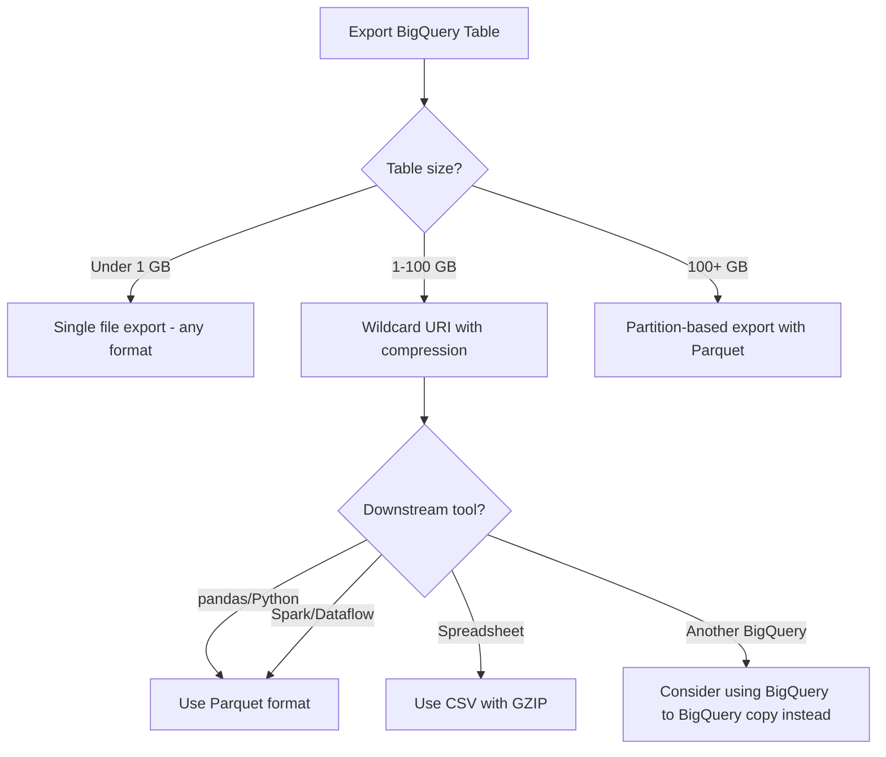

# How to Fix BigQuery Export to Cloud Storage Failing with Exceeded Maximum File Size Error

Author: [nawazdhandala](https://www.github.com/nawazdhandala)

Tags: GCP, BigQuery, Cloud Storage, Data Export, File Size, Troubleshooting

Description: Fix BigQuery export to Cloud Storage failing with exceeded maximum file size by using wildcard URIs, compression, and partition-based export strategies.

---

You tried to export a large BigQuery table to Cloud Storage and got an error about exceeding the maximum file size. BigQuery EXPORT DATA and the bq extract command have a limit of 1 GB per file for CSV and JSON formats, and this limit catches people off guard when exporting tables that are larger than a few gigabytes.

The good news is that BigQuery has built-in support for splitting exports into multiple files, and with the right approach you can export tables of any size. Let me walk through the solutions.

## Understanding the Export Limits

BigQuery enforces these per-file limits during export:
- CSV format: 1 GB per file
- JSON (newline-delimited): 1 GB per file
- Avro format: 1 GB per file (but Avro is much more compact)
- Parquet format: 1 GB per file

If your export would produce a single file larger than 1 GB, the operation fails. The fix is to tell BigQuery to split the output into multiple files using a wildcard URI.

## Fix 1 - Use Wildcard URIs for File Splitting

The simplest fix is to use a wildcard (`*`) in the destination URI. BigQuery will automatically split the output into multiple files.

```bash
# Bad: single file that might exceed the 1GB limit
bq extract \
    --destination_format=CSV \
    my_dataset.large_table \
    gs://my-bucket/export/data.csv

# Good: wildcard URI splits into multiple files automatically
bq extract \
    --destination_format=CSV \
    my_dataset.large_table \
    gs://my-bucket/export/data-*.csv
```

BigQuery replaces the `*` with a zero-padded number, producing files like `data-000000000000.csv`, `data-000000000001.csv`, etc.

Using the SQL EXPORT DATA syntax.

```sql
-- Export with wildcard to split into multiple files
EXPORT DATA OPTIONS(
  uri='gs://my-bucket/export/data-*.csv',
  format='CSV',
  overwrite=true,
  header=true
) AS
SELECT * FROM `my_dataset.large_table`;
```

## Fix 2 - Use Compression

Compressed exports are significantly smaller, which means fewer files and faster transfers.

```bash
# Export with gzip compression
bq extract \
    --destination_format=CSV \
    --compression=GZIP \
    my_dataset.large_table \
    gs://my-bucket/export/data-*.csv.gz
```

With SQL.

```sql
-- Export compressed CSV files
EXPORT DATA OPTIONS(
  uri='gs://my-bucket/export/data-*.csv.gz',
  format='CSV',
  overwrite=true,
  header=true,
  compression='GZIP'
) AS
SELECT * FROM `my_dataset.large_table`;
```

GZIP compression typically achieves 5-10x compression ratios on tabular data, so a 10 GB table might compress to 1-2 GB across just a couple of files.

## Fix 3 - Use Parquet or Avro Format

Binary formats like Parquet and Avro are much more compact than CSV or JSON, reducing the number of output files and making downstream processing faster.

```sql
-- Export as Parquet (highly recommended for analytics workloads)
EXPORT DATA OPTIONS(
  uri='gs://my-bucket/export/data-*.parquet',
  format='PARQUET',
  overwrite=true
) AS
SELECT * FROM `my_dataset.large_table`;
```

```sql
-- Export as Avro with Snappy compression
EXPORT DATA OPTIONS(
  uri='gs://my-bucket/export/data-*.avro',
  format='AVRO',
  overwrite=true,
  compression='SNAPPY'
) AS
SELECT * FROM `my_dataset.large_table`;
```

Parquet is especially good because it preserves data types, supports nested and repeated fields, and is natively supported by tools like Spark, pandas, and Dataflow.

## Fix 4 - Export by Partition

For very large tables, export one partition at a time. This gives you more control over file organization and makes incremental exports easier.

```sql
-- Export a specific date partition
EXPORT DATA OPTIONS(
  uri='gs://my-bucket/export/2024/06/15/data-*.parquet',
  format='PARQUET',
  overwrite=true
) AS
SELECT * FROM `my_dataset.large_table`
WHERE DATE(event_timestamp) = '2024-06-15';
```

You can automate this with a script that iterates over partitions.

```bash
#!/bin/bash
# Export each partition to a separate directory in Cloud Storage

TABLE="my_dataset.large_table"
BUCKET="gs://my-bucket/export"
START_DATE="2024-01-01"
END_DATE="2024-06-30"

# Loop through each date in the range
current="$START_DATE"
while [[ "$current" < "$END_DATE" ]]; do
    # Format the date for the export path
    year=$(date -d "$current" +%Y)
    month=$(date -d "$current" +%m)
    day=$(date -d "$current" +%d)

    echo "Exporting partition: $current"

    bq query --use_legacy_sql=false "
    EXPORT DATA OPTIONS(
      uri='${BUCKET}/${year}/${month}/${day}/data-*.parquet',
      format='PARQUET',
      overwrite=true
    ) AS
    SELECT * FROM \`${TABLE}\`
    WHERE DATE(event_timestamp) = '${current}';
    "

    # Move to next day
    current=$(date -d "$current + 1 day" +%Y-%m-%d)
done

echo "Export complete"
```

## Fix 5 - Filter and Export Only What You Need

If you do not need the entire table, filter the export to reduce the data volume.

```sql
-- Export only the columns and rows you actually need
EXPORT DATA OPTIONS(
  uri='gs://my-bucket/export/filtered-*.parquet',
  format='PARQUET',
  overwrite=true
) AS
SELECT
  user_id,
  event_type,
  event_timestamp,
  -- Skip large text columns or nested fields you do not need
  revenue
FROM `my_dataset.large_table`
WHERE event_timestamp >= '2024-01-01'
  AND event_type IN ('purchase', 'signup');
```

## Fix 6 - Handle Exports Programmatically

For production pipelines, use the BigQuery client library to manage exports with proper error handling.

```python
from google.cloud import bigquery

client = bigquery.Client()

def export_table_to_gcs(dataset_id, table_id, bucket_name, prefix):
    """Export a BigQuery table to Cloud Storage with automatic file splitting."""
    destination_uri = f"gs://{bucket_name}/{prefix}/data-*.parquet"

    dataset_ref = client.dataset(dataset_id)
    table_ref = dataset_ref.table(table_id)

    # Configure the extract job
    job_config = bigquery.ExtractJobConfig()
    job_config.destination_format = bigquery.DestinationFormat.PARQUET
    job_config.compression = bigquery.Compression.SNAPPY

    # Start the export
    extract_job = client.extract_table(
        table_ref,
        destination_uri,
        job_config=job_config,
    )

    # Wait for the job to complete
    extract_job.result()

    print(f"Exported {table_id} to {destination_uri}")
    print(f"  Bytes transferred: {extract_job.destination_uri_file_counts}")

    return extract_job

# Usage
export_table_to_gcs('my_dataset', 'large_table', 'my-bucket', 'exports/2024')
```

## Dealing with the Output Files

After exporting with wildcards, you will have multiple files. Here is how to work with them.

```python
from google.cloud import storage
import pandas as pd

def read_exported_files(bucket_name, prefix):
    """Read all exported Parquet files from Cloud Storage."""
    client = storage.Client()
    bucket = client.bucket(bucket_name)
    blobs = list(bucket.list_blobs(prefix=prefix))

    print(f"Found {len(blobs)} exported files")

    # Read all files into a single DataFrame
    dfs = []
    for blob in blobs:
        if blob.name.endswith('.parquet'):
            local_path = f"/tmp/{blob.name.split('/')[-1]}"
            blob.download_to_filename(local_path)
            dfs.append(pd.read_parquet(local_path))

    return pd.concat(dfs, ignore_index=True)
```

## Export Strategy Decision Tree



## Summary

The maximum file size error is solved by using wildcard URIs in the destination path, which tells BigQuery to split the export into multiple files. For best results, use Parquet or Avro format with compression, export by partition for very large tables, and filter to only the data you need. The wildcard approach scales to tables of any size, and the resulting files can be easily processed by downstream tools.
