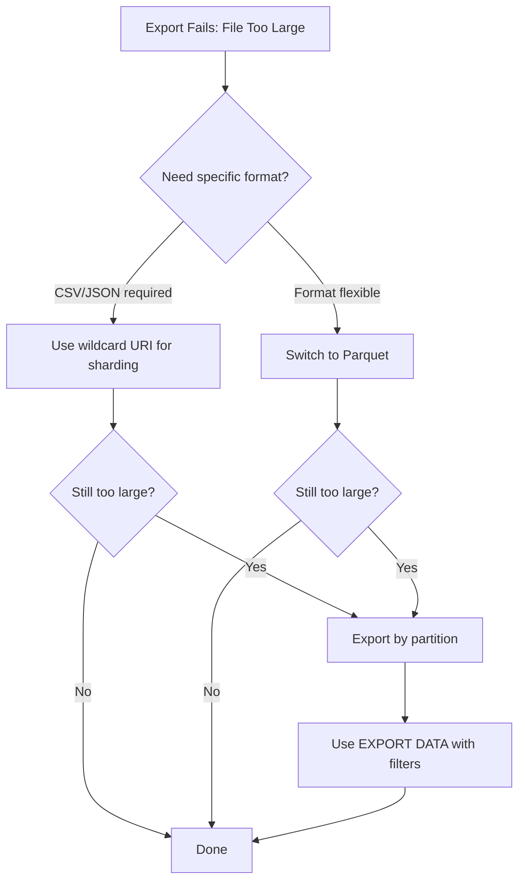

# How to Fix BigQuery Export to Cloud Storage Failing with File Size Exceeded Error

Author: [nawazdhandala](https://www.github.com/nawazdhandala)

Tags: GCP, BigQuery, Cloud Storage, Data Export, Troubleshooting

Description: How to resolve BigQuery export failures caused by file size exceeded errors when exporting large tables to Cloud Storage buckets.

---

Exporting data from BigQuery to Cloud Storage sounds straightforward, but when your tables get large enough, you will eventually hit the dreaded "file size exceeded" error. BigQuery imposes a 1 GB limit on individual exported files (for CSV and JSON formats), and if your table exceeds that, the export just fails. Let me show you how to work around this.

## The Error

The error typically shows up as:

```
Error: Table too large to be exported to a single file.
Specify a uri including a * to shard export across multiple files.
```

Or for compressed exports that still exceed limits:

```
Error: The exported file size (2.3 GB) exceeds the maximum allowed size (1 GB).
```

## Why This Limit Exists

BigQuery export jobs run as distributed operations, and the file size limit ensures that individual export shards can be written efficiently. For uncompressed CSV or JSON, the limit is 1 GB per file. For Avro and Parquet formats, the limit is also 1 GB but these formats compress the data, so you can effectively export more data per file.

## Fix 1: Use Wildcard URIs for Automatic Sharding

The simplest fix is to use a wildcard in your destination URI. BigQuery will automatically split the output across multiple files.

```bash
# Export with wildcard - BigQuery will create multiple sharded files
bq extract \
    --destination_format=CSV \
    --compression=GZIP \
    my-project:my_dataset.my_table \
    gs://my-bucket/exports/my_table_*.csv.gz
```

The wildcard `*` tells BigQuery to shard the output. The resulting files will be named something like:

```
gs://my-bucket/exports/my_table_000000000000.csv.gz
gs://my-bucket/exports/my_table_000000000001.csv.gz
gs://my-bucket/exports/my_table_000000000002.csv.gz
```

You can also place the wildcard at different positions:

```bash
# Wildcard at end with a prefix
bq extract \
    my-project:my_dataset.my_table \
    gs://my-bucket/exports/2026-02-17/part-*

# Multiple path segments with wildcard
bq extract \
    my-project:my_dataset.my_table \
    gs://my-bucket/exports/my_table/shard-*.json
```

## Fix 2: Use Parquet or Avro for Better Compression

If you are exporting as CSV or JSON, switching to a columnar format like Parquet dramatically reduces the output file size while also being faster to read.

```bash
# Export as Parquet - much smaller files for structured data
bq extract \
    --destination_format=PARQUET \
    --compression=SNAPPY \
    my-project:my_dataset.my_table \
    gs://my-bucket/exports/my_table_*.parquet
```

Here is a rough comparison of export sizes for a 10 GB table:

| Format | Compression | Approximate Output Size |
|--------|------------|------------------------|
| CSV | None | 10 GB |
| CSV | GZIP | 2-3 GB |
| JSON | GZIP | 3-4 GB |
| Parquet | SNAPPY | 1-2 GB |
| Avro | DEFLATE | 1.5-2.5 GB |

## Fix 3: Export Partitioned Data in Chunks

For very large tables, export partitions separately rather than the entire table at once.

```bash
# Export a single partition using a query-based extract
bq query \
    --use_legacy_sql=false \
    --destination_table=my-project:my_dataset.temp_export \
    'SELECT * FROM `my-project.my_dataset.my_table`
     WHERE _PARTITIONDATE = "2026-02-17"'

# Then export the smaller temp table
bq extract \
    --destination_format=PARQUET \
    my-project:my_dataset.temp_export \
    gs://my-bucket/exports/2026-02-17/*.parquet

# Clean up
bq rm -f my-project:my_dataset.temp_export
```

For automating this across many partitions, use a script:

```bash
#!/bin/bash
# Export each partition separately to avoid file size limits

PARTITIONS=$(bq query --use_legacy_sql=false --format=csv --quiet \
    'SELECT DISTINCT _PARTITIONDATE as dt
     FROM `my-project.my_dataset.my_table`
     WHERE _PARTITIONDATE >= "2026-01-01"
     ORDER BY dt')

for PARTITION_DATE in $PARTITIONS; do
    # Skip the header row from CSV output
    if [ "$PARTITION_DATE" = "dt" ]; then continue; fi

    echo "Exporting partition: $PARTITION_DATE"

    # Export directly using partition decorator
    bq extract \
        --destination_format=PARQUET \
        "my-project:my_dataset.my_table\$${PARTITION_DATE//-/}" \
        "gs://my-bucket/exports/${PARTITION_DATE}/*.parquet"
done
```

## Fix 4: Use the EXPORT DATA SQL Statement

The `EXPORT DATA` statement gives you more control over the export process, including the ability to set a maximum file size per shard.

```sql
-- Export with explicit shard size control
EXPORT DATA OPTIONS(
  uri='gs://my-bucket/exports/my_table_*.csv',
  format='CSV',
  overwrite=true,
  header=true,
  field_delimiter=','
) AS
SELECT *
FROM `my-project.my_dataset.my_table`
WHERE created_date >= '2026-01-01';
```

You can run this through the bq command line:

```bash
# Run the EXPORT DATA statement
bq query --use_legacy_sql=false '
EXPORT DATA OPTIONS(
  uri="gs://my-bucket/exports/output_*.parquet",
  format="PARQUET",
  overwrite=true,
  compression="SNAPPY"
) AS
SELECT * FROM `my-project.my_dataset.my_table`'
```

## Fix 5: Pre-filter to Reduce Export Size

If you only need a subset of columns or rows, filter them before exporting. This often brings the export under the file size limit without needing sharding.

```bash
# Create a view or temp table with only the needed columns
bq query \
    --use_legacy_sql=false \
    --destination_table=my-project:my_dataset.export_subset \
    --replace \
    'SELECT user_id, event_name, event_timestamp
     FROM `my-project.my_dataset.my_table`
     WHERE event_timestamp >= TIMESTAMP("2026-02-01")'

# Export the filtered subset
bq extract \
    --destination_format=CSV \
    --compression=GZIP \
    my-project:my_dataset.export_subset \
    gs://my-bucket/exports/subset_*.csv.gz
```

## Handling the Sharded Files Downstream

When BigQuery creates multiple shard files, you need to handle them in your downstream processing. Here is a Python example that reads all shards:

```python
from google.cloud import storage
import pandas as pd
import io

def read_sharded_export(bucket_name, prefix):
    """Read all sharded export files from GCS into a single DataFrame."""
    client = storage.Client()
    bucket = client.bucket(bucket_name)

    # List all blobs matching the prefix
    blobs = bucket.list_blobs(prefix=prefix)

    frames = []
    for blob in blobs:
        # Download each shard and parse it
        content = blob.download_as_bytes()
        df = pd.read_csv(io.BytesIO(content), compression='gzip')
        frames.append(df)
        print(f"Read {len(df)} rows from {blob.name}")

    # Combine all shards into one DataFrame
    combined = pd.concat(frames, ignore_index=True)
    print(f"Total rows: {len(combined)}")
    return combined
```

## Quick Decision Guide



The most common solution is simply adding a wildcard to your destination URI. Start there, and only move to more involved approaches if you have specific requirements around file organization or downstream processing.
