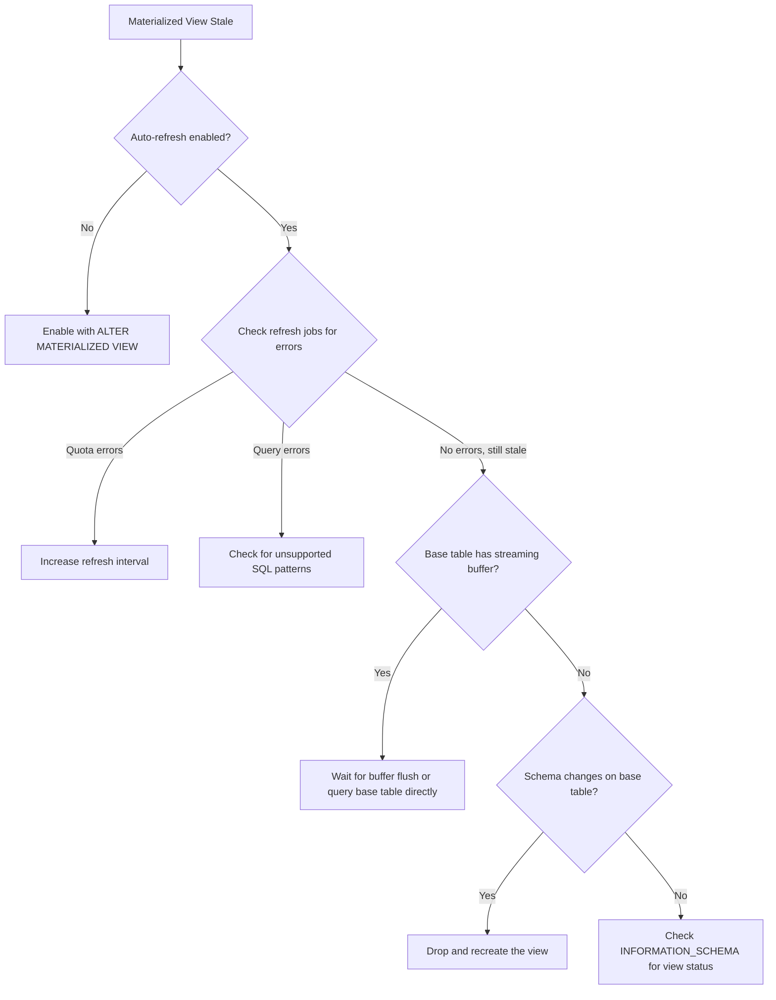

# How to Fix BigQuery Materialized View Auto-Refresh Failures and Staleness Issues

Author: [nawazdhandala](https://www.github.com/nawazdhandala)

Tags: GCP, BigQuery, Materialized Views, Auto-Refresh, Data Staleness, Performance

Description: Diagnose and fix BigQuery materialized view auto-refresh failures and staleness issues, including quota limits, query restrictions, and monitoring strategies.

---

Materialized views in BigQuery are powerful - they precompute expensive aggregations and BigQuery automatically refreshes them when the base tables change. At least, that is how it is supposed to work. In practice, you might find that your materialized view is stale, the auto-refresh is silently failing, or the view is not being used by the query optimizer at all.

Let me walk through the common issues and how to fix them.

## How Materialized View Auto-Refresh Works

BigQuery automatically refreshes materialized views within a few minutes of changes to the base tables. The refresh is incremental when possible - it only reprocesses the data that changed. However, there are conditions under which auto-refresh fails or is not triggered.

```sql
-- Check the last refresh time of a materialized view
SELECT
  table_name,
  creation_time,
  last_modified_time,
  TIMESTAMP_DIFF(CURRENT_TIMESTAMP(), last_modified_time, MINUTE) as minutes_since_refresh
FROM `my_dataset.INFORMATION_SCHEMA.TABLES`
WHERE table_type = 'MATERIALIZED_VIEW';
```

## Problem 1 - Auto-Refresh Disabled

The most basic issue. Auto-refresh might have been disabled during view creation or a subsequent update.

```sql
-- Check if auto-refresh is enabled
SELECT
  table_name,
  option_name,
  option_value
FROM `my_dataset.INFORMATION_SCHEMA.TABLE_OPTIONS`
WHERE table_name = 'my_materialized_view'
  AND option_name = 'enable_refresh';
```

To enable auto-refresh.

```sql
-- Enable auto-refresh on an existing materialized view
ALTER MATERIALIZED VIEW `my_dataset.my_materialized_view`
SET OPTIONS (enable_refresh = true);
```

When creating a new materialized view, auto-refresh is enabled by default, but you can also set a refresh interval.

```sql
-- Create a materialized view with explicit refresh settings
CREATE MATERIALIZED VIEW `my_dataset.daily_stats`
OPTIONS (
  enable_refresh = true,
  refresh_interval_minutes = 30  -- Refresh at most every 30 minutes
)
AS
SELECT
  DATE(event_timestamp) as day,
  event_type,
  COUNT(*) as event_count,
  SUM(revenue) as total_revenue
FROM `my_dataset.events`
GROUP BY day, event_type;
```

## Problem 2 - Base Table Has Streaming Buffer

When the base table has data in its streaming buffer, incremental refresh may not include the buffered rows. This creates a window where the materialized view appears stale.

```bash
# Check if the base table has a streaming buffer
bq show --format=prettyjson my_dataset.events | python3 -c "
import json, sys
table = json.load(sys.stdin)
buffer = table.get('streamingBuffer')
if buffer:
    print(f'Streaming buffer has ~{buffer.get(\"estimatedRows\", \"?\")} rows')
    print(f'Oldest entry: {buffer.get(\"oldestEntryTime\", \"?\")}')
else:
    print('No streaming buffer')
"
```

The materialized view will catch up once the streaming buffer is flushed to permanent storage. If you need real-time accuracy, query the base table directly instead of the materialized view.

## Problem 3 - Query Pattern Not Supported

Materialized views support a limited set of SQL operations. If you try to create a materialized view with unsupported operations, the creation succeeds but refresh might fail.

Supported operations:
- SELECT with aggregation functions (COUNT, SUM, AVG, MIN, MAX, etc.)
- GROUP BY
- WHERE clause with simple predicates
- INNER JOIN (with restrictions)

Not supported:
- OUTER JOINs
- Window functions
- Subqueries in the SELECT
- HAVING clause
- UNION
- Non-deterministic functions (CURRENT_TIMESTAMP, RAND, etc.)

```sql
-- This will fail to auto-refresh because of the window function
-- Don't do this:
CREATE MATERIALIZED VIEW `my_dataset.bad_mv` AS
SELECT
  user_id,
  ROW_NUMBER() OVER (PARTITION BY user_id ORDER BY event_time) as rn
FROM `my_dataset.events`;

-- Instead, use a supported pattern:
CREATE MATERIALIZED VIEW `my_dataset.good_mv` AS
SELECT
  user_id,
  COUNT(*) as event_count,
  MAX(event_time) as latest_event
FROM `my_dataset.events`
GROUP BY user_id;
```

## Problem 4 - Refresh Quota Exceeded

BigQuery limits how often materialized views can be refreshed. If you have many materialized views on the same base table, they might exceed the refresh quota.

```sql
-- Check refresh jobs for materialized views
SELECT
  job_id,
  creation_time,
  state,
  error_result.reason as error_reason,
  error_result.message as error_message,
  destination_table.table_id
FROM `region-us`.INFORMATION_SCHEMA.JOBS_BY_PROJECT
WHERE creation_time > TIMESTAMP_SUB(CURRENT_TIMESTAMP(), INTERVAL 24 HOUR)
  AND job_type = 'QUERY'
  AND statement_type = 'MATERIALIZED_VIEW_REFRESH'
ORDER BY creation_time DESC
LIMIT 20;
```

If you see errors related to rate limits, increase the `refresh_interval_minutes` on some views to spread out the refreshes.

```sql
-- Reduce refresh frequency for less critical views
ALTER MATERIALIZED VIEW `my_dataset.hourly_stats`
SET OPTIONS (refresh_interval_minutes = 120);
```

## Problem 5 - Materialized View Not Used by Query Optimizer

You created the materialized view, it is up to date, but BigQuery is not using it to accelerate your queries. The query optimizer only uses materialized views when the query pattern matches the view definition.

```sql
-- Check if a query used a materialized view
-- Run your query, then check the job details
SELECT
  job_id,
  materialized_view_statistics
FROM `region-us`.INFORMATION_SCHEMA.JOBS_BY_PROJECT
WHERE job_id = 'your-query-job-id';
```

The optimizer will use the materialized view when:
- The query references the same base table
- The query filters and aggregations are compatible with the view
- The view is not too stale

```sql
-- Materialized view
CREATE MATERIALIZED VIEW `my_dataset.mv_daily_revenue` AS
SELECT
  DATE(order_date) as day,
  product_category,
  SUM(revenue) as total_revenue,
  COUNT(*) as order_count
FROM `my_dataset.orders`
GROUP BY day, product_category;

-- This query WILL use the materialized view (compatible pattern)
SELECT product_category, SUM(total_revenue) as revenue
FROM `my_dataset.mv_daily_revenue`
WHERE day >= '2024-01-01'
GROUP BY product_category;

-- This query MIGHT use the materialized view (smart rewrite)
SELECT product_category, SUM(revenue) as revenue
FROM `my_dataset.orders`
WHERE DATE(order_date) >= '2024-01-01'
GROUP BY product_category;
```

## Problem 6 - Schema Changes on Base Table

If you modify the schema of the base table (adding columns, changing types), the materialized view might become invalid and stop refreshing.

```sql
-- Check for invalid materialized views
SELECT
  table_name,
  table_type,
  creation_time,
  last_modified_time
FROM `my_dataset.INFORMATION_SCHEMA.TABLES`
WHERE table_type = 'MATERIALIZED_VIEW';
```

If the view is invalid, you may need to drop and recreate it.

```sql
-- Drop the invalid view
DROP MATERIALIZED VIEW IF EXISTS `my_dataset.my_materialized_view`;

-- Recreate with the updated schema
CREATE MATERIALIZED VIEW `my_dataset.my_materialized_view`
OPTIONS (enable_refresh = true, refresh_interval_minutes = 30)
AS
SELECT
  DATE(event_timestamp) as day,
  event_type,
  new_column,  -- Include the new column
  COUNT(*) as event_count
FROM `my_dataset.events`
GROUP BY day, event_type, new_column;
```

## Monitoring Materialized View Health

Set up a regular check to monitor your materialized views.

```sql
-- Comprehensive materialized view health check
SELECT
  t.table_name,
  t.creation_time,
  t.last_modified_time,
  TIMESTAMP_DIFF(CURRENT_TIMESTAMP(), t.last_modified_time, MINUTE) as minutes_stale,
  o.option_value as refresh_enabled,
  CASE
    WHEN TIMESTAMP_DIFF(CURRENT_TIMESTAMP(), t.last_modified_time, MINUTE) > 120 THEN 'STALE'
    WHEN TIMESTAMP_DIFF(CURRENT_TIMESTAMP(), t.last_modified_time, MINUTE) > 60 THEN 'WARNING'
    ELSE 'OK'
  END as health_status
FROM `my_dataset.INFORMATION_SCHEMA.TABLES` t
LEFT JOIN `my_dataset.INFORMATION_SCHEMA.TABLE_OPTIONS` o
  ON t.table_name = o.table_name AND o.option_name = 'enable_refresh'
WHERE t.table_type = 'MATERIALIZED_VIEW'
ORDER BY minutes_stale DESC;
```

## Decision Flow



## Summary

BigQuery materialized view auto-refresh failures are usually caused by disabled refresh settings, unsupported SQL patterns, quota limits, or base table schema changes. Monitor your views using INFORMATION_SCHEMA queries, keep the view definitions simple (basic aggregations with GROUP BY), and be aware that streaming buffer data may not appear in the view immediately. When in doubt, check the refresh job history to see if there are error messages explaining the failure.
