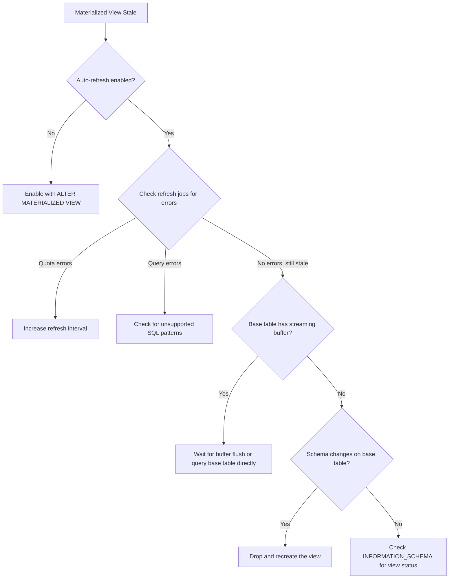

# How to Fix BigQuery Materialized View Auto-Refresh Failures and Staleness Issues

Author: [nawazdhandala](https://www.github.com/nawazdhandala)

Tags: GCP, BigQuery, Materialized View, Auto-Refresh, Data Staleness, Performance

Description: Diagnose and fix BigQuery materialized view auto-refresh failures and staleness issues, including quota limits, query restrictions, and monitoring strategies.

---

Materialized views in BigQuery are powerful - they precompute expensive aggregations and BigQuery automatically refreshes them when the base tables change. At least, that is how it is supposed to work. In practice, you might find that your materialized view is stale, the auto-refresh is silently failing, or the view is not being used by the query optimizer at all.

Let me walk through the common issues and how to fix them.

## How Materialized View Auto-Refresh Works

BigQuery automatically refreshes materialized views on a best-effort basis after changes to the base tables. By default, BigQuery tries to start a refresh within 5 minutes if the previous refresh was more than 30 minutes ago, but the start and completion times are not guaranteed. The refresh is incremental when possible - it only reprocesses the data that changed. However, there are conditions under which auto-refresh fails or is not triggered.

```sql
-- Check the last refresh time of a materialized view
SELECT
  table_name,
  last_refresh_time,
  refresh_watermark,
  TIMESTAMP_DIFF(CURRENT_TIMESTAMP(), refresh_watermark, MINUTE) as minutes_since_refresh,
  last_refresh_status
FROM `my_dataset.INFORMATION_SCHEMA.MATERIALIZED_VIEWS`;
```

## Problem 1 - Auto-Refresh Disabled

The most basic issue. Auto-refresh might have been disabled during view creation or a subsequent update.

```sql
-- Check if auto-refresh is enabled
SELECT
  table_name,
  option_name,
  option_value
FROM `my_dataset.INFORMATION_SCHEMA.TABLE_OPTIONS`
WHERE table_name = 'my_materialized_view'
  AND option_name = 'enable_refresh';
```

To enable auto-refresh.

```sql
-- Enable auto-refresh on an existing materialized view
ALTER MATERIALIZED VIEW `my_dataset.my_materialized_view`
SET OPTIONS (enable_refresh = true);
```

When creating a new materialized view, auto-refresh is enabled by default, but you can also set a refresh interval.

```sql
-- Create a materialized view with explicit refresh settings
CREATE MATERIALIZED VIEW `my_dataset.daily_stats`
OPTIONS (
  enable_refresh = true,
  refresh_interval_minutes = 30  -- Refresh at most every 30 minutes
)
AS
SELECT
  DATE(event_timestamp) as day,
  event_type,
  COUNT(*) as event_count,
  SUM(revenue) as total_revenue
FROM `my_dataset.events`
GROUP BY day, event_type;
```

## Problem 2 - Base Table Has Streaming Buffer

When the base table has data in its streaming buffer, querying the materialized view can still return fresh results by combining cached view data with base table changes, but it might be slower or cost more than expected. The streaming buffer is still useful to check when you are investigating why queries are not using only cached materialized view data.

```bash
# Check if the base table has a streaming buffer

bq show --format=prettyjson my_dataset.events | python3 -c "
import json, sys
table = json.load(sys.stdin)
buffer = table.get('streamingBuffer')
if buffer:
    print(f'Streaming buffer has ~{buffer.get(\"estimatedRows\", \"?\")} rows')
    print(f'Oldest entry: {buffer.get(\"oldestEntryTime\", \"?\")}')
else:
    print('No streaming buffer')
"
```

The materialized view cache will catch up once automatic or manual refresh processes the new data. If you need predictable latency during high-volume streaming ingestion, compare direct base table queries with materialized view queries and choose the lower-latency path for that workload.

## Problem 3 - Query Pattern Not Supported

Incremental materialized views support a limited set of SQL operations. If you try to create an incremental materialized view with unsupported operations, creation usually fails. If a later base table change makes the definition invalid, automatic refresh can fail and report the error in `INFORMATION_SCHEMA.MATERIALIZED_VIEWS.last_refresh_status`.

Supported operations:
- SELECT with aggregation functions (COUNT, SUM, AVG, MIN, MAX, etc.)
- GROUP BY
- WHERE clause with simple predicates
- INNER JOIN (with restrictions)

Not supported:
- RIGHT and FULL OUTER JOINs
- Window functions
- Subqueries in the SELECT
- HAVING clause
- UNION and standard UNION DISTINCT
- Non-deterministic functions (CURRENT_TIMESTAMP, RAND, etc.)

`LEFT OUTER JOIN` and `UNION ALL` are available for incremental materialized views in Preview, but smart tuning is not supported for materialized views that use them.

```sql
-- This will fail to create as an incremental materialized view because of the window function
-- Don't do this:
CREATE MATERIALIZED VIEW `my_dataset.bad_mv` AS
SELECT
  user_id,
  ROW_NUMBER() OVER (PARTITION BY user_id ORDER BY event_time) as rn
FROM `my_dataset.events`;

-- Instead, use a supported pattern:
CREATE MATERIALIZED VIEW `my_dataset.good_mv` AS
SELECT
  user_id,
  COUNT(*) as event_count,
  MAX(event_time) as latest_event
FROM `my_dataset.events`
GROUP BY user_id;
```

## Problem 4 - Refresh Quota Exceeded

BigQuery limits how often materialized views can be refreshed. If you have many materialized views on the same base table, they might exceed the refresh quota.

```sql
-- Check refresh jobs for materialized views
SELECT
  job_id,
  creation_time,
  state,
  error_result.reason as error_reason,
  error_result.message as error_message,
  total_slot_ms,
  total_bytes_processed,
  materialized_view_statistics.materialized_view[SAFE_OFFSET(0)].rejected_reason as full_refresh_reason
FROM `region-us`.INFORMATION_SCHEMA.JOBS_BY_PROJECT
WHERE creation_time > TIMESTAMP_SUB(CURRENT_TIMESTAMP(), INTERVAL 24 HOUR)
  AND job_id LIKE '%materialized_view_refresh_%'
ORDER BY creation_time DESC
LIMIT 20;
```

If you see errors related to rate limits, increase the `refresh_interval_minutes` on some views to spread out the refreshes.

```sql
-- Reduce refresh frequency for less critical views
ALTER MATERIALIZED VIEW `my_dataset.hourly_stats`
SET OPTIONS (refresh_interval_minutes = 120);
```

## Problem 5 - Materialized View Not Used by Query Optimizer

You created the materialized view, it is up to date, but BigQuery is not using it to accelerate your queries. The query optimizer only uses materialized views when the query pattern matches the view definition.

```sql
-- Check if a query used a materialized view
-- Run your query, then check the job details
SELECT
  job_id,
  materialized_view_statistics
FROM `region-us`.INFORMATION_SCHEMA.JOBS_BY_PROJECT
WHERE job_id = 'your-query-job-id';
```

The optimizer will use the materialized view when:
- The query references the same base table
- The query filters and aggregations are compatible with the view
- The materialized view includes all columns and rows needed by the query

```sql
-- Materialized view
CREATE MATERIALIZED VIEW `my_dataset.mv_daily_revenue` AS
SELECT
  DATE(order_date) as day,
  product_category,
  SUM(revenue) as total_revenue,
  COUNT(*) as order_count
FROM `my_dataset.orders`
GROUP BY day, product_category;

-- This query WILL use the materialized view (compatible pattern)
SELECT product_category, SUM(total_revenue) as revenue
FROM `my_dataset.mv_daily_revenue`
WHERE day >= '2024-01-01'
GROUP BY product_category;

-- This query MIGHT use the materialized view (smart rewrite)
SELECT product_category, SUM(revenue) as revenue
FROM `my_dataset.orders`
WHERE DATE(order_date) >= '2024-01-01'
GROUP BY product_category;
```

## Problem 6 - Schema Changes on Base Table

If you modify the schema of the base table (adding columns, changing types), the materialized view might become invalid and stop refreshing.

```sql
-- Check for invalid or failed materialized view refreshes
SELECT
  table_name,
  last_refresh_time,
  refresh_watermark,
  last_refresh_status
FROM `my_dataset.INFORMATION_SCHEMA.MATERIALIZED_VIEWS`
WHERE last_refresh_status IS NOT NULL;
```

If the view is invalid, for example because a referenced column was dropped from the base table, you may need to drop and recreate it.

```sql
-- Drop the invalid view
DROP MATERIALIZED VIEW IF EXISTS `my_dataset.my_materialized_view`;

-- Recreate with the updated schema
CREATE MATERIALIZED VIEW `my_dataset.my_materialized_view`
OPTIONS (enable_refresh = true, refresh_interval_minutes = 30)
AS
SELECT
  DATE(event_timestamp) as day,
  event_type,
  new_column,  -- Include the new column
  COUNT(*) as event_count
FROM `my_dataset.events`
GROUP BY day, event_type, new_column;
```

## Monitoring Materialized View Health

Set up a regular check to monitor your materialized views.

```sql
-- Comprehensive materialized view health check
SELECT
  mv.table_name,
  mv.last_refresh_time,
  mv.refresh_watermark,
  mv.last_refresh_status,
  TIMESTAMP_DIFF(CURRENT_TIMESTAMP(), mv.refresh_watermark, MINUTE) as minutes_stale,
  o.option_value as refresh_enabled,
  CASE
    WHEN mv.last_refresh_status IS NOT NULL THEN 'ERROR'
    WHEN TIMESTAMP_DIFF(CURRENT_TIMESTAMP(), mv.refresh_watermark, MINUTE) > 120 THEN 'STALE'
    WHEN TIMESTAMP_DIFF(CURRENT_TIMESTAMP(), mv.refresh_watermark, MINUTE) > 60 THEN 'WARNING'
    ELSE 'OK'
  END as health_status
FROM `my_dataset.INFORMATION_SCHEMA.MATERIALIZED_VIEWS` mv
LEFT JOIN `my_dataset.INFORMATION_SCHEMA.TABLE_OPTIONS` o
  ON mv.table_name = o.table_name AND o.option_name = 'enable_refresh'
ORDER BY minutes_stale DESC;
```

## Decision Flow


```mermaid
flowchart TD
    A[Materialized View Stale] --> B{Auto-refresh enabled?}
    B -->|No| C[Enable with ALTER MATERIALIZED VIEW]
    B -->|Yes| D{Check refresh jobs for errors}
    D -->|Quota errors| E[Increase refresh interval]
    D -->|Query errors| F[Check for unsupported SQL patterns]
    D -->|No errors, still stale| G{Base table has streaming buffer?}
    G -->|Yes| H[Wait for buffer flush or query base table directly]
    G -->|No| I{Schema changes on base table?}
    I -->|Yes| J[Drop and recreate the view]
    I -->|No| K[Check INFORMATION_SCHEMA for view status]
```

## Summary

BigQuery materialized view auto-refresh failures are usually caused by disabled refresh settings, unsupported SQL patterns, quota limits, or base table schema changes. Monitor your views using INFORMATION_SCHEMA queries, keep the view definitions simple (basic aggregations with GROUP BY), and be aware that streaming buffer data may not appear in the view immediately. When in doubt, check the refresh job history to see if there are error messages explaining the failure.
