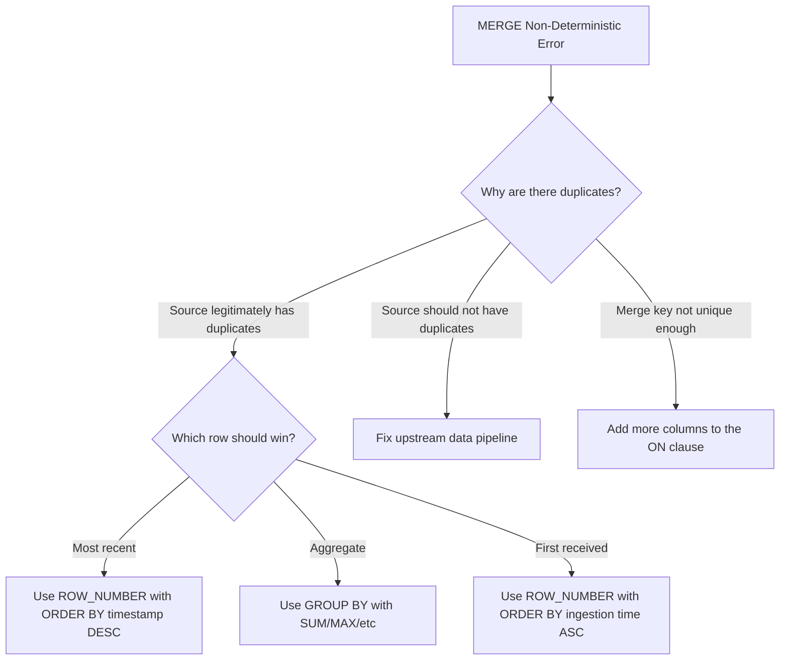

# How to Fix BigQuery MERGE Statement Generating UPDATE or DELETE with Non-Deterministic Match

Author: [nawazdhandala](https://www.github.com/nawazdhandala)

Tags: GCP, BigQuery, MERGE, DML, Upsert, Data Deduplication

Description: Fix BigQuery MERGE statement errors caused by non-deterministic matches where multiple source rows match a single target row, with deduplication strategies.

---

You are running a MERGE statement in BigQuery to upsert data, and you get this error: "UPDATE/MERGE must match at most one source row for each target row." This happens when your source data has duplicate rows for the same key, and BigQuery cannot determine which source row should be used to update the target row.

This is not a bug - it is BigQuery enforcing data integrity. If two source rows both match the same target row, which one should win? BigQuery refuses to guess and instead throws an error. Let me show you how to fix it.

## Understanding the Error

Consider this MERGE statement.

```sql
MERGE `my_dataset.target_table` T
USING `my_dataset.source_table` S
ON T.id = S.id
WHEN MATCHED THEN
  UPDATE SET T.value = S.value, T.updated_at = S.updated_at
WHEN NOT MATCHED THEN
  INSERT (id, value, updated_at) VALUES (S.id, S.value, S.updated_at);
```

If `source_table` has two rows with the same `id`, BigQuery does not know which row's `value` to use for the UPDATE. Should it use the first row? The second? There is no guaranteed ordering, so the result would be non-deterministic.

## Step 1 - Find the Duplicates

Before fixing the MERGE, identify the duplicate keys in your source data.

```sql
-- Find duplicate keys in the source data
SELECT
  id,
  COUNT(*) as duplicate_count
FROM `my_dataset.source_table`
GROUP BY id
HAVING COUNT(*) > 1
ORDER BY duplicate_count DESC
LIMIT 20;
```

Look at the actual duplicate rows to understand why they exist.

```sql
-- Examine the duplicate rows
SELECT *
FROM `my_dataset.source_table`
WHERE id IN (
  SELECT id
  FROM `my_dataset.source_table`
  GROUP BY id
  HAVING COUNT(*) > 1
)
ORDER BY id, updated_at DESC;
```

## Fix 1 - Deduplicate the Source Before Merging

The most common fix is to deduplicate the source data in the MERGE statement itself, using a subquery with ROW_NUMBER.

```sql
-- Deduplicate source by keeping the most recent row per id
MERGE `my_dataset.target_table` T
USING (
  SELECT * EXCEPT(row_num)
  FROM (
    SELECT *,
      ROW_NUMBER() OVER (PARTITION BY id ORDER BY updated_at DESC) as row_num
    FROM `my_dataset.source_table`
  )
  WHERE row_num = 1
) S
ON T.id = S.id
WHEN MATCHED THEN
  UPDATE SET
    T.value = S.value,
    T.updated_at = S.updated_at
WHEN NOT MATCHED THEN
  INSERT (id, value, updated_at)
  VALUES (S.id, S.value, S.updated_at);
```

The ROW_NUMBER window function assigns a number to each row within a partition of the same `id`, ordered by `updated_at` descending. The `WHERE row_num = 1` keeps only the most recent row.

## Fix 2 - Aggregate the Source Data

If instead of picking one row you want to aggregate the duplicates, use GROUP BY.

```sql
-- Aggregate source data before merging
MERGE `my_dataset.target_table` T
USING (
  SELECT
    id,
    SUM(value) as value,  -- Aggregate instead of picking one
    MAX(updated_at) as updated_at
  FROM `my_dataset.source_table`
  GROUP BY id
) S
ON T.id = S.id
WHEN MATCHED THEN
  UPDATE SET
    T.value = S.value,
    T.updated_at = S.updated_at
WHEN NOT MATCHED THEN
  INSERT (id, value, updated_at)
  VALUES (S.id, S.value, S.updated_at);
```

## Fix 3 - Use QUALIFY for Cleaner Deduplication

BigQuery supports the QUALIFY clause, which is a more concise way to filter window function results.

```sql
-- Cleaner deduplication using QUALIFY
MERGE `my_dataset.target_table` T
USING (
  SELECT *
  FROM `my_dataset.source_table`
  QUALIFY ROW_NUMBER() OVER (PARTITION BY id ORDER BY updated_at DESC) = 1
) S
ON T.id = S.id
WHEN MATCHED THEN
  UPDATE SET
    T.value = S.value,
    T.updated_at = S.updated_at
WHEN NOT MATCHED THEN
  INSERT (id, value, updated_at)
  VALUES (S.id, S.value, S.updated_at);
```

## Fix 4 - Fix the Source Data

If duplicates in the source should not exist, fix the upstream data instead of working around it.

```sql
-- Create a clean source table with no duplicates
CREATE OR REPLACE TABLE `my_dataset.source_table_clean` AS
SELECT * EXCEPT(row_num)
FROM (
  SELECT *,
    ROW_NUMBER() OVER (PARTITION BY id ORDER BY updated_at DESC) as row_num
  FROM `my_dataset.source_table`
)
WHERE row_num = 1;

-- Now MERGE with the clean source
MERGE `my_dataset.target_table` T
USING `my_dataset.source_table_clean` S
ON T.id = S.id
WHEN MATCHED THEN
  UPDATE SET
    T.value = S.value,
    T.updated_at = S.updated_at
WHEN NOT MATCHED THEN
  INSERT (id, value, updated_at)
  VALUES (S.id, S.value, S.updated_at);
```

## Fix 5 - Use a Composite Key

Sometimes the issue is that your merge key is not unique enough. Adding more columns to the ON clause can resolve the ambiguity.

```sql
-- Use a composite key to make the match unique
MERGE `my_dataset.target_table` T
USING `my_dataset.source_table` S
ON T.id = S.id AND T.version = S.version  -- Composite key
WHEN MATCHED THEN
  UPDATE SET
    T.value = S.value,
    T.updated_at = S.updated_at
WHEN NOT MATCHED THEN
  INSERT (id, version, value, updated_at)
  VALUES (S.id, S.version, S.value, S.updated_at);
```

## Handling Different Deduplication Strategies

Depending on your use case, you might want different deduplication logic.

```sql
-- Strategy 1: Keep the most recent row
QUALIFY ROW_NUMBER() OVER (PARTITION BY id ORDER BY updated_at DESC) = 1

-- Strategy 2: Keep the row with the highest value
QUALIFY ROW_NUMBER() OVER (PARTITION BY id ORDER BY value DESC) = 1

-- Strategy 3: Keep the first row received (by ingestion time)
QUALIFY ROW_NUMBER() OVER (PARTITION BY id ORDER BY _PARTITIONTIME ASC) = 1

-- Strategy 4: Keep the row with the most complete data
QUALIFY ROW_NUMBER() OVER (
  PARTITION BY id
  ORDER BY
    CASE WHEN value IS NOT NULL THEN 1 ELSE 0 END +
    CASE WHEN name IS NOT NULL THEN 1 ELSE 0 END +
    CASE WHEN email IS NOT NULL THEN 1 ELSE 0 END
  DESC
) = 1
```

## Production MERGE Pattern

Here is the pattern I use for production upsert pipelines that handles duplicates, tracks changes, and is idempotent.

```sql
-- Production-grade MERGE with deduplication and change tracking
MERGE `my_dataset.customers` T
USING (
  -- Deduplicate the staging data
  SELECT * FROM (
    SELECT
      customer_id,
      name,
      email,
      phone,
      updated_at,
      -- Keep the most recent record per customer
      ROW_NUMBER() OVER (
        PARTITION BY customer_id
        ORDER BY updated_at DESC
      ) as dedup_rank
    FROM `my_dataset.staging_customers`
    WHERE customer_id IS NOT NULL  -- Skip null keys
  )
  WHERE dedup_rank = 1
) S
ON T.customer_id = S.customer_id
WHEN MATCHED AND (
  -- Only update if data actually changed
  T.name != S.name OR
  T.email != S.email OR
  T.phone != S.phone OR
  T.name IS NULL != S.name IS NULL OR
  T.email IS NULL != S.email IS NULL
) THEN
  UPDATE SET
    T.name = S.name,
    T.email = S.email,
    T.phone = S.phone,
    T.updated_at = S.updated_at,
    T.last_modified = CURRENT_TIMESTAMP()
WHEN NOT MATCHED THEN
  INSERT (customer_id, name, email, phone, updated_at, created_at, last_modified)
  VALUES (S.customer_id, S.name, S.email, S.phone, S.updated_at, CURRENT_TIMESTAMP(), CURRENT_TIMESTAMP());
```

## Decision Flow



## Summary

The BigQuery MERGE non-deterministic match error happens when multiple source rows match a single target row. The fix is almost always to deduplicate the source data in the USING clause, either by picking the best row with ROW_NUMBER or by aggregating duplicates with GROUP BY. Use the QUALIFY clause for cleaner syntax, and always validate that your merge key is unique in the source before running the MERGE.
