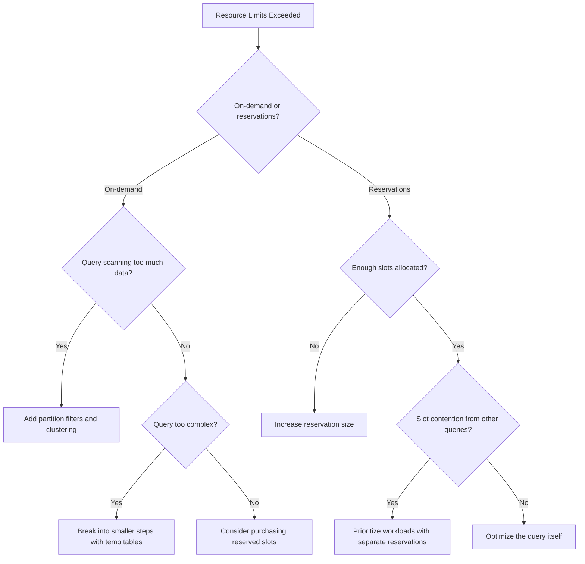

# How to Fix BigQuery Query Exceeded Resource Limits and Optimize Slot Usage

Author: [nawazdhandala](https://www.github.com/nawazdhandala)

Tags: GCP, BigQuery, Slot Usage, Resource Limits, Query Optimization, Cost Management

Description: Learn how to fix BigQuery resource limit errors by understanding slot allocation, optimizing queries, and managing reservations for better performance.

---

You ran a BigQuery query and got hit with "Query exceeded resource limits" or "Resources exceeded during query execution." Your query might have been running for a while before failing, which makes it even more frustrating. This error means your query demanded more compute resources (slots) than were available or allowed.

Understanding how BigQuery allocates resources and how to write queries that use them efficiently is key to avoiding this problem. Let me break it down.

## What Are BigQuery Slots?

A slot is BigQuery's unit of computational capacity. It represents a combination of CPU, memory, and I/O resources. When you run a query, BigQuery breaks it into stages and assigns slots to execute each stage.

If you are on on-demand pricing, you share a pool of slots (typically up to 2000 per project) with other on-demand users in your region. If you are on capacity pricing (reservations), you have a fixed number of slots allocated to your organization.

```bash
# Check your current slot usage with INFORMATION_SCHEMA
bq query --use_legacy_sql=false '
SELECT
  period_start,
  SUM(total_slot_ms) / 1000 / 60 as total_slot_minutes,
  COUNT(*) as query_count
FROM `region-us`.INFORMATION_SCHEMA.JOBS_BY_PROJECT
WHERE creation_time > TIMESTAMP_SUB(CURRENT_TIMESTAMP(), INTERVAL 1 HOUR)
GROUP BY period_start
ORDER BY period_start DESC
LIMIT 10'
```

## Why Resource Limits Are Exceeded

### Too Much Data Scanned

The most common cause. Queries that scan huge amounts of data without proper filtering consume enormous resources.

```sql
-- Bad: scans the entire table
SELECT * FROM `my-project.my_dataset.huge_table`
WHERE EXTRACT(YEAR FROM created_at) = 2024;

-- Better: use a partitioned column in the WHERE clause
SELECT * FROM `my-project.my_dataset.huge_table`
WHERE created_at BETWEEN '2024-01-01' AND '2024-12-31';
```

If your table is partitioned by `created_at`, the second query skips partitions outside the date range, dramatically reducing the data scanned.

### Large Joins with Skewed Data

Joins where one side has highly skewed key distribution can cause individual slots to run out of memory.

```sql
-- This can fail if user_id has a few very popular values
SELECT o.*, u.name
FROM `my_dataset.orders` o
JOIN `my_dataset.users` u ON o.user_id = u.user_id;

-- Fix: filter before joining to reduce the data volume
SELECT o.*, u.name
FROM (
  SELECT * FROM `my_dataset.orders`
  WHERE order_date > '2024-01-01'  -- Reduce the orders table first
) o
JOIN `my_dataset.users` u ON o.user_id = u.user_id;
```

### Overly Complex Queries

Queries with many CTEs, subqueries, and window functions can exceed the query complexity limits.

## Diagnosing the Issue

### Check the Query Execution Plan

The execution plan shows how BigQuery processed your query and where it spent resources.

```bash
# Get the execution details for a failed job
bq show -j <job-id> --format=prettyjson
```

In the Cloud Console, go to BigQuery, find your query in the Query History, and click on the execution details. Look for:
- Stages with high `slotMs` values - these consumed the most resources
- Stages with high `shuffleOutputBytes` - these moved a lot of data between stages
- Stages with `waitMsAvg` significantly higher than `readMsAvg` or `computeMsAvg` - these were waiting for slots

### Check INFORMATION_SCHEMA for Resource Usage

```sql
-- Find the most resource-intensive queries in the last 24 hours
SELECT
  job_id,
  user_email,
  query,
  total_slot_ms,
  total_bytes_processed,
  TIMESTAMP_DIFF(end_time, start_time, SECOND) as duration_seconds
FROM `region-us`.INFORMATION_SCHEMA.JOBS_BY_PROJECT
WHERE creation_time > TIMESTAMP_SUB(CURRENT_TIMESTAMP(), INTERVAL 24 HOUR)
  AND state = 'DONE'
  AND job_type = 'QUERY'
ORDER BY total_slot_ms DESC
LIMIT 20;
```

## Fixing Resource Limit Errors

### Strategy 1 - Reduce Data Scanned

Use partition pruning and clustering to minimize the data BigQuery needs to read.

```sql
-- Create a partitioned and clustered table
CREATE TABLE `my_dataset.orders_optimized`
PARTITION BY DATE(order_date)
CLUSTER BY customer_id, region
AS SELECT * FROM `my_dataset.orders`;

-- Queries that filter on order_date and customer_id will be much faster
SELECT *
FROM `my_dataset.orders_optimized`
WHERE order_date BETWEEN '2024-06-01' AND '2024-06-30'
  AND customer_id = 'CUST-12345';
```

### Strategy 2 - Break Up Large Queries

Instead of one massive query, break it into smaller steps using temporary tables.

```sql
-- Step 1: Create a filtered intermediate table
CREATE TEMP TABLE filtered_orders AS
SELECT order_id, customer_id, total_amount, order_date
FROM `my_dataset.orders`
WHERE order_date BETWEEN '2024-01-01' AND '2024-12-31';

-- Step 2: Join with the smaller intermediate table
SELECT fo.*, c.name, c.region
FROM filtered_orders fo
JOIN `my_dataset.customers` c ON fo.customer_id = c.customer_id;

-- Step 3: Aggregate the results
SELECT c.region, SUM(fo.total_amount) as total_revenue
FROM filtered_orders fo
JOIN `my_dataset.customers` c ON fo.customer_id = c.customer_id
GROUP BY c.region;
```

### Strategy 3 - Use Approximate Functions

For analytics queries, approximate functions use significantly fewer resources.

```sql
-- Exact count distinct - resource intensive
SELECT COUNT(DISTINCT user_id) as unique_users
FROM `my_dataset.events`
WHERE event_date BETWEEN '2024-01-01' AND '2024-12-31';

-- Approximate count distinct - much faster and lighter
SELECT APPROX_COUNT_DISTINCT(user_id) as approx_unique_users
FROM `my_dataset.events`
WHERE event_date BETWEEN '2024-01-01' AND '2024-12-31';
```

### Strategy 4 - Purchase Reserved Slots

If you consistently hit resource limits, on-demand pricing might not provide enough slots for your workload.

```bash
# Create a reservation with 500 slots
bq mk --reservation \
    --project_id=my-project \
    --location=US \
    --reservation_id=my-reservation \
    --slots=500

# Create a reservation assignment for your project
bq mk --reservation_assignment \
    --project_id=my-project \
    --location=US \
    --reservation_id=my-reservation \
    --assignee_id=my-project \
    --assignee_type=PROJECT \
    --job_type=QUERY
```

### Strategy 5 - Use Materialized Views

For queries that run frequently on the same data, materialized views precompute the results.

```sql
-- Create a materialized view for a common aggregation
CREATE MATERIALIZED VIEW `my_dataset.daily_revenue`
AS
SELECT
  DATE(order_date) as day,
  region,
  COUNT(*) as order_count,
  SUM(total_amount) as total_revenue
FROM `my_dataset.orders`
GROUP BY day, region;

-- Queries against this view use precomputed results
SELECT * FROM `my_dataset.daily_revenue`
WHERE day BETWEEN '2024-06-01' AND '2024-06-30';
```

## Monitoring Slot Usage

Set up monitoring to track your slot usage over time and catch issues before they cause failures.

```sql
-- Monitor slot utilization over the past week
SELECT
  TIMESTAMP_TRUNC(period_start, HOUR) as hour,
  SUM(period_slot_ms) / 1000 / 3600 as slot_hours,
  MAX(period_slot_ms) / 1000 as peak_slot_seconds
FROM `region-us`.INFORMATION_SCHEMA.JOBS_TIMELINE_BY_PROJECT
WHERE period_start > TIMESTAMP_SUB(CURRENT_TIMESTAMP(), INTERVAL 7 DAY)
GROUP BY hour
ORDER BY hour DESC;
```



## Summary

BigQuery resource limit errors come from queries demanding more compute than is available. The fix usually involves reducing the data your query processes (partition pruning, clustering, filtering early), simplifying the query (breaking it into steps, using approximate functions), or increasing your compute capacity (reserved slots). Start by checking INFORMATION_SCHEMA to understand which queries are consuming the most resources, then optimize from there.
