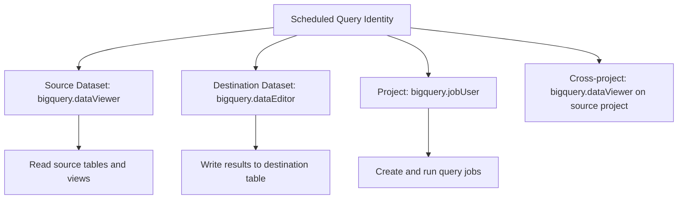

# How to Fix BigQuery Scheduled Query Failing with Access Denied to Dataset Error

Author: [nawazdhandala](https://www.github.com/nawazdhandala)

Tags: GCP, BigQuery, Scheduled Queries, Access Denied, IAM, Permissions

Description: Fix BigQuery scheduled query failures caused by access denied to dataset errors, covering service account permissions, cross-project access, and transfer configurations.

---

Your BigQuery scheduled query worked fine when you ran it manually, but when it runs on schedule it fails with "Access Denied: Dataset my_dataset: User does not have permission." This is a classic permission issue that happens because scheduled queries run under a different identity than your personal account.

Let me explain exactly why this happens and how to fix it.

## Why Scheduled Queries Fail with Access Denied

When you create a BigQuery scheduled query, it runs using the BigQuery Data Transfer Service. The query executes under one of two identities:

1. **Your user account** (default for simple setups) - uses your personal credentials with a refresh token
2. **A service account** (recommended for production) - uses a dedicated service account

The issue is that the identity running the scheduled query might not have access to the source datasets, destination datasets, or both.

## Step 1 - Identify What Identity the Scheduled Query Uses

```bash
# List your scheduled queries (transfers)
bq ls --transfer_config --transfer_location=us

# Get details about a specific scheduled query
bq show --transfer_config <config-id>
```

You can also check in the Cloud Console under BigQuery > Scheduled Queries.

Look at the "Credentials" section. It shows which account is used to run the query.

## Step 2 - Check the Error Details

```bash
# List recent runs of a scheduled query
bq ls --transfer_run --transfer_location=us <config-id>

# Get details about a failed run
bq show --transfer_run <run-id>
```

The error message usually tells you exactly which dataset or table the identity cannot access.

## Step 3 - Fix Permissions for User Account Credentials

If the scheduled query uses your user account, the issue might be that your credentials have expired or your permissions have changed.

### Refresh Credentials

```bash
# Update the scheduled query to refresh credentials
bq update --transfer_config \
    --update_credentials \
    <config-id>
```

This prompts you to re-authenticate, which generates a new refresh token.

### Grant Dataset Access

If you never had access to the dataset, or access was revoked, you need the appropriate role.

```bash
# Grant BigQuery Data Viewer on the source dataset
bq show --format=prettyjson my_project:my_dataset

# Add yourself to the dataset ACL
bq update --source my_project:source_dataset \
    --set_label="description:Updated access"
```

Or use gcloud.

```bash
# Grant BigQuery Data Viewer role at the dataset level
gcloud projects add-iam-policy-binding my-project \
    --member="user:your-email@company.com" \
    --role="roles/bigquery.dataViewer"
```

## Step 4 - Switch to Service Account Credentials (Recommended)

Using a service account is more reliable because it does not depend on your personal credentials staying valid.

```bash
# Create a dedicated service account for scheduled queries
gcloud iam service-accounts create bq-scheduler \
    --display-name="BigQuery Scheduled Query Runner"
```

Grant the necessary permissions.

```bash
# Grant BigQuery Job User to run queries
gcloud projects add-iam-policy-binding my-project \
    --member="serviceAccount:bq-scheduler@my-project.iam.gserviceaccount.com" \
    --role="roles/bigquery.jobUser"

# Grant BigQuery Data Viewer on source datasets
gcloud projects add-iam-policy-binding my-project \
    --member="serviceAccount:bq-scheduler@my-project.iam.gserviceaccount.com" \
    --role="roles/bigquery.dataViewer"

# Grant BigQuery Data Editor on the destination dataset
bq update \
    --dataset \
    --source <(echo '{
      "access": [
        {
          "role": "WRITER",
          "userByEmail": "bq-scheduler@my-project.iam.gserviceaccount.com"
        }
      ]
    }') \
    my_project:destination_dataset
```

Then update the scheduled query to use the service account.

```bash
# Update the scheduled query to use the service account
bq update --transfer_config \
    --service_account_name=bq-scheduler@my-project.iam.gserviceaccount.com \
    <config-id>
```

## Step 5 - Fix Cross-Project Access

If your scheduled query reads from datasets in other projects, the running identity needs permissions in those projects too.

```bash
# Grant access to a dataset in another project
# The service account from project-a needs access to project-b's dataset
gcloud projects add-iam-policy-binding project-b \
    --member="serviceAccount:bq-scheduler@project-a.iam.gserviceaccount.com" \
    --role="roles/bigquery.dataViewer"
```

Or grant access at the dataset level if you want finer control.

```sql
-- Grant access at the dataset level using BigQuery SQL
GRANT `roles/bigquery.dataViewer`
ON SCHEMA `project-b.shared_dataset`
TO "serviceAccount:bq-scheduler@project-a.iam.gserviceaccount.com";
```

## Step 6 - Verify Destination Table Permissions

The running identity needs write access to the destination table and dataset.

```bash
# Check existing dataset permissions
bq show --format=prettyjson my_project:destination_dataset | python3 -c "
import json, sys
ds = json.load(sys.stdin)
for entry in ds.get('access', []):
    print(entry)
"
```

The service account needs either the `WRITER` role on the destination dataset or the `roles/bigquery.dataEditor` role at the project level.

## Step 7 - Check for VPC Service Controls

If your organization uses VPC Service Controls, the perimeter might be blocking the scheduled query's service account from accessing resources.

```bash
# Check for VPC-SC violations in the audit logs
gcloud logging read \
    'protoPayload.status.code=7 AND protoPayload.serviceName="bigquery.googleapis.com"' \
    --project=my-project \
    --limit=10 \
    --format="table(timestamp, protoPayload.status.message)"
```

If you see VPC-SC violations, you need to add the Data Transfer Service and the service account to the access level of your service perimeter.

## Common Permissions Required

Here is a reference for the minimum permissions needed by the scheduled query identity.



For the exact IAM roles:
- `roles/bigquery.jobUser` - create and run query jobs
- `roles/bigquery.dataViewer` - read data from source tables
- `roles/bigquery.dataEditor` - write data to destination tables

## Testing the Fix

After updating permissions, trigger a manual run of the scheduled query.

```bash
# Trigger a manual run
bq mk --transfer_run \
    --run_time=$(date -u +"%Y-%m-%dT%H:%M:%SZ") \
    <config-id>

# Check the run status
bq ls --transfer_run --transfer_location=us <config-id>
```

## Prevention Checklist

1. Always use a service account for production scheduled queries
2. Grant the minimum required permissions (not project-level Owner or Editor)
3. Test the query manually using the service account before scheduling
4. Set up email notifications for failed scheduled queries
5. Document which service accounts have access to which datasets
6. Review permissions when datasets are moved or renamed

## Summary

BigQuery scheduled query access denied errors happen because the query runs under a different identity than your personal account. The fix is to ensure the running identity (user account or service account) has the correct permissions on both source and destination datasets. For production workloads, always use a dedicated service account with the minimum required roles: bigquery.jobUser, bigquery.dataViewer on source datasets, and bigquery.dataEditor on destination datasets. After updating permissions, trigger a manual run to verify the fix.
