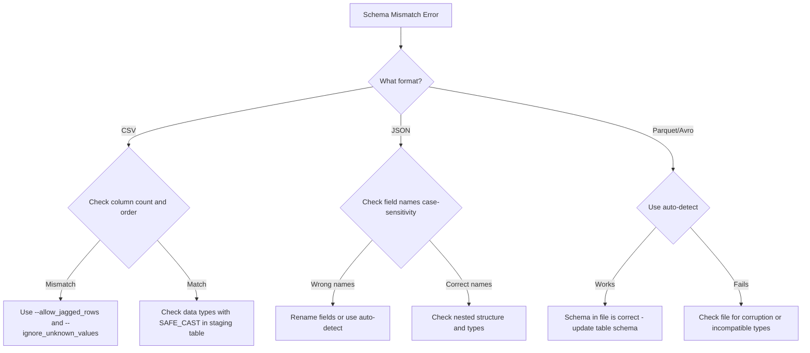

# How to Fix BigQuery Schema Mismatch Errors When Loading Data from Cloud Storage

Author: [nawazdhandala](https://www.github.com/nawazdhandala)

Tags: GCP, BigQuery, Schema, Cloud Storage, Data Loading, ETL

Description: Fix BigQuery schema mismatch errors when loading CSV, JSON, Parquet, and Avro data from Cloud Storage, with solutions for common type conflicts and structural issues.

---

Loading data from Cloud Storage into BigQuery should be straightforward - point BigQuery at a file, define the schema, and let it load. But in practice, schema mismatch errors are one of the most common failures. The data in your file does not match what BigQuery expects, and the error messages can range from helpful to completely cryptic.

This post covers the most common schema mismatch scenarios and how to fix each one.

## Understanding Schema Mismatch Errors

When you load data into BigQuery, the system compares the structure of the incoming data with the target table schema. If there is a mismatch, the load job fails. Common error messages include:

- "Error while reading data, error message: Could not parse as INT64"
- "Provided Schema does not match Table"
- "JSON parsing error in row starting at position X"
- "CSV table encountered too many errors"

```bash
# Check the error details for a failed load job
bq show -j <job-id> --format=prettyjson | python3 -c "
import json, sys
job = json.load(sys.stdin)
errors = job.get('status', {}).get('errors', [])
for e in errors:
    print(f\"Reason: {e.get('reason')}\")
    print(f\"Message: {e.get('message')}\")
    print()
"
```

## Mismatch 1 - Data Type Conflicts

The most common mismatch. Your schema says a field is INT64, but the file contains a string value for that field.

```bash
# Your table schema expects an integer
# Schema: [{"name": "user_id", "type": "INT64"}, {"name": "value", "type": "FLOAT64"}]

# But your CSV has:
# user_id,value
# 123,45.6
# abc,78.9   <-- "abc" is not an integer
```

Fix by either correcting the data or adjusting the schema.

```bash
# Option 1: Allow some bad rows to be skipped
bq load \
    --source_format=CSV \
    --skip_leading_rows=1 \
    --max_bad_records=100 \
    my_dataset.my_table \
    gs://my-bucket/data.csv \
    user_id:INT64,value:FLOAT64

# Option 2: Load as STRING first, then transform
bq load \
    --source_format=CSV \
    --skip_leading_rows=1 \
    my_dataset.staging_table \
    gs://my-bucket/data.csv \
    user_id:STRING,value:STRING
```

Then transform in BigQuery.

```sql
-- Transform and load into the final table with proper types
INSERT INTO `my_dataset.my_table` (user_id, value)
SELECT
  SAFE_CAST(user_id AS INT64) as user_id,
  SAFE_CAST(value AS FLOAT64) as value
FROM `my_dataset.staging_table`
WHERE SAFE_CAST(user_id AS INT64) IS NOT NULL;
```

## Mismatch 2 - Extra or Missing Columns in CSV

CSV files do not have column names embedded (unless you use a header row), so the number and order of columns must match exactly.

```bash
# Your schema has 3 fields: id, name, value
# But your CSV has 4 columns per row:
# 1,Alice,42,extra_field

# Fix: tell BigQuery to allow extra columns
bq load \
    --source_format=CSV \
    --skip_leading_rows=1 \
    --allow_jagged_rows \
    --ignore_unknown_values \
    my_dataset.my_table \
    gs://my-bucket/data.csv \
    id:INT64,name:STRING,value:INT64
```

The flags:
- `--allow_jagged_rows`: allows rows with fewer columns than the schema (missing columns default to NULL)
- `--ignore_unknown_values`: ignores extra columns not in the schema

## Mismatch 3 - JSON Field Name Differences

When loading newline-delimited JSON, field names must match the schema exactly (case-sensitive).

```json
{"UserId": 123, "value": 42}
```

If your schema defines the field as `user_id` but the JSON has `UserId`, the field will be null (or the load will fail depending on whether the field is required).

```bash
# Load with auto-detect to see what BigQuery infers from the JSON
bq load \
    --source_format=NEWLINE_DELIMITED_JSON \
    --autodetect \
    my_dataset.temp_table \
    gs://my-bucket/data.json

# Check the inferred schema
bq show --schema my_dataset.temp_table
```

If field names do not match, you have a few options.

```sql
-- Option 1: Load into a temp table and rename columns
CREATE TABLE `my_dataset.final_table` AS
SELECT
  UserId as user_id,  -- Rename to match your convention
  value
FROM `my_dataset.temp_table`;
```

```python
# Option 2: Transform the JSON before loading
import json
from google.cloud import storage

def fix_field_names(bucket_name, source_blob, dest_blob):
    """Rename JSON fields to match the BigQuery schema."""
    client = storage.Client()
    bucket = client.bucket(bucket_name)

    # Read the source file
    source = bucket.blob(source_blob)
    content = source.download_as_text()

    # Transform each line
    fixed_lines = []
    for line in content.strip().split('\n'):
        record = json.loads(line)
        # Rename fields to match schema
        fixed = {
            'user_id': record.get('UserId'),
            'value': record.get('value'),
        }
        fixed_lines.append(json.dumps(fixed))

    # Write the fixed file
    dest = bucket.blob(dest_blob)
    dest.upload_from_string('\n'.join(fixed_lines))
```

## Mismatch 4 - Nested and Repeated Field Issues

Loading data with nested structures (STRUCT/RECORD) or repeated fields (ARRAY) requires careful schema definition.

```json
{"id": 1, "tags": ["red", "blue"], "address": {"city": "NYC", "zip": "10001"}}
```

The schema for this needs to be.

```json
[
  {"name": "id", "type": "INT64"},
  {"name": "tags", "type": "STRING", "mode": "REPEATED"},
  {
    "name": "address",
    "type": "RECORD",
    "fields": [
      {"name": "city", "type": "STRING"},
      {"name": "zip", "type": "STRING"}
    ]
  }
]
```

```bash
# Load with the explicit schema file
bq load \
    --source_format=NEWLINE_DELIMITED_JSON \
    my_dataset.my_table \
    gs://my-bucket/data.json \
    schema.json
```

## Mismatch 5 - Parquet/Avro Schema Evolution

When loading Parquet or Avro files, the file contains its own schema. If this does not match the target table, you get an error.

```bash
# Check the schema of a Parquet file before loading
# (requires pyarrow locally)
python3 -c "
import pyarrow.parquet as pq
schema = pq.read_schema('local_copy.parquet')
print(schema)
"
```

Common Parquet schema mismatches:
- INT32 in Parquet vs INT64 in BigQuery
- BYTE_ARRAY in Parquet vs STRING in BigQuery
- Missing logical type annotations for timestamps

```bash
# Load Parquet with schema auto-detection (recommended)
bq load \
    --source_format=PARQUET \
    --autodetect \
    my_dataset.my_table \
    gs://my-bucket/data.parquet
```

## Mismatch 6 - Schema Changes in Append Mode

When appending data to an existing table, the incoming data schema must be compatible with the existing table schema.

```bash
# This will fail if the new file has a different schema
bq load \
    --source_format=CSV \
    --write_disposition=WRITE_APPEND \
    my_dataset.my_table \
    gs://my-bucket/new_data.csv
```

To add new columns while appending.

```bash
# Allow schema updates when appending
bq load \
    --source_format=NEWLINE_DELIMITED_JSON \
    --write_disposition=WRITE_APPEND \
    --schema_update_option=ALLOW_FIELD_ADDITION \
    my_dataset.my_table \
    gs://my-bucket/new_data.json
```

## Debugging Strategy



## Prevention Best Practices

1. Use auto-detect for initial loads to see what BigQuery infers
2. Load into a staging table first, then transform and insert into the final table
3. Use Parquet or Avro instead of CSV when possible - they carry schema information
4. Set `max_bad_records` to catch and skip a few bad rows without failing the entire load
5. Validate your data files before loading with a local tool

## Summary

BigQuery schema mismatch errors when loading from Cloud Storage are usually caused by data type conflicts, column count differences, case-sensitive field name issues, or schema evolution problems. The safest approach is to use auto-detect or load into a staging table with STRING types first, then transform into the correct types using SAFE_CAST. For production pipelines, use self-describing formats like Parquet or Avro to minimize schema issues.
