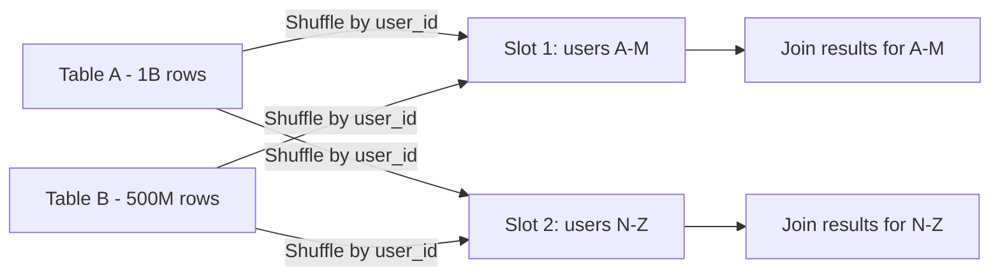

# How to Fix BigQuery Shuffle Operation Resources Exceeded Error on Large Joins

Author: [nawazdhandala](https://www.github.com/nawazdhandala)

Tags: GCP, BigQuery, Shuffle, Joins, Query Optimization, Performance

Description: Fix BigQuery shuffle operation resources exceeded errors on large joins by restructuring queries, reducing data volume, and handling data skew effectively.

---

You are running a BigQuery query that joins two large tables, and it fails with "Resources exceeded during query execution: The query could not be executed in the allotted memory" or "Shuffle operation resources exceeded." This error occurs when the shuffle phase - where BigQuery redistributes data across processing slots for a join or aggregation - requires more memory than a single slot can handle.

This is not just a matter of throwing more resources at the problem. You need to restructure your query to reduce the amount of data being shuffled. Here is how.

## What Is a Shuffle in BigQuery?

When BigQuery performs a join, it needs to make sure that matching rows end up on the same processing slot. To do this, it redistributes (shuffles) data based on the join key. If you are joining two tables each with a billion rows on a `user_id` column, BigQuery sends all rows with the same `user_id` to the same slot.

The problem arises when:
1. The total amount of data being shuffled is massive
2. A single join key value has an enormous number of matching rows (data skew)
3. The intermediate results of the join are very wide (many columns)



When one slot receives too much data (say 95% of a table has `user_id = NULL`), that slot runs out of memory.

## Fix 1 - Filter Before Joining

The most effective fix is reducing the data volume before the join. Only select the columns you need and apply filters as early as possible.

```sql
-- Bad: joins entire tables with all columns
SELECT *
FROM `my_dataset.orders` o
JOIN `my_dataset.order_items` oi ON o.order_id = oi.order_id;

-- Good: filter and select only needed columns before joining
SELECT
  o.order_id,
  o.customer_id,
  o.order_date,
  oi.product_id,
  oi.quantity,
  oi.price
FROM (
  -- Filter orders first to reduce shuffle volume
  SELECT order_id, customer_id, order_date
  FROM `my_dataset.orders`
  WHERE order_date >= '2024-01-01'
) o
JOIN (
  -- Select only needed columns from order items
  SELECT order_id, product_id, quantity, price
  FROM `my_dataset.order_items`
) oi ON o.order_id = oi.order_id;
```

This reduces both the number of rows and the width of each row being shuffled.

## Fix 2 - Handle Data Skew

Data skew is the most common cause of shuffle memory errors. If your join key has a few values with millions of rows and many values with a handful, the slots handling the popular values get overwhelmed.

First, identify the skew.

```sql
-- Find the most common values in your join key
SELECT
  join_key_column,
  COUNT(*) as row_count,
  ROUND(COUNT(*) * 100.0 / SUM(COUNT(*)) OVER(), 2) as percentage
FROM `my_dataset.large_table`
GROUP BY join_key_column
ORDER BY row_count DESC
LIMIT 20;
```

If you see NULL values or a few keys dominating, handle them separately.

```sql
-- Separate approach for skewed and non-skewed data
-- Step 1: Handle the common case (non-null, non-skewed keys)
SELECT a.*, b.category_name
FROM `my_dataset.products` a
JOIN `my_dataset.categories` b ON a.category_id = b.category_id
WHERE a.category_id IS NOT NULL
  AND a.category_id NOT IN ('UNCATEGORIZED', 'OTHER')

UNION ALL

-- Step 2: Handle the skewed keys with a broadcast join hint
SELECT a.*, b.category_name
FROM `my_dataset.products` a
JOIN `my_dataset.categories` b ON a.category_id = b.category_id
WHERE a.category_id IN ('UNCATEGORIZED', 'OTHER')

UNION ALL

-- Step 3: Handle NULL keys
SELECT a.*, CAST(NULL AS STRING) as category_name
FROM `my_dataset.products` a
WHERE a.category_id IS NULL;
```

## Fix 3 - Use Approximate Joins for Analytics

If you are joining for analytical purposes and do not need exact results, consider using approximate aggregation.

```sql
-- Instead of joining and counting distinct
-- SELECT COUNT(DISTINCT a.user_id)
-- FROM table_a a JOIN table_b b ON a.id = b.id

-- Use APPROX_COUNT_DISTINCT which is more memory-efficient
SELECT APPROX_COUNT_DISTINCT(a.user_id)
FROM `my_dataset.events` a
WHERE a.event_type = 'purchase'
  AND EXISTS (
    SELECT 1 FROM `my_dataset.users` b
    WHERE a.user_id = b.user_id AND b.country = 'US'
  );
```

## Fix 4 - Break the Query into Steps

For very large joins, materializing intermediate results in temporary tables can be more efficient than trying to do everything in one query.

```sql
-- Step 1: Create a filtered, narrow version of the large table
CREATE TEMP TABLE filtered_events AS
SELECT
  event_id,
  user_id,
  event_type,
  event_timestamp
FROM `my_dataset.events`
WHERE event_timestamp >= '2024-01-01'
  AND event_type IN ('purchase', 'signup', 'pageview');

-- Step 2: Create a filtered version of the second table
CREATE TEMP TABLE active_users AS
SELECT user_id, signup_date, country
FROM `my_dataset.users`
WHERE last_active_date >= '2024-06-01';

-- Step 3: Now join the smaller intermediate tables
SELECT
  fe.event_type,
  au.country,
  COUNT(*) as event_count,
  COUNT(DISTINCT fe.user_id) as unique_users
FROM filtered_events fe
JOIN active_users au ON fe.user_id = au.user_id
GROUP BY fe.event_type, au.country;
```

Each step independently fits within resource limits, and BigQuery can optimize each step separately.

## Fix 5 - Use Partitioned and Clustered Tables

If your tables are partitioned and clustered on the join key, BigQuery can skip irrelevant data during the shuffle.

```sql
-- Create a table clustered by the join key
CREATE TABLE `my_dataset.orders_clustered`
PARTITION BY DATE(order_date)
CLUSTER BY customer_id
AS SELECT * FROM `my_dataset.orders`;

CREATE TABLE `my_dataset.returns_clustered`
PARTITION BY DATE(return_date)
CLUSTER BY customer_id
AS SELECT * FROM `my_dataset.returns`;

-- Joining clustered tables on the cluster key is more efficient
SELECT o.order_id, r.return_reason
FROM `my_dataset.orders_clustered` o
JOIN `my_dataset.returns_clustered` r
  ON o.customer_id = r.customer_id
  AND o.order_id = r.order_id
WHERE o.order_date >= '2024-01-01'
  AND r.return_date >= '2024-01-01';
```

## Fix 6 - Use Window Functions Instead of Self-Joins

Self-joins are a common pattern that often causes shuffle issues. Window functions can frequently replace them.

```sql
-- Bad: self-join to find the previous order for each customer
SELECT a.order_id, a.order_date, b.order_date as previous_order_date
FROM `my_dataset.orders` a
LEFT JOIN `my_dataset.orders` b
  ON a.customer_id = b.customer_id
  AND b.order_date < a.order_date
  AND b.order_date = (
    SELECT MAX(order_date) FROM `my_dataset.orders` c
    WHERE c.customer_id = a.customer_id AND c.order_date < a.order_date
  );

-- Good: use LAG window function instead
SELECT
  order_id,
  order_date,
  LAG(order_date) OVER (
    PARTITION BY customer_id ORDER BY order_date
  ) as previous_order_date
FROM `my_dataset.orders`;
```

Window functions process data in a streaming fashion within each partition, avoiding the massive shuffle of a self-join.

## Fix 7 - Consider Using BigQuery BI Engine

For frequently-run analytical queries on smaller datasets (up to a few hundred GB), BI Engine keeps data in memory and avoids the shuffle altogether.

```bash
# Create a BI Engine reservation
bq mk --bi_reservation \
    --project_id=my-project \
    --location=US \
    --reservation_size=10G
```

## Diagnosing Shuffle Issues in the Execution Plan

When you look at the execution plan for a failed query, pay attention to these indicators.

```sql
-- After running your query, check the job stats
SELECT
  j.job_id,
  stage.name as stage_name,
  stage.shuffleOutputBytes,
  stage.shuffleOutputBytesSpilled,
  stage.slotMs,
  stage.recordsRead,
  stage.recordsWritten
FROM `region-us`.INFORMATION_SCHEMA.JOBS_BY_PROJECT j,
UNNEST(j.job_stages) as stage
WHERE j.job_id = 'your-job-id'
ORDER BY stage.shuffleOutputBytes DESC;
```

High `shuffleOutputBytesSpilled` indicates that shuffle data exceeded memory and spilled to disk, which is a major performance bottleneck and a precursor to resource exceeded errors.

## Summary

BigQuery shuffle resource errors are caused by trying to move too much data between processing slots during joins and aggregations. The fixes are: reduce data volume before joins (filter early, select only needed columns), handle data skew by separating hot keys, break large queries into intermediate steps, use window functions instead of self-joins, and leverage clustering on join keys. Always check the execution plan for high shuffle bytes and spilled bytes to identify which stage is causing the problem.
