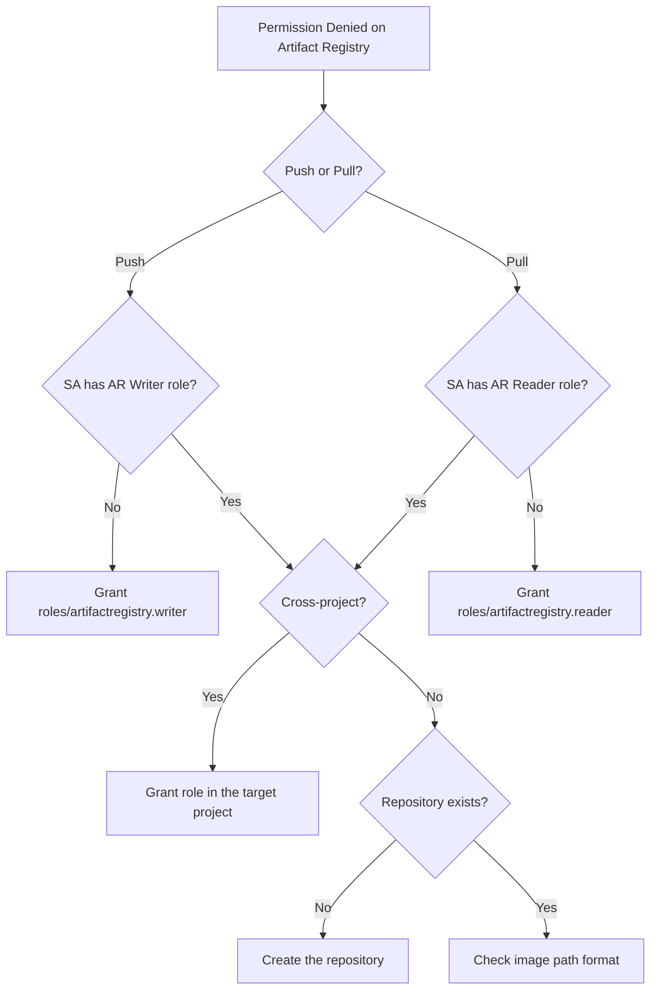

# How to Fix Cloud Build Service Account Permission Denied Accessing Artifact Registry

Author: [nawazdhandala](https://www.github.com/nawazdhandala)

Tags: GCP, Cloud Build, Artifact Registry, IAM, CI/CD

Description: Resolve permission denied errors when Cloud Build service accounts try to push or pull images from Google Cloud Artifact Registry repositories.

---

Your Cloud Build pipeline fails with a permission denied error when trying to push an image to Artifact Registry. Or maybe it cannot pull a base image from a private registry. Either way, the build was working yesterday and now it is not, or you just set up a new repository and builds cannot access it. The IAM model between Cloud Build and Artifact Registry has a few gotchas that are easy to miss.

## Understanding the Service Accounts Involved

Cloud Build uses different service accounts depending on your configuration:

1. The default Cloud Build service account: `PROJECT_NUMBER@cloudbuild.gserviceaccount.com`
2. The legacy Cloud Build service account (older projects): `PROJECT_ID@cloudbuild.gserviceaccount.com`
3. A user-specified service account (if configured in the build trigger or submission)

Recent changes to Google Cloud may affect which roles are granted by default. In newer projects, the default Cloud Build service account might not have broad permissions, so you need to grant them explicitly.

## Step 1: Identify Which Service Account Is Being Used

Check the build configuration to see which service account runs the build:

```bash
# Check recent build details
gcloud builds describe BUILD_ID \
    --format="json(serviceAccount, options)"
```

If `serviceAccount` is empty, the build uses the default Cloud Build service account. You can also check the build trigger:

```bash
# List build triggers and their service account configuration
gcloud builds triggers list \
    --format="table(name, serviceAccount, createTime)"
```

## Step 2: Check Current Permissions

See what roles the service account currently has:

```bash
# Check project-level IAM for the Cloud Build SA
gcloud projects get-iam-policy YOUR_PROJECT \
    --flatten="bindings[].members" \
    --filter="bindings.members:cloudbuild.gserviceaccount.com" \
    --format="table(bindings.role)"
```

Also check repository-level IAM:

```bash
# Check IAM on the specific Artifact Registry repository
gcloud artifacts repositories get-iam-policy your-repo \
    --location=us-central1 \
    --format="table(bindings.role, bindings.members)"
```

## Step 3: Grant Artifact Registry Permissions

For pushing images, the service account needs `roles/artifactregistry.writer`. For pulling images, it needs `roles/artifactregistry.reader`.

Grant at the project level (applies to all repos):

```bash
# Grant Artifact Registry Writer to the Cloud Build SA
gcloud projects add-iam-policy-binding YOUR_PROJECT \
    --member="serviceAccount:PROJECT_NUMBER@cloudbuild.gserviceaccount.com" \
    --role="roles/artifactregistry.writer"
```

Or grant at the repository level (more restrictive):

```bash
# Grant on a specific repository only
gcloud artifacts repositories add-iam-policy-binding your-repo \
    --location=us-central1 \
    --member="serviceAccount:PROJECT_NUMBER@cloudbuild.gserviceaccount.com" \
    --role="roles/artifactregistry.writer"
```

If you are using a custom service account:

```bash
# Grant permissions to a custom service account
gcloud artifacts repositories add-iam-policy-binding your-repo \
    --location=us-central1 \
    --member="serviceAccount:my-custom-sa@YOUR_PROJECT.iam.gserviceaccount.com" \
    --role="roles/artifactregistry.writer"
```

## Step 4: Handle Cross-Project Access

If your Artifact Registry repository is in a different project than your Cloud Build, you need cross-project IAM:

```bash
# Grant the Cloud Build SA from Project A access to Artifact Registry in Project B
gcloud artifacts repositories add-iam-policy-binding your-repo \
    --project=project-b \
    --location=us-central1 \
    --member="serviceAccount:PROJECT_A_NUMBER@cloudbuild.gserviceaccount.com" \
    --role="roles/artifactregistry.writer"
```

For pulling base images from a different project:

```bash
# Grant reader access for pulling base images
gcloud artifacts repositories add-iam-policy-binding base-images-repo \
    --project=shared-images-project \
    --location=us-central1 \
    --member="serviceAccount:PROJECT_NUMBER@cloudbuild.gserviceaccount.com" \
    --role="roles/artifactregistry.reader"
```

## Step 5: Check for the Docker Credential Helper

When Cloud Build uses Docker commands to push or pull, it needs the Artifact Registry credential helper configured. This is usually automatic, but can break if you are using a custom Docker configuration.

In your `cloudbuild.yaml`, make sure Docker is configured to authenticate:

```yaml
steps:
  # Step 1: Configure Docker authentication for Artifact Registry
  - name: 'gcr.io/cloud-builders/docker'
    entrypoint: 'bash'
    args:
      - '-c'
      - |
        # Configure Docker to use gcloud for authentication
        gcloud auth configure-docker us-central1-docker.pkg.dev --quiet

  # Step 2: Build and push the image
  - name: 'gcr.io/cloud-builders/docker'
    args:
      - 'build'
      - '-t'
      - 'us-central1-docker.pkg.dev/$PROJECT_ID/my-repo/my-image:$COMMIT_SHA'
      - '.'

  - name: 'gcr.io/cloud-builders/docker'
    args:
      - 'push'
      - 'us-central1-docker.pkg.dev/$PROJECT_ID/my-repo/my-image:$COMMIT_SHA'
```

The `gcloud auth configure-docker` command sets up the credential helper so that `docker push` and `docker pull` authenticate automatically.

## Step 6: Check If the Repository Exists

A surprisingly common issue - the Artifact Registry repository must be created before you push to it:

```bash
# List existing repositories
gcloud artifacts repositories list \
    --location=us-central1 \
    --format="table(name, format, mode)"

# Create a Docker repository if it does not exist
gcloud artifacts repositories create your-repo \
    --repository-format=docker \
    --location=us-central1 \
    --description="Docker images for CI/CD"
```

Unlike Container Registry (gcr.io) which creates repositories automatically, Artifact Registry requires explicit repository creation.

## Step 7: Verify the Image Path Format

Artifact Registry uses a different URL format than Container Registry:

```
# Container Registry (old - being deprecated)
gcr.io/PROJECT_ID/IMAGE_NAME:TAG

# Artifact Registry (current)
LOCATION-docker.pkg.dev/PROJECT_ID/REPOSITORY/IMAGE_NAME:TAG
```

Common mistakes with the Artifact Registry path:
- Missing the repository name (it is required, unlike gcr.io)
- Wrong location prefix (us-central1 vs us, etc.)
- Using `.io` instead of `.dev`

```yaml
# Correct image path for Artifact Registry
steps:
  - name: 'gcr.io/cloud-builders/docker'
    args:
      - 'build'
      - '-t'
      # Note the full path: location-docker.pkg.dev/project/repo/image:tag
      - 'us-central1-docker.pkg.dev/$PROJECT_ID/my-repo/my-image:$COMMIT_SHA'
      - '.'
```

## Step 8: Handle the Default Service Account Deprecation

Google Cloud has been tightening default permissions for service accounts. In newer projects, the Cloud Build service account may not have the `roles/editor` role that was previously granted by default. If your builds suddenly stop working, this might be the cause.

Check if the default Cloud Build service account has the necessary roles:

```bash
# Check if the Cloud Build SA has basic roles
gcloud projects get-iam-policy YOUR_PROJECT \
    --flatten="bindings[].members" \
    --filter="bindings.members:PROJECT_NUMBER@cloudbuild.gserviceaccount.com" \
    --format="table(bindings.role)"
```

If `roles/editor` or `roles/cloudbuild.builds.builder` is missing, you need to grant specific roles:

```bash
# Grant the minimum roles needed for Cloud Build with Artifact Registry
gcloud projects add-iam-policy-binding YOUR_PROJECT \
    --member="serviceAccount:PROJECT_NUMBER@cloudbuild.gserviceaccount.com" \
    --role="roles/artifactregistry.writer"

gcloud projects add-iam-policy-binding YOUR_PROJECT \
    --member="serviceAccount:PROJECT_NUMBER@cloudbuild.gserviceaccount.com" \
    --role="roles/storage.objectViewer"

gcloud projects add-iam-policy-binding YOUR_PROJECT \
    --member="serviceAccount:PROJECT_NUMBER@cloudbuild.gserviceaccount.com" \
    --role="roles/logging.logWriter"
```

## Debugging Flowchart



## Monitoring Build Pipelines

Use [OneUptime](https://oneuptime.com) to monitor Cloud Build success rates and catch permission failures early. Tracking build failures over time helps you identify patterns - like permissions breaking after infrastructure changes - and fix them before they block your deployment pipeline.

The key to avoiding permission issues is to explicitly grant the minimum required roles and not rely on overly broad default permissions. This is more secure and more predictable.
