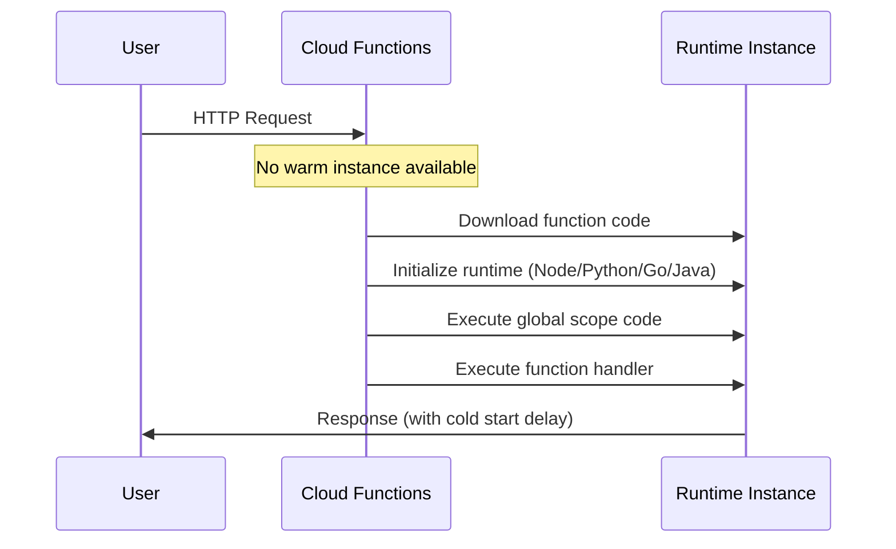

# How to Fix Cloud Functions 504 Timeout Errors Caused by Cold Starts

Author: [nawazdhandala](https://www.github.com/nawazdhandala)

Tags: GCP, Cloud Functions, Cold Start, Serverless, Performance

Description: Learn how to diagnose and fix 504 timeout errors in Google Cloud Functions caused by cold starts, with strategies for reducing cold start latency and keeping instances warm.

---

Your Cloud Function works most of the time, but occasionally users get 504 Gateway Timeout errors. When you check the logs, the function took 30+ seconds to respond - far longer than usual. The culprit is almost always a cold start.

Cold starts happen when Cloud Functions has to spin up a new instance of your function from scratch. This includes downloading your code, initializing the runtime, and running your global/module-level initialization code. For some functions, this can add 5-30 seconds of latency on top of the actual execution time.

## Understanding Cold Starts

A cold start occurs when:
- The function has not been called recently and all instances were scaled to zero
- Traffic spikes and new instances need to be created
- You deploy a new version (all existing instances are replaced)

The cold start timeline:



## Measuring Cold Start Impact

First, quantify how bad the problem is:

```bash
# Check function execution times in logs
# Look for outliers that are much slower than average
gcloud functions logs read my-function \
    --region=us-central1 \
    --limit=100 \
    --format="table(executionId, duration, status)"

# Check for timeout errors specifically
gcloud logging read \
    'resource.type="cloud_function" AND resource.labels.function_name="my-function" AND textPayload=~"timeout"' \
    --project=my-project \
    --limit=20
```

You can also use Cloud Monitoring to see the execution time distribution:

```bash
# Query execution duration metrics
gcloud monitoring metrics list \
    --filter="metric.type = cloudfunctions.googleapis.com/function/execution_times"
```

## Strategy 1: Increase the Function Timeout

The quickest fix is to increase the timeout so cold starts do not cause 504 errors:

```bash
# Increase the function timeout to 120 seconds (default is 60)
gcloud functions deploy my-function \
    --runtime=nodejs20 \
    --trigger-http \
    --timeout=120 \
    --region=us-central1 \
    --source=.
```

This does not fix the cold start latency, but it prevents 504 errors. Maximum timeout is 540 seconds for HTTP functions and 540 seconds for event-driven functions.

## Strategy 2: Set Minimum Instances

The most effective solution is keeping instances warm by setting a minimum instance count:

```bash
# Keep at least 1 instance warm at all times
# This eliminates cold starts for baseline traffic
gcloud functions deploy my-function \
    --runtime=nodejs20 \
    --trigger-http \
    --min-instances=1 \
    --region=us-central1 \
    --source=.
```

For Cloud Functions 2nd gen:

```bash
# 2nd gen functions use Cloud Run under the hood
gcloud functions deploy my-function \
    --gen2 \
    --runtime=nodejs20 \
    --trigger-http \
    --min-instances=1 \
    --region=us-central1 \
    --source=.
```

The trade-off: minimum instances cost money even when idle. One warm instance of a 256MB function costs roughly $5-10/month depending on the region. But if cold start latency is costing you users, it is usually worth it.

## Strategy 3: Optimize Global Scope Initialization

Everything in your global scope runs during cold start. Move heavy operations out of the global scope or make them lazy.

Bad - heavy initialization in global scope:

```javascript
// Bad: This runs on every cold start
const admin = require('firebase-admin');
admin.initializeApp();
const db = admin.firestore();

// This query runs during cold start, adding seconds of latency
const config = await db.collection('config').doc('main').get();
const cache = await buildExpensiveCache();

exports.handler = async (req, res) => {
    // Function logic using config and cache
    res.json({ data: cache.get(req.query.key) });
};
```

Better - lazy initialization:

```javascript
// Better: Initialize Firebase once (lightweight)
const admin = require('firebase-admin');
admin.initializeApp();
const db = admin.firestore();

// Lazy-load expensive resources
let config = null;
let cache = null;

async function getConfig() {
    // Only fetch config on first invocation, not during cold start
    if (!config) {
        config = await db.collection('config').doc('main').get();
        cache = await buildExpensiveCache(config.data());
    }
    return { config, cache };
}

exports.handler = async (req, res) => {
    const { cache } = await getConfig();
    res.json({ data: cache.get(req.query.key) });
};
```

## Strategy 4: Use a Lighter Runtime

Different runtimes have different cold start characteristics:

| Runtime | Typical Cold Start | Notes |
|---|---|---|
| Go | 100-300ms | Fastest cold starts |
| Node.js | 300-800ms | Fast, but depends on dependencies |
| Python | 500ms-2s | Moderate, depends on imports |
| Java | 3-10s | Slowest, JVM startup overhead |
| .NET | 1-3s | CLR initialization |

If cold start latency is critical, consider using Go or Node.js instead of Java.

## Strategy 5: Reduce Package Size

Larger deployment packages take longer to load:

```bash
# Check your current deployment size
du -sh ./function-directory/

# For Node.js, use production dependencies only
npm install --omit=dev

# Remove unnecessary files from the deployment
# Use .gcloudignore to exclude files
```

Create a `.gcloudignore` file:

```
# .gcloudignore - files to exclude from deployment
node_modules/
tests/
*.test.js
*.spec.js
docs/
.git/
README.md
```

For Python, avoid importing heavy libraries at the top level:

```python
# Bad: Importing heavy libraries at module level
import pandas as pd
import numpy as np
from tensorflow import keras

def handler(request):
    # Use pandas, numpy, keras
    pass
```

```python
# Better: Import heavy libraries only when needed
def handler(request):
    import pandas as pd
    import numpy as np
    # Use them here
    pass
```

## Strategy 6: Use Cloud Functions 2nd Gen

Cloud Functions 2nd gen (built on Cloud Run) generally has better cold start performance and more configuration options:

```bash
# Deploy as 2nd gen function
gcloud functions deploy my-function \
    --gen2 \
    --runtime=nodejs20 \
    --trigger-http \
    --min-instances=1 \
    --cpu=1 \
    --memory=512MB \
    --concurrency=80 \
    --region=us-central1 \
    --source=.
```

Key advantages of 2nd gen:
- Concurrency support (one instance handles multiple requests)
- Startup CPU boost
- Longer maximum timeout (up to 60 minutes for event-driven)
- Better cold start performance overall

## Strategy 7: Implement a Warmup Mechanism

If you do not want to pay for minimum instances, you can use Cloud Scheduler to periodically ping your function:

```bash
# Create a Cloud Scheduler job that calls the function every 5 minutes
gcloud scheduler jobs create http warmup-my-function \
    --schedule="*/5 * * * *" \
    --uri="https://us-central1-my-project.cloudfunctions.net/my-function" \
    --http-method=GET \
    --headers="X-Warmup=true" \
    --oidc-service-account-email=scheduler-sa@my-project.iam.gserviceaccount.com
```

Handle the warmup request in your function:

```javascript
// Handle warmup requests quickly to keep the instance alive
exports.handler = async (req, res) => {
    if (req.headers['x-warmup'] === 'true') {
        res.status(200).send('warm');
        return;
    }

    // Normal function logic
    const result = await processRequest(req);
    res.json(result);
};
```

This is a hacky solution compared to minimum instances, but it costs less (Cloud Scheduler pricing is minimal).

## Monitoring Cold Starts

Set up monitoring to track cold start frequency and impact:

```bash
# Create an alert for high function latency
gcloud alpha monitoring policies create \
    --notification-channels=CHANNEL_ID \
    --display-name="Function Cold Start Alert" \
    --condition-display-name="Function latency above 10s" \
    --condition-filter='resource.type="cloud_function" AND metric.type="cloudfunctions.googleapis.com/function/execution_times"' \
    --condition-threshold-value=10000 \
    --condition-threshold-comparison=COMPARISON_GT
```

Cold starts are a fundamental trade-off of serverless computing. You trade always-on infrastructure costs for occasional startup latency. The strategies above let you find the right balance between cost and performance for your use case.
