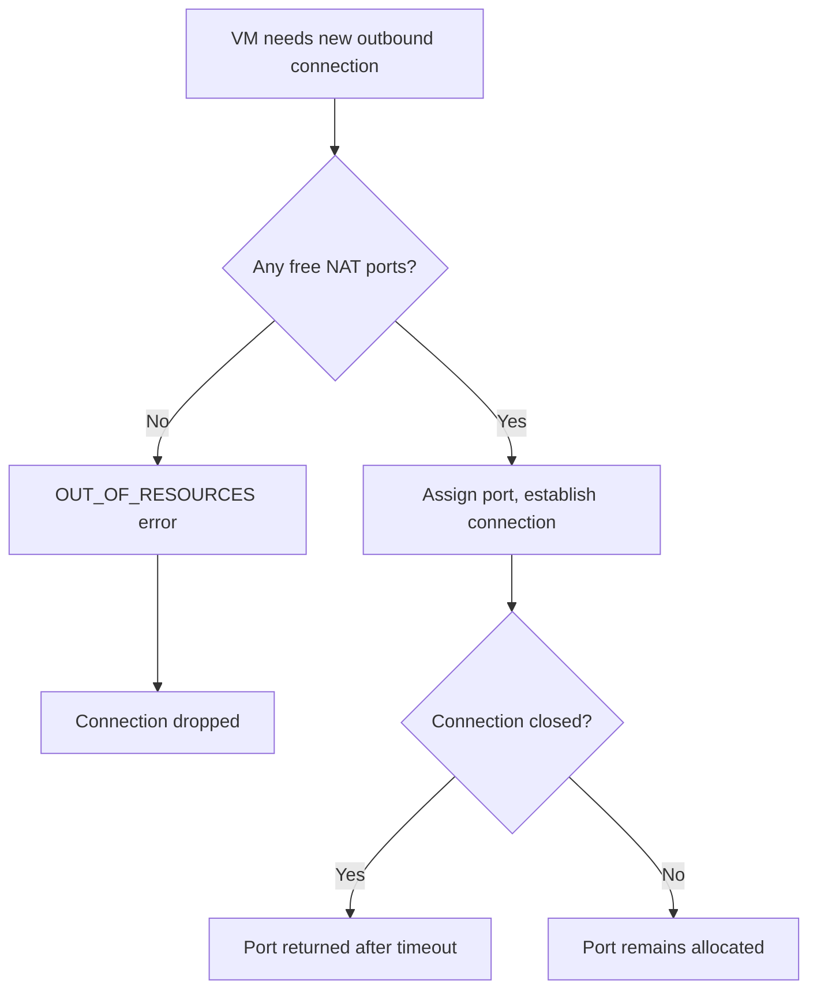

# How to Fix Cloud NAT Port Exhaustion Errors in GCP

Author: [nawazdhandala](https://www.github.com/nawazdhandala)

Tags: GCP, Cloud NAT, Port Exhaustion, Troubleshooting, Networking

Description: Diagnose and resolve Cloud NAT port exhaustion errors that cause dropped connections and OUT_OF_RESOURCES failures for your GCP workloads.

---

Port exhaustion is the most common Cloud NAT issue in production environments. It happens when your VMs need more outbound connections than the available NAT ports can handle. The symptoms are frustrating - intermittent connection failures, dropped packets, timeouts to external services, and `OUT_OF_RESOURCES` errors in your NAT logs. The good news is that it is fixable once you understand how NAT port allocation works.

## Understanding NAT Port Allocation

Every outbound connection through Cloud NAT uses a unique source port. The combination of NAT IP address and source port identifies the connection. Here is the math:

- Each NAT IP address provides ports 1024 through 65535 = 64,512 usable ports
- By default, Cloud NAT allocates a minimum of 64 ports per VM
- With static port allocation, each VM gets exactly the minimum allocation
- With dynamic port allocation, VMs can get more ports as needed up to a maximum

Port exhaustion occurs when all allocated ports for a VM are in use and a new connection is needed.



## Step 1: Confirm Port Exhaustion

First, verify that port exhaustion is actually the problem:

```bash
# Check for port exhaustion in NAT logs
gcloud logging read \
  'resource.type="nat_gateway" AND jsonPayload.allocation_status="DROPPED"' \
  --project=your-project-id \
  --limit=20 \
  --format="table(timestamp, jsonPayload.connection.src_ip, jsonPayload.connection.dest_ip, jsonPayload.connection.dest_port)"
```

If you see results, port exhaustion is confirmed. The `src_ip` field tells you which VM is exhausting its ports.

Also check Cloud Monitoring for the `nat/port_usage` metric:

```bash
# Get NAT port usage statistics
gcloud monitoring metrics list \
  --filter='metric.type="router.googleapis.com/nat/port_usage"' \
  --project=your-project-id
```

## Step 2: Identify the Cause

Port exhaustion typically has one of these root causes:

### Too Many Concurrent Connections from a Single VM

A VM making thousands of outbound connections simultaneously will exhaust its port allocation. Common culprits:

- Web scrapers or crawlers
- Load testing tools
- Applications that open many connections to external databases
- Microservices making many parallel API calls

### Connection Pooling Issues

Applications that do not reuse connections (no HTTP keep-alive, no connection pooling) create and destroy connections rapidly. Each closed connection keeps its port allocated until the TCP TIME_WAIT timer expires (120 seconds by default).

### Too Many VMs Sharing Too Few NAT IPs

If you have many VMs and few NAT IPs, the total port pool gets divided up quickly:

```
Total available ports = Number of NAT IPs x 64,512
Max VMs (at 64 ports each) = Total available ports / 64
```

With 1 NAT IP and 64 ports per VM, you can support about 1,008 VMs. But if each VM needs more than 64 concurrent connections, that number drops fast.

## Step 3: Fix - Increase Minimum Ports Per VM

The quickest fix is to increase the minimum port allocation:

```bash
# Increase minimum ports per VM
gcloud compute routers nats update your-nat-gateway \
  --router=your-router \
  --region=us-central1 \
  --min-ports-per-vm=512 \
  --project=your-project-id
```

Choose a value based on your peak concurrent connection count per VM. Common settings:

| Use Case | Suggested Min Ports |
|----------|-------------------|
| Light web browsing, package updates | 64 (default) |
| Application calling a few external APIs | 256 |
| Application with moderate external connections | 512 |
| Heavy API consumers, crawlers | 1024-4096 |
| Load testing, scraping workloads | 4096-16384 |

## Step 4: Fix - Enable Dynamic Port Allocation

Dynamic port allocation is usually the best solution. Instead of statically assigning ports, it lets VMs borrow more ports when they need them:

```bash
# Enable dynamic port allocation
gcloud compute routers nats update your-nat-gateway \
  --router=your-router \
  --region=us-central1 \
  --enable-dynamic-port-allocation \
  --min-ports-per-vm=64 \
  --max-ports-per-vm=4096 \
  --project=your-project-id
```

With this configuration:
- Each VM starts with 64 ports
- If a VM needs more, it automatically gets more up to 4,096
- Unused ports are returned to the pool for other VMs
- This maximizes utilization of your NAT IP pool

## Step 5: Fix - Add More NAT IP Addresses

If all your VMs genuinely need high port counts simultaneously, add more NAT IPs:

```bash
# Reserve additional static IPs
gcloud compute addresses create nat-ip-3 --region=us-central1
gcloud compute addresses create nat-ip-4 --region=us-central1

# Update NAT to use additional IPs
gcloud compute routers nats update your-nat-gateway \
  --router=your-router \
  --region=us-central1 \
  --nat-external-ip-pool=nat-ip-1,nat-ip-2,nat-ip-3,nat-ip-4 \
  --project=your-project-id
```

Or switch to auto-allocated IPs to let GCP manage scaling:

```bash
# Switch to auto-allocated IPs
gcloud compute routers nats update your-nat-gateway \
  --router=your-router \
  --region=us-central1 \
  --auto-allocate-nat-external-ips \
  --project=your-project-id
```

## Step 6: Fix - Reduce TCP TIME_WAIT Duration

When connections close, the port stays allocated during the TCP TIME_WAIT period. Reducing this timeout frees ports faster:

```bash
# Reduce TCP TIME_WAIT timeout from 120 to 30 seconds
gcloud compute routers nats update your-nat-gateway \
  --router=your-router \
  --region=us-central1 \
  --tcp-time-wait-timeout=30 \
  --project=your-project-id
```

This is safe for most workloads but can cause issues with connections to the same destination in rare cases. Test before applying in production.

## Step 7: Fix - Application-Level Improvements

Sometimes the best fix is in your application code:

```python
# Bad: Creating a new connection for every request
import requests

for url in urls:
    response = requests.get(url)  # New connection each time

# Good: Using a session with connection pooling
import requests

session = requests.Session()
adapter = requests.adapters.HTTPAdapter(
    pool_connections=10,   # Connection pool size
    pool_maxsize=10,       # Max connections per host
    max_retries=3
)
session.mount('https://', adapter)

for url in urls:
    response = session.get(url)  # Reuses connections
```

Connection pooling dramatically reduces port consumption because it reuses existing connections instead of creating new ones.

## Monitoring After the Fix

After applying fixes, monitor to confirm the issue is resolved:

```bash
# Check for any remaining port exhaustion events
gcloud logging read \
  'resource.type="nat_gateway" AND resource.labels.gateway_name="your-nat-gateway" AND jsonPayload.allocation_status="DROPPED"' \
  --project=your-project-id \
  --freshness=1h \
  --format="table(timestamp, jsonPayload.connection.src_ip)"
```

Set up an alert to catch future port exhaustion before it impacts your services:

```bash
# Create a log-based metric for port exhaustion events
gcloud logging metrics create nat-port-exhaustion \
  --project=your-project-id \
  --description="Cloud NAT port exhaustion events" \
  --log-filter='resource.type="nat_gateway" AND jsonPayload.allocation_status="DROPPED"'
```

Then create a monitoring alert on this metric to notify you when port exhaustion occurs.

## Prevention Checklist

To prevent port exhaustion from happening again:

1. Enable dynamic port allocation from the start
2. Set reasonable min and max port values
3. Use connection pooling in your applications
4. Monitor NAT port usage metrics
5. Set up alerts for `DROPPED` allocation events
6. Plan your NAT IP count based on expected connection volumes
7. Reduce TCP TIME_WAIT timeout if appropriate for your workload

## Wrapping Up

Cloud NAT port exhaustion is disruptive but completely preventable. The key is understanding that every outbound connection costs a port, and ports are a finite resource tied to your NAT IP count and allocation settings. Dynamic port allocation is your best friend here - it lets the system balance port usage across VMs automatically. Combine that with reasonable timeout settings, application-level connection pooling, and proper monitoring, and port exhaustion becomes a non-issue.
