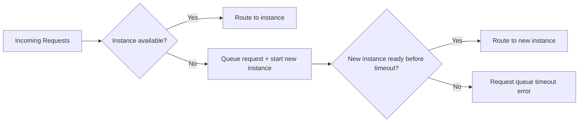

# How to Fix Cloud Run Concurrent Request Throttling and Request Queue Timeout Errors

Author: [nawazdhandala](https://www.github.com/nawazdhandala)

Tags: GCP, Cloud Run, Concurrency, Throttling, Request Queue, Performance

Description: Fix Cloud Run request queue timeout errors and concurrent request throttling by tuning concurrency settings, scaling parameters, and application architecture.

---

You have deployed a Cloud Run service that works fine under light load, but as traffic increases you start seeing requests timing out before they even reach your application. The logs show "request queue timeout" or you notice that response times spike dramatically. This is Cloud Run's request queuing and concurrency throttling at work.

Understanding how Cloud Run handles concurrent requests is essential to running reliable services. Let me walk through the mechanics and how to fix these issues.

## How Cloud Run Concurrency Works

Each Cloud Run container instance has a configurable maximum concurrency - the number of requests it will handle simultaneously. The default is 80. When all instances are at their concurrency limit and a new request comes in, Cloud Run does two things: it starts spinning up a new instance and it queues the request. If the queue timeout is exceeded before the new instance is ready, the request fails.



## Identifying the Problem

Check for request queue timeout errors in Cloud Logging.

```bash
# Search for queue timeout errors
gcloud logging read \
    'resource.type="cloud_run_revision" AND resource.labels.service_name="my-service" AND textPayload:"queue"' \
    --project=my-project \
    --limit=50 \
    --format="table(timestamp, textPayload)"
```

Also check your latency metrics. A sudden jump in p99 latency often indicates requests spending time in the queue.

```bash
# Check request latencies
gcloud logging read \
    'resource.type="cloud_run_revision" AND resource.labels.service_name="my-service" AND httpRequest.latency>"5s"' \
    --project=my-project \
    --limit=20 \
    --format="table(timestamp, httpRequest.requestUrl, httpRequest.latency)"
```

## Fix 1 - Adjust Concurrency Settings

If your application cannot handle 80 concurrent requests efficiently, lower the concurrency. This makes Cloud Run scale out sooner.

```bash
# Reduce concurrency to 10 requests per instance
gcloud run services update my-service \
    --concurrency=10 \
    --region=us-central1
```

The right concurrency depends on your application. A CPU-bound service might only handle 5-10 concurrent requests per vCPU. An I/O-bound service (waiting on database queries, API calls) might handle 100 or more.

A simple way to find the right value is to load test at different concurrency levels.

```bash
# Load test with 50 concurrent connections
hey -n 5000 -c 50 https://my-service-xxxxx.run.app/api/endpoint

# Then try with 20
hey -n 5000 -c 20 https://my-service-xxxxx.run.app/api/endpoint

# Compare p99 latencies and error rates
```

## Fix 2 - Set Minimum Instances

Cold starts are a major contributor to request queue timeouts. When traffic spikes, Cloud Run needs to start new instances, and if your container takes several seconds to start, requests pile up in the queue.

```bash
# Keep 2 instances always warm
gcloud run services update my-service \
    --min-instances=2 \
    --region=us-central1
```

Minimum instances cost money even when idle, but they eliminate cold start latency for baseline traffic. Use this for services that need consistent low latency.

## Fix 3 - Increase Maximum Instances

By default, Cloud Run can scale up to 100 instances. If you are hitting this limit during traffic spikes, increase it.

```bash
# Allow scaling up to 500 instances
gcloud run services update my-service \
    --max-instances=500 \
    --region=us-central1
```

Check your current scaling behavior.

```bash
# See instance count over time in Cloud Monitoring
gcloud run services describe my-service \
    --region=us-central1 \
    --format="value(spec.template.metadata.annotations['autoscaling.knative.dev/maxScale'])"
```

## Fix 4 - Enable Startup CPU Boost

Faster startup means less time in the queue for requests waiting on new instances.

```bash
# Enable startup CPU boost
gcloud run services update my-service \
    --cpu-boost \
    --region=us-central1
```

This temporarily allocates additional CPU during container startup, which can cut startup time significantly for CPU-bound initialization.

## Fix 5 - Optimize Your Request Handler

If individual requests take too long, they block concurrency slots. Optimize your request handling code.

```python
import asyncio
import aiohttp
from flask import Flask

app = Flask(__name__)

@app.route('/api/aggregate')
async def aggregate_data():
    """Fetch data from multiple sources concurrently instead of sequentially."""

    # Bad - sequential calls block the concurrency slot for longer
    # result1 = requests.get("https://api1.example.com/data")
    # result2 = requests.get("https://api2.example.com/data")
    # result3 = requests.get("https://api3.example.com/data")

    # Good - concurrent calls free up the slot sooner
    async with aiohttp.ClientSession() as session:
        tasks = [
            session.get("https://api1.example.com/data"),
            session.get("https://api2.example.com/data"),
            session.get("https://api3.example.com/data"),
        ]
        responses = await asyncio.gather(*tasks)

    results = [await r.json() for r in responses]
    return {"data": results}
```

For Node.js, use async patterns and avoid blocking the event loop.

```javascript
const express = require('express');
const app = express();

app.get('/api/process', async (req, res) => {
  try {
    // Run independent operations concurrently
    const [userData, orderData, inventoryData] = await Promise.all([
      fetchUserData(req.query.userId),
      fetchOrderHistory(req.query.userId),
      checkInventory(req.query.productId),
    ]);

    res.json({
      user: userData,
      orders: orderData,
      inventory: inventoryData,
    });
  } catch (error) {
    res.status(500).json({ error: error.message });
  }
});
```

## Fix 6 - Use Session Affinity for Stateful Workloads

If your application maintains per-client state (like WebSocket connections or cached session data), enable session affinity so requests from the same client go to the same instance.

```bash
# Enable session affinity
gcloud run services update my-service \
    --session-affinity \
    --region=us-central1
```

This reduces the overhead of recreating state for each request, which can improve throughput and reduce per-request latency.

## Fix 7 - Allocate More CPU

If your application is CPU-bound, more CPU means it can handle more concurrent requests.

```bash
# Increase CPU allocation
gcloud run services update my-service \
    --cpu=4 \
    --memory=4Gi \
    --region=us-central1
```

Note that Cloud Run ties memory and CPU together - larger CPU allocations require corresponding memory increases.

## Monitoring Concurrency

Set up dashboards to monitor your concurrency patterns.

```bash
# Check current instance count
gcloud run services describe my-service \
    --region=us-central1 \
    --format="value(status.traffic)"

# Query request count metrics to understand traffic patterns
gcloud logging read \
    'resource.type="cloud_run_revision" AND resource.labels.service_name="my-service" AND httpRequest.requestMethod="GET"' \
    --project=my-project \
    --freshness=1h \
    --format="value(timestamp)" | wc -l
```

Create alerts for when queue timeout errors start appearing.

```bash
# Alert on request queue timeout errors
gcloud alpha monitoring policies create \
    --display-name="Cloud Run Queue Timeouts" \
    --condition-display-name="Request queue timeout rate" \
    --condition-filter='resource.type="cloud_run_revision" AND metric.type="run.googleapis.com/request_count" AND metric.labels.response_code_class="5xx"' \
    --notification-channels=<channel-id>
```

## Concurrency Tuning Cheat Sheet

Here is a quick reference for common application types.

| Application Type | Recommended Concurrency | Reasoning |
|-----------------|------------------------|-----------|
| CPU-heavy computation | 1-5 per vCPU | CPU is the bottleneck |
| REST API with DB queries | 20-50 | I/O wait allows overlapping requests |
| Static file serving | 80-100 | Very little per-request overhead |
| Machine learning inference | 1-2 | GPU/CPU intensive per request |
| WebSocket connections | 100-1000 | Mostly idle connections |

## Summary

Cloud Run request queue timeout errors happen when your service cannot scale fast enough to handle incoming traffic. The fixes fall into two categories: make scaling faster (min instances, CPU boost, lower concurrency to trigger earlier scale-out) and make each instance handle more load (optimize request handlers, increase CPU, parallelize I/O). Start by identifying whether the bottleneck is cold starts or per-instance throughput, then apply the appropriate fixes.
