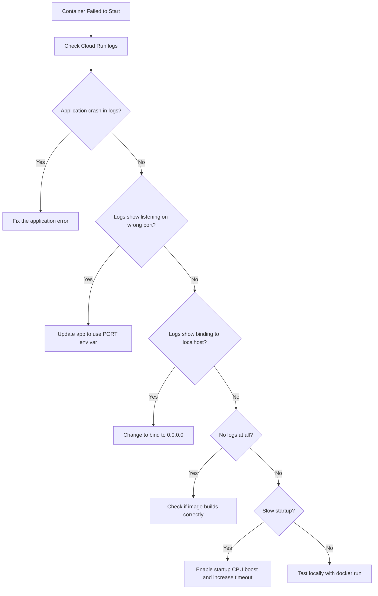

# How to Fix Cloud Run Container Failed to Start Error When Port Is Misconfigured

Author: [nawazdhandala](https://www.github.com/nawazdhandala)

Tags: GCP, Cloud Run, Container Port, Deployment, Troubleshooting

Description: Fix the Cloud Run container failed to start error caused by port misconfiguration, with examples for Node.js, Python, Go, and Java applications.

---

You deploy to Cloud Run and get hit with the dreaded "Container failed to start" error. The container was supposed to listen on a specific port, Cloud Run tried to send it traffic, and nothing was listening. It is the single most common deployment error on Cloud Run, and it almost always comes down to one of three port-related issues.

## The Error

The error shows up in the Cloud Run revision details:

```
Container failed to start. Failed to start and then listen on the port defined
by the PORT environment variable when it is set, or on port 8080. Logs for
this revision might contain more information.
```

## How Cloud Run Port Configuration Works

Cloud Run sets a `PORT` environment variable on your container (default value is 8080). Your application must:

1. Read the `PORT` environment variable
2. Bind to `0.0.0.0` on that port (not `localhost`, not `127.0.0.1`)
3. Start accepting TCP connections before the startup timeout expires

If any of these three conditions is not met, the deployment fails.

## Issue 1: Binding to localhost Instead of 0.0.0.0

This is the most common mistake. Many web frameworks default to binding to `localhost` or `127.0.0.1`, which means they only accept connections from within the container itself. Cloud Run's health check comes from outside the container, so it cannot reach your application.

### Node.js / Express

```javascript
const express = require('express');
const app = express();

// Wrong: binding to localhost
// app.listen(8080);  // Some frameworks bind to localhost by default

// Correct: explicitly bind to 0.0.0.0 and use the PORT env variable
const port = process.env.PORT || 8080;
app.listen(port, '0.0.0.0', () => {
    console.log(`Listening on port ${port}`);
});
```

### Python / Flask

```python
import os
from flask import Flask

app = Flask(__name__)

@app.route('/')
def hello():
    return 'Hello World'

if __name__ == '__main__':
    # Wrong: Flask defaults to 127.0.0.1
    # app.run()

    # Correct: bind to 0.0.0.0 and use PORT env variable
    port = int(os.environ.get('PORT', 8080))
    app.run(host='0.0.0.0', port=port)
```

For production Flask apps using Gunicorn:

```dockerfile
# Dockerfile for Flask with Gunicorn
FROM python:3.11-slim
WORKDIR /app
COPY requirements.txt .
RUN pip install -r requirements.txt
COPY . .

# Correct: bind to 0.0.0.0:$PORT
CMD exec gunicorn --bind 0.0.0.0:$PORT --workers 1 --threads 8 app:app
```

### Go

```go
package main

import (
    "fmt"
    "log"
    "net/http"
    "os"
)

func main() {
    port := os.Getenv("PORT")
    if port == "" {
        port = "8080"
    }

    http.HandleFunc("/", func(w http.ResponseWriter, r *http.Request) {
        fmt.Fprintf(w, "Hello World")
    })

    // Correct: listen on all interfaces with ":"
    // Wrong would be "localhost:" + port
    log.Printf("Listening on port %s", port)
    log.Fatal(http.ListenAndServe(":"+port, nil))
}
```

### Java / Spring Boot

```properties
# application.properties
# Correct: use the PORT environment variable
server.port=${PORT:8080}
# Spring Boot binds to 0.0.0.0 by default, so that part is fine
```

### Ruby / Rails

```ruby
# Correct Procfile for Rails on Cloud Run
web: bundle exec rails server -p $PORT -b 0.0.0.0
```

### Rust / Actix

```rust
use std::env;
use actix_web::{web, App, HttpServer, HttpResponse};

#[actix_web::main]
async fn main() -> std::io::Result<()> {
    let port = env::var("PORT").unwrap_or_else(|_| "8080".to_string());
    let addr = format!("0.0.0.0:{}", port);

    // Correct: bind to 0.0.0.0
    HttpServer::new(|| {
        App::new()
            .route("/", web::get().to(|| async { HttpResponse::Ok().body("Hello") }))
    })
    .bind(&addr)?
    .run()
    .await
}
```

## Issue 2: Hardcoded Port That Conflicts with PORT Variable

Some applications hardcode a port number in their configuration. If Cloud Run sets `PORT=8080` but your app listens on port 3000, the health check fails.

```bash
# Check what port Cloud Run is configured to probe
gcloud run services describe my-service \
    --region=us-central1 \
    --format="value(spec.template.spec.containers[0].ports[0].containerPort)"
```

Two ways to fix this:

Option 1 - Change your app to read PORT:

```javascript
// Read PORT environment variable instead of hardcoding
const port = process.env.PORT || 3000;
app.listen(port, '0.0.0.0');
```

Option 2 - Tell Cloud Run to use your port:

```bash
# Configure Cloud Run to use port 3000 instead of 8080
gcloud run deploy my-service \
    --image=us-docker.pkg.dev/my-project/my-repo/my-app:latest \
    --port=3000 \
    --region=us-central1
```

## Issue 3: Container Exits Before Listening

If your container process crashes during startup, it exits before it can listen on any port. Cloud Run sees no listener and reports the port error, even though the real problem is an application crash.

Check the logs:

```bash
# Get logs for the failed revision
gcloud logging read \
    'resource.type="cloud_run_revision" AND resource.labels.revision_name="my-service-00002-abc" AND severity>=ERROR' \
    --project=my-project \
    --limit=20 \
    --format="table(timestamp, textPayload)"
```

Common crash causes:
- Missing environment variables (database connection string, API keys)
- Missing dependencies in the container image
- Incompatible architecture (built for ARM, running on x86)
- Insufficient memory

## Issue 4: Dockerfile EXPOSE Does Not Match

The `EXPOSE` instruction in a Dockerfile is documentation only - it does not actually configure ports. But if it misleads you into thinking your app is on a different port, it can cause confusion.

```dockerfile
# EXPOSE is informational only - it does not set the actual port
EXPOSE 3000

# The CMD must start the app on the PORT environment variable
CMD ["node", "server.js"]
```

What matters is what port your application actually binds to at runtime, not what EXPOSE says.

## Testing Locally

Before deploying, test your container locally with the same PORT variable Cloud Run uses:

```bash
# Build the container
docker build -t my-app .

# Run it with the PORT variable set
docker run -p 8080:8080 -e PORT=8080 my-app

# Test if it responds
curl http://localhost:8080/
```

If this works locally but fails on Cloud Run, the issue is likely environment-specific (missing secrets, database connectivity).

## Debugging Flowchart



## Quick Checklist

When you see "container failed to start" on Cloud Run, run through this list:

1. Is your app reading the `PORT` environment variable?
2. Is your app binding to `0.0.0.0`, not `localhost`?
3. Is the container port in Cloud Run config matching your app?
4. Are there any crash logs that indicate a different problem?
5. Does the container work locally with `docker run -e PORT=8080`?

The port misconfiguration error is Cloud Run's way of saying "I tried to connect to your container and nobody answered." The fix is almost always making sure your application binds to `0.0.0.0:$PORT`. Get that right and this error goes away.
