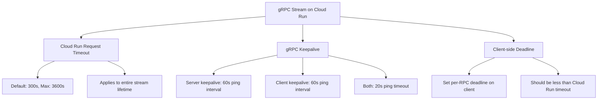

# How to Fix Cloud Run gRPC Streaming Connection Timeout Errors

Author: [nawazdhandala](https://www.github.com/nawazdhandala)

Tags: GCP, Cloud Run, gRPC, Streaming, Timeout, Troubleshooting

Description: A practical guide to fixing gRPC streaming connection timeout errors on Cloud Run, covering HTTP/2 configuration, keepalive settings, and timeout tuning.

---

Running gRPC services on Cloud Run is a great fit in many ways - Cloud Run supports HTTP/2 end-to-end, handles TLS termination, and scales automatically. But if you are using gRPC streaming (server-side, client-side, or bidirectional), you will almost certainly run into timeout issues. Streaming connections that work perfectly in local development suddenly start getting terminated after a few minutes on Cloud Run.

The root cause is usually related to Cloud Run's request timeout model, which was designed primarily for unary request-response patterns. Let me walk through the specific issues and how to fix them.

## Understanding Cloud Run's Timeout Model

Cloud Run has a per-request timeout that defaults to 300 seconds (5 minutes) and can be configured up to 3600 seconds (60 minutes). For unary gRPC calls, this is rarely a problem. But for streaming RPCs, the timeout applies to the entire stream lifetime, not individual messages.

If your server-side stream sends data for 10 minutes, you need the timeout set to at least 600 seconds. If you have a bidirectional stream that stays open indefinitely for real-time updates, Cloud Run's maximum 60-minute timeout means your client needs to handle reconnection.

## Step 1 - Enable HTTP/2 End-to-End

This is the most basic requirement and the first thing to check. By default, Cloud Run downgrades HTTP/2 to HTTP/1.1 between the load balancer and your container. gRPC requires HTTP/2, so streams will fail immediately without this setting.

```bash
# Check if HTTP/2 is enabled
gcloud run services describe my-grpc-service \
    --region=us-central1 \
    --format="value(spec.template.metadata.annotations['run.googleapis.com/launch-stage'])"

# Enable HTTP/2 end-to-end
gcloud run services update my-grpc-service \
    --use-http2 \
    --region=us-central1
```

Or set it during deployment.

```bash
# Deploy with HTTP/2 enabled
gcloud run deploy my-grpc-service \
    --image=gcr.io/my-project/my-grpc-service:latest \
    --use-http2 \
    --region=us-central1
```

## Step 2 - Increase the Request Timeout

For streaming RPCs, increase the Cloud Run request timeout to accommodate your longest expected stream.

```bash
# Set timeout to 60 minutes (maximum)
gcloud run services update my-grpc-service \
    --timeout=3600 \
    --region=us-central1
```

But do not rely on this alone. Your application should handle reconnection gracefully for streams that might exceed the timeout.

## Step 3 - Configure gRPC Keepalive

gRPC keepalive pings maintain the connection and detect dead connections. Without keepalive, idle streams can be terminated by intermediate proxies (including Cloud Run's load balancer).

Here is how to configure keepalive on the server side in Go.

```go
package main

import (
	"log"
	"net"
	"time"

	"google.golang.org/grpc"
	"google.golang.org/grpc/keepalive"
)

func main() {
	lis, err := net.Listen("tcp", ":8080")
	if err != nil {
		log.Fatalf("Failed to listen: %v", err)
	}

	// Configure keepalive to prevent idle connection termination
	server := grpc.NewServer(
		grpc.KeepaliveParams(keepalive.ServerParameters{
			// Send keepalive ping after 60 seconds of inactivity
			Time: 60 * time.Second,
			// Wait 20 seconds for ping ack before considering connection dead
			Timeout: 20 * time.Second,
		}),
		grpc.KeepaliveEnforcementPolicy(keepalive.EnforcementPolicy{
			// Allow clients to send pings every 30 seconds
			MinTime: 30 * time.Second,
			// Allow pings even when there are no active streams
			PermitWithoutStream: true,
		}),
	)

	// Register your gRPC services here
	// pb.RegisterMyServiceServer(server, &myServiceImpl{})

	log.Printf("gRPC server listening on :8080")
	if err := server.Serve(lis); err != nil {
		log.Fatalf("Failed to serve: %v", err)
	}
}
```

And on the client side.

```go
import (
	"google.golang.org/grpc"
	"google.golang.org/grpc/keepalive"
	"time"
)

func createConnection(target string) (*grpc.ClientConn, error) {
	// Client keepalive settings to match server configuration
	conn, err := grpc.Dial(target,
		grpc.WithKeepaliveParams(keepalive.ClientParameters{
			// Send keepalive ping after 60 seconds of inactivity
			Time: 60 * time.Second,
			// Wait 20 seconds for ping ack
			Timeout: 20 * time.Second,
			// Send pings even without active streams
			PermitWithoutStream: true,
		}),
	)
	return conn, err
}
```

For Python gRPC.

```python
import grpc

def create_server():
    """Create a gRPC server with keepalive settings for Cloud Run."""
    server = grpc.server(
        futures.ThreadPoolExecutor(max_workers=10),
        options=[
            # Send keepalive ping every 60 seconds
            ('grpc.keepalive_time_ms', 60000),
            # Wait 20 seconds for ping response
            ('grpc.keepalive_timeout_ms', 20000),
            # Allow keepalive pings when there are no calls
            ('grpc.keepalive_permit_without_calls', True),
            # Allow clients to send keepalive pings frequently
            ('grpc.http2.min_ping_interval_without_data_ms', 30000),
        ],
    )
    return server
```

## Step 4 - Implement Stream Reconnection

Even with keepalive and increased timeouts, streams will eventually be terminated - by deployments, scaling events, or the 60-minute maximum timeout. Your client must handle reconnection.

```go
package main

import (
	"context"
	"log"
	"time"

	pb "my-project/proto"
	"google.golang.org/grpc"
	"google.golang.org/grpc/codes"
	"google.golang.org/grpc/status"
)

// streamWithReconnect maintains a server-side stream with automatic reconnection
func streamWithReconnect(client pb.MyServiceClient, request *pb.StreamRequest) {
	for {
		ctx, cancel := context.WithCancel(context.Background())

		stream, err := client.StreamData(ctx, request)
		if err != nil {
			log.Printf("Failed to create stream: %v. Retrying in 5s...", err)
			cancel()
			time.Sleep(5 * time.Second)
			continue
		}

		log.Println("Stream connected successfully")

		// Read messages from the stream until it ends or errors
		for {
			msg, err := stream.Recv()
			if err != nil {
				st, ok := status.FromError(err)
				if ok && st.Code() == codes.Unavailable {
					log.Println("Stream unavailable, reconnecting in 2s...")
					time.Sleep(2 * time.Second)
				} else {
					log.Printf("Stream error: %v. Reconnecting in 5s...", err)
					time.Sleep(5 * time.Second)
				}
				cancel()
				break
			}

			// Process the received message
			processMessage(msg)
		}
	}
}
```

## Step 5 - Handle Cloud Run Scaling Events

When Cloud Run scales down or deploys a new revision, existing connections are terminated. Your server should handle SIGTERM gracefully to give streams time to close cleanly.

```go
package main

import (
	"context"
	"log"
	"net"
	"os"
	"os/signal"
	"syscall"
	"time"

	"google.golang.org/grpc"
)

func main() {
	lis, err := net.Listen("tcp", ":8080")
	if err != nil {
		log.Fatalf("Failed to listen: %v", err)
	}

	server := grpc.NewServer( /* keepalive options */ )
	// Register services...

	// Start serving in a goroutine
	go func() {
		if err := server.Serve(lis); err != nil {
			log.Fatalf("Failed to serve: %v", err)
		}
	}()

	// Wait for SIGTERM from Cloud Run
	sigChan := make(chan os.Signal, 1)
	signal.Notify(sigChan, syscall.SIGTERM)
	<-sigChan

	log.Println("SIGTERM received, gracefully stopping gRPC server...")

	// GracefulStop waits for active streams to finish (with a timeout)
	stopped := make(chan struct{})
	go func() {
		server.GracefulStop()
		close(stopped)
	}()

	// Force stop after 8 seconds (Cloud Run kills after 10)
	select {
	case <-stopped:
		log.Println("Server stopped gracefully")
	case <-time.After(8 * time.Second):
		log.Println("Graceful stop timed out, forcing stop")
		server.Stop()
	}
}
```

## Timeout Configuration Summary

Here is a reference for all the timeout-related settings.



## Common Pitfalls

1. **Forgetting --use-http2**: gRPC will not work at all without HTTP/2 end-to-end
2. **Setting concurrency too low**: Each streaming connection uses one concurrent request slot. If concurrency is 1, only one stream can exist per instance
3. **Not handling reconnection**: Streams will be interrupted by deployments and scaling events
4. **Keepalive too aggressive**: Cloud Run may throttle connections that ping too frequently. Keep ping intervals at 30 seconds or higher
5. **Ignoring the 60-minute cap**: There is no way around the maximum 3600-second timeout on Cloud Run. Design your protocol to handle periodic reconnection

## Summary

gRPC streaming on Cloud Run works well once you get the configuration right. Enable HTTP/2, increase the request timeout, configure keepalive on both client and server, and implement reconnection logic. The 60-minute maximum timeout is the main constraint - plan your streaming protocol around periodic reconnection, and your service will be reliable.
