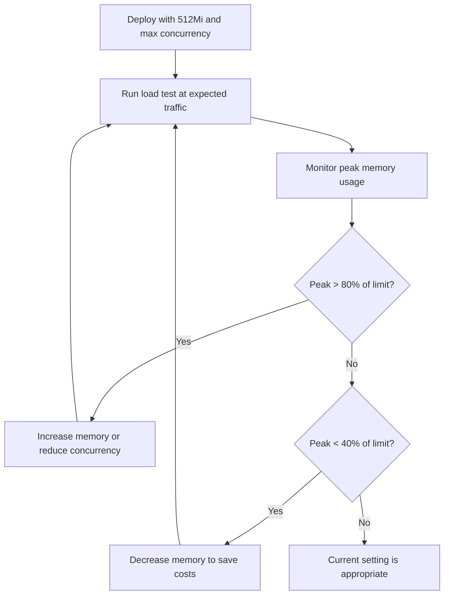

# How to Fix Cloud Run Memory Limit Exceeded Error and Right-Size Container Memory

Author: [nawazdhandala](https://www.github.com/nawazdhandala)

Tags: GCP, Cloud Run, Memory Management, Containers, Troubleshooting

Description: A practical guide to diagnosing Cloud Run memory limit exceeded errors and right-sizing your container memory allocation for optimal performance and cost.

---

Cloud Run makes it easy to deploy containers without thinking about infrastructure, but one thing you absolutely have to think about is memory. When your container exceeds its allocated memory, Cloud Run kills it immediately with no warning. You will see a "memory limit exceeded" error in your logs, your users will see a 500 error, and you will be scrambling to figure out what happened.

I have dealt with this error across dozens of services, and the fix is rarely just "throw more memory at it." Let me walk you through how to actually diagnose the problem and right-size your memory allocation.

## Understanding the Error

When you see "Container exceeded memory limit" in Cloud Logging, it means your container attempted to use more memory than the configured limit. Cloud Run enforces hard memory limits - there is no swap, no grace period, no gradual degradation. Your container gets a SIGKILL, and the request fails.

Here is what the error typically looks like in Cloud Logging.

```
Container memory limit reached. Consider increasing the memory limit.
The container was terminated because it exceeded its memory limit.
```

The default memory limit in Cloud Run is 512 MiB. Many developers deploy their first service, everything works in testing where traffic is light, and then it blows up in production when concurrent requests stack up.

## Why Your Container Uses More Memory Than Expected

### Concurrent Request Handling

This is the number one gotcha. Unlike Cloud Functions (which handles one request per instance by default), Cloud Run can send multiple concurrent requests to a single container instance. The default concurrency is 80. Each request uses its own memory for processing, and they all share the same container memory.

If your request handler allocates 10 MB of memory per request, and you have 80 concurrent requests, that is 800 MB just for request handling - not counting your application framework, loaded libraries, and runtime overhead.

### Memory Leaks

Long-running container instances that handle thousands of requests can accumulate memory leaks. Languages with garbage collection like Java, Node.js, and Python are not immune to this - closures holding references, growing caches, event listener accumulation, and connection pool growth all contribute.

### Large Dependencies and Frameworks

Some frameworks are genuinely memory-hungry. A Spring Boot application with several starters easily consumes 300-500 MB at idle. A Node.js application loading many npm packages can consume 100-200 MB before handling any requests.

## Diagnosing the Problem

### Step 1 - Check Cloud Logging

Start by finding the actual memory usage at the time of the crash.

```bash
# Query logs for memory limit errors in the last 24 hours
gcloud logging read 'resource.type="cloud_run_revision" AND textPayload:"memory limit"' \
    --project=my-project \
    --limit=20 \
    --format="table(timestamp, textPayload)"
```

### Step 2 - Check Memory Metrics in Cloud Monitoring

Cloud Run reports container memory utilization as a metric. You can see the peak and average memory usage over time.

```bash
# Get memory utilization metrics for your service
gcloud monitoring metrics list \
    --filter='metric.type="run.googleapis.com/container/memory/utilizations"'
```

In the Cloud Console, navigate to Cloud Run, select your service, go to the Metrics tab, and look at "Container Memory Utilization." If you see it regularly hitting 90-100% before the crash, you are clearly under-provisioned. If you see a gradual climb over hours, you likely have a memory leak.

### Step 3 - Profile Memory Locally

Run your container locally with the same memory constraint to reproduce the issue.

```bash
# Run your container with the same memory limit as Cloud Run
docker run --memory=512m --memory-swap=512m \
    -p 8080:8080 \
    my-service:latest
```

Then hit it with concurrent requests using a load testing tool.

```bash
# Simple load test with hey (install with: go install github.com/rakyll/hey@latest)
hey -n 1000 -c 80 http://localhost:8080/your-endpoint
```

Watch memory usage while the test runs.

```bash
# Monitor container memory usage in real time
docker stats --no-stream --format "table {{.Name}}\t{{.MemUsage}}\t{{.MemPerc}}"
```

## Fixing the Problem

### Option 1 - Increase Memory Limit

The simplest fix is to increase the memory limit. Cloud Run supports up to 32 GiB of memory.

```bash
# Update the memory limit for your Cloud Run service
gcloud run services update my-service \
    --memory=1Gi \
    --region=us-central1
```

But do not just blindly increase it. First figure out what your actual peak memory requirement is, then add a 20-30% buffer.

### Option 2 - Reduce Concurrency

If concurrent requests are the problem, reducing the maximum concurrent requests per instance can dramatically reduce memory usage.

```bash
# Set maximum concurrency to 10 requests per instance
gcloud run services update my-service \
    --concurrency=10 \
    --region=us-central1
```

Lower concurrency means Cloud Run will spin up more instances to handle the same traffic, but each instance will use less memory. The trade-off is more cold starts and potentially higher costs from running more instances.

### Option 3 - Optimize Your Application

This is the best long-term solution. Here are practical techniques by language.

For Node.js applications, set a max heap size and watch for common leaks.

```javascript
// In your Dockerfile, set the max old space size
// CMD ["node", "--max-old-space-size=384", "server.js"]

// Use streaming instead of buffering large responses
const { pipeline } = require('stream/promises');
const fs = require('fs');

app.get('/large-file', async (req, res) => {
  // Stream the file instead of loading it all into memory
  const fileStream = fs.createReadStream('/data/large-file.csv');
  res.setHeader('Content-Type', 'text/csv');
  await pipeline(fileStream, res);
});
```

For Java and Spring Boot, tune the JVM heap settings.

```dockerfile
# In your Dockerfile, set JVM memory flags
FROM eclipse-temurin:17-jre-alpine
COPY target/app.jar /app.jar

# Set heap to 70% of container memory, leaving room for native memory
ENV JAVA_OPTS="-XX:MaxRAMPercentage=70.0 -XX:+UseG1GC -XX:+UseStringDeduplication"
CMD ["sh", "-c", "java $JAVA_OPTS -jar /app.jar"]
```

For Python applications, watch out for large DataFrames and in-memory caches.

```python
import gc

# Process data in chunks instead of loading everything at once
def process_large_dataset(file_path):
    # Read CSV in chunks of 1000 rows to limit memory usage
    for chunk in pd.read_csv(file_path, chunksize=1000):
        process_chunk(chunk)

    # Force garbage collection after heavy processing
    gc.collect()
```

### Option 4 - Use a Multi-Stage Build to Reduce Image Size

Smaller images mean less memory used at startup for loading dependencies.

```dockerfile
# Multi-stage build to minimize the final image
FROM node:18 AS builder
WORKDIR /app
COPY package*.json ./
RUN npm ci --only=production
COPY . .

FROM node:18-slim
WORKDIR /app
# Copy only the necessary files from the builder stage
COPY --from=builder /app/node_modules ./node_modules
COPY --from=builder /app/src ./src
COPY --from=builder /app/package.json ./

CMD ["node", "--max-old-space-size=384", "src/index.js"]
```

## Right-Sizing Your Memory

Here is a practical approach to finding the right memory setting.



The goal is to keep your peak memory usage between 50-80% of the allocated limit. Below 50%, you are paying for memory you do not need. Above 80%, you are at risk of OOM during traffic spikes.

## Monitoring Going Forward

Set up an alert so you know when memory usage is creeping up before it causes crashes.

```bash
# Create a monitoring alert for high memory utilization
gcloud alpha monitoring policies create \
    --display-name="Cloud Run High Memory" \
    --condition-display-name="Memory over 80%" \
    --condition-filter='resource.type="cloud_run_revision" AND metric.type="run.googleapis.com/container/memory/utilizations"' \
    --condition-threshold-value=0.8 \
    --condition-threshold-comparison=COMPARISON_GT \
    --notification-channels=<channel-id>
```

## Summary

Cloud Run memory errors are almost always caused by either underestimating the impact of concurrent requests, or not tuning your application runtime for container environments. Start by profiling your actual memory usage under load, then pick the right combination of memory limit, concurrency setting, and application optimization. Do not just bump the memory and move on - you will end up paying for resources you do not need and hiding problems that will bite you later.
