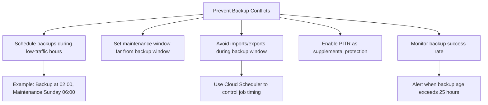

# How to Fix Cloud SQL Automated Backup Failing with Operation Already in Progress Error

Author: [nawazdhandala](https://www.github.com/nawazdhandala)

Tags: GCP, Cloud SQL, Backup, Database, Operations, Troubleshooting

Description: How to resolve Cloud SQL automated backup failures caused by conflicting operations, including diagnosis steps and strategies to prevent backup conflicts.

---

Automated backups are your safety net for Cloud SQL instances, so when they start failing, you need to fix it quickly. The "operation already in progress" error means your backup is trying to start but something else is already running on the instance. Let me show you how to find the conflicting operation and get your backups working again.

## The Error

In your Cloud SQL operations log or Cloud Logging, you will see something like:

```
The instance or operation is not in an appropriate state to handle the request.
Another operation is already in progress for this instance.
```

Or from the gcloud command line:

```
ERROR: (gcloud.sql.backups.create) HTTPError 409:
The instance or operation is not in an appropriate state to handle the request.
```

## Understanding Why This Happens

Cloud SQL only allows one administrative operation at a time per instance. If a backup tries to start while any of these operations are running, it will fail:

- Another backup (manual or automated)
- Instance restart
- Maintenance update
- Failover
- Storage increase
- Flag change
- Import or export operation
- Replica creation

The automated backup has a scheduled window, and if that window overlaps with another operation, the backup gets skipped.

## Step 1: Find the Conflicting Operation

```bash
# List recent operations to find what was running during the backup window
gcloud sql operations list \
    --instance=my-instance \
    --project=my-project \
    --limit=20 \
    --format="table(name, operationType, status, startTime, endTime)"
```

Look for operations that overlap with your backup window. Pay special attention to operations with status `RUNNING` or operations that were running at the time the backup was scheduled.

```bash
# Check the backup configuration to see the backup window
gcloud sql instances describe my-instance \
    --project=my-project \
    --format="json(settings.backupConfiguration)"
```

The output shows your backup window start time (in UTC). The window is typically 4 hours long.

## Step 2: Check for Stuck Operations

Sometimes an operation gets stuck and blocks everything, including backups.

```bash
# Look for operations that have been running for an unusually long time
gcloud sql operations list \
    --instance=my-instance \
    --project=my-project \
    --filter="status=RUNNING" \
    --format="table(name, operationType, status, startTime)"
```

If you find an operation that has been running for hours, it might be stuck. Common culprits:

- Large import operations
- Export operations on huge tables
- Storage resize operations

For stuck operations, you may need to contact Google Cloud support to cancel them. There is no gcloud command to cancel a stuck Cloud SQL operation.

## Step 3: Adjust the Backup Window

If your backup window regularly conflicts with maintenance or other scheduled operations, move the backup to a quieter time.

```bash
# Change the backup window to a different time
gcloud sql instances patch my-instance \
    --backup-start-time=02:00 \
    --project=my-project
```

Choose a time when:
- No scheduled maintenance typically runs
- Import/export jobs are not running
- Application traffic is at its lowest (to minimize backup impact)

Also check the maintenance window:

```bash
# Check the maintenance window
gcloud sql instances describe my-instance \
    --format="json(settings.maintenanceWindow)"

# Set maintenance window to a different day/time than backup
gcloud sql instances patch my-instance \
    --maintenance-window-day=SUN \
    --maintenance-window-hour=6 \
    --project=my-project
```

## Step 4: Avoid Long-Running Operations During Backup Windows

If you have scheduled data imports or exports, make sure they do not overlap with the backup window.

```bash
# Check when your import/export cron jobs are scheduled
# and compare with the backup window

# Example: if backup is at 02:00 UTC, schedule exports at 10:00 UTC
# In Cloud Scheduler or your cron system, set:
# 0 10 * * * /path/to/export_script.sh
```

For Cloud SQL imports, break large imports into smaller chunks:

```bash
# Instead of one large import
# gcloud sql import sql my-instance gs://bucket/huge_dump.sql

# Split into smaller files and import them sequentially outside the backup window
gcloud sql import sql my-instance gs://bucket/dump_part1.sql --project=my-project
gcloud sql import sql my-instance gs://bucket/dump_part2.sql --project=my-project
```

## Step 5: Enable Point-in-Time Recovery as a Backup

Even if automated backups occasionally fail, point-in-time recovery (PITR) provides continuous protection through binary logs (MySQL) or WAL archives (PostgreSQL).

```bash
# Enable point-in-time recovery
gcloud sql instances patch my-instance \
    --enable-point-in-time-recovery \
    --project=my-project
```

With PITR enabled, you can recover to any point in time, not just the last successful backup. This gives you protection even when automated backups miss their window.

## Step 6: Run a Manual Backup After Fixing the Issue

After resolving the conflict, trigger a manual backup to make sure you have a recent backup.

```bash
# Create an on-demand backup
gcloud sql backups create \
    --instance=my-instance \
    --project=my-project \
    --description="Manual backup after fixing automated backup failure"
```

Verify it completed:

```bash
# List recent backups
gcloud sql backups list \
    --instance=my-instance \
    --project=my-project \
    --limit=5 \
    --format="table(id, type, status, startTime, endTime)"
```

## Step 7: Set Up Monitoring for Backup Failures

You want to know immediately when a backup fails, not discover it days later when you need to restore.

```bash
# Create a log-based metric for backup failures
gcloud logging metrics create cloudsql-backup-failures \
    --description="Cloud SQL automated backup failures" \
    --log-filter='resource.type="cloudsql_database" AND protoPayload.methodName="cloudsql.instances.automatedBackup" AND severity>=ERROR' \
    --project=my-project
```

You can also monitor backup age to detect when backups stop happening:

```bash
# Query for the most recent successful backup
gcloud sql backups list \
    --instance=my-instance \
    --project=my-project \
    --filter="status=SUCCESSFUL" \
    --sort-by=~startTime \
    --limit=1 \
    --format="table(startTime)"
```

## Conflict Prevention Strategy



## Backup Retention Best Practices

While you are fixing backup issues, also review your retention settings:

```bash
# Check current backup retention
gcloud sql instances describe my-instance \
    --format="json(settings.backupConfiguration.transactionLogRetentionDays, settings.backupConfiguration.backupRetentionSettings)"

# Set backup retention to 30 days and transaction log retention to 7 days
gcloud sql instances patch my-instance \
    --retained-backups-count=30 \
    --retained-transaction-log-days=7 \
    --project=my-project
```

The core fix for the "operation already in progress" error is scheduling. Make sure your backup window does not overlap with maintenance windows, import/export jobs, or other administrative operations. And always have PITR enabled as a fallback for when automated backups do miss their window.
