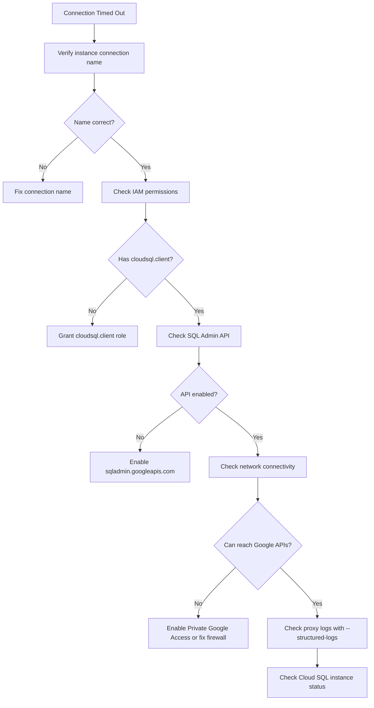

# How to Fix Cloud SQL Connection Timed Out Errors with the Cloud SQL Auth Proxy

Author: [nawazdhandala](https://www.github.com/nawazdhandala)

Tags: GCP, Cloud SQL, Auth Proxy, Database, Troubleshooting

Description: Diagnose and fix Cloud SQL connection timed out errors when using the Cloud SQL Auth Proxy, including network configuration, IAM permissions, and proxy setup issues.

---

The Cloud SQL Auth Proxy is the recommended way to connect to Cloud SQL instances securely. But when it does not work, the error messages are vague and unhelpful. A connection timeout could mean a dozen different things - from network misconfiguration to missing IAM permissions to a wrong instance connection name.

Let me go through the systematic approach to diagnosing and fixing these timeouts.

## The Error

The typical error you see:

```
failed to connect to instance: dial tcp: i/o timeout
```

Or from your application:

```
Error: connect ETIMEDOUT
could not connect to Cloud SQL instance "my-project:us-central1:my-db"
```

## Step 1: Verify the Instance Connection Name

This sounds basic, but it is wrong more often than you would expect. The connection name format is `project:region:instance-name`.

```bash
# Get the correct instance connection name
gcloud sql instances describe my-db \
    --format="value(connectionName)"
```

The output should look like `my-project:us-central1:my-db`. Copy this exactly - a typo in any part causes a timeout because the proxy cannot find the instance.

## Step 2: Check IAM Permissions

The service account running the proxy needs the `roles/cloudsql.client` role. Without it, the proxy cannot establish a connection.

```bash
# Check if the service account has Cloud SQL Client role
gcloud projects get-iam-policy my-project \
    --flatten="bindings[].members" \
    --filter="bindings.members:serviceAccount:my-sa@my-project.iam.gserviceaccount.com AND bindings.role:roles/cloudsql" \
    --format="table(bindings.role)"
```

If the role is missing, add it:

```bash
# Grant Cloud SQL Client role to the service account
gcloud projects add-iam-binding my-project \
    --member="serviceAccount:my-sa@my-project.iam.gserviceaccount.com" \
    --role="roles/cloudsql.client"
```

The `cloudsql.client` role includes the `cloudsql.instances.connect` permission, which is what the proxy actually needs. If you are using a custom role, make sure that permission is included.

## Step 3: Check the Cloud SQL Admin API

The proxy uses the Cloud SQL Admin API to get connection information. If the API is not enabled, the proxy silently fails with a timeout.

```bash
# Check if the Cloud SQL Admin API is enabled
gcloud services list --enabled --filter="name:sqladmin.googleapis.com"

# Enable it if needed
gcloud services enable sqladmin.googleapis.com
```

## Step 4: Verify Network Connectivity

The proxy needs to reach Google's APIs. If you are running the proxy on a VM without an external IP, or behind a firewall, it might not be able to reach the Cloud SQL Admin API.

```bash
# Test if the VM can reach Google APIs
curl -s https://sqladmin.googleapis.com/ -o /dev/null -w "%{http_code}"
# Should return 404 (which means the API is reachable)

# Check if there is a firewall blocking egress to port 443
gcloud compute firewall-rules list \
    --filter="network:my-vpc AND direction=EGRESS" \
    --format="table(name, denied, destinationRanges)"
```

If your VM does not have an external IP, make sure Private Google Access is enabled on the subnet:

```bash
# Enable Private Google Access on the subnet
gcloud compute networks subnets update my-subnet \
    --region=us-central1 \
    --enable-private-ip-google-access
```

## Step 5: Check the Proxy Version and Configuration

Make sure you are using a recent version of the Cloud SQL Auth Proxy and that it is configured correctly.

```bash
# Download the latest Cloud SQL Auth Proxy
curl -o cloud-sql-proxy \
    https://storage.googleapis.com/cloud-sql-connectors/cloud-sql-proxy/v2.8.0/cloud-sql-proxy.linux.amd64
chmod +x cloud-sql-proxy

# Run the proxy with verbose logging to see what is happening
./cloud-sql-proxy \
    --port=5432 \
    --credentials-file=/path/to/service-account-key.json \
    --structured-logs \
    my-project:us-central1:my-db
```

The structured logs will tell you exactly where the connection is failing. Common messages and what they mean:

- `"Authorizing with Application Default Credentials"` - The proxy is using ADC, not a key file
- `"instance not found"` - Wrong connection name
- `"failed to connect to API"` - Network or API issue
- `"failed to create TLS config"` - Permission issue

## Step 6: Test with the Correct Authentication

The proxy supports several authentication methods. Make sure you are using the right one for your environment.

For local development with user credentials:

```bash
# Authenticate with your user account
gcloud auth application-default login

# Run the proxy (it will use your credentials)
./cloud-sql-proxy my-project:us-central1:my-db
```

For production with a service account key:

```bash
# Run the proxy with a service account key file
./cloud-sql-proxy \
    --credentials-file=/path/to/key.json \
    my-project:us-central1:my-db
```

For GKE with Workload Identity:

```bash
# No credentials file needed - Workload Identity handles auth
./cloud-sql-proxy my-project:us-central1:my-db
```

## Step 7: Check Cloud SQL Instance Status

If everything else looks right, verify the Cloud SQL instance itself is running and accepting connections:

```bash
# Check instance status
gcloud sql instances describe my-db \
    --format="table(state, settings.ipConfiguration.authorizedNetworks, settings.ipConfiguration.privateNetwork)"
```

The instance state should be RUNNABLE. If it is SUSPENDED or MAINTENANCE, that explains the timeout.

## GKE Sidecar Configuration

If you are running the proxy as a sidecar in GKE, here is a working configuration:

```yaml
# Cloud SQL Auth Proxy sidecar container configuration
# Add this to your pod spec alongside your application container
apiVersion: apps/v1
kind: Deployment
metadata:
  name: my-app
spec:
  template:
    spec:
      serviceAccountName: my-ksa  # Kubernetes SA linked via Workload Identity
      containers:
      - name: my-app
        image: my-app:latest
        env:
        - name: DB_HOST
          value: "127.0.0.1"  # Connect to localhost since proxy is a sidecar
        - name: DB_PORT
          value: "5432"
      - name: cloud-sql-proxy
        image: gcr.io/cloud-sql-connectors/cloud-sql-proxy:2.8.0
        args:
        - "--port=5432"
        - "--structured-logs"
        - "my-project:us-central1:my-db"
        securityContext:
          runAsNonRoot: true
        resources:
          requests:
            memory: "128Mi"
            cpu: "100m"
```

## Debugging Flowchart



## Quick Diagnostic Script

Run this to check all common causes at once:

```bash
#!/bin/bash
# Diagnose Cloud SQL Auth Proxy connection issues
# Usage: ./diagnose-proxy.sh <project> <instance-name> <service-account-email>

PROJECT=$1
INSTANCE=$2
SA=$3

echo "=== Checking instance ==="
gcloud sql instances describe $INSTANCE --project=$PROJECT \
    --format="value(connectionName, state)" 2>&1

echo ""
echo "=== Checking IAM permissions ==="
gcloud projects get-iam-policy $PROJECT \
    --flatten="bindings[].members" \
    --filter="bindings.members:serviceAccount:$SA AND bindings.role:cloudsql" \
    --format="value(bindings.role)" 2>&1

echo ""
echo "=== Checking SQL Admin API ==="
gcloud services list --enabled \
    --filter="name:sqladmin.googleapis.com" \
    --project=$PROJECT --format="value(name)" 2>&1 || echo "NOT ENABLED"

echo ""
echo "=== Checking network connectivity ==="
curl -s -o /dev/null -w "HTTP Status: %{http_code}\n" \
    https://sqladmin.googleapis.com/ 2>&1
```

The Cloud SQL Auth Proxy is a great tool once it is working, but the setup has enough moving parts that something usually goes wrong the first time. Work through these steps in order and the verbose logging from the proxy will tell you exactly what to fix.
