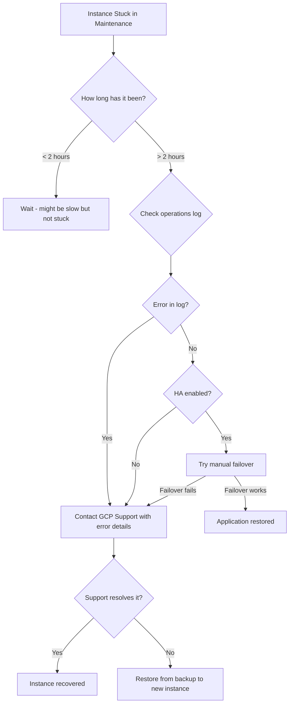

# How to Fix Cloud SQL Instance Stuck in Maintenance State After Patch Update

Author: [nawazdhandala](https://www.github.com/nawazdhandala)

Tags: GCP, Cloud SQL, Maintenance, Patching, Database, Operations

Description: How to handle Cloud SQL instances that get stuck in maintenance state after a patch update, including diagnosis steps, recovery options, and prevention strategies.

---

You logged in on Monday morning to find your Cloud SQL instance stuck in a maintenance state. The scheduled patch update started over the weekend and never completed. Your application is either completely down or running on a stale failover instance. This post covers what to do when this happens and how to reduce the chances of it happening again.

## Recognizing the Problem

Your instance status shows `MAINTENANCE` or `PENDING_MAINTENANCE` and has been in that state for much longer than expected. Normal maintenance operations typically complete within 10-30 minutes.

```bash
# Check the instance state
gcloud sql instances describe my-instance \
    --project=my-project \
    --format="table(state, maintenanceVersion, settings.maintenanceWindow)"
```

If the state shows `MAINTENANCE` and the operation has been running for more than an hour, something is likely stuck.

## Step 1: Check the Operations Log

```bash
# List recent operations to see what is happening
gcloud sql operations list \
    --instance=my-instance \
    --project=my-project \
    --limit=10 \
    --format="table(name, operationType, status, startTime, endTime, error)"
```

Look for a `MAINTENANCE` or `UPDATE` operation with status `RUNNING` that started hours ago. Note the operation name for further investigation.

```bash
# Get detailed information about the stuck operation
gcloud sql operations describe <operation-name> \
    --project=my-project \
    --format=json
```

## Step 2: Check Cloud Logging for Details

The instance logs often contain more detail about why the maintenance is stuck.

```bash
# Search for maintenance-related log entries
gcloud logging read \
    'resource.type="cloudsql_database" AND resource.labels.database_id="my-project:my-instance" AND (textPayload:"maintenance" OR textPayload:"update" OR textPayload:"restart" OR severity>=ERROR)' \
    --project=my-project \
    --limit=30 \
    --format="table(timestamp, severity, textPayload)"
```

Common reasons maintenance gets stuck:

1. **Large InnoDB buffer pool** - the database takes a long time to shut down cleanly because it needs to flush dirty pages to disk
2. **Long-running transactions** - MySQL waits for active transactions to complete before shutting down
3. **Corrupted data files** - the update process encounters corruption and cannot proceed
4. **Insufficient disk space** - the new version needs temporary space that is not available
5. **Internal GCP issue** - sometimes Google's maintenance orchestration has problems

## Step 3: Wait a Reasonable Amount of Time

Not every slow maintenance is stuck. Large instances with lots of data legitimately take longer.

General guidelines for how long maintenance should take:

- Small instances (db-f1-micro to db-n1-standard-4): 5-15 minutes
- Medium instances (db-n1-standard-8 to db-n1-standard-16): 10-30 minutes
- Large instances (db-n1-standard-32+): 15-60 minutes
- Instances with 500GB+ data: Can take over an hour

If your instance has been in maintenance for more than 2x these estimates, it is likely stuck.

## Step 4: Contact Google Cloud Support

For a truly stuck maintenance operation, there is limited action you can take from outside the instance. Google Cloud Support can:

- Check the internal state of the maintenance operation
- Force-complete or cancel the stuck operation
- Restart the instance if needed
- Provide information about what went wrong

```bash
# Create a support case through gcloud (if you have a support plan)
# Or go to console.cloud.google.com/support
```

While waiting for support, document:
- When the maintenance started
- The operation ID from the operations list
- Whether the instance has HA enabled
- The instance tier and storage size
- Any error messages from the logs

## Step 5: Check If HA Failover Can Help

If your instance has high availability enabled, the standby might be functional even if the primary is stuck in maintenance.

```bash
# Check if the instance has HA
gcloud sql instances describe my-instance \
    --format="value(settings.availabilityType)"
```

If the instance has HA, check if a manual failover is possible:

```bash
# Attempt a failover (may not work if instance is in maintenance state)
gcloud sql instances failover my-instance \
    --project=my-project
```

This might fail because the instance is in maintenance mode, but it is worth trying.

## Step 6: Prepare for Data Recovery (Worst Case)

If the instance cannot be recovered, you need a backup strategy.

```bash
# List available backups
gcloud sql backups list \
    --instance=my-instance \
    --project=my-project \
    --filter="status=SUCCESSFUL" \
    --sort-by=~startTime \
    --limit=5 \
    --format="table(id, type, status, startTime)"
```

If you have a recent backup, you can restore to a new instance:

```bash
# Restore the most recent backup to a new instance
gcloud sql backups restore <backup-id> \
    --restore-instance=my-instance-restored \
    --backup-instance=my-instance \
    --project=my-project
```

If point-in-time recovery is enabled:

```bash
# Restore to a specific point in time (just before maintenance started)
gcloud sql instances clone my-instance my-instance-recovered \
    --point-in-time="2026-02-16T22:00:00Z" \
    --project=my-project
```

## Prevention: Controlling Maintenance Windows

You cannot avoid maintenance entirely, but you can control when it happens.

```bash
# Set a specific maintenance window
gcloud sql instances patch my-instance \
    --maintenance-window-day=SUN \
    --maintenance-window-hour=2 \
    --maintenance-release-channel=week5 \
    --project=my-project
```

The `maintenance-release-channel` options:
- `preview` - get updates early (for testing)
- `production` - standard timing
- `week5` - get updates 5 weeks after preview (most conservative)

Using `week5` gives you the most time, and updates have been applied to other customers first, reducing the chance of issues.

## Prevention: Pre-Maintenance Checklist

Before a known maintenance window, prepare your instance:

```bash
#!/bin/bash
# Pre-maintenance checklist script

INSTANCE="my-instance"
PROJECT="my-project"

echo "=== Pre-Maintenance Checklist ==="

# 1. Check disk space (should have at least 20% free)
echo "Checking disk utilization..."
gcloud monitoring time-series list \
    --filter="resource.type=cloudsql_database AND resource.labels.database_id=${PROJECT}:${INSTANCE} AND metric.type=cloudsql.googleapis.com/database/disk/utilization" \
    --interval-start-time=$(date -u -v-10M +%Y-%m-%dT%H:%M:%SZ) \
    --format="value(points.value.doubleValue)" | head -1

# 2. Check for long-running transactions
echo "Checking for long transactions..."
gcloud sql connect $INSTANCE --user=root --project=$PROJECT \
    --quiet -- -e "SELECT id, time, state, LEFT(info, 80) FROM information_schema.processlist WHERE command != 'Sleep' AND time > 60;"

# 3. Verify backups are recent
echo "Checking latest backup..."
gcloud sql backups list --instance=$INSTANCE --project=$PROJECT \
    --filter="status=SUCCESSFUL" --sort-by=~startTime --limit=1 \
    --format="table(startTime)"

# 4. Take a manual backup before maintenance
echo "Creating pre-maintenance backup..."
gcloud sql backups create --instance=$INSTANCE --project=$PROJECT \
    --description="Pre-maintenance backup"

echo "=== Checklist complete ==="
```

## Recovery Decision Flowchart



## Key Takeaways

- Set your maintenance window to a low-traffic time and use the `week5` release channel
- Always have automated backups and point-in-time recovery enabled
- Take a manual backup before known maintenance windows
- Kill long-running transactions before the maintenance window
- Make sure you have adequate disk space (at least 20% free) before maintenance
- If stuck for more than 2 hours, contact Google Cloud Support immediately
- Have a documented recovery procedure so you do not waste time figuring it out during an outage

Maintenance stuck situations are rare but can be severe. Having backups and a recovery plan ready means you can get back online quickly regardless of what happens to the original instance.
